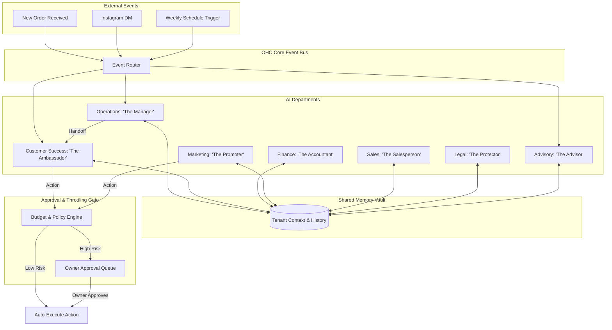

# [Architecture] AI Agent Department Integration

## Title
AI Agent Department Architecture: Invisible Enterprise Intelligence for Small Businesses

## Problem Statement
Small business owners (like Maya the baker or Carlos the handyman) spend up to 40% of their time on "back-office" tasks—answering redundant customer questions, updating inventory, generating quotes, and balancing the books. They do not want to "prompt an AI" or learn how to build automated workflows. They just want a team of employees to handle the busywork so they can focus on their craft. Currently, business platforms force them to integrate third-party tools or manually configure complex automation rules, which are intimidating, time-consuming, and fail the "grandmother test."

## Research Report
**Findings:**
Small business owners think in terms of roles, not software functions. They don't want "CRM automation"; they want a "Salesperson." They don't want an "inventory sync webhook"; they want a "Manager."

**Competitive Analysis:**
- **Shopify:** Offers "Shopify Magic" and Flow, but requires users to manually build automation paths or click specific AI generation buttons for product descriptions. It relies on user initiation rather than autonomous, proactive action.
- **Wix:** Provides AI site generation and basic auto-responders, but lacks cross-functional, stateful agents that communicate with one another.
- **Squarespace:** AI is isolated to text/image generation during site creation. Operational AI is non-existent.
- **GoDaddy:** Basic AI prompts for marketing, but no concept of an "always-on" AI employee handling daily operations.

By organizing AI into understandable "Departments" (The Manager, The Promoter, etc.), OHC provides an enterprise-grade organizational structure wrapped in plain language. The AI works invisibly, escalating to the owner only when necessary.

## Design Doc

### Key Design Decisions and Why
1. **Departmental Persona Abstraction:** AI agents are presented as standard business roles (e.g., "The Accountant", "The Ambassador"). *Why:* It maps perfectly to how business owners naturally delegate tasks, requiring zero learning curve.
2. **Approval Thresholds (Draft vs. Auto-Execute):** High-risk actions (e.g., sending a $500 refund, publishing a new marketing campaign) default to "Draft for Review," while low-risk actions (e.g., answering FAQ on Instagram, updating inventory count) are "Auto-Execute." *Why:* Builds trust incrementally without overwhelming the user or causing costly mistakes.
3. **Event-Driven Triggers & Inter-Departmental Handoffs:** Agents do not just wait for prompts; they react to business events (e.g., new order received) and hand off tasks to one another. *Why:* Mimics a real office environment where the Operations team notifies Customer Success when a product is shipped.
4. **Shared Context Memory:** All departments read from and write to a unified, tenant-scoped memory vault. *Why:* Ensures "The Ambassador" knows that a customer just received a refund from "The Manager," preventing disjointed and frustrating customer experiences.

### Architecture Diagram

### AI Agent Integration Points
- **Triggers:**
  - **On Event:** Webhooks, new orders, form submissions, incoming messages.
  - **On Schedule:** Weekly health reports (The Advisor), daily reconciliations (The Accountant).
  - **On Demand:** Owner asks, "How much did we make yesterday?" via natural language in the mobile app.
- **Coordination:** Agents publish "completion" events back to the event bus, triggering subsequent agents.
- **Memory:** Agents query the shared memory vault before acting to retrieve historical interactions, tenant preferences, and prior agent actions.
- **Throttling:** Every agent action checks the tenant's monthly AI allowance. If exhausted, operations pause or gracefully degrade to manual queues with a notification to the owner.

### UI Wireframes & Screen Flow (375px)
- **Screen 1: Home Dashboard (The Feed)**
  - Clean Glassmorphism cards showing recent agent actions.
  - Card: "The Manager updated 4 items out of stock." (Subtle checkmark).
  - Card: "The Promoter drafted an Instagram post for your new cakes. [Review & Post]" (Action required button).
- **Screen 2: Agent Approval Queue**
  - High-touch, easily readable list of pending actions.
  - "The Ambassador wants to offer a 10% discount to Sarah for her delayed order."
  - Big touch targets (≥ 44x44px): [Approve] | [Edit] | [Deny].
- **Screen 3: Department Settings**
  - Simple toggles. "The Salesperson: Auto-send quotes under $100? [Toggle On/Off]"

### Mobile UX Flow
1. User receives a push notification: "The Ambassador drafted a reply to a new lead."
2. User taps notification, opening the OHC app to the Approval Queue.
3. User reads the drafted quote for a plumbing job.
4. User taps "Approve" (large, accessible button).
5. App displays a satisfying micro-interaction (subtle motion, blur effect) confirming the message was sent.

## Implementation Prompt
**Task for Implementer:**
Implement the "Agent Approval Queue" and "Event Router" foundational logic for the AI Departments. Build the core infrastructure that routes an incoming business event (e.g., "New Order") to the designated AI department ("Operations"), generates an action, and conditionally places that action in an Approval Queue based on a risk threshold.

**Critical User Journey (CUJ):**
1. A simulated external event "New Order" is fired.
2. The Operations agent ("The Manager") processes the event and generates a fulfillment action.
3. The Operations agent hands off a notification request to Customer Success ("The Ambassador").
4. Customer Success generates an email draft. Because it includes a promotional discount, it is flagged as high-risk and sent to the Approval Queue.
5. The business owner opens the mobile-first Approval Queue, sees the draft, and approves it.
6. The action executes successfully.

**Acceptance Criteria:**
- 100% E2E test coverage for the above CUJ, verifying the flow from event generation to owner approval and execution.
- Implement an event routing mechanism that triggers the appropriate department without hardcoding logic inside the endpoint.
- Implement a draft vs. auto-execute threshold system.
- UI must adhere strictly to OHC Premium Design Standards (Glassmorphism, touch targets ≥ 44x44px, Outfit/Inter typography).
- Ensure mobile parity: The Approval Queue must be perfectly usable and visually stunning on a 375px viewport.

## Priority
P0

## Estimated Scope
Large