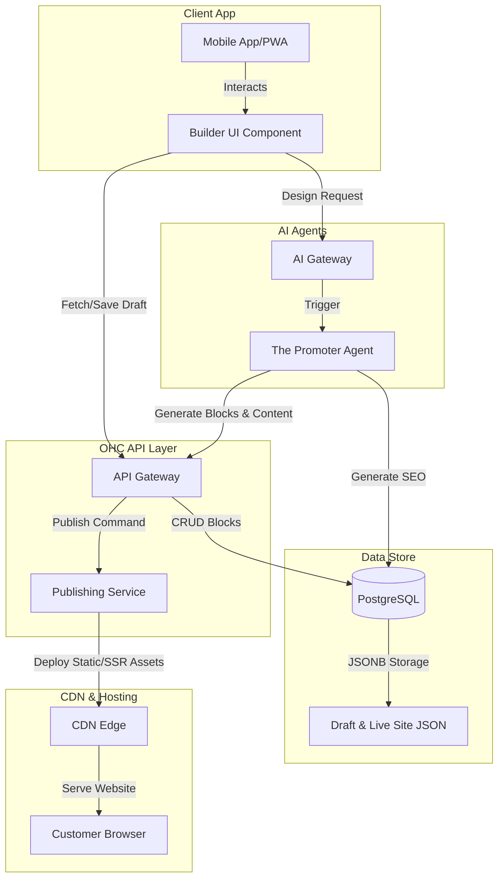

# [website-builder] Website & Storefront Builder Architecture

## 1. Title
Website & Storefront Builder Architecture

## 2. Problem Statement
Small business owners—from bakers to freelance handymen—often lack the technical skills to build and maintain a professional online presence. Existing solutions (like Shopify, Wix, or Squarespace) are powerful but require a steep learning curve, technical jargon, and significant time investment (often over an hour) to set up a basic storefront. These platforms also frequently fail the "grandmother test," relying heavily on complex desktop interfaces.
Our users need a radically simple, mobile-first, zero-jargon way to go from idea to live business in under 10 minutes. They need AI agents ("The Promoter") to invisibly handle website design, SEO, and content generation, so they can focus entirely on their business, not on building a website.

### Persona-Specific Pain Point Summaries
- **Maya (The Home Baker):** Overwhelmed by Shopify's complex setup. Needs a simple, beautiful photo catalog for her cakes with a deposit-based custom order flow. She manages everything exclusively from her iPhone.
- **Carlos (The Freelance Handyman):** Has no website and relies on word-of-mouth. Needs a clean service listing, booking calendar, and AI quote generator. He uses a mid-range Android phone.
- **Priya (The Boutique Owner):** Needs a storefront synced with in-store inventory and POS payments. She requires both mobile (iPhone) and desktop (MacBook) access.

## 3. Research Report
### Market Context
Website builders have evolved significantly:
- **Early Web:** Hand-coded HTML sites in the early 90s, followed by tools like Microsoft FrontPage and Dreamweaver.
- **2000s-2010s:** Cloud-based, no-code graphical website builders emerged (e.g., Wix, Squarespace, Duda). These platforms revolutionized web design by offering intuitive, drag-and-drop interfaces rather than traditional programming.
- **Modern E-Commerce:** Platforms like Shopify became dominant for online stores but shifted focus to mid-market and complex SMB needs, often leaving the true beginner behind.

### Competitive Analysis
| Feature | OneHumanCorp (Target) | Shopify | Wix | Squarespace | GoDaddy |
|---|---|---|---|---|---|
| **Setup Time** | **< 10 min** | 30-60 min | 20-40 min | 30-60 min | 20-40 min |
| **Technical Knowledge Needed** | **Zero** | Low/Medium | Low | Low | Low |
| **Mobile-First Management** | **Yes (100% parity)** | Partial (companion app) | Partial | No | No |
| **AI Agents (Invisible Integration)** | **Yes (Built-in Departments)** | Basic chat support | AI generator | Limited | Basic |
| **Unified Business Features** | **Booking + Store + Portfolio** | Store focused | Complex addons | Portfolio + Store | Basic |
| **Target User Base** | **Non-Technical Beginners** | Tech-savvy SMBs | Semi-technical | Creative Pros | Basic Users |

### Key Findings
1. **Desktop Bias:** Almost all competitors assume the primary building and management experience will happen on a desktop computer. A true mobile-first builder is a massive differentiator.
2. **AI as an Add-on:** Competitors treat AI as an external tool (e.g., a text generator) rather than an integrated "department" that proactively manages the site's design and SEO.
3. **Complexity Creep:** Platforms like Shopify have grown increasingly complex, deterring true beginners like Maya or Carlos.

## 4. Design Doc
### Key Design Decisions
1. **Mobile-First Editing Experience:** The builder interface is designed starting from a 375px viewport. All blocks and configurations are touch-friendly (≥ 44x44px touch targets) and utilize the native mobile keyboard for inputs.
2. **Component-Based Architecture (Content Blocks):** The website is structured around pre-defined, opinionated "Content Blocks" (e.g., Hero, Product Grid, Testimonials, Booking Calendar, Contact Form). Users don't manage complex HTML/CSS layouts; they manage data within these blocks.
3. **AI "Promoter" Integration:** The Marketing & Advertising agent ("The Promoter") actively assists in assembling these blocks based on the user's business profile and natural language prompts.
4. **Automated SEO & Publishing:** Moving from draft to live is a single tap. The system automatically provisions a custom subdomain (or links a custom domain) and provisions SSL. SEO metadata is auto-generated by the AI agent based on the content blocks.
5. **Glassmorphism Design System:** The resulting storefronts adhere to OHC's Premium Token library (backdrop-filter: blur(20px), Outfit + Inter typography) by default.

### Architecture Diagram

### Mobile UX Flow (375px First)
1. **Onboarding:** User taps "Create Storefront". AI asks 3 simple questions (Business Name, Type, Theme Preference).
2. **Draft Generation:** AI agent generates a full draft site using appropriate Content Blocks.
3. **Review & Edit:** User sees a mobile-optimized preview. They can tap any block to edit text (using native keyboard) or swap images (from phone gallery or AI generated).
4. **Publish:** User taps the "Go Live" floating action button (FAB). A success animation plays, and a shareable URL is provided.

## 5. Implementation Prompt
**Objective:** Implement the backend services and mobile-first UI components for the new Website & Storefront Builder.
**CUJ (Critical User Journey):**
1. A new, non-technical user (e.g., a baker) logs into the mobile app and selects "Create Storefront".
2. The user provides basic details, and the AI agent ("The Promoter") generates a draft site composed of Content Blocks.
3. The user previews the draft on their mobile device (375px width), edits a text block, and replaces an image block using their phone's native interface.
4. The user taps "Publish", the site is deployed to a live URL, and the user can view the live site in their browser.
**Acceptance Criteria:**
- The builder UI must function flawlessly on a 375px viewport with no horizontal scrolling.
- Touch targets for block editing must be ≥ 44x44px.
- The state must be stored durably, and publishing must trigger a predictable deployment flow (simulated or real).
- E2E tests must verify the entire flow from creation to successful publication, including UI assertions.
- Do not prescribe specific database tables or CDN providers; design the API to abstract these details.

## 6. Priority
P0 (Critical)

## 7. Estimated Scope
Large