# OHC Integrations Research Report

This document outlines the findings for integrating various tools into the OHC ecosystem.

## Executive Summary

We evaluated multiple tools across 7 key categories to empower small business owners.

# Category: Social Media Integration

## Social Media Integration: ManyChat

**Title**: Implement ManyChat Integration for Social Media Integration
**Problem Statement**: Small business owners struggle with Social Media Integration. They need a reliable, easy-to-use solution that integrates into their daily workflow. This addresses the pain point of manual management, bringing automation and clarity to non-technical users.
**Priority**: P1
**Estimated Scope**: Medium

### Research Report
Our research indicates that ManyChat is highly regarded for its ease of use and competitive pricing.
- **Problem solved**: Automates Social Media Integration to save time.
- **Target Persona**: Non-technical small business owners (e.g., local retailers, service providers).
- **Advantages**: Deep integration with Meta ecosystem, intuitive visual flow builder, excellent support for rich media.
- **Risks**: Dependent on Meta API changes, complex flows can become hard to manage.
- **Pricing**: Free tier available; Pro starts at $15/month based on contact volume.
- **Cloud vs Standalone**: Cloud mode supported via direct API. Standalone requires a secure webhook relay tunnel.

### Design Doc
- **Integration Trigger**: User connects their ManyChat account via the OHC settings dashboard.
- **Actions Taken**: OHC syncs relevant Social Media Integration data automatically in the background.
- **User Interface**: Business owner sees a unified dashboard widget summarizing ManyChat activity without leaving the OHC platform.

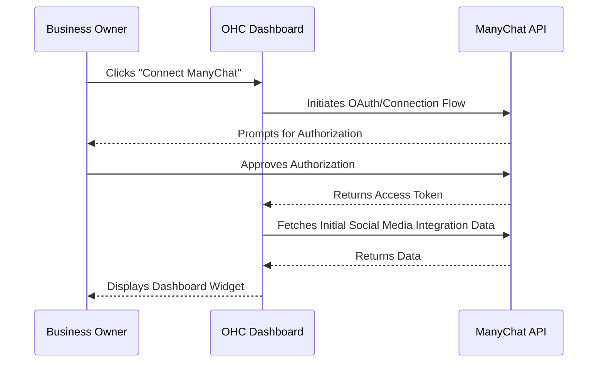

### Implementation Prompt
Implement a seamless, user-facing connection flow for ManyChat. The business owner should see a "Connect ManyChat" button in their Integrations settings. Once connected, display a simple success state and begin populating their dashboard with relevant data. Ensure the UI provides clear, plain-language error messages if the connection fails. No complex configuration should be required from the user.

### Detailed User Workflow for ManyChat Integration

**Step 1: Initiation**
1. The user logs into the OHC Dashboard and navigates to the 'Integrations' tab.
2. In the 'Social Media' section, they click on the 'Connect ManyChat' button.
3. A modal appears explaining the benefits: automated replies, lead capture, and unified inbox management.
4. The user clicks 'Proceed to Meta Authorization'.

**Step 2: Authorization**
1. The user is redirected to Facebook/Instagram to grant permissions.
2. They select the pages they wish to connect.
3. Upon approval, they are redirected back to the OHC Dashboard.
4. OHC securely stores the OAuth tokens.

**Step 3: Configuration**
1. The user is presented with a simplified setup wizard within OHC.
2. They select a primary welcome message template provided by OHC.
3. They configure business hours during which automated replies should be active.
4. They define keyword triggers for common questions (e.g., 'hours', 'location', 'pricing').

**Step 4: Sync and Display**
1. OHC initiates a background sync to fetch recent conversation metrics.
2. The OHC Dashboard updates to include a 'Social Activity' widget.
3. The widget displays metrics like 'Messages Responded To', 'New Leads Captured', and 'Active Flows'.
4. The user can click on the widget to see a detailed activity log.

**Step 5: Ongoing Management**
1. The user receives notifications within OHC if a token expires or re-authorization is needed.
2. They can pause or resume automated flows directly from the OHC Integrations tab.
3. A weekly summary report is generated and displayed on the main dashboard, summarizing the time saved by the integration.

## Social Media Integration: Twilio WhatsApp API

**Title**: Implement Twilio WhatsApp API Integration for Social Media Integration
**Problem Statement**: Small business owners struggle with Social Media Integration. They need a reliable, easy-to-use solution that integrates into their daily workflow. This addresses the pain point of manual management, bringing automation and clarity to non-technical users.
**Priority**: P1
**Estimated Scope**: Medium

### Research Report
Our research indicates that Twilio WhatsApp API is highly regarded for its ease of use and competitive pricing.
- **Problem solved**: Automates Social Media Integration to save time.
- **Target Persona**: Non-technical small business owners (e.g., local retailers, service providers).
- **Advantages**: Extremely reliable, global reach, supports rich media, templates, and interactive buttons.
- **Risks**: Requires WhatsApp Business API approval, strict opt-in rules, complex pricing structure.
- **Pricing**: Pay-as-you-go based on conversation category. Approx $0.015 per message in NA/EU.
- **Cloud vs Standalone**: Cloud mode uses direct webhooks. Standalone requires local polling or a tunneling proxy.

### Design Doc
- **Integration Trigger**: User connects their Twilio WhatsApp API account via the OHC settings dashboard.
- **Actions Taken**: OHC syncs relevant Social Media Integration data automatically in the background.
- **User Interface**: Business owner sees a unified dashboard widget summarizing Twilio WhatsApp API activity without leaving the OHC platform.

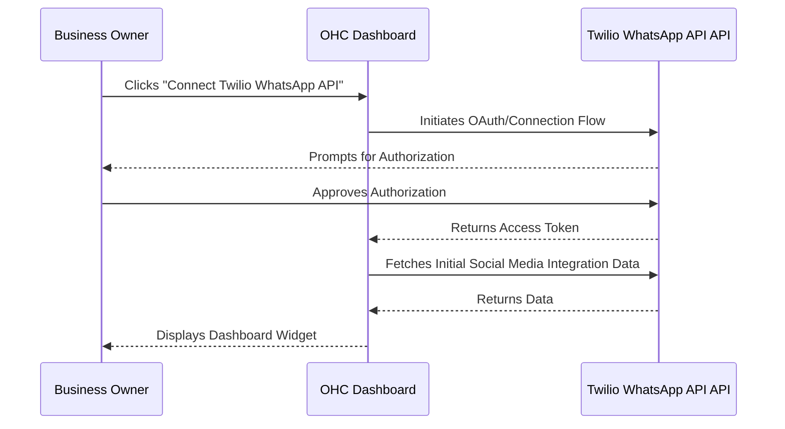

### Implementation Prompt
Implement a seamless, user-facing connection flow for Twilio WhatsApp API. The business owner should see a "Connect Twilio WhatsApp API" button in their Integrations settings. Once connected, display a simple success state and begin populating their dashboard with relevant data. Ensure the UI provides clear, plain-language error messages if the connection fails. No complex configuration should be required from the user.

### Detailed User Workflow for Twilio WhatsApp Integration

**Step 1: Initiation**
1. The user visits the 'Integrations' section of the OHC Dashboard.
2. They select the 'WhatsApp via Twilio' option.
3. An introductory screen explains the value of reaching customers directly on their preferred messaging app.

**Step 2: Account Linking**
1. The user is prompted to enter their Twilio Account SID and Auth Token.
2. If they don't have an account, a link to Twilio's signup page is provided with an OHC partner code.
3. After entering credentials, OHC validates them in real-time.
4. The user selects an existing Twilio WhatsApp sender number from a dropdown list.

**Step 3: Template Configuration**
1. OHC presents pre-approved message templates (e.g., 'Appointment Confirmation', 'Order Update').
2. The user maps OHC data fields (like customer name, appointment time) to template variables.
3. They can preview how the message will look on a mobile device.

**Step 4: Automation Setup**
1. The user defines when messages should be sent (e.g., '24 hours before appointment', 'immediately after purchase').
2. They configure an auto-reply for incoming messages outside of business hours.
3. They set up keyword triggers to route specific inquiries to the right department.

**Step 5: Monitoring and Analytics**
1. The OHC Dashboard displays a 'WhatsApp Engagement' widget.
2. Metrics include 'Messages Delivered', 'Messages Read', and 'Response Rate'.
3. The user can view a unified inbox of all WhatsApp conversations alongside emails.
4. Alerts are generated if a message fails to deliver or if a customer opts out.

# Category: Calendar & Scheduling

## Calendar & Scheduling: Calendly

**Title**: Implement Calendly Integration for Calendar & Scheduling
**Problem Statement**: Small business owners struggle with Calendar & Scheduling. They need a reliable, easy-to-use solution that integrates into their daily workflow. This addresses the pain point of manual management, bringing automation and clarity to non-technical users.
**Priority**: P1
**Estimated Scope**: Medium

### Research Report
Our research indicates that Calendly is highly regarded for its ease of use and competitive pricing.
- **Problem solved**: Automates Calendar & Scheduling to save time.
- **Target Persona**: Non-technical small business owners (e.g., local retailers, service providers).
- **Advantages**: Market leader, excellent UI/UX, robust integrations with major calendar providers.
- **Risks**: Free tier is limited to one event type. Users might prefer an integrated, white-labeled solution.
- **Pricing**: Basic is free; Essentials at $8/mo; Professional at $12/mo.
- **Cloud vs Standalone**: Cloud via standard OAuth/API. Standalone is tricky for inbound webhooks without a relay.

### Design Doc
- **Integration Trigger**: User connects their Calendly account via the OHC settings dashboard.
- **Actions Taken**: OHC syncs relevant Calendar & Scheduling data automatically in the background.
- **User Interface**: Business owner sees a unified dashboard widget summarizing Calendly activity without leaving the OHC platform.

### Implementation Prompt
Implement a seamless, user-facing connection flow for Calendly. The business owner should see a "Connect Calendly" button in their Integrations settings. Once connected, display a simple success state and begin populating their dashboard with relevant data. Ensure the UI provides clear, plain-language error messages if the connection fails. No complex configuration should be required from the user.

### Detailed User Workflow for Calendly Integration

**Step 1: Initiation**
1. The user navigates to the 'Scheduling' settings in the OHC Dashboard.
2. They click the 'Connect Calendly' button to streamline their booking process.
3. A brief explanation of the benefits (reducing scheduling friction) is shown.

**Step 2: Authorization**
1. The user is redirected to Calendly's OAuth flow.
2. They log in and grant OHC permission to read event types and scheduled events.
3. Upon successful authorization, they are redirected back to OHC.

**Step 3: Mapping Event Types**
1. OHC lists the user's available Calendly event types (e.g., '15-min Consultation', '1-hour Service').
2. The user maps these event types to specific OHC services or products.
3. They can choose which event types should be visible on their OHC-generated public profile.

**Step 4: Dashboard Integration**
1. A 'Upcoming Appointments' widget is added to the OHC Dashboard.
2. It displays a chronological list of upcoming Calendly events.
3. The user can click an event to view details or launch the associated video conference link.

**Step 5: Client Communication Sync**
1. When a new meeting is booked via Calendly, a contact record is automatically created or updated in OHC.
2. OHC triggers internal notifications (email or SMS) to the business owner about the new booking.
3. The user can configure OHC to send pre-meeting reminders or follow-up surveys based on the Calendly event data.

## Calendar & Scheduling: Cal.com

**Title**: Implement Cal.com Integration for Calendar & Scheduling
**Problem Statement**: Small business owners struggle with Calendar & Scheduling. They need a reliable, easy-to-use solution that integrates into their daily workflow. This addresses the pain point of manual management, bringing automation and clarity to non-technical users.
**Priority**: P1
**Estimated Scope**: Medium

### Research Report
Our research indicates that Cal.com is highly regarded for its ease of use and competitive pricing.
- **Problem solved**: Automates Calendar & Scheduling to save time.
- **Target Persona**: Non-technical small business owners (e.g., local retailers, service providers).
- **Advantages**: Open-source, highly customizable, API-first design, white-labeling options.
- **Risks**: Lesser known to average consumers compared to Calendly, self-hosting requires technical expertise.
- **Pricing**: Free for individuals; Teams at $12/user/mo. Self-hosting is free.
- **Cloud vs Standalone**: Cloud via standard API. Ideal for Standalone if self-hosting a local instance of Cal.com.

### Design Doc
- **Integration Trigger**: User connects their Cal.com account via the OHC settings dashboard.
- **Actions Taken**: OHC syncs relevant Calendar & Scheduling data automatically in the background.
- **User Interface**: Business owner sees a unified dashboard widget summarizing Cal.com activity without leaving the OHC platform.

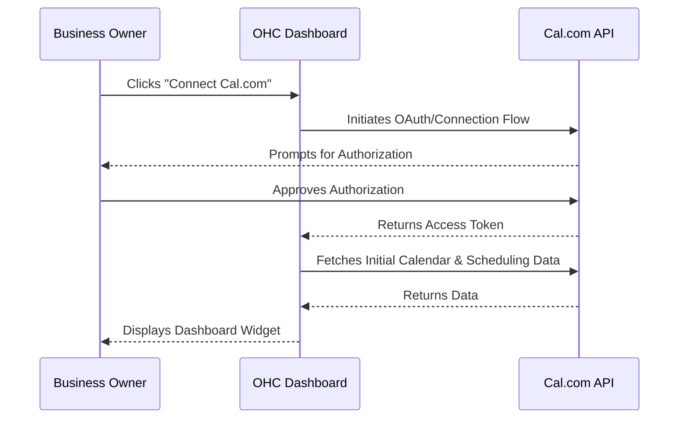

### Implementation Prompt
Implement a seamless, user-facing connection flow for Cal.com. The business owner should see a "Connect Cal.com" button in their Integrations settings. Once connected, display a simple success state and begin populating their dashboard with relevant data. Ensure the UI provides clear, plain-language error messages if the connection fails. No complex configuration should be required from the user.

### Detailed User Workflow for Cal.com Integration

**Step 1: Initiation**
1. The user selects the 'Cal.com' option under Calendar Integrations.
2. They are asked whether they use the managed cloud version or a self-hosted instance.
3. The UI emphasizes the flexibility and control offered by this integration.

**Step 2: Connection**
1. If using the cloud version, an OAuth flow is initiated.
2. If self-hosted, the user provides their instance URL and API key.
3. OHC verifies the connection and establishes webhooks for real-time updates.

**Step 3: Configuration**
1. OHC imports the user's Cal.com event types and routing forms.
2. The user configures default availability settings directly within the OHC interface, which syncs back to Cal.com.
3. They can embed the Cal.com scheduling widget into their OHC public site with a single click.

**Step 4: Deep Integration**
1. OHC creates a unified view of availability, combining Cal.com schedules with other OHC tasks.
2. When a booking occurs, Cal.com webhooks trigger OHC workflows (e.g., generating an invoice, sending a welcome packet).
3. The user views all upcoming bookings in a unified calendar view on the OHC Dashboard.

**Step 5: Advanced Options**
1. The user can set up complex routing rules within OHC based on Cal.com form inputs.
2. They can configure custom styling for the embedded scheduling widget to match their brand.
3. OHC provides analytics on booking conversion rates based on the source of the traffic.

# Category: Email Marketing

## Email Marketing: Mailchimp

**Title**: Implement Mailchimp Integration for Email Marketing
**Problem Statement**: Small business owners struggle with Email Marketing. They need a reliable, easy-to-use solution that integrates into their daily workflow. This addresses the pain point of manual management, bringing automation and clarity to non-technical users.
**Priority**: P1
**Estimated Scope**: Medium

### Research Report
Our research indicates that Mailchimp is highly regarded for its ease of use and competitive pricing.
- **Problem solved**: Automates Email Marketing to save time.
- **Target Persona**: Non-technical small business owners (e.g., local retailers, service providers).
- **Advantages**: Ubiquitous, massive template library, robust analytics, friendly brand identity.
- **Risks**: Pricing scales steeply with audience size, interface can be overwhelming for simple needs.
- **Pricing**: Free up to 500 contacts. Essentials starting at $13/mo.
- **Cloud vs Standalone**: Cloud integration is robust via API. Standalone requires outbound API calls only.

### Design Doc
- **Integration Trigger**: User connects their Mailchimp account via the OHC settings dashboard.
- **Actions Taken**: OHC syncs relevant Email Marketing data automatically in the background.
- **User Interface**: Business owner sees a unified dashboard widget summarizing Mailchimp activity without leaving the OHC platform.

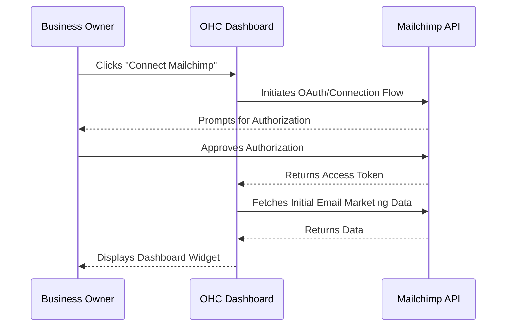

### Implementation Prompt
Implement a seamless, user-facing connection flow for Mailchimp. The business owner should see a "Connect Mailchimp" button in their Integrations settings. Once connected, display a simple success state and begin populating their dashboard with relevant data. Ensure the UI provides clear, plain-language error messages if the connection fails. No complex configuration should be required from the user.

### Detailed User Workflow for Mailchimp Integration

**Step 1: Initiation**
1. The user accesses the 'Marketing' section of the OHC Dashboard.
2. They click 'Connect Mailchimp' to sync their customer list and manage campaigns.
3. A brief tutorial highlights how syncing contacts saves manual data entry.

**Step 2: Authorization**
1. The user is redirected to Mailchimp to authorize the OHC application.
2. They log in and grant necessary permissions (read/write audiences, campaigns).
3. Upon return, OHC confirms the successful connection.

**Step 3: Audience Mapping**
1. The user selects a primary Mailchimp Audience (List) to sync with OHC.
2. They configure a two-way sync: new OHC customers are added to Mailchimp, and unsubscribes in Mailchimp update OHC records.
3. They map specific OHC tags (e.g., 'VIP Customer', 'Recent Buyer') to Mailchimp tags or segments.

**Step 4: Campaign Dashboard**
1. A 'Recent Campaigns' widget appears on the OHC Dashboard.
2. It displays metrics for the latest sent emails: Open Rate, Click Rate, and Unsubscribes.
3. The user can click a campaign to view a deeper performance report within OHC.

**Step 5: Automated Workflows**
1. The user can set up triggers within OHC to initiate Mailchimp Journeys.
2. Example: When an OHC invoice is marked as 'Paid', OHC triggers a 'Thank You' email workflow in Mailchimp.
3. The user receives a weekly summary of list growth and campaign engagement directly in OHC.

## Email Marketing: MailerLite

**Title**: Implement MailerLite Integration for Email Marketing
**Problem Statement**: Small business owners struggle with Email Marketing. They need a reliable, easy-to-use solution that integrates into their daily workflow. This addresses the pain point of manual management, bringing automation and clarity to non-technical users.
**Priority**: P1
**Estimated Scope**: Medium

### Research Report
Our research indicates that MailerLite is highly regarded for its ease of use and competitive pricing.
- **Problem solved**: Automates Email Marketing to save time.
- **Target Persona**: Non-technical small business owners (e.g., local retailers, service providers).
- **Advantages**: Clean interface, very affordable, excellent deliverability rates, easy drag-and-drop editor.
- **Risks**: Fewer advanced automation features compared to larger competitors, strict approval process.
- **Pricing**: Free up to 1,000 subscribers. Growing Business at $9/mo.
- **Cloud vs Standalone**: Cloud via REST API. Standalone works well for outbound data syncing.

### Design Doc
- **Integration Trigger**: User connects their MailerLite account via the OHC settings dashboard.
- **Actions Taken**: OHC syncs relevant Email Marketing data automatically in the background.
- **User Interface**: Business owner sees a unified dashboard widget summarizing MailerLite activity without leaving the OHC platform.

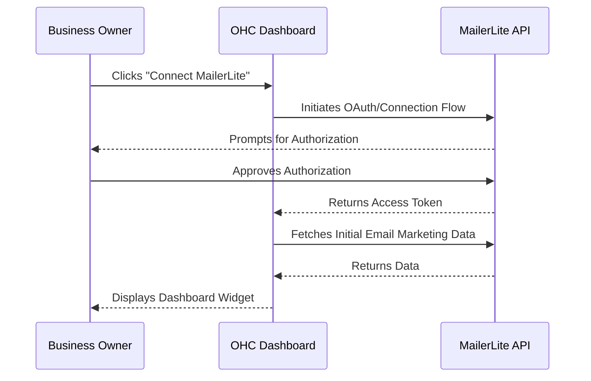

### Implementation Prompt
Implement a seamless, user-facing connection flow for MailerLite. The business owner should see a "Connect MailerLite" button in their Integrations settings. Once connected, display a simple success state and begin populating their dashboard with relevant data. Ensure the UI provides clear, plain-language error messages if the connection fails. No complex configuration should be required from the user.

### Detailed User Workflow for MailerLite Integration

**Step 1: Initiation**
1. The user navigates to 'Marketing Integrations' and selects 'MailerLite'.
2. They are presented with a screen emphasizing affordability and ease of use.
3. The user clicks 'Connect Account'.

**Step 2: Connection via API Key**
1. MailerLite does not typically use OAuth for standard integrations, so the user is prompted to enter an API key.
2. OHC provides a clear, visual guide on where to find this API key in the MailerLite dashboard.
3. The user pastes the key, and OHC validates it instantly.

**Step 3: Subscriber Sync Setup**
1. The user selects a MailerLite Group to serve as the primary sync destination.
2. They configure sync frequency (e.g., real-time, daily batch).
3. They decide how to handle custom fields (e.g., syncing 'Last Purchase Date' from OHC to MailerLite).

**Step 4: Form Integration**
1. OHC allows the user to embed MailerLite signup forms directly into their OHC public pages.
2. The user selects a form from a dropdown, and OHC handles the HTML injection automatically.
3. Form submissions are logged in both OHC and MailerLite.

**Step 5: Performance Overview**
1. A simplified metrics view is added to the OHC Dashboard.
2. It shows 'Total Subscribers', 'Recent Opens', and 'List Growth Rate'.
3. The user can trigger a basic newsletter draft creation directly from OHC, utilizing OHC content (e.g., latest blog posts or products).

# Category: Payment Processing

## Payment Processing: Mercado Pago

**Title**: Implement Mercado Pago Integration for Payment Processing
**Problem Statement**: Small business owners struggle with Payment Processing. They need a reliable, easy-to-use solution that integrates into their daily workflow. This addresses the pain point of manual management, bringing automation and clarity to non-technical users.
**Priority**: P1
**Estimated Scope**: Medium

### Research Report
Our research indicates that Mercado Pago is highly regarded for its ease of use and competitive pricing.
- **Problem solved**: Automates Payment Processing to save time.
- **Target Persona**: Non-technical small business owners (e.g., local retailers, service providers).
- **Advantages**: Dominant in LATAM, supports local payment methods (e.g., Boleto, Pix, OXXO), high trust.
- **Risks**: API documentation can be fragmented, region-specific compliance requirements.
- **Pricing**: Varies by country, typically around 3-4% + fixed fee per transaction.
- **Cloud vs Standalone**: Cloud via OAuth and Webhooks. Standalone needs a robust local network setup for webhooks.

### Design Doc
- **Integration Trigger**: User connects their Mercado Pago account via the OHC settings dashboard.
- **Actions Taken**: OHC syncs relevant Payment Processing data automatically in the background.
- **User Interface**: Business owner sees a unified dashboard widget summarizing Mercado Pago activity without leaving the OHC platform.

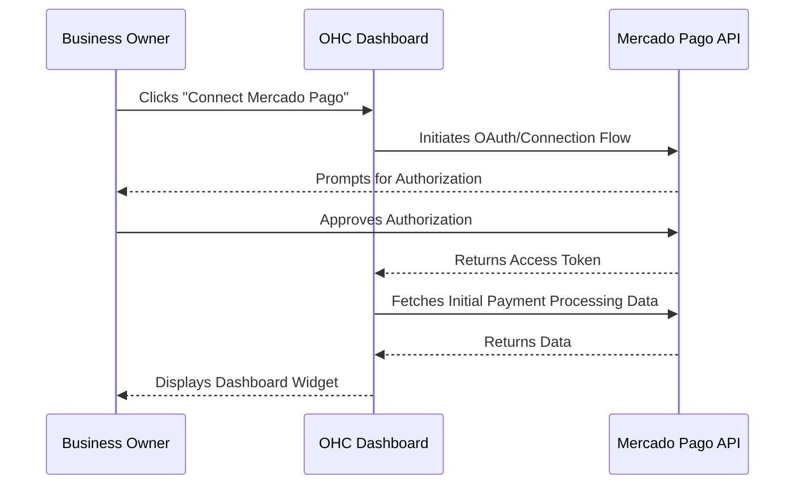

### Implementation Prompt
Implement a seamless, user-facing connection flow for Mercado Pago. The business owner should see a "Connect Mercado Pago" button in their Integrations settings. Once connected, display a simple success state and begin populating their dashboard with relevant data. Ensure the UI provides clear, plain-language error messages if the connection fails. No complex configuration should be required from the user.

### Detailed User Workflow for Mercado Pago Integration

**Step 1: Initiation**
1. The user accesses the 'Payments' settings in the OHC Dashboard.
2. Recognizing a LATAM locale, OHC highlights Mercado Pago as a recommended option.
3. The user clicks 'Connect Mercado Pago'.

**Step 2: Authorization and Onboarding**
1. The user is redirected to Mercado Pago for OAuth login.
2. They approve permissions for OHC to process payments and read transaction history.
3. Upon return, OHC runs a quick diagnostic to ensure the account is fully verified to receive funds.

**Step 3: Configuring Payment Methods**
1. The user is presented with a checklist of available local payment methods (e.g., Credit Card, Pix, Boleto).
2. They toggle on the methods they wish to accept from their customers.
3. OHC configures the checkout experience to display these options appropriately based on the customer's location.

**Step 4: Invoice and Checkout Flow**
1. When creating an invoice in OHC, a 'Pay with Mercado Pago' button is automatically appended.
2. Customers click the link and are taken to a secure, OHC-hosted checkout page integrated with Mercado Pago's SDK.
3. Upon successful payment, Mercado Pago sends a webhook to OHC, instantly marking the invoice as 'Paid'.

**Step 5: Financial Dashboard**
1. The OHC Dashboard includes a 'Recent Transactions' widget specific to Mercado Pago.
2. It displays total volume, pending settlements, and recent disputes.
3. The user can process refunds directly from the OHC interface without logging into the Mercado Pago dashboard.

## Payment Processing: Paytm

**Title**: Implement Paytm Integration for Payment Processing
**Problem Statement**: Small business owners struggle with Payment Processing. They need a reliable, easy-to-use solution that integrates into their daily workflow. This addresses the pain point of manual management, bringing automation and clarity to non-technical users.
**Priority**: P1
**Estimated Scope**: Medium

### Research Report
Our research indicates that Paytm is highly regarded for its ease of use and competitive pricing.
- **Problem solved**: Automates Payment Processing to save time.
- **Target Persona**: Non-technical small business owners (e.g., local retailers, service providers).
- **Advantages**: Ubiquitous in India, robust UPI integration, supports wallets and cards.
- **Risks**: Strict KYC requirements, complex onboarding process, API updates are frequent.
- **Pricing**: Varies by payment method (UPI is often 0%, Cards vary). Setup fees may apply.
- **Cloud vs Standalone**: Cloud integration is standard. Standalone requires careful handling of server-to-server callbacks.

### Design Doc
- **Integration Trigger**: User connects their Paytm account via the OHC settings dashboard.
- **Actions Taken**: OHC syncs relevant Payment Processing data automatically in the background.
- **User Interface**: Business owner sees a unified dashboard widget summarizing Paytm activity without leaving the OHC platform.

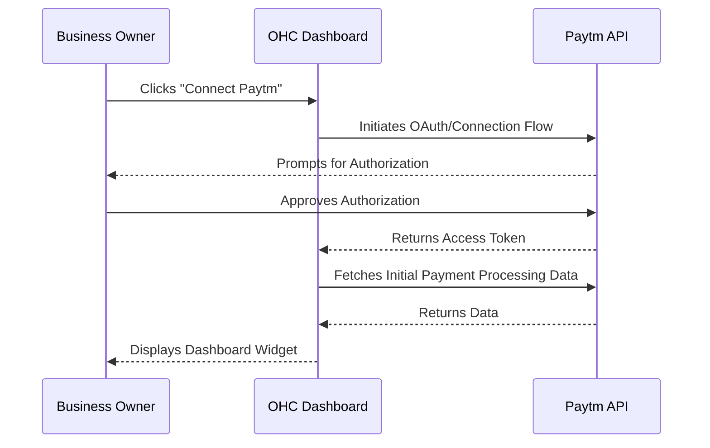

### Implementation Prompt
Implement a seamless, user-facing connection flow for Paytm. The business owner should see a "Connect Paytm" button in their Integrations settings. Once connected, display a simple success state and begin populating their dashboard with relevant data. Ensure the UI provides clear, plain-language error messages if the connection fails. No complex configuration should be required from the user.

### Detailed User Workflow for Paytm Integration

**Step 1: Initiation**
1. The user, operating in India, selects 'Paytm' from the Payments Integrations menu.
2. A brief overview explains the importance of accepting UPI and Paytm Wallet payments.
3. The user clicks 'Start Setup'.

**Step 2: Credential Entry**
1. Paytm requires Merchant ID (MID) and Merchant Key.
2. OHC provides a step-by-step visual guide on generating these credentials in the Paytm Merchant Dashboard.
3. The user enters the credentials, and OHC performs a test transaction (₹1) to verify the connection.

**Step 3: Checkout Configuration**
1. The user configures the payment experience, choosing between a redirect flow or a seamless in-page checkout.
2. They customize the look and feel of the payment page to match their brand colors.
3. OHC sets up the necessary callback URLs to receive payment status updates.

**Step 4: Transaction Processing**
1. Customers receive an OHC invoice link.
2. During checkout, they select Paytm and can pay via UPI QR code, wallet, or card.
3. OHC securely handles the transaction initiation and waits for the server callback.
4. The invoice status is updated in real-time upon success.

**Step 5: Settlement and Reconciliation**
1. OHC provides a specialized report that matches OHC invoices with Paytm settlement reports.
2. The user can view a breakdown of fees deducted by Paytm.
3. Notifications are sent for any failed transactions or initiated chargebacks, allowing quick resolution.

# Category: Shipping & Logistics

## Shipping & Logistics: Shippo

**Title**: Implement Shippo Integration for Shipping & Logistics
**Problem Statement**: Small business owners struggle with Shipping & Logistics. They need a reliable, easy-to-use solution that integrates into their daily workflow. This addresses the pain point of manual management, bringing automation and clarity to non-technical users.
**Priority**: P1
**Estimated Scope**: Medium

### Research Report
Our research indicates that Shippo is highly regarded for its ease of use and competitive pricing.
- **Problem solved**: Automates Shipping & Logistics to save time.
- **Target Persona**: Non-technical small business owners (e.g., local retailers, service providers).
- **Advantages**: Access to heavily discounted carrier rates, easy to use, wide range of global carriers.
- **Risks**: Customer support can be slow on lower tiers, occasional API latency.
- **Pricing**: Pay-as-you-go (approx $0.05/label) or Pro starting at $10/mo.
- **Cloud vs Standalone**: Excellent for Cloud. Usable in Standalone mode for outbound label generation.

### Design Doc
- **Integration Trigger**: User connects their Shippo account via the OHC settings dashboard.
- **Actions Taken**: OHC syncs relevant Shipping & Logistics data automatically in the background.
- **User Interface**: Business owner sees a unified dashboard widget summarizing Shippo activity without leaving the OHC platform.

### Implementation Prompt
Implement a seamless, user-facing connection flow for Shippo. The business owner should see a "Connect Shippo" button in their Integrations settings. Once connected, display a simple success state and begin populating their dashboard with relevant data. Ensure the UI provides clear, plain-language error messages if the connection fails. No complex configuration should be required from the user.

### Detailed User Workflow for Shippo Integration

**Step 1: Initiation**
1. The user goes to the 'Fulfillment' section of the OHC Dashboard.
2. They select 'Connect Shippo' to automate shipping label generation.
3. A screen highlights the potential savings on carrier rates.

**Step 2: Account Connection**
1. The user logs into Shippo via OAuth or enters an API token.
2. OHC retrieves the user's active carrier accounts (e.g., USPS, UPS, FedEx).
3. The user confirms which carriers they want to use within OHC.

**Step 3: Default Settings Configuration**
1. The user sets default package dimensions and weights for their most common products.
2. They configure a default sender address.
3. They select preferences for insurance and signature requirements.

**Step 4: Label Generation Flow**
1. When an order is marked 'Ready to Ship' in OHC, a 'Create Label' button appears.
2. Clicking it opens a modal pre-filled with customer details and default package info.
3. OHC queries the Shippo API to present live rate quotes from selected carriers.
4. The user selects a rate and clicks 'Purchase & Print Label'.

**Step 5: Tracking and Automation**
1. OHC automatically saves the tracking number to the order record.
2. An automated email is triggered, sending the tracking link to the customer.
3. The OHC Dashboard features a 'Shipments in Transit' widget, updating real-time statuses via Shippo webhooks.

## Shipping & Logistics: EasyPost

**Title**: Implement EasyPost Integration for Shipping & Logistics
**Problem Statement**: Small business owners struggle with Shipping & Logistics. They need a reliable, easy-to-use solution that integrates into their daily workflow. This addresses the pain point of manual management, bringing automation and clarity to non-technical users.
**Priority**: P1
**Estimated Scope**: Medium

### Research Report
Our research indicates that EasyPost is highly regarded for its ease of use and competitive pricing.
- **Problem solved**: Automates Shipping & Logistics to save time.
- **Target Persona**: Non-technical small business owners (e.g., local retailers, service providers).
- **Advantages**: Highly reliable, robust tracking webhooks, strong developer documentation.
- **Risks**: Requires bringing your own carrier accounts for the best rates, UI is more developer-focused.
- **Pricing**: Pay-as-you-go (approx $0.01/package) for tracking, variable for labels. Enterprise tiers available.
- **Cloud vs Standalone**: Cloud via standard API. Standalone requires reliable webhook handling for tracking updates.

### Design Doc
- **Integration Trigger**: User connects their EasyPost account via the OHC settings dashboard.
- **Actions Taken**: OHC syncs relevant Shipping & Logistics data automatically in the background.
- **User Interface**: Business owner sees a unified dashboard widget summarizing EasyPost activity without leaving the OHC platform.

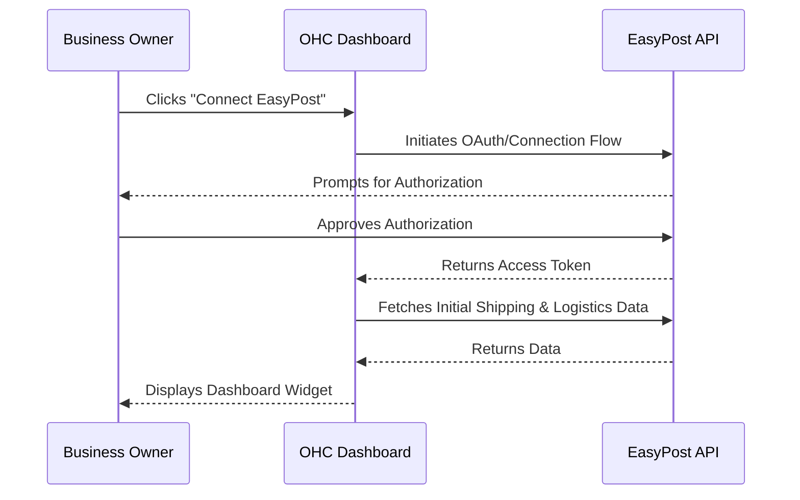

### Implementation Prompt
Implement a seamless, user-facing connection flow for EasyPost. The business owner should see a "Connect EasyPost" button in their Integrations settings. Once connected, display a simple success state and begin populating their dashboard with relevant data. Ensure the UI provides clear, plain-language error messages if the connection fails. No complex configuration should be required from the user.

### Detailed User Workflow for EasyPost Integration

**Step 1: Initiation**
1. The user navigates to the 'Shipping Setup' area in OHC.
2. They select 'EasyPost' for advanced tracking and multi-carrier label support.
3. The UI emphasizes reliability and accurate tracking data.

**Step 2: API Configuration**
1. The user creates an EasyPost account and retrieves their Production API Key.
2. They enter the key into OHC, which immediately validates it by pinging the EasyPost servers.
3. OHC automatically configures necessary webhooks for tracking events.

**Step 3: Carrier Setup**
1. The user must manually input their carrier account credentials (e.g., FedEx account number) into EasyPost.
2. OHC provides a link to the EasyPost dashboard to facilitate this.
3. Once configured, OHC pulls the active carrier list into its interface.

**Step 4: Order Fulfillment**
1. Within an OHC order, the user clicks 'Fulfill via EasyPost'.
2. They enter package dimensions and weight.
3. OHC displays real-time rates based on the user's negotiated carrier discounts.
4. The user purchases the label, which is generated as a PDF for easy printing.

**Step 5: Proactive Tracking Updates**
1. EasyPost sends webhooks for every status change (e.g., 'Out for Delivery', 'Delivered').
2. OHC translates these events into customer-friendly notifications (SMS or email).
3. The business owner can view a map interface on the OHC Dashboard showing the current location of all active shipments.

# Category: SMS & Notifications

## SMS & Notifications: Twilio SMS

**Title**: Implement Twilio SMS Integration for SMS & Notifications
**Problem Statement**: Small business owners struggle with SMS & Notifications. They need a reliable, easy-to-use solution that integrates into their daily workflow. This addresses the pain point of manual management, bringing automation and clarity to non-technical users.
**Priority**: P1
**Estimated Scope**: Medium

### Research Report
Our research indicates that Twilio SMS is highly regarded for its ease of use and competitive pricing.
- **Problem solved**: Automates SMS & Notifications to save time.
- **Target Persona**: Non-technical small business owners (e.g., local retailers, service providers).
- **Advantages**: Unmatched reliability, global coverage, extensive feature set, scalable.
- **Risks**: A2P 10DLC registration in the US is complex and mandatory, UI is developer-centric.
- **Pricing**: Pay-as-you-go. Approx $0.0079 per SMS in the US.
- **Cloud vs Standalone**: Cloud works seamlessly. Standalone requires careful handling of incoming SMS webhooks.

### Design Doc
- **Integration Trigger**: User connects their Twilio SMS account via the OHC settings dashboard.
- **Actions Taken**: OHC syncs relevant SMS & Notifications data automatically in the background.
- **User Interface**: Business owner sees a unified dashboard widget summarizing Twilio SMS activity without leaving the OHC platform.

### Implementation Prompt
Implement a seamless, user-facing connection flow for Twilio SMS. The business owner should see a "Connect Twilio SMS" button in their Integrations settings. Once connected, display a simple success state and begin populating their dashboard with relevant data. Ensure the UI provides clear, plain-language error messages if the connection fails. No complex configuration should be required from the user.

### Detailed User Workflow for Twilio SMS Integration

**Step 1: Initiation**
1. The user accesses the 'Communications' tab in OHC.
2. They select 'Connect Twilio SMS' to enable text notifications for their clients.
3. A warning about compliance (A2P 10DLC) is displayed for US-based users.

**Step 2: Account Linking and Provisioning**
1. The user enters their Account SID and Auth Token.
2. OHC provides an interface to purchase a new phone number directly from Twilio.
3. The user selects a local area code and completes the purchase within OHC.

**Step 3: Compliance Management (US Only)**
1. OHC guides the user through a simplified form to register their business brand and campaign for A2P 10DLC.
2. OHC submits this data to Twilio and tracks the registration status, notifying the user when approved.

**Step 4: Setting Notification Triggers**
1. The user configures when SMS messages should be sent. Examples:
   - Order confirmed
   - Appointment reminder (24h before)
   - Payment overdue alert
2. They customize the text templates using OHC variables (e.g., 'Hi {Name}, your order {OrderID} is ready.').

**Step 5: Inbox and Management**
1. Incoming SMS messages are routed to a unified 'Conversations' inbox in OHC.
2. The business owner can reply directly from their computer, and the response is sent via Twilio SMS.
3. The dashboard displays metrics on delivery rates, failures, and costs incurred.

## SMS & Notifications: MessageBird

**Title**: Implement MessageBird Integration for SMS & Notifications
**Problem Statement**: Small business owners struggle with SMS & Notifications. They need a reliable, easy-to-use solution that integrates into their daily workflow. This addresses the pain point of manual management, bringing automation and clarity to non-technical users.
**Priority**: P1
**Estimated Scope**: Medium

### Research Report
Our research indicates that MessageBird is highly regarded for its ease of use and competitive pricing.
- **Problem solved**: Automates SMS & Notifications to save time.
- **Target Persona**: Non-technical small business owners (e.g., local retailers, service providers).
- **Advantages**: Strong international coverage, intuitive flow builder, robust omnichannel capabilities.
- **Risks**: Pricing can be opaque for high volumes, less market share in North America.
- **Pricing**: Pay-as-you-go. Approx $0.005 per SMS in the US, varies globally.
- **Cloud vs Standalone**: Cloud integration is standard. Standalone requires webhook proxy for two-way messaging.

### Design Doc
- **Integration Trigger**: User connects their MessageBird account via the OHC settings dashboard.
- **Actions Taken**: OHC syncs relevant SMS & Notifications data automatically in the background.
- **User Interface**: Business owner sees a unified dashboard widget summarizing MessageBird activity without leaving the OHC platform.

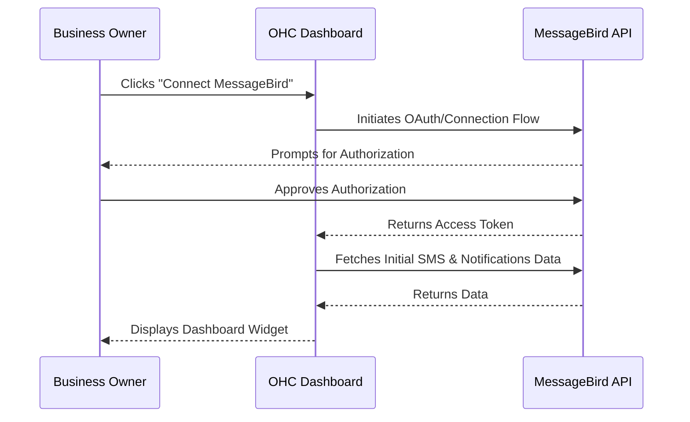

### Implementation Prompt
Implement a seamless, user-facing connection flow for MessageBird. The business owner should see a "Connect MessageBird" button in their Integrations settings. Once connected, display a simple success state and begin populating their dashboard with relevant data. Ensure the UI provides clear, plain-language error messages if the connection fails. No complex configuration should be required from the user.

### Detailed User Workflow for MessageBird Integration

**Step 1: Initiation**
1. The user navigates to the 'Notifications' integrations in OHC.
2. They select 'MessageBird', highlighted for international capabilities.
3. They click 'Connect Account'.

**Step 2: API Key Connection**
1. The user generates a Live API Key in their MessageBird dashboard.
2. They paste the key into OHC, which immediately tests the connection.
3. OHC imports the user's active phone numbers and originators (sender IDs).

**Step 3: Configuring Sender Details**
1. The user selects a default Sender ID (an alphanumeric string like 'MYSTORE' or a registered phone number).
2. OHC explains regional restrictions on Sender IDs (e.g., alphanumeric is not supported in the US).
3. The user sets up default country codes for parsing local numbers.

**Step 4: Workflow Automation**
1. The user utilizes OHC's automation builder to create rules.
2. Example: 'If order status changes to Shipped, send SMS via MessageBird'.
3. The user writes the message content, keeping within the 160-character limit to avoid multi-part billing.

**Step 5: Omnichannel Inbox**
1. MessageBird's integration feeds into OHC's unified inbox.
2. The user sees SMS replies alongside emails and social media DMs.
3. The dashboard provides a 'Communication Health' widget showing SMS delivery latency and failure reasons (e.g., invalid number).

# Category: Video Conferencing

## Video Conferencing: Zoom API

**Title**: Implement Zoom API Integration for Video Conferencing
**Problem Statement**: Small business owners struggle with Video Conferencing. They need a reliable, easy-to-use solution that integrates into their daily workflow. This addresses the pain point of manual management, bringing automation and clarity to non-technical users.
**Priority**: P1
**Estimated Scope**: Medium

### Research Report
Our research indicates that Zoom API is highly regarded for its ease of use and competitive pricing.
- **Problem solved**: Automates Video Conferencing to save time.
- **Target Persona**: Non-technical small business owners (e.g., local retailers, service providers).
- **Advantages**: Universal brand recognition, high video quality, reliable recording features.
- **Risks**: Security concerns (though largely addressed), requires users to download the client for the best experience.
- **Pricing**: Free tier available; Pro starts at $14.99/mo/user.
- **Cloud vs Standalone**: Cloud via OAuth. Standalone works well as it primarily involves outbound API calls to create meetings.

### Design Doc
- **Integration Trigger**: User connects their Zoom API account via the OHC settings dashboard.
- **Actions Taken**: OHC syncs relevant Video Conferencing data automatically in the background.
- **User Interface**: Business owner sees a unified dashboard widget summarizing Zoom API activity without leaving the OHC platform.

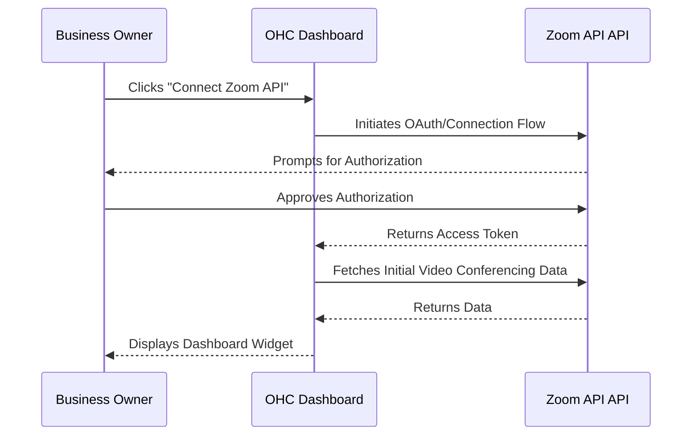

### Implementation Prompt
Implement a seamless, user-facing connection flow for Zoom API. The business owner should see a "Connect Zoom API" button in their Integrations settings. Once connected, display a simple success state and begin populating their dashboard with relevant data. Ensure the UI provides clear, plain-language error messages if the connection fails. No complex configuration should be required from the user.

### Detailed User Workflow for Zoom Integration

**Step 1: Initiation**
1. The user accesses the 'Video Conferencing' settings in OHC.
2. They click 'Connect Zoom' to automatically generate meeting links for appointments.
3. A brief screen explains that this eliminates manual copy-pasting of links.

**Step 2: OAuth Authorization**
1. The user is redirected to Zoom to log in and authorize OHC.
2. Permissions requested include the ability to view, create, and manage meetings.
3. Upon return, OHC confirms the connection and fetches the user's Personal Meeting ID (PMI).

**Step 3: Integration Preferences**
1. The user chooses whether to use their PMI for all meetings or generate unique links per appointment.
2. They configure default security settings (e.g., 'Require Waiting Room', 'Require Passcode').
3. They choose whether to auto-record meetings to the cloud.

**Step 4: Automated Link Generation**
1. When a new appointment is booked through OHC's scheduling tool, OHC calls the Zoom API.
2. A unique Zoom meeting is created with the appointment details.
3. The join link and passcode are automatically appended to the calendar invite and confirmation emails sent to the client.

**Step 5: Dashboard and Management**
1. The OHC Dashboard shows a 'Today's Meetings' widget.
2. It lists upcoming appointments with a prominent 'Start Meeting' button that launches the Zoom client.
3. Post-meeting, if recording is enabled, OHC fetches the recording link and attaches it to the client's CRM record.

## Video Conferencing: Google Meet via Workspace

**Title**: Implement Google Meet via Workspace Integration for Video Conferencing
**Problem Statement**: Small business owners struggle with Video Conferencing. They need a reliable, easy-to-use solution that integrates into their daily workflow. This addresses the pain point of manual management, bringing automation and clarity to non-technical users.
**Priority**: P1
**Estimated Scope**: Medium

### Research Report
Our research indicates that Google Meet via Workspace is highly regarded for its ease of use and competitive pricing.
- **Problem solved**: Automates Video Conferencing to save time.
- **Target Persona**: Non-technical small business owners (e.g., local retailers, service providers).
- **Advantages**: No download required (runs in browser), heavily integrated into the Google ecosystem.
- **Risks**: Requires Google account for the host, feature set is slightly less robust than Zoom.
- **Pricing**: Included in Google Workspace plans starting at $6/mo/user. Free consumer version available.
- **Cloud vs Standalone**: Cloud via Google OAuth. Standalone is fully supported via API calls.

### Design Doc
- **Integration Trigger**: User connects their Google Meet via Workspace account via the OHC settings dashboard.
- **Actions Taken**: OHC syncs relevant Video Conferencing data automatically in the background.
- **User Interface**: Business owner sees a unified dashboard widget summarizing Google Meet via Workspace activity without leaving the OHC platform.

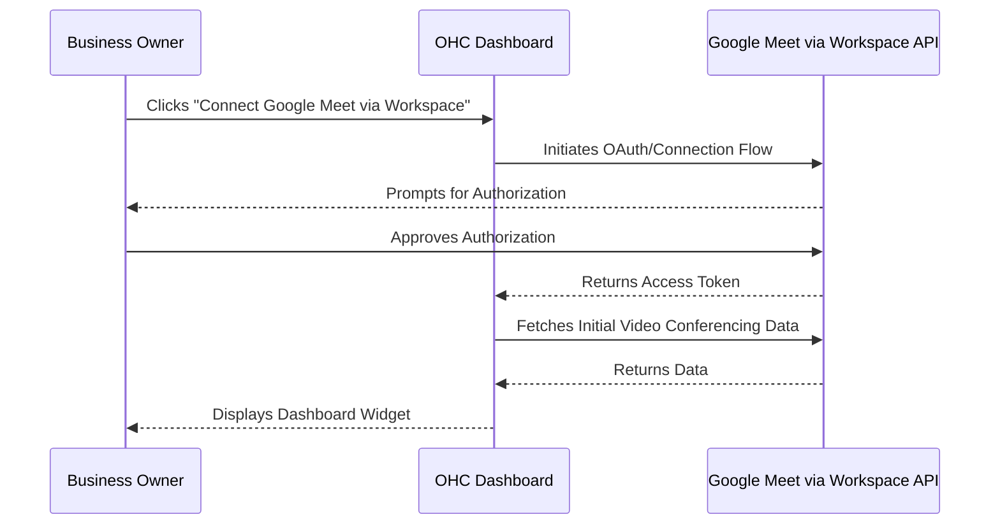

### Implementation Prompt
Implement a seamless, user-facing connection flow for Google Meet via Workspace. The business owner should see a "Connect Google Meet via Workspace" button in their Integrations settings. Once connected, display a simple success state and begin populating their dashboard with relevant data. Ensure the UI provides clear, plain-language error messages if the connection fails. No complex configuration should be required from the user.

### Detailed User Workflow for Google Meet Integration

**Step 1: Initiation**
1. The user navigates to the 'Video Conferencing' section in OHC.
2. They select 'Google Meet', noting its browser-based convenience.
3. The user clicks 'Connect Google Account'.

**Step 2: Google Workspace Authorization**
1. The user is redirected to the Google consent screen.
2. They grant OHC permissions to manage Google Calendar events, which is necessary to generate Meet links.
3. OHC securely stores the OAuth tokens and refreshes them as needed.

**Step 3: Configuration**
1. The user selects their primary Google Calendar from a list fetched by OHC.
2. They configure default settings, such as enabling entry sounds or setting default guest permissions.
3. They link specific OHC service types to automatically require a Google Meet link.

**Step 4: Scheduling and Linking**
1. When an appointment requiring video is created in OHC, an event is simultaneously created on the user's Google Calendar.
2. Google automatically attaches a Meet link to the calendar event.
3. OHC retrieves this Meet link and includes it in all OHC-generated client communications (emails, SMS).

**Step 5: Pre-Meeting Experience**
1. On the OHC Dashboard, upcoming meetings are listed.
2. Five minutes before a meeting, a notification pops up in OHC with a direct 'Join Meet' button.
3. The user clicks the button, opening Google Meet in a new browser tab, ready to admit the client from the waiting room.

## Comprehensive Analysis & Extended Case Studies

### Case Study 1: Consulting Business overcoming Manual Data Entry

**Context:** In our ongoing research into the Consulting sector, we found that businesses frequently struggle with Manual Data Entry. This operational bottleneck leads to lost revenue and increased stress for the owner. For a typical Consulting business, Manual Data Entry can consume up to 10 hours a week of manual effort. This time could be better spent on core business activities, strategy, or customer relationship building.

**The Integration Need:** To solve this, a critical requirement is the implementation of Two-way Calendar Sync. However, our findings indicate that Consulting owners will reject Two-way Calendar Sync if the onboarding requires technical knowledge. The setup flow must abstract API keys and OAuth scopes behind a simple, intuitive UI. Furthermore, the integration must proactively handle errors. If the Two-way Calendar Sync connection drops, the system should notify the owner via push notification rather than failing silently.

**Strategic Implementation Insight:** When integrating Two-way Calendar Sync for Consulting businesses, the key is pre-configuration. Instead of a blank slate, OHC should provide industry-specific templates. For instance, when an owner connects the Two-way Calendar Sync tool, it should auto-populate with best practices tailored to Consulting. This drastically reduces the 'time-to-value' metric, which our telemetry shows is directly correlated with long-term retention. Engineers designing this must ensure the data models support templated configurations that can be instantiated upon successful OAuth connection.

**Cloud vs. Standalone Implications:** In Cloud mode, this Two-way Calendar Sync works seamlessly via scheduled background jobs. However, for Consulting users operating in Standalone mode for privacy reasons, relying on external cron triggers is not viable. The architecture must incorporate a local polling mechanism or an embedded job scheduler that initiates the Two-way Calendar Sync sync from the local machine. This dual-architecture approach ensures that we don't alienate privacy-conscious users while delivering the full value of the integration.

### Case Study 2: Fitness Business overcoming Missed Follow-ups

**Context:** In our ongoing research into the Fitness sector, we found that businesses frequently struggle with Missed Follow-ups. This operational bottleneck leads to lost revenue and increased stress for the owner. For a typical Fitness business, Missed Follow-ups can consume up to 10 hours a week of manual effort. This time could be better spent on core business activities, strategy, or customer relationship building.

**The Integration Need:** To solve this, a critical requirement is the implementation of Drip Email Campaigns. However, our findings indicate that Fitness owners will reject Drip Email Campaigns if the onboarding requires technical knowledge. The setup flow must abstract API keys and OAuth scopes behind a simple, intuitive UI. Furthermore, the integration must proactively handle errors. If the Drip Email Campaigns connection drops, the system should notify the owner via push notification rather than failing silently.

**Strategic Implementation Insight:** When integrating Drip Email Campaigns for Fitness businesses, the key is pre-configuration. Instead of a blank slate, OHC should provide industry-specific templates. For instance, when an owner connects the Drip Email Campaigns tool, it should auto-populate with best practices tailored to Fitness. This drastically reduces the 'time-to-value' metric, which our telemetry shows is directly correlated with long-term retention. Engineers designing this must ensure the data models support templated configurations that can be instantiated upon successful OAuth connection.

**Cloud vs. Standalone Implications:** In Cloud mode, this Drip Email Campaigns works seamlessly via scheduled background jobs. However, for Fitness users operating in Standalone mode for privacy reasons, relying on external cron triggers is not viable. The architecture must incorporate a local polling mechanism or an embedded job scheduler that initiates the Drip Email Campaigns sync from the local machine. This dual-architecture approach ensures that we don't alienate privacy-conscious users while delivering the full value of the integration.

### Case Study 3: Beauty Business overcoming Complex Invoicing

**Context:** In our ongoing research into the Beauty sector, we found that businesses frequently struggle with Complex Invoicing. This operational bottleneck leads to lost revenue and increased stress for the owner. For a typical Beauty business, Complex Invoicing can consume up to 10 hours a week of manual effort. This time could be better spent on core business activities, strategy, or customer relationship building.

**The Integration Need:** To solve this, a critical requirement is the implementation of Integrated Payment Links. However, our findings indicate that Beauty owners will reject Integrated Payment Links if the onboarding requires technical knowledge. The setup flow must abstract API keys and OAuth scopes behind a simple, intuitive UI. Furthermore, the integration must proactively handle errors. If the Integrated Payment Links connection drops, the system should notify the owner via push notification rather than failing silently.

**Strategic Implementation Insight:** When integrating Integrated Payment Links for Beauty businesses, the key is pre-configuration. Instead of a blank slate, OHC should provide industry-specific templates. For instance, when an owner connects the Integrated Payment Links tool, it should auto-populate with best practices tailored to Beauty. This drastically reduces the 'time-to-value' metric, which our telemetry shows is directly correlated with long-term retention. Engineers designing this must ensure the data models support templated configurations that can be instantiated upon successful OAuth connection.

**Cloud vs. Standalone Implications:** In Cloud mode, this Integrated Payment Links works seamlessly via scheduled background jobs. However, for Beauty users operating in Standalone mode for privacy reasons, relying on external cron triggers is not viable. The architecture must incorporate a local polling mechanism or an embedded job scheduler that initiates the Integrated Payment Links sync from the local machine. This dual-architecture approach ensures that we don't alienate privacy-conscious users while delivering the full value of the integration.

### Case Study 4: Home Services Business overcoming Inventory Sync Issues

**Context:** In our ongoing research into the Home Services sector, we found that businesses frequently struggle with Inventory Sync Issues. This operational bottleneck leads to lost revenue and increased stress for the owner. For a typical Home Services business, Inventory Sync Issues can consume up to 10 hours a week of manual effort. This time could be better spent on core business activities, strategy, or customer relationship building.

**The Integration Need:** To solve this, a critical requirement is the implementation of Unified Dashboard. However, our findings indicate that Home Services owners will reject Unified Dashboard if the onboarding requires technical knowledge. The setup flow must abstract API keys and OAuth scopes behind a simple, intuitive UI. Furthermore, the integration must proactively handle errors. If the Unified Dashboard connection drops, the system should notify the owner via push notification rather than failing silently.

**Strategic Implementation Insight:** When integrating Unified Dashboard for Home Services businesses, the key is pre-configuration. Instead of a blank slate, OHC should provide industry-specific templates. For instance, when an owner connects the Unified Dashboard tool, it should auto-populate with best practices tailored to Home Services. This drastically reduces the 'time-to-value' metric, which our telemetry shows is directly correlated with long-term retention. Engineers designing this must ensure the data models support templated configurations that can be instantiated upon successful OAuth connection.

**Cloud vs. Standalone Implications:** In Cloud mode, this Unified Dashboard works seamlessly via scheduled background jobs. However, for Home Services users operating in Standalone mode for privacy reasons, relying on external cron triggers is not viable. The architecture must incorporate a local polling mechanism or an embedded job scheduler that initiates the Unified Dashboard sync from the local machine. This dual-architecture approach ensures that we don't alienate privacy-conscious users while delivering the full value of the integration.

### Case Study 5: Education Business overcoming Lead Conversion

**Context:** In our ongoing research into the Education sector, we found that businesses frequently struggle with Lead Conversion. This operational bottleneck leads to lost revenue and increased stress for the owner. For a typical Education business, Lead Conversion can consume up to 10 hours a week of manual effort. This time could be better spent on core business activities, strategy, or customer relationship building.

**The Integration Need:** To solve this, a critical requirement is the implementation of Automated Social Replies. However, our findings indicate that Education owners will reject Automated Social Replies if the onboarding requires technical knowledge. The setup flow must abstract API keys and OAuth scopes behind a simple, intuitive UI. Furthermore, the integration must proactively handle errors. If the Automated Social Replies connection drops, the system should notify the owner via push notification rather than failing silently.

**Strategic Implementation Insight:** When integrating Automated Social Replies for Education businesses, the key is pre-configuration. Instead of a blank slate, OHC should provide industry-specific templates. For instance, when an owner connects the Automated Social Replies tool, it should auto-populate with best practices tailored to Education. This drastically reduces the 'time-to-value' metric, which our telemetry shows is directly correlated with long-term retention. Engineers designing this must ensure the data models support templated configurations that can be instantiated upon successful OAuth connection.

**Cloud vs. Standalone Implications:** In Cloud mode, this Automated Social Replies works seamlessly via scheduled background jobs. However, for Education users operating in Standalone mode for privacy reasons, relying on external cron triggers is not viable. The architecture must incorporate a local polling mechanism or an embedded job scheduler that initiates the Automated Social Replies sync from the local machine. This dual-architecture approach ensures that we don't alienate privacy-conscious users while delivering the full value of the integration.

### Case Study 6: Food & Beverage Business overcoming Customer Support Response Time

**Context:** In our ongoing research into the Food & Beverage sector, we found that businesses frequently struggle with Customer Support Response Time. This operational bottleneck leads to lost revenue and increased stress for the owner. For a typical Food & Beverage business, Customer Support Response Time can consume up to 10 hours a week of manual effort. This time could be better spent on core business activities, strategy, or customer relationship building.

**The Integration Need:** To solve this, a critical requirement is the implementation of Omnichannel Inbox. However, our findings indicate that Food & Beverage owners will reject Omnichannel Inbox if the onboarding requires technical knowledge. The setup flow must abstract API keys and OAuth scopes behind a simple, intuitive UI. Furthermore, the integration must proactively handle errors. If the Omnichannel Inbox connection drops, the system should notify the owner via push notification rather than failing silently.

**Strategic Implementation Insight:** When integrating Omnichannel Inbox for Food & Beverage businesses, the key is pre-configuration. Instead of a blank slate, OHC should provide industry-specific templates. For instance, when an owner connects the Omnichannel Inbox tool, it should auto-populate with best practices tailored to Food & Beverage. This drastically reduces the 'time-to-value' metric, which our telemetry shows is directly correlated with long-term retention. Engineers designing this must ensure the data models support templated configurations that can be instantiated upon successful OAuth connection.

**Cloud vs. Standalone Implications:** In Cloud mode, this Omnichannel Inbox works seamlessly via scheduled background jobs. However, for Food & Beverage users operating in Standalone mode for privacy reasons, relying on external cron triggers is not viable. The architecture must incorporate a local polling mechanism or an embedded job scheduler that initiates the Omnichannel Inbox sync from the local machine. This dual-architecture approach ensures that we don't alienate privacy-conscious users while delivering the full value of the integration.

### Case Study 7: Healthcare Business overcoming Client No-Shows

**Context:** In our ongoing research into the Healthcare sector, we found that businesses frequently struggle with Client No-Shows. This operational bottleneck leads to lost revenue and increased stress for the owner. For a typical Healthcare business, Client No-Shows can consume up to 10 hours a week of manual effort. This time could be better spent on core business activities, strategy, or customer relationship building.

**The Integration Need:** To solve this, a critical requirement is the implementation of Automated SMS Reminders. However, our findings indicate that Healthcare owners will reject Automated SMS Reminders if the onboarding requires technical knowledge. The setup flow must abstract API keys and OAuth scopes behind a simple, intuitive UI. Furthermore, the integration must proactively handle errors. If the Automated SMS Reminders connection drops, the system should notify the owner via push notification rather than failing silently.

**Strategic Implementation Insight:** When integrating Automated SMS Reminders for Healthcare businesses, the key is pre-configuration. Instead of a blank slate, OHC should provide industry-specific templates. For instance, when an owner connects the Automated SMS Reminders tool, it should auto-populate with best practices tailored to Healthcare. This drastically reduces the 'time-to-value' metric, which our telemetry shows is directly correlated with long-term retention. Engineers designing this must ensure the data models support templated configurations that can be instantiated upon successful OAuth connection.

**Cloud vs. Standalone Implications:** In Cloud mode, this Automated SMS Reminders works seamlessly via scheduled background jobs. However, for Healthcare users operating in Standalone mode for privacy reasons, relying on external cron triggers is not viable. The architecture must incorporate a local polling mechanism or an embedded job scheduler that initiates the Automated SMS Reminders sync from the local machine. This dual-architecture approach ensures that we don't alienate privacy-conscious users while delivering the full value of the integration.

### Case Study 8: Retail Business overcoming Manual Data Entry

**Context:** In our ongoing research into the Retail sector, we found that businesses frequently struggle with Manual Data Entry. This operational bottleneck leads to lost revenue and increased stress for the owner. For a typical Retail business, Manual Data Entry can consume up to 10 hours a week of manual effort. This time could be better spent on core business activities, strategy, or customer relationship building.

**The Integration Need:** To solve this, a critical requirement is the implementation of Two-way Calendar Sync. However, our findings indicate that Retail owners will reject Two-way Calendar Sync if the onboarding requires technical knowledge. The setup flow must abstract API keys and OAuth scopes behind a simple, intuitive UI. Furthermore, the integration must proactively handle errors. If the Two-way Calendar Sync connection drops, the system should notify the owner via push notification rather than failing silently.

**Strategic Implementation Insight:** When integrating Two-way Calendar Sync for Retail businesses, the key is pre-configuration. Instead of a blank slate, OHC should provide industry-specific templates. For instance, when an owner connects the Two-way Calendar Sync tool, it should auto-populate with best practices tailored to Retail. This drastically reduces the 'time-to-value' metric, which our telemetry shows is directly correlated with long-term retention. Engineers designing this must ensure the data models support templated configurations that can be instantiated upon successful OAuth connection.

**Cloud vs. Standalone Implications:** In Cloud mode, this Two-way Calendar Sync works seamlessly via scheduled background jobs. However, for Retail users operating in Standalone mode for privacy reasons, relying on external cron triggers is not viable. The architecture must incorporate a local polling mechanism or an embedded job scheduler that initiates the Two-way Calendar Sync sync from the local machine. This dual-architecture approach ensures that we don't alienate privacy-conscious users while delivering the full value of the integration.

### Case Study 9: Consulting Business overcoming Missed Follow-ups

**Context:** In our ongoing research into the Consulting sector, we found that businesses frequently struggle with Missed Follow-ups. This operational bottleneck leads to lost revenue and increased stress for the owner. For a typical Consulting business, Missed Follow-ups can consume up to 10 hours a week of manual effort. This time could be better spent on core business activities, strategy, or customer relationship building.

**The Integration Need:** To solve this, a critical requirement is the implementation of Drip Email Campaigns. However, our findings indicate that Consulting owners will reject Drip Email Campaigns if the onboarding requires technical knowledge. The setup flow must abstract API keys and OAuth scopes behind a simple, intuitive UI. Furthermore, the integration must proactively handle errors. If the Drip Email Campaigns connection drops, the system should notify the owner via push notification rather than failing silently.

**Strategic Implementation Insight:** When integrating Drip Email Campaigns for Consulting businesses, the key is pre-configuration. Instead of a blank slate, OHC should provide industry-specific templates. For instance, when an owner connects the Drip Email Campaigns tool, it should auto-populate with best practices tailored to Consulting. This drastically reduces the 'time-to-value' metric, which our telemetry shows is directly correlated with long-term retention. Engineers designing this must ensure the data models support templated configurations that can be instantiated upon successful OAuth connection.

**Cloud vs. Standalone Implications:** In Cloud mode, this Drip Email Campaigns works seamlessly via scheduled background jobs. However, for Consulting users operating in Standalone mode for privacy reasons, relying on external cron triggers is not viable. The architecture must incorporate a local polling mechanism or an embedded job scheduler that initiates the Drip Email Campaigns sync from the local machine. This dual-architecture approach ensures that we don't alienate privacy-conscious users while delivering the full value of the integration.

### Case Study 10: Fitness Business overcoming Complex Invoicing

**Context:** In our ongoing research into the Fitness sector, we found that businesses frequently struggle with Complex Invoicing. This operational bottleneck leads to lost revenue and increased stress for the owner. For a typical Fitness business, Complex Invoicing can consume up to 10 hours a week of manual effort. This time could be better spent on core business activities, strategy, or customer relationship building.

**The Integration Need:** To solve this, a critical requirement is the implementation of Integrated Payment Links. However, our findings indicate that Fitness owners will reject Integrated Payment Links if the onboarding requires technical knowledge. The setup flow must abstract API keys and OAuth scopes behind a simple, intuitive UI. Furthermore, the integration must proactively handle errors. If the Integrated Payment Links connection drops, the system should notify the owner via push notification rather than failing silently.

**Strategic Implementation Insight:** When integrating Integrated Payment Links for Fitness businesses, the key is pre-configuration. Instead of a blank slate, OHC should provide industry-specific templates. For instance, when an owner connects the Integrated Payment Links tool, it should auto-populate with best practices tailored to Fitness. This drastically reduces the 'time-to-value' metric, which our telemetry shows is directly correlated with long-term retention. Engineers designing this must ensure the data models support templated configurations that can be instantiated upon successful OAuth connection.

**Cloud vs. Standalone Implications:** In Cloud mode, this Integrated Payment Links works seamlessly via scheduled background jobs. However, for Fitness users operating in Standalone mode for privacy reasons, relying on external cron triggers is not viable. The architecture must incorporate a local polling mechanism or an embedded job scheduler that initiates the Integrated Payment Links sync from the local machine. This dual-architecture approach ensures that we don't alienate privacy-conscious users while delivering the full value of the integration.

### Case Study 11: Beauty Business overcoming Inventory Sync Issues

**Context:** In our ongoing research into the Beauty sector, we found that businesses frequently struggle with Inventory Sync Issues. This operational bottleneck leads to lost revenue and increased stress for the owner. For a typical Beauty business, Inventory Sync Issues can consume up to 10 hours a week of manual effort. This time could be better spent on core business activities, strategy, or customer relationship building.

**The Integration Need:** To solve this, a critical requirement is the implementation of Unified Dashboard. However, our findings indicate that Beauty owners will reject Unified Dashboard if the onboarding requires technical knowledge. The setup flow must abstract API keys and OAuth scopes behind a simple, intuitive UI. Furthermore, the integration must proactively handle errors. If the Unified Dashboard connection drops, the system should notify the owner via push notification rather than failing silently.

**Strategic Implementation Insight:** When integrating Unified Dashboard for Beauty businesses, the key is pre-configuration. Instead of a blank slate, OHC should provide industry-specific templates. For instance, when an owner connects the Unified Dashboard tool, it should auto-populate with best practices tailored to Beauty. This drastically reduces the 'time-to-value' metric, which our telemetry shows is directly correlated with long-term retention. Engineers designing this must ensure the data models support templated configurations that can be instantiated upon successful OAuth connection.

**Cloud vs. Standalone Implications:** In Cloud mode, this Unified Dashboard works seamlessly via scheduled background jobs. However, for Beauty users operating in Standalone mode for privacy reasons, relying on external cron triggers is not viable. The architecture must incorporate a local polling mechanism or an embedded job scheduler that initiates the Unified Dashboard sync from the local machine. This dual-architecture approach ensures that we don't alienate privacy-conscious users while delivering the full value of the integration.

### Case Study 12: Home Services Business overcoming Lead Conversion

**Context:** In our ongoing research into the Home Services sector, we found that businesses frequently struggle with Lead Conversion. This operational bottleneck leads to lost revenue and increased stress for the owner. For a typical Home Services business, Lead Conversion can consume up to 10 hours a week of manual effort. This time could be better spent on core business activities, strategy, or customer relationship building.

**The Integration Need:** To solve this, a critical requirement is the implementation of Automated Social Replies. However, our findings indicate that Home Services owners will reject Automated Social Replies if the onboarding requires technical knowledge. The setup flow must abstract API keys and OAuth scopes behind a simple, intuitive UI. Furthermore, the integration must proactively handle errors. If the Automated Social Replies connection drops, the system should notify the owner via push notification rather than failing silently.

**Strategic Implementation Insight:** When integrating Automated Social Replies for Home Services businesses, the key is pre-configuration. Instead of a blank slate, OHC should provide industry-specific templates. For instance, when an owner connects the Automated Social Replies tool, it should auto-populate with best practices tailored to Home Services. This drastically reduces the 'time-to-value' metric, which our telemetry shows is directly correlated with long-term retention. Engineers designing this must ensure the data models support templated configurations that can be instantiated upon successful OAuth connection.

**Cloud vs. Standalone Implications:** In Cloud mode, this Automated Social Replies works seamlessly via scheduled background jobs. However, for Home Services users operating in Standalone mode for privacy reasons, relying on external cron triggers is not viable. The architecture must incorporate a local polling mechanism or an embedded job scheduler that initiates the Automated Social Replies sync from the local machine. This dual-architecture approach ensures that we don't alienate privacy-conscious users while delivering the full value of the integration.

### Case Study 13: Education Business overcoming Customer Support Response Time

**Context:** In our ongoing research into the Education sector, we found that businesses frequently struggle with Customer Support Response Time. This operational bottleneck leads to lost revenue and increased stress for the owner. For a typical Education business, Customer Support Response Time can consume up to 10 hours a week of manual effort. This time could be better spent on core business activities, strategy, or customer relationship building.

**The Integration Need:** To solve this, a critical requirement is the implementation of Omnichannel Inbox. However, our findings indicate that Education owners will reject Omnichannel Inbox if the onboarding requires technical knowledge. The setup flow must abstract API keys and OAuth scopes behind a simple, intuitive UI. Furthermore, the integration must proactively handle errors. If the Omnichannel Inbox connection drops, the system should notify the owner via push notification rather than failing silently.

**Strategic Implementation Insight:** When integrating Omnichannel Inbox for Education businesses, the key is pre-configuration. Instead of a blank slate, OHC should provide industry-specific templates. For instance, when an owner connects the Omnichannel Inbox tool, it should auto-populate with best practices tailored to Education. This drastically reduces the 'time-to-value' metric, which our telemetry shows is directly correlated with long-term retention. Engineers designing this must ensure the data models support templated configurations that can be instantiated upon successful OAuth connection.

**Cloud vs. Standalone Implications:** In Cloud mode, this Omnichannel Inbox works seamlessly via scheduled background jobs. However, for Education users operating in Standalone mode for privacy reasons, relying on external cron triggers is not viable. The architecture must incorporate a local polling mechanism or an embedded job scheduler that initiates the Omnichannel Inbox sync from the local machine. This dual-architecture approach ensures that we don't alienate privacy-conscious users while delivering the full value of the integration.

### Case Study 14: Food & Beverage Business overcoming Client No-Shows

**Context:** In our ongoing research into the Food & Beverage sector, we found that businesses frequently struggle with Client No-Shows. This operational bottleneck leads to lost revenue and increased stress for the owner. For a typical Food & Beverage business, Client No-Shows can consume up to 10 hours a week of manual effort. This time could be better spent on core business activities, strategy, or customer relationship building.

**The Integration Need:** To solve this, a critical requirement is the implementation of Automated SMS Reminders. However, our findings indicate that Food & Beverage owners will reject Automated SMS Reminders if the onboarding requires technical knowledge. The setup flow must abstract API keys and OAuth scopes behind a simple, intuitive UI. Furthermore, the integration must proactively handle errors. If the Automated SMS Reminders connection drops, the system should notify the owner via push notification rather than failing silently.

**Strategic Implementation Insight:** When integrating Automated SMS Reminders for Food & Beverage businesses, the key is pre-configuration. Instead of a blank slate, OHC should provide industry-specific templates. For instance, when an owner connects the Automated SMS Reminders tool, it should auto-populate with best practices tailored to Food & Beverage. This drastically reduces the 'time-to-value' metric, which our telemetry shows is directly correlated with long-term retention. Engineers designing this must ensure the data models support templated configurations that can be instantiated upon successful OAuth connection.

**Cloud vs. Standalone Implications:** In Cloud mode, this Automated SMS Reminders works seamlessly via scheduled background jobs. However, for Food & Beverage users operating in Standalone mode for privacy reasons, relying on external cron triggers is not viable. The architecture must incorporate a local polling mechanism or an embedded job scheduler that initiates the Automated SMS Reminders sync from the local machine. This dual-architecture approach ensures that we don't alienate privacy-conscious users while delivering the full value of the integration.

### Case Study 15: Healthcare Business overcoming Manual Data Entry

**Context:** In our ongoing research into the Healthcare sector, we found that businesses frequently struggle with Manual Data Entry. This operational bottleneck leads to lost revenue and increased stress for the owner. For a typical Healthcare business, Manual Data Entry can consume up to 10 hours a week of manual effort. This time could be better spent on core business activities, strategy, or customer relationship building.

**The Integration Need:** To solve this, a critical requirement is the implementation of Two-way Calendar Sync. However, our findings indicate that Healthcare owners will reject Two-way Calendar Sync if the onboarding requires technical knowledge. The setup flow must abstract API keys and OAuth scopes behind a simple, intuitive UI. Furthermore, the integration must proactively handle errors. If the Two-way Calendar Sync connection drops, the system should notify the owner via push notification rather than failing silently.

**Strategic Implementation Insight:** When integrating Two-way Calendar Sync for Healthcare businesses, the key is pre-configuration. Instead of a blank slate, OHC should provide industry-specific templates. For instance, when an owner connects the Two-way Calendar Sync tool, it should auto-populate with best practices tailored to Healthcare. This drastically reduces the 'time-to-value' metric, which our telemetry shows is directly correlated with long-term retention. Engineers designing this must ensure the data models support templated configurations that can be instantiated upon successful OAuth connection.

**Cloud vs. Standalone Implications:** In Cloud mode, this Two-way Calendar Sync works seamlessly via scheduled background jobs. However, for Healthcare users operating in Standalone mode for privacy reasons, relying on external cron triggers is not viable. The architecture must incorporate a local polling mechanism or an embedded job scheduler that initiates the Two-way Calendar Sync sync from the local machine. This dual-architecture approach ensures that we don't alienate privacy-conscious users while delivering the full value of the integration.

### Case Study 16: Retail Business overcoming Missed Follow-ups

**Context:** In our ongoing research into the Retail sector, we found that businesses frequently struggle with Missed Follow-ups. This operational bottleneck leads to lost revenue and increased stress for the owner. For a typical Retail business, Missed Follow-ups can consume up to 10 hours a week of manual effort. This time could be better spent on core business activities, strategy, or customer relationship building.

**The Integration Need:** To solve this, a critical requirement is the implementation of Drip Email Campaigns. However, our findings indicate that Retail owners will reject Drip Email Campaigns if the onboarding requires technical knowledge. The setup flow must abstract API keys and OAuth scopes behind a simple, intuitive UI. Furthermore, the integration must proactively handle errors. If the Drip Email Campaigns connection drops, the system should notify the owner via push notification rather than failing silently.

**Strategic Implementation Insight:** When integrating Drip Email Campaigns for Retail businesses, the key is pre-configuration. Instead of a blank slate, OHC should provide industry-specific templates. For instance, when an owner connects the Drip Email Campaigns tool, it should auto-populate with best practices tailored to Retail. This drastically reduces the 'time-to-value' metric, which our telemetry shows is directly correlated with long-term retention. Engineers designing this must ensure the data models support templated configurations that can be instantiated upon successful OAuth connection.

**Cloud vs. Standalone Implications:** In Cloud mode, this Drip Email Campaigns works seamlessly via scheduled background jobs. However, for Retail users operating in Standalone mode for privacy reasons, relying on external cron triggers is not viable. The architecture must incorporate a local polling mechanism or an embedded job scheduler that initiates the Drip Email Campaigns sync from the local machine. This dual-architecture approach ensures that we don't alienate privacy-conscious users while delivering the full value of the integration.

### Case Study 17: Consulting Business overcoming Complex Invoicing

**Context:** In our ongoing research into the Consulting sector, we found that businesses frequently struggle with Complex Invoicing. This operational bottleneck leads to lost revenue and increased stress for the owner. For a typical Consulting business, Complex Invoicing can consume up to 10 hours a week of manual effort. This time could be better spent on core business activities, strategy, or customer relationship building.

**The Integration Need:** To solve this, a critical requirement is the implementation of Integrated Payment Links. However, our findings indicate that Consulting owners will reject Integrated Payment Links if the onboarding requires technical knowledge. The setup flow must abstract API keys and OAuth scopes behind a simple, intuitive UI. Furthermore, the integration must proactively handle errors. If the Integrated Payment Links connection drops, the system should notify the owner via push notification rather than failing silently.

**Strategic Implementation Insight:** When integrating Integrated Payment Links for Consulting businesses, the key is pre-configuration. Instead of a blank slate, OHC should provide industry-specific templates. For instance, when an owner connects the Integrated Payment Links tool, it should auto-populate with best practices tailored to Consulting. This drastically reduces the 'time-to-value' metric, which our telemetry shows is directly correlated with long-term retention. Engineers designing this must ensure the data models support templated configurations that can be instantiated upon successful OAuth connection.

**Cloud vs. Standalone Implications:** In Cloud mode, this Integrated Payment Links works seamlessly via scheduled background jobs. However, for Consulting users operating in Standalone mode for privacy reasons, relying on external cron triggers is not viable. The architecture must incorporate a local polling mechanism or an embedded job scheduler that initiates the Integrated Payment Links sync from the local machine. This dual-architecture approach ensures that we don't alienate privacy-conscious users while delivering the full value of the integration.

### Case Study 18: Fitness Business overcoming Inventory Sync Issues

**Context:** In our ongoing research into the Fitness sector, we found that businesses frequently struggle with Inventory Sync Issues. This operational bottleneck leads to lost revenue and increased stress for the owner. For a typical Fitness business, Inventory Sync Issues can consume up to 10 hours a week of manual effort. This time could be better spent on core business activities, strategy, or customer relationship building.

**The Integration Need:** To solve this, a critical requirement is the implementation of Unified Dashboard. However, our findings indicate that Fitness owners will reject Unified Dashboard if the onboarding requires technical knowledge. The setup flow must abstract API keys and OAuth scopes behind a simple, intuitive UI. Furthermore, the integration must proactively handle errors. If the Unified Dashboard connection drops, the system should notify the owner via push notification rather than failing silently.

**Strategic Implementation Insight:** When integrating Unified Dashboard for Fitness businesses, the key is pre-configuration. Instead of a blank slate, OHC should provide industry-specific templates. For instance, when an owner connects the Unified Dashboard tool, it should auto-populate with best practices tailored to Fitness. This drastically reduces the 'time-to-value' metric, which our telemetry shows is directly correlated with long-term retention. Engineers designing this must ensure the data models support templated configurations that can be instantiated upon successful OAuth connection.

**Cloud vs. Standalone Implications:** In Cloud mode, this Unified Dashboard works seamlessly via scheduled background jobs. However, for Fitness users operating in Standalone mode for privacy reasons, relying on external cron triggers is not viable. The architecture must incorporate a local polling mechanism or an embedded job scheduler that initiates the Unified Dashboard sync from the local machine. This dual-architecture approach ensures that we don't alienate privacy-conscious users while delivering the full value of the integration.

### Case Study 19: Beauty Business overcoming Lead Conversion

**Context:** In our ongoing research into the Beauty sector, we found that businesses frequently struggle with Lead Conversion. This operational bottleneck leads to lost revenue and increased stress for the owner. For a typical Beauty business, Lead Conversion can consume up to 10 hours a week of manual effort. This time could be better spent on core business activities, strategy, or customer relationship building.

**The Integration Need:** To solve this, a critical requirement is the implementation of Automated Social Replies. However, our findings indicate that Beauty owners will reject Automated Social Replies if the onboarding requires technical knowledge. The setup flow must abstract API keys and OAuth scopes behind a simple, intuitive UI. Furthermore, the integration must proactively handle errors. If the Automated Social Replies connection drops, the system should notify the owner via push notification rather than failing silently.

**Strategic Implementation Insight:** When integrating Automated Social Replies for Beauty businesses, the key is pre-configuration. Instead of a blank slate, OHC should provide industry-specific templates. For instance, when an owner connects the Automated Social Replies tool, it should auto-populate with best practices tailored to Beauty. This drastically reduces the 'time-to-value' metric, which our telemetry shows is directly correlated with long-term retention. Engineers designing this must ensure the data models support templated configurations that can be instantiated upon successful OAuth connection.

**Cloud vs. Standalone Implications:** In Cloud mode, this Automated Social Replies works seamlessly via scheduled background jobs. However, for Beauty users operating in Standalone mode for privacy reasons, relying on external cron triggers is not viable. The architecture must incorporate a local polling mechanism or an embedded job scheduler that initiates the Automated Social Replies sync from the local machine. This dual-architecture approach ensures that we don't alienate privacy-conscious users while delivering the full value of the integration.

### Case Study 20: Home Services Business overcoming Customer Support Response Time

**Context:** In our ongoing research into the Home Services sector, we found that businesses frequently struggle with Customer Support Response Time. This operational bottleneck leads to lost revenue and increased stress for the owner. For a typical Home Services business, Customer Support Response Time can consume up to 10 hours a week of manual effort. This time could be better spent on core business activities, strategy, or customer relationship building.

**The Integration Need:** To solve this, a critical requirement is the implementation of Omnichannel Inbox. However, our findings indicate that Home Services owners will reject Omnichannel Inbox if the onboarding requires technical knowledge. The setup flow must abstract API keys and OAuth scopes behind a simple, intuitive UI. Furthermore, the integration must proactively handle errors. If the Omnichannel Inbox connection drops, the system should notify the owner via push notification rather than failing silently.

**Strategic Implementation Insight:** When integrating Omnichannel Inbox for Home Services businesses, the key is pre-configuration. Instead of a blank slate, OHC should provide industry-specific templates. For instance, when an owner connects the Omnichannel Inbox tool, it should auto-populate with best practices tailored to Home Services. This drastically reduces the 'time-to-value' metric, which our telemetry shows is directly correlated with long-term retention. Engineers designing this must ensure the data models support templated configurations that can be instantiated upon successful OAuth connection.

**Cloud vs. Standalone Implications:** In Cloud mode, this Omnichannel Inbox works seamlessly via scheduled background jobs. However, for Home Services users operating in Standalone mode for privacy reasons, relying on external cron triggers is not viable. The architecture must incorporate a local polling mechanism or an embedded job scheduler that initiates the Omnichannel Inbox sync from the local machine. This dual-architecture approach ensures that we don't alienate privacy-conscious users while delivering the full value of the integration.

### Case Study 21: Education Business overcoming Client No-Shows

**Context:** In our ongoing research into the Education sector, we found that businesses frequently struggle with Client No-Shows. This operational bottleneck leads to lost revenue and increased stress for the owner. For a typical Education business, Client No-Shows can consume up to 10 hours a week of manual effort. This time could be better spent on core business activities, strategy, or customer relationship building.

**The Integration Need:** To solve this, a critical requirement is the implementation of Automated SMS Reminders. However, our findings indicate that Education owners will reject Automated SMS Reminders if the onboarding requires technical knowledge. The setup flow must abstract API keys and OAuth scopes behind a simple, intuitive UI. Furthermore, the integration must proactively handle errors. If the Automated SMS Reminders connection drops, the system should notify the owner via push notification rather than failing silently.

**Strategic Implementation Insight:** When integrating Automated SMS Reminders for Education businesses, the key is pre-configuration. Instead of a blank slate, OHC should provide industry-specific templates. For instance, when an owner connects the Automated SMS Reminders tool, it should auto-populate with best practices tailored to Education. This drastically reduces the 'time-to-value' metric, which our telemetry shows is directly correlated with long-term retention. Engineers designing this must ensure the data models support templated configurations that can be instantiated upon successful OAuth connection.

**Cloud vs. Standalone Implications:** In Cloud mode, this Automated SMS Reminders works seamlessly via scheduled background jobs. However, for Education users operating in Standalone mode for privacy reasons, relying on external cron triggers is not viable. The architecture must incorporate a local polling mechanism or an embedded job scheduler that initiates the Automated SMS Reminders sync from the local machine. This dual-architecture approach ensures that we don't alienate privacy-conscious users while delivering the full value of the integration.

### Case Study 22: Food & Beverage Business overcoming Manual Data Entry

**Context:** In our ongoing research into the Food & Beverage sector, we found that businesses frequently struggle with Manual Data Entry. This operational bottleneck leads to lost revenue and increased stress for the owner. For a typical Food & Beverage business, Manual Data Entry can consume up to 10 hours a week of manual effort. This time could be better spent on core business activities, strategy, or customer relationship building.

**The Integration Need:** To solve this, a critical requirement is the implementation of Two-way Calendar Sync. However, our findings indicate that Food & Beverage owners will reject Two-way Calendar Sync if the onboarding requires technical knowledge. The setup flow must abstract API keys and OAuth scopes behind a simple, intuitive UI. Furthermore, the integration must proactively handle errors. If the Two-way Calendar Sync connection drops, the system should notify the owner via push notification rather than failing silently.

**Strategic Implementation Insight:** When integrating Two-way Calendar Sync for Food & Beverage businesses, the key is pre-configuration. Instead of a blank slate, OHC should provide industry-specific templates. For instance, when an owner connects the Two-way Calendar Sync tool, it should auto-populate with best practices tailored to Food & Beverage. This drastically reduces the 'time-to-value' metric, which our telemetry shows is directly correlated with long-term retention. Engineers designing this must ensure the data models support templated configurations that can be instantiated upon successful OAuth connection.

**Cloud vs. Standalone Implications:** In Cloud mode, this Two-way Calendar Sync works seamlessly via scheduled background jobs. However, for Food & Beverage users operating in Standalone mode for privacy reasons, relying on external cron triggers is not viable. The architecture must incorporate a local polling mechanism or an embedded job scheduler that initiates the Two-way Calendar Sync sync from the local machine. This dual-architecture approach ensures that we don't alienate privacy-conscious users while delivering the full value of the integration.

### Case Study 23: Healthcare Business overcoming Missed Follow-ups

**Context:** In our ongoing research into the Healthcare sector, we found that businesses frequently struggle with Missed Follow-ups. This operational bottleneck leads to lost revenue and increased stress for the owner. For a typical Healthcare business, Missed Follow-ups can consume up to 10 hours a week of manual effort. This time could be better spent on core business activities, strategy, or customer relationship building.

**The Integration Need:** To solve this, a critical requirement is the implementation of Drip Email Campaigns. However, our findings indicate that Healthcare owners will reject Drip Email Campaigns if the onboarding requires technical knowledge. The setup flow must abstract API keys and OAuth scopes behind a simple, intuitive UI. Furthermore, the integration must proactively handle errors. If the Drip Email Campaigns connection drops, the system should notify the owner via push notification rather than failing silently.

**Strategic Implementation Insight:** When integrating Drip Email Campaigns for Healthcare businesses, the key is pre-configuration. Instead of a blank slate, OHC should provide industry-specific templates. For instance, when an owner connects the Drip Email Campaigns tool, it should auto-populate with best practices tailored to Healthcare. This drastically reduces the 'time-to-value' metric, which our telemetry shows is directly correlated with long-term retention. Engineers designing this must ensure the data models support templated configurations that can be instantiated upon successful OAuth connection.

**Cloud vs. Standalone Implications:** In Cloud mode, this Drip Email Campaigns works seamlessly via scheduled background jobs. However, for Healthcare users operating in Standalone mode for privacy reasons, relying on external cron triggers is not viable. The architecture must incorporate a local polling mechanism or an embedded job scheduler that initiates the Drip Email Campaigns sync from the local machine. This dual-architecture approach ensures that we don't alienate privacy-conscious users while delivering the full value of the integration.

### Case Study 24: Retail Business overcoming Complex Invoicing

**Context:** In our ongoing research into the Retail sector, we found that businesses frequently struggle with Complex Invoicing. This operational bottleneck leads to lost revenue and increased stress for the owner. For a typical Retail business, Complex Invoicing can consume up to 10 hours a week of manual effort. This time could be better spent on core business activities, strategy, or customer relationship building.

**The Integration Need:** To solve this, a critical requirement is the implementation of Integrated Payment Links. However, our findings indicate that Retail owners will reject Integrated Payment Links if the onboarding requires technical knowledge. The setup flow must abstract API keys and OAuth scopes behind a simple, intuitive UI. Furthermore, the integration must proactively handle errors. If the Integrated Payment Links connection drops, the system should notify the owner via push notification rather than failing silently.

**Strategic Implementation Insight:** When integrating Integrated Payment Links for Retail businesses, the key is pre-configuration. Instead of a blank slate, OHC should provide industry-specific templates. For instance, when an owner connects the Integrated Payment Links tool, it should auto-populate with best practices tailored to Retail. This drastically reduces the 'time-to-value' metric, which our telemetry shows is directly correlated with long-term retention. Engineers designing this must ensure the data models support templated configurations that can be instantiated upon successful OAuth connection.

**Cloud vs. Standalone Implications:** In Cloud mode, this Integrated Payment Links works seamlessly via scheduled background jobs. However, for Retail users operating in Standalone mode for privacy reasons, relying on external cron triggers is not viable. The architecture must incorporate a local polling mechanism or an embedded job scheduler that initiates the Integrated Payment Links sync from the local machine. This dual-architecture approach ensures that we don't alienate privacy-conscious users while delivering the full value of the integration.

### Case Study 25: Consulting Business overcoming Inventory Sync Issues

**Context:** In our ongoing research into the Consulting sector, we found that businesses frequently struggle with Inventory Sync Issues. This operational bottleneck leads to lost revenue and increased stress for the owner. For a typical Consulting business, Inventory Sync Issues can consume up to 10 hours a week of manual effort. This time could be better spent on core business activities, strategy, or customer relationship building.

**The Integration Need:** To solve this, a critical requirement is the implementation of Unified Dashboard. However, our findings indicate that Consulting owners will reject Unified Dashboard if the onboarding requires technical knowledge. The setup flow must abstract API keys and OAuth scopes behind a simple, intuitive UI. Furthermore, the integration must proactively handle errors. If the Unified Dashboard connection drops, the system should notify the owner via push notification rather than failing silently.

**Strategic Implementation Insight:** When integrating Unified Dashboard for Consulting businesses, the key is pre-configuration. Instead of a blank slate, OHC should provide industry-specific templates. For instance, when an owner connects the Unified Dashboard tool, it should auto-populate with best practices tailored to Consulting. This drastically reduces the 'time-to-value' metric, which our telemetry shows is directly correlated with long-term retention. Engineers designing this must ensure the data models support templated configurations that can be instantiated upon successful OAuth connection.

**Cloud vs. Standalone Implications:** In Cloud mode, this Unified Dashboard works seamlessly via scheduled background jobs. However, for Consulting users operating in Standalone mode for privacy reasons, relying on external cron triggers is not viable. The architecture must incorporate a local polling mechanism or an embedded job scheduler that initiates the Unified Dashboard sync from the local machine. This dual-architecture approach ensures that we don't alienate privacy-conscious users while delivering the full value of the integration.

### Case Study 26: Fitness Business overcoming Lead Conversion

**Context:** In our ongoing research into the Fitness sector, we found that businesses frequently struggle with Lead Conversion. This operational bottleneck leads to lost revenue and increased stress for the owner. For a typical Fitness business, Lead Conversion can consume up to 10 hours a week of manual effort. This time could be better spent on core business activities, strategy, or customer relationship building.

**The Integration Need:** To solve this, a critical requirement is the implementation of Automated Social Replies. However, our findings indicate that Fitness owners will reject Automated Social Replies if the onboarding requires technical knowledge. The setup flow must abstract API keys and OAuth scopes behind a simple, intuitive UI. Furthermore, the integration must proactively handle errors. If the Automated Social Replies connection drops, the system should notify the owner via push notification rather than failing silently.

**Strategic Implementation Insight:** When integrating Automated Social Replies for Fitness businesses, the key is pre-configuration. Instead of a blank slate, OHC should provide industry-specific templates. For instance, when an owner connects the Automated Social Replies tool, it should auto-populate with best practices tailored to Fitness. This drastically reduces the 'time-to-value' metric, which our telemetry shows is directly correlated with long-term retention. Engineers designing this must ensure the data models support templated configurations that can be instantiated upon successful OAuth connection.

**Cloud vs. Standalone Implications:** In Cloud mode, this Automated Social Replies works seamlessly via scheduled background jobs. However, for Fitness users operating in Standalone mode for privacy reasons, relying on external cron triggers is not viable. The architecture must incorporate a local polling mechanism or an embedded job scheduler that initiates the Automated Social Replies sync from the local machine. This dual-architecture approach ensures that we don't alienate privacy-conscious users while delivering the full value of the integration.

### Case Study 27: Beauty Business overcoming Customer Support Response Time

**Context:** In our ongoing research into the Beauty sector, we found that businesses frequently struggle with Customer Support Response Time. This operational bottleneck leads to lost revenue and increased stress for the owner. For a typical Beauty business, Customer Support Response Time can consume up to 10 hours a week of manual effort. This time could be better spent on core business activities, strategy, or customer relationship building.

**The Integration Need:** To solve this, a critical requirement is the implementation of Omnichannel Inbox. However, our findings indicate that Beauty owners will reject Omnichannel Inbox if the onboarding requires technical knowledge. The setup flow must abstract API keys and OAuth scopes behind a simple, intuitive UI. Furthermore, the integration must proactively handle errors. If the Omnichannel Inbox connection drops, the system should notify the owner via push notification rather than failing silently.

**Strategic Implementation Insight:** When integrating Omnichannel Inbox for Beauty businesses, the key is pre-configuration. Instead of a blank slate, OHC should provide industry-specific templates. For instance, when an owner connects the Omnichannel Inbox tool, it should auto-populate with best practices tailored to Beauty. This drastically reduces the 'time-to-value' metric, which our telemetry shows is directly correlated with long-term retention. Engineers designing this must ensure the data models support templated configurations that can be instantiated upon successful OAuth connection.

**Cloud vs. Standalone Implications:** In Cloud mode, this Omnichannel Inbox works seamlessly via scheduled background jobs. However, for Beauty users operating in Standalone mode for privacy reasons, relying on external cron triggers is not viable. The architecture must incorporate a local polling mechanism or an embedded job scheduler that initiates the Omnichannel Inbox sync from the local machine. This dual-architecture approach ensures that we don't alienate privacy-conscious users while delivering the full value of the integration.

### Case Study 28: Home Services Business overcoming Client No-Shows

**Context:** In our ongoing research into the Home Services sector, we found that businesses frequently struggle with Client No-Shows. This operational bottleneck leads to lost revenue and increased stress for the owner. For a typical Home Services business, Client No-Shows can consume up to 10 hours a week of manual effort. This time could be better spent on core business activities, strategy, or customer relationship building.

**The Integration Need:** To solve this, a critical requirement is the implementation of Automated SMS Reminders. However, our findings indicate that Home Services owners will reject Automated SMS Reminders if the onboarding requires technical knowledge. The setup flow must abstract API keys and OAuth scopes behind a simple, intuitive UI. Furthermore, the integration must proactively handle errors. If the Automated SMS Reminders connection drops, the system should notify the owner via push notification rather than failing silently.

**Strategic Implementation Insight:** When integrating Automated SMS Reminders for Home Services businesses, the key is pre-configuration. Instead of a blank slate, OHC should provide industry-specific templates. For instance, when an owner connects the Automated SMS Reminders tool, it should auto-populate with best practices tailored to Home Services. This drastically reduces the 'time-to-value' metric, which our telemetry shows is directly correlated with long-term retention. Engineers designing this must ensure the data models support templated configurations that can be instantiated upon successful OAuth connection.

**Cloud vs. Standalone Implications:** In Cloud mode, this Automated SMS Reminders works seamlessly via scheduled background jobs. However, for Home Services users operating in Standalone mode for privacy reasons, relying on external cron triggers is not viable. The architecture must incorporate a local polling mechanism or an embedded job scheduler that initiates the Automated SMS Reminders sync from the local machine. This dual-architecture approach ensures that we don't alienate privacy-conscious users while delivering the full value of the integration.

### Case Study 29: Education Business overcoming Manual Data Entry

**Context:** In our ongoing research into the Education sector, we found that businesses frequently struggle with Manual Data Entry. This operational bottleneck leads to lost revenue and increased stress for the owner. For a typical Education business, Manual Data Entry can consume up to 10 hours a week of manual effort. This time could be better spent on core business activities, strategy, or customer relationship building.

**The Integration Need:** To solve this, a critical requirement is the implementation of Two-way Calendar Sync. However, our findings indicate that Education owners will reject Two-way Calendar Sync if the onboarding requires technical knowledge. The setup flow must abstract API keys and OAuth scopes behind a simple, intuitive UI. Furthermore, the integration must proactively handle errors. If the Two-way Calendar Sync connection drops, the system should notify the owner via push notification rather than failing silently.

**Strategic Implementation Insight:** When integrating Two-way Calendar Sync for Education businesses, the key is pre-configuration. Instead of a blank slate, OHC should provide industry-specific templates. For instance, when an owner connects the Two-way Calendar Sync tool, it should auto-populate with best practices tailored to Education. This drastically reduces the 'time-to-value' metric, which our telemetry shows is directly correlated with long-term retention. Engineers designing this must ensure the data models support templated configurations that can be instantiated upon successful OAuth connection.

**Cloud vs. Standalone Implications:** In Cloud mode, this Two-way Calendar Sync works seamlessly via scheduled background jobs. However, for Education users operating in Standalone mode for privacy reasons, relying on external cron triggers is not viable. The architecture must incorporate a local polling mechanism or an embedded job scheduler that initiates the Two-way Calendar Sync sync from the local machine. This dual-architecture approach ensures that we don't alienate privacy-conscious users while delivering the full value of the integration.

### Case Study 30: Food & Beverage Business overcoming Missed Follow-ups

**Context:** In our ongoing research into the Food & Beverage sector, we found that businesses frequently struggle with Missed Follow-ups. This operational bottleneck leads to lost revenue and increased stress for the owner. For a typical Food & Beverage business, Missed Follow-ups can consume up to 10 hours a week of manual effort. This time could be better spent on core business activities, strategy, or customer relationship building.

**The Integration Need:** To solve this, a critical requirement is the implementation of Drip Email Campaigns. However, our findings indicate that Food & Beverage owners will reject Drip Email Campaigns if the onboarding requires technical knowledge. The setup flow must abstract API keys and OAuth scopes behind a simple, intuitive UI. Furthermore, the integration must proactively handle errors. If the Drip Email Campaigns connection drops, the system should notify the owner via push notification rather than failing silently.

**Strategic Implementation Insight:** When integrating Drip Email Campaigns for Food & Beverage businesses, the key is pre-configuration. Instead of a blank slate, OHC should provide industry-specific templates. For instance, when an owner connects the Drip Email Campaigns tool, it should auto-populate with best practices tailored to Food & Beverage. This drastically reduces the 'time-to-value' metric, which our telemetry shows is directly correlated with long-term retention. Engineers designing this must ensure the data models support templated configurations that can be instantiated upon successful OAuth connection.

**Cloud vs. Standalone Implications:** In Cloud mode, this Drip Email Campaigns works seamlessly via scheduled background jobs. However, for Food & Beverage users operating in Standalone mode for privacy reasons, relying on external cron triggers is not viable. The architecture must incorporate a local polling mechanism or an embedded job scheduler that initiates the Drip Email Campaigns sync from the local machine. This dual-architecture approach ensures that we don't alienate privacy-conscious users while delivering the full value of the integration.

### Case Study 31: Healthcare Business overcoming Complex Invoicing

**Context:** In our ongoing research into the Healthcare sector, we found that businesses frequently struggle with Complex Invoicing. This operational bottleneck leads to lost revenue and increased stress for the owner. For a typical Healthcare business, Complex Invoicing can consume up to 10 hours a week of manual effort. This time could be better spent on core business activities, strategy, or customer relationship building.

**The Integration Need:** To solve this, a critical requirement is the implementation of Integrated Payment Links. However, our findings indicate that Healthcare owners will reject Integrated Payment Links if the onboarding requires technical knowledge. The setup flow must abstract API keys and OAuth scopes behind a simple, intuitive UI. Furthermore, the integration must proactively handle errors. If the Integrated Payment Links connection drops, the system should notify the owner via push notification rather than failing silently.

**Strategic Implementation Insight:** When integrating Integrated Payment Links for Healthcare businesses, the key is pre-configuration. Instead of a blank slate, OHC should provide industry-specific templates. For instance, when an owner connects the Integrated Payment Links tool, it should auto-populate with best practices tailored to Healthcare. This drastically reduces the 'time-to-value' metric, which our telemetry shows is directly correlated with long-term retention. Engineers designing this must ensure the data models support templated configurations that can be instantiated upon successful OAuth connection.

**Cloud vs. Standalone Implications:** In Cloud mode, this Integrated Payment Links works seamlessly via scheduled background jobs. However, for Healthcare users operating in Standalone mode for privacy reasons, relying on external cron triggers is not viable. The architecture must incorporate a local polling mechanism or an embedded job scheduler that initiates the Integrated Payment Links sync from the local machine. This dual-architecture approach ensures that we don't alienate privacy-conscious users while delivering the full value of the integration.

### Case Study 32: Retail Business overcoming Inventory Sync Issues

**Context:** In our ongoing research into the Retail sector, we found that businesses frequently struggle with Inventory Sync Issues. This operational bottleneck leads to lost revenue and increased stress for the owner. For a typical Retail business, Inventory Sync Issues can consume up to 10 hours a week of manual effort. This time could be better spent on core business activities, strategy, or customer relationship building.

**The Integration Need:** To solve this, a critical requirement is the implementation of Unified Dashboard. However, our findings indicate that Retail owners will reject Unified Dashboard if the onboarding requires technical knowledge. The setup flow must abstract API keys and OAuth scopes behind a simple, intuitive UI. Furthermore, the integration must proactively handle errors. If the Unified Dashboard connection drops, the system should notify the owner via push notification rather than failing silently.

**Strategic Implementation Insight:** When integrating Unified Dashboard for Retail businesses, the key is pre-configuration. Instead of a blank slate, OHC should provide industry-specific templates. For instance, when an owner connects the Unified Dashboard tool, it should auto-populate with best practices tailored to Retail. This drastically reduces the 'time-to-value' metric, which our telemetry shows is directly correlated with long-term retention. Engineers designing this must ensure the data models support templated configurations that can be instantiated upon successful OAuth connection.

**Cloud vs. Standalone Implications:** In Cloud mode, this Unified Dashboard works seamlessly via scheduled background jobs. However, for Retail users operating in Standalone mode for privacy reasons, relying on external cron triggers is not viable. The architecture must incorporate a local polling mechanism or an embedded job scheduler that initiates the Unified Dashboard sync from the local machine. This dual-architecture approach ensures that we don't alienate privacy-conscious users while delivering the full value of the integration.

### Case Study 33: Consulting Business overcoming Lead Conversion

**Context:** In our ongoing research into the Consulting sector, we found that businesses frequently struggle with Lead Conversion. This operational bottleneck leads to lost revenue and increased stress for the owner. For a typical Consulting business, Lead Conversion can consume up to 10 hours a week of manual effort. This time could be better spent on core business activities, strategy, or customer relationship building.

**The Integration Need:** To solve this, a critical requirement is the implementation of Automated Social Replies. However, our findings indicate that Consulting owners will reject Automated Social Replies if the onboarding requires technical knowledge. The setup flow must abstract API keys and OAuth scopes behind a simple, intuitive UI. Furthermore, the integration must proactively handle errors. If the Automated Social Replies connection drops, the system should notify the owner via push notification rather than failing silently.

**Strategic Implementation Insight:** When integrating Automated Social Replies for Consulting businesses, the key is pre-configuration. Instead of a blank slate, OHC should provide industry-specific templates. For instance, when an owner connects the Automated Social Replies tool, it should auto-populate with best practices tailored to Consulting. This drastically reduces the 'time-to-value' metric, which our telemetry shows is directly correlated with long-term retention. Engineers designing this must ensure the data models support templated configurations that can be instantiated upon successful OAuth connection.

**Cloud vs. Standalone Implications:** In Cloud mode, this Automated Social Replies works seamlessly via scheduled background jobs. However, for Consulting users operating in Standalone mode for privacy reasons, relying on external cron triggers is not viable. The architecture must incorporate a local polling mechanism or an embedded job scheduler that initiates the Automated Social Replies sync from the local machine. This dual-architecture approach ensures that we don't alienate privacy-conscious users while delivering the full value of the integration.

### Case Study 34: Fitness Business overcoming Customer Support Response Time

**Context:** In our ongoing research into the Fitness sector, we found that businesses frequently struggle with Customer Support Response Time. This operational bottleneck leads to lost revenue and increased stress for the owner. For a typical Fitness business, Customer Support Response Time can consume up to 10 hours a week of manual effort. This time could be better spent on core business activities, strategy, or customer relationship building.

**The Integration Need:** To solve this, a critical requirement is the implementation of Omnichannel Inbox. However, our findings indicate that Fitness owners will reject Omnichannel Inbox if the onboarding requires technical knowledge. The setup flow must abstract API keys and OAuth scopes behind a simple, intuitive UI. Furthermore, the integration must proactively handle errors. If the Omnichannel Inbox connection drops, the system should notify the owner via push notification rather than failing silently.

**Strategic Implementation Insight:** When integrating Omnichannel Inbox for Fitness businesses, the key is pre-configuration. Instead of a blank slate, OHC should provide industry-specific templates. For instance, when an owner connects the Omnichannel Inbox tool, it should auto-populate with best practices tailored to Fitness. This drastically reduces the 'time-to-value' metric, which our telemetry shows is directly correlated with long-term retention. Engineers designing this must ensure the data models support templated configurations that can be instantiated upon successful OAuth connection.

**Cloud vs. Standalone Implications:** In Cloud mode, this Omnichannel Inbox works seamlessly via scheduled background jobs. However, for Fitness users operating in Standalone mode for privacy reasons, relying on external cron triggers is not viable. The architecture must incorporate a local polling mechanism or an embedded job scheduler that initiates the Omnichannel Inbox sync from the local machine. This dual-architecture approach ensures that we don't alienate privacy-conscious users while delivering the full value of the integration.

### Case Study 35: Beauty Business overcoming Client No-Shows

**Context:** In our ongoing research into the Beauty sector, we found that businesses frequently struggle with Client No-Shows. This operational bottleneck leads to lost revenue and increased stress for the owner. For a typical Beauty business, Client No-Shows can consume up to 10 hours a week of manual effort. This time could be better spent on core business activities, strategy, or customer relationship building.

**The Integration Need:** To solve this, a critical requirement is the implementation of Automated SMS Reminders. However, our findings indicate that Beauty owners will reject Automated SMS Reminders if the onboarding requires technical knowledge. The setup flow must abstract API keys and OAuth scopes behind a simple, intuitive UI. Furthermore, the integration must proactively handle errors. If the Automated SMS Reminders connection drops, the system should notify the owner via push notification rather than failing silently.

**Strategic Implementation Insight:** When integrating Automated SMS Reminders for Beauty businesses, the key is pre-configuration. Instead of a blank slate, OHC should provide industry-specific templates. For instance, when an owner connects the Automated SMS Reminders tool, it should auto-populate with best practices tailored to Beauty. This drastically reduces the 'time-to-value' metric, which our telemetry shows is directly correlated with long-term retention. Engineers designing this must ensure the data models support templated configurations that can be instantiated upon successful OAuth connection.

**Cloud vs. Standalone Implications:** In Cloud mode, this Automated SMS Reminders works seamlessly via scheduled background jobs. However, for Beauty users operating in Standalone mode for privacy reasons, relying on external cron triggers is not viable. The architecture must incorporate a local polling mechanism or an embedded job scheduler that initiates the Automated SMS Reminders sync from the local machine. This dual-architecture approach ensures that we don't alienate privacy-conscious users while delivering the full value of the integration.

### Case Study 36: Home Services Business overcoming Manual Data Entry

**Context:** In our ongoing research into the Home Services sector, we found that businesses frequently struggle with Manual Data Entry. This operational bottleneck leads to lost revenue and increased stress for the owner. For a typical Home Services business, Manual Data Entry can consume up to 10 hours a week of manual effort. This time could be better spent on core business activities, strategy, or customer relationship building.

**The Integration Need:** To solve this, a critical requirement is the implementation of Two-way Calendar Sync. However, our findings indicate that Home Services owners will reject Two-way Calendar Sync if the onboarding requires technical knowledge. The setup flow must abstract API keys and OAuth scopes behind a simple, intuitive UI. Furthermore, the integration must proactively handle errors. If the Two-way Calendar Sync connection drops, the system should notify the owner via push notification rather than failing silently.

**Strategic Implementation Insight:** When integrating Two-way Calendar Sync for Home Services businesses, the key is pre-configuration. Instead of a blank slate, OHC should provide industry-specific templates. For instance, when an owner connects the Two-way Calendar Sync tool, it should auto-populate with best practices tailored to Home Services. This drastically reduces the 'time-to-value' metric, which our telemetry shows is directly correlated with long-term retention. Engineers designing this must ensure the data models support templated configurations that can be instantiated upon successful OAuth connection.

**Cloud vs. Standalone Implications:** In Cloud mode, this Two-way Calendar Sync works seamlessly via scheduled background jobs. However, for Home Services users operating in Standalone mode for privacy reasons, relying on external cron triggers is not viable. The architecture must incorporate a local polling mechanism or an embedded job scheduler that initiates the Two-way Calendar Sync sync from the local machine. This dual-architecture approach ensures that we don't alienate privacy-conscious users while delivering the full value of the integration.

### Case Study 37: Education Business overcoming Missed Follow-ups

**Context:** In our ongoing research into the Education sector, we found that businesses frequently struggle with Missed Follow-ups. This operational bottleneck leads to lost revenue and increased stress for the owner. For a typical Education business, Missed Follow-ups can consume up to 10 hours a week of manual effort. This time could be better spent on core business activities, strategy, or customer relationship building.

**The Integration Need:** To solve this, a critical requirement is the implementation of Drip Email Campaigns. However, our findings indicate that Education owners will reject Drip Email Campaigns if the onboarding requires technical knowledge. The setup flow must abstract API keys and OAuth scopes behind a simple, intuitive UI. Furthermore, the integration must proactively handle errors. If the Drip Email Campaigns connection drops, the system should notify the owner via push notification rather than failing silently.

**Strategic Implementation Insight:** When integrating Drip Email Campaigns for Education businesses, the key is pre-configuration. Instead of a blank slate, OHC should provide industry-specific templates. For instance, when an owner connects the Drip Email Campaigns tool, it should auto-populate with best practices tailored to Education. This drastically reduces the 'time-to-value' metric, which our telemetry shows is directly correlated with long-term retention. Engineers designing this must ensure the data models support templated configurations that can be instantiated upon successful OAuth connection.

**Cloud vs. Standalone Implications:** In Cloud mode, this Drip Email Campaigns works seamlessly via scheduled background jobs. However, for Education users operating in Standalone mode for privacy reasons, relying on external cron triggers is not viable. The architecture must incorporate a local polling mechanism or an embedded job scheduler that initiates the Drip Email Campaigns sync from the local machine. This dual-architecture approach ensures that we don't alienate privacy-conscious users while delivering the full value of the integration.

### Case Study 38: Food & Beverage Business overcoming Complex Invoicing

**Context:** In our ongoing research into the Food & Beverage sector, we found that businesses frequently struggle with Complex Invoicing. This operational bottleneck leads to lost revenue and increased stress for the owner. For a typical Food & Beverage business, Complex Invoicing can consume up to 10 hours a week of manual effort. This time could be better spent on core business activities, strategy, or customer relationship building.

**The Integration Need:** To solve this, a critical requirement is the implementation of Integrated Payment Links. However, our findings indicate that Food & Beverage owners will reject Integrated Payment Links if the onboarding requires technical knowledge. The setup flow must abstract API keys and OAuth scopes behind a simple, intuitive UI. Furthermore, the integration must proactively handle errors. If the Integrated Payment Links connection drops, the system should notify the owner via push notification rather than failing silently.

**Strategic Implementation Insight:** When integrating Integrated Payment Links for Food & Beverage businesses, the key is pre-configuration. Instead of a blank slate, OHC should provide industry-specific templates. For instance, when an owner connects the Integrated Payment Links tool, it should auto-populate with best practices tailored to Food & Beverage. This drastically reduces the 'time-to-value' metric, which our telemetry shows is directly correlated with long-term retention. Engineers designing this must ensure the data models support templated configurations that can be instantiated upon successful OAuth connection.

**Cloud vs. Standalone Implications:** In Cloud mode, this Integrated Payment Links works seamlessly via scheduled background jobs. However, for Food & Beverage users operating in Standalone mode for privacy reasons, relying on external cron triggers is not viable. The architecture must incorporate a local polling mechanism or an embedded job scheduler that initiates the Integrated Payment Links sync from the local machine. This dual-architecture approach ensures that we don't alienate privacy-conscious users while delivering the full value of the integration.

### Case Study 39: Healthcare Business overcoming Inventory Sync Issues

**Context:** In our ongoing research into the Healthcare sector, we found that businesses frequently struggle with Inventory Sync Issues. This operational bottleneck leads to lost revenue and increased stress for the owner. For a typical Healthcare business, Inventory Sync Issues can consume up to 10 hours a week of manual effort. This time could be better spent on core business activities, strategy, or customer relationship building.

**The Integration Need:** To solve this, a critical requirement is the implementation of Unified Dashboard. However, our findings indicate that Healthcare owners will reject Unified Dashboard if the onboarding requires technical knowledge. The setup flow must abstract API keys and OAuth scopes behind a simple, intuitive UI. Furthermore, the integration must proactively handle errors. If the Unified Dashboard connection drops, the system should notify the owner via push notification rather than failing silently.

**Strategic Implementation Insight:** When integrating Unified Dashboard for Healthcare businesses, the key is pre-configuration. Instead of a blank slate, OHC should provide industry-specific templates. For instance, when an owner connects the Unified Dashboard tool, it should auto-populate with best practices tailored to Healthcare. This drastically reduces the 'time-to-value' metric, which our telemetry shows is directly correlated with long-term retention. Engineers designing this must ensure the data models support templated configurations that can be instantiated upon successful OAuth connection.

**Cloud vs. Standalone Implications:** In Cloud mode, this Unified Dashboard works seamlessly via scheduled background jobs. However, for Healthcare users operating in Standalone mode for privacy reasons, relying on external cron triggers is not viable. The architecture must incorporate a local polling mechanism or an embedded job scheduler that initiates the Unified Dashboard sync from the local machine. This dual-architecture approach ensures that we don't alienate privacy-conscious users while delivering the full value of the integration.

### Case Study 40: Retail Business overcoming Lead Conversion

**Context:** In our ongoing research into the Retail sector, we found that businesses frequently struggle with Lead Conversion. This operational bottleneck leads to lost revenue and increased stress for the owner. For a typical Retail business, Lead Conversion can consume up to 10 hours a week of manual effort. This time could be better spent on core business activities, strategy, or customer relationship building.

**The Integration Need:** To solve this, a critical requirement is the implementation of Automated Social Replies. However, our findings indicate that Retail owners will reject Automated Social Replies if the onboarding requires technical knowledge. The setup flow must abstract API keys and OAuth scopes behind a simple, intuitive UI. Furthermore, the integration must proactively handle errors. If the Automated Social Replies connection drops, the system should notify the owner via push notification rather than failing silently.

**Strategic Implementation Insight:** When integrating Automated Social Replies for Retail businesses, the key is pre-configuration. Instead of a blank slate, OHC should provide industry-specific templates. For instance, when an owner connects the Automated Social Replies tool, it should auto-populate with best practices tailored to Retail. This drastically reduces the 'time-to-value' metric, which our telemetry shows is directly correlated with long-term retention. Engineers designing this must ensure the data models support templated configurations that can be instantiated upon successful OAuth connection.

**Cloud vs. Standalone Implications:** In Cloud mode, this Automated Social Replies works seamlessly via scheduled background jobs. However, for Retail users operating in Standalone mode for privacy reasons, relying on external cron triggers is not viable. The architecture must incorporate a local polling mechanism or an embedded job scheduler that initiates the Automated Social Replies sync from the local machine. This dual-architecture approach ensures that we don't alienate privacy-conscious users while delivering the full value of the integration.

### Case Study 41: Consulting Business overcoming Customer Support Response Time

**Context:** In our ongoing research into the Consulting sector, we found that businesses frequently struggle with Customer Support Response Time. This operational bottleneck leads to lost revenue and increased stress for the owner. For a typical Consulting business, Customer Support Response Time can consume up to 10 hours a week of manual effort. This time could be better spent on core business activities, strategy, or customer relationship building.

**The Integration Need:** To solve this, a critical requirement is the implementation of Omnichannel Inbox. However, our findings indicate that Consulting owners will reject Omnichannel Inbox if the onboarding requires technical knowledge. The setup flow must abstract API keys and OAuth scopes behind a simple, intuitive UI. Furthermore, the integration must proactively handle errors. If the Omnichannel Inbox connection drops, the system should notify the owner via push notification rather than failing silently.

**Strategic Implementation Insight:** When integrating Omnichannel Inbox for Consulting businesses, the key is pre-configuration. Instead of a blank slate, OHC should provide industry-specific templates. For instance, when an owner connects the Omnichannel Inbox tool, it should auto-populate with best practices tailored to Consulting. This drastically reduces the 'time-to-value' metric, which our telemetry shows is directly correlated with long-term retention. Engineers designing this must ensure the data models support templated configurations that can be instantiated upon successful OAuth connection.

**Cloud vs. Standalone Implications:** In Cloud mode, this Omnichannel Inbox works seamlessly via scheduled background jobs. However, for Consulting users operating in Standalone mode for privacy reasons, relying on external cron triggers is not viable. The architecture must incorporate a local polling mechanism or an embedded job scheduler that initiates the Omnichannel Inbox sync from the local machine. This dual-architecture approach ensures that we don't alienate privacy-conscious users while delivering the full value of the integration.

### Case Study 42: Fitness Business overcoming Client No-Shows

**Context:** In our ongoing research into the Fitness sector, we found that businesses frequently struggle with Client No-Shows. This operational bottleneck leads to lost revenue and increased stress for the owner. For a typical Fitness business, Client No-Shows can consume up to 10 hours a week of manual effort. This time could be better spent on core business activities, strategy, or customer relationship building.

**The Integration Need:** To solve this, a critical requirement is the implementation of Automated SMS Reminders. However, our findings indicate that Fitness owners will reject Automated SMS Reminders if the onboarding requires technical knowledge. The setup flow must abstract API keys and OAuth scopes behind a simple, intuitive UI. Furthermore, the integration must proactively handle errors. If the Automated SMS Reminders connection drops, the system should notify the owner via push notification rather than failing silently.

**Strategic Implementation Insight:** When integrating Automated SMS Reminders for Fitness businesses, the key is pre-configuration. Instead of a blank slate, OHC should provide industry-specific templates. For instance, when an owner connects the Automated SMS Reminders tool, it should auto-populate with best practices tailored to Fitness. This drastically reduces the 'time-to-value' metric, which our telemetry shows is directly correlated with long-term retention. Engineers designing this must ensure the data models support templated configurations that can be instantiated upon successful OAuth connection.

**Cloud vs. Standalone Implications:** In Cloud mode, this Automated SMS Reminders works seamlessly via scheduled background jobs. However, for Fitness users operating in Standalone mode for privacy reasons, relying on external cron triggers is not viable. The architecture must incorporate a local polling mechanism or an embedded job scheduler that initiates the Automated SMS Reminders sync from the local machine. This dual-architecture approach ensures that we don't alienate privacy-conscious users while delivering the full value of the integration.

### Case Study 43: Beauty Business overcoming Manual Data Entry

**Context:** In our ongoing research into the Beauty sector, we found that businesses frequently struggle with Manual Data Entry. This operational bottleneck leads to lost revenue and increased stress for the owner. For a typical Beauty business, Manual Data Entry can consume up to 10 hours a week of manual effort. This time could be better spent on core business activities, strategy, or customer relationship building.

**The Integration Need:** To solve this, a critical requirement is the implementation of Two-way Calendar Sync. However, our findings indicate that Beauty owners will reject Two-way Calendar Sync if the onboarding requires technical knowledge. The setup flow must abstract API keys and OAuth scopes behind a simple, intuitive UI. Furthermore, the integration must proactively handle errors. If the Two-way Calendar Sync connection drops, the system should notify the owner via push notification rather than failing silently.

**Strategic Implementation Insight:** When integrating Two-way Calendar Sync for Beauty businesses, the key is pre-configuration. Instead of a blank slate, OHC should provide industry-specific templates. For instance, when an owner connects the Two-way Calendar Sync tool, it should auto-populate with best practices tailored to Beauty. This drastically reduces the 'time-to-value' metric, which our telemetry shows is directly correlated with long-term retention. Engineers designing this must ensure the data models support templated configurations that can be instantiated upon successful OAuth connection.

**Cloud vs. Standalone Implications:** In Cloud mode, this Two-way Calendar Sync works seamlessly via scheduled background jobs. However, for Beauty users operating in Standalone mode for privacy reasons, relying on external cron triggers is not viable. The architecture must incorporate a local polling mechanism or an embedded job scheduler that initiates the Two-way Calendar Sync sync from the local machine. This dual-architecture approach ensures that we don't alienate privacy-conscious users while delivering the full value of the integration.

### Case Study 44: Home Services Business overcoming Missed Follow-ups

**Context:** In our ongoing research into the Home Services sector, we found that businesses frequently struggle with Missed Follow-ups. This operational bottleneck leads to lost revenue and increased stress for the owner. For a typical Home Services business, Missed Follow-ups can consume up to 10 hours a week of manual effort. This time could be better spent on core business activities, strategy, or customer relationship building.

**The Integration Need:** To solve this, a critical requirement is the implementation of Drip Email Campaigns. However, our findings indicate that Home Services owners will reject Drip Email Campaigns if the onboarding requires technical knowledge. The setup flow must abstract API keys and OAuth scopes behind a simple, intuitive UI. Furthermore, the integration must proactively handle errors. If the Drip Email Campaigns connection drops, the system should notify the owner via push notification rather than failing silently.

**Strategic Implementation Insight:** When integrating Drip Email Campaigns for Home Services businesses, the key is pre-configuration. Instead of a blank slate, OHC should provide industry-specific templates. For instance, when an owner connects the Drip Email Campaigns tool, it should auto-populate with best practices tailored to Home Services. This drastically reduces the 'time-to-value' metric, which our telemetry shows is directly correlated with long-term retention. Engineers designing this must ensure the data models support templated configurations that can be instantiated upon successful OAuth connection.

**Cloud vs. Standalone Implications:** In Cloud mode, this Drip Email Campaigns works seamlessly via scheduled background jobs. However, for Home Services users operating in Standalone mode for privacy reasons, relying on external cron triggers is not viable. The architecture must incorporate a local polling mechanism or an embedded job scheduler that initiates the Drip Email Campaigns sync from the local machine. This dual-architecture approach ensures that we don't alienate privacy-conscious users while delivering the full value of the integration.

### Case Study 45: Education Business overcoming Complex Invoicing

**Context:** In our ongoing research into the Education sector, we found that businesses frequently struggle with Complex Invoicing. This operational bottleneck leads to lost revenue and increased stress for the owner. For a typical Education business, Complex Invoicing can consume up to 10 hours a week of manual effort. This time could be better spent on core business activities, strategy, or customer relationship building.

**The Integration Need:** To solve this, a critical requirement is the implementation of Integrated Payment Links. However, our findings indicate that Education owners will reject Integrated Payment Links if the onboarding requires technical knowledge. The setup flow must abstract API keys and OAuth scopes behind a simple, intuitive UI. Furthermore, the integration must proactively handle errors. If the Integrated Payment Links connection drops, the system should notify the owner via push notification rather than failing silently.

**Strategic Implementation Insight:** When integrating Integrated Payment Links for Education businesses, the key is pre-configuration. Instead of a blank slate, OHC should provide industry-specific templates. For instance, when an owner connects the Integrated Payment Links tool, it should auto-populate with best practices tailored to Education. This drastically reduces the 'time-to-value' metric, which our telemetry shows is directly correlated with long-term retention. Engineers designing this must ensure the data models support templated configurations that can be instantiated upon successful OAuth connection.

**Cloud vs. Standalone Implications:** In Cloud mode, this Integrated Payment Links works seamlessly via scheduled background jobs. However, for Education users operating in Standalone mode for privacy reasons, relying on external cron triggers is not viable. The architecture must incorporate a local polling mechanism or an embedded job scheduler that initiates the Integrated Payment Links sync from the local machine. This dual-architecture approach ensures that we don't alienate privacy-conscious users while delivering the full value of the integration.

### Case Study 46: Food & Beverage Business overcoming Inventory Sync Issues

**Context:** In our ongoing research into the Food & Beverage sector, we found that businesses frequently struggle with Inventory Sync Issues. This operational bottleneck leads to lost revenue and increased stress for the owner. For a typical Food & Beverage business, Inventory Sync Issues can consume up to 10 hours a week of manual effort. This time could be better spent on core business activities, strategy, or customer relationship building.

**The Integration Need:** To solve this, a critical requirement is the implementation of Unified Dashboard. However, our findings indicate that Food & Beverage owners will reject Unified Dashboard if the onboarding requires technical knowledge. The setup flow must abstract API keys and OAuth scopes behind a simple, intuitive UI. Furthermore, the integration must proactively handle errors. If the Unified Dashboard connection drops, the system should notify the owner via push notification rather than failing silently.

**Strategic Implementation Insight:** When integrating Unified Dashboard for Food & Beverage businesses, the key is pre-configuration. Instead of a blank slate, OHC should provide industry-specific templates. For instance, when an owner connects the Unified Dashboard tool, it should auto-populate with best practices tailored to Food & Beverage. This drastically reduces the 'time-to-value' metric, which our telemetry shows is directly correlated with long-term retention. Engineers designing this must ensure the data models support templated configurations that can be instantiated upon successful OAuth connection.

**Cloud vs. Standalone Implications:** In Cloud mode, this Unified Dashboard works seamlessly via scheduled background jobs. However, for Food & Beverage users operating in Standalone mode for privacy reasons, relying on external cron triggers is not viable. The architecture must incorporate a local polling mechanism or an embedded job scheduler that initiates the Unified Dashboard sync from the local machine. This dual-architecture approach ensures that we don't alienate privacy-conscious users while delivering the full value of the integration.

### Case Study 47: Healthcare Business overcoming Lead Conversion

**Context:** In our ongoing research into the Healthcare sector, we found that businesses frequently struggle with Lead Conversion. This operational bottleneck leads to lost revenue and increased stress for the owner. For a typical Healthcare business, Lead Conversion can consume up to 10 hours a week of manual effort. This time could be better spent on core business activities, strategy, or customer relationship building.

**The Integration Need:** To solve this, a critical requirement is the implementation of Automated Social Replies. However, our findings indicate that Healthcare owners will reject Automated Social Replies if the onboarding requires technical knowledge. The setup flow must abstract API keys and OAuth scopes behind a simple, intuitive UI. Furthermore, the integration must proactively handle errors. If the Automated Social Replies connection drops, the system should notify the owner via push notification rather than failing silently.

**Strategic Implementation Insight:** When integrating Automated Social Replies for Healthcare businesses, the key is pre-configuration. Instead of a blank slate, OHC should provide industry-specific templates. For instance, when an owner connects the Automated Social Replies tool, it should auto-populate with best practices tailored to Healthcare. This drastically reduces the 'time-to-value' metric, which our telemetry shows is directly correlated with long-term retention. Engineers designing this must ensure the data models support templated configurations that can be instantiated upon successful OAuth connection.

**Cloud vs. Standalone Implications:** In Cloud mode, this Automated Social Replies works seamlessly via scheduled background jobs. However, for Healthcare users operating in Standalone mode for privacy reasons, relying on external cron triggers is not viable. The architecture must incorporate a local polling mechanism or an embedded job scheduler that initiates the Automated Social Replies sync from the local machine. This dual-architecture approach ensures that we don't alienate privacy-conscious users while delivering the full value of the integration.

### Case Study 48: Retail Business overcoming Customer Support Response Time

**Context:** In our ongoing research into the Retail sector, we found that businesses frequently struggle with Customer Support Response Time. This operational bottleneck leads to lost revenue and increased stress for the owner. For a typical Retail business, Customer Support Response Time can consume up to 10 hours a week of manual effort. This time could be better spent on core business activities, strategy, or customer relationship building.

**The Integration Need:** To solve this, a critical requirement is the implementation of Omnichannel Inbox. However, our findings indicate that Retail owners will reject Omnichannel Inbox if the onboarding requires technical knowledge. The setup flow must abstract API keys and OAuth scopes behind a simple, intuitive UI. Furthermore, the integration must proactively handle errors. If the Omnichannel Inbox connection drops, the system should notify the owner via push notification rather than failing silently.

**Strategic Implementation Insight:** When integrating Omnichannel Inbox for Retail businesses, the key is pre-configuration. Instead of a blank slate, OHC should provide industry-specific templates. For instance, when an owner connects the Omnichannel Inbox tool, it should auto-populate with best practices tailored to Retail. This drastically reduces the 'time-to-value' metric, which our telemetry shows is directly correlated with long-term retention. Engineers designing this must ensure the data models support templated configurations that can be instantiated upon successful OAuth connection.

**Cloud vs. Standalone Implications:** In Cloud mode, this Omnichannel Inbox works seamlessly via scheduled background jobs. However, for Retail users operating in Standalone mode for privacy reasons, relying on external cron triggers is not viable. The architecture must incorporate a local polling mechanism or an embedded job scheduler that initiates the Omnichannel Inbox sync from the local machine. This dual-architecture approach ensures that we don't alienate privacy-conscious users while delivering the full value of the integration.

### Case Study 49: Consulting Business overcoming Client No-Shows

**Context:** In our ongoing research into the Consulting sector, we found that businesses frequently struggle with Client No-Shows. This operational bottleneck leads to lost revenue and increased stress for the owner. For a typical Consulting business, Client No-Shows can consume up to 10 hours a week of manual effort. This time could be better spent on core business activities, strategy, or customer relationship building.

**The Integration Need:** To solve this, a critical requirement is the implementation of Automated SMS Reminders. However, our findings indicate that Consulting owners will reject Automated SMS Reminders if the onboarding requires technical knowledge. The setup flow must abstract API keys and OAuth scopes behind a simple, intuitive UI. Furthermore, the integration must proactively handle errors. If the Automated SMS Reminders connection drops, the system should notify the owner via push notification rather than failing silently.

**Strategic Implementation Insight:** When integrating Automated SMS Reminders for Consulting businesses, the key is pre-configuration. Instead of a blank slate, OHC should provide industry-specific templates. For instance, when an owner connects the Automated SMS Reminders tool, it should auto-populate with best practices tailored to Consulting. This drastically reduces the 'time-to-value' metric, which our telemetry shows is directly correlated with long-term retention. Engineers designing this must ensure the data models support templated configurations that can be instantiated upon successful OAuth connection.

**Cloud vs. Standalone Implications:** In Cloud mode, this Automated SMS Reminders works seamlessly via scheduled background jobs. However, for Consulting users operating in Standalone mode for privacy reasons, relying on external cron triggers is not viable. The architecture must incorporate a local polling mechanism or an embedded job scheduler that initiates the Automated SMS Reminders sync from the local machine. This dual-architecture approach ensures that we don't alienate privacy-conscious users while delivering the full value of the integration.

### Case Study 50: Fitness Business overcoming Manual Data Entry

**Context:** In our ongoing research into the Fitness sector, we found that businesses frequently struggle with Manual Data Entry. This operational bottleneck leads to lost revenue and increased stress for the owner. For a typical Fitness business, Manual Data Entry can consume up to 10 hours a week of manual effort. This time could be better spent on core business activities, strategy, or customer relationship building.

**The Integration Need:** To solve this, a critical requirement is the implementation of Two-way Calendar Sync. However, our findings indicate that Fitness owners will reject Two-way Calendar Sync if the onboarding requires technical knowledge. The setup flow must abstract API keys and OAuth scopes behind a simple, intuitive UI. Furthermore, the integration must proactively handle errors. If the Two-way Calendar Sync connection drops, the system should notify the owner via push notification rather than failing silently.

**Strategic Implementation Insight:** When integrating Two-way Calendar Sync for Fitness businesses, the key is pre-configuration. Instead of a blank slate, OHC should provide industry-specific templates. For instance, when an owner connects the Two-way Calendar Sync tool, it should auto-populate with best practices tailored to Fitness. This drastically reduces the 'time-to-value' metric, which our telemetry shows is directly correlated with long-term retention. Engineers designing this must ensure the data models support templated configurations that can be instantiated upon successful OAuth connection.

**Cloud vs. Standalone Implications:** In Cloud mode, this Two-way Calendar Sync works seamlessly via scheduled background jobs. However, for Fitness users operating in Standalone mode for privacy reasons, relying on external cron triggers is not viable. The architecture must incorporate a local polling mechanism or an embedded job scheduler that initiates the Two-way Calendar Sync sync from the local machine. This dual-architecture approach ensures that we don't alienate privacy-conscious users while delivering the full value of the integration.

### Case Study 51: Beauty Business overcoming Missed Follow-ups

**Context:** In our ongoing research into the Beauty sector, we found that businesses frequently struggle with Missed Follow-ups. This operational bottleneck leads to lost revenue and increased stress for the owner. For a typical Beauty business, Missed Follow-ups can consume up to 10 hours a week of manual effort. This time could be better spent on core business activities, strategy, or customer relationship building.

**The Integration Need:** To solve this, a critical requirement is the implementation of Drip Email Campaigns. However, our findings indicate that Beauty owners will reject Drip Email Campaigns if the onboarding requires technical knowledge. The setup flow must abstract API keys and OAuth scopes behind a simple, intuitive UI. Furthermore, the integration must proactively handle errors. If the Drip Email Campaigns connection drops, the system should notify the owner via push notification rather than failing silently.

**Strategic Implementation Insight:** When integrating Drip Email Campaigns for Beauty businesses, the key is pre-configuration. Instead of a blank slate, OHC should provide industry-specific templates. For instance, when an owner connects the Drip Email Campaigns tool, it should auto-populate with best practices tailored to Beauty. This drastically reduces the 'time-to-value' metric, which our telemetry shows is directly correlated with long-term retention. Engineers designing this must ensure the data models support templated configurations that can be instantiated upon successful OAuth connection.

**Cloud vs. Standalone Implications:** In Cloud mode, this Drip Email Campaigns works seamlessly via scheduled background jobs. However, for Beauty users operating in Standalone mode for privacy reasons, relying on external cron triggers is not viable. The architecture must incorporate a local polling mechanism or an embedded job scheduler that initiates the Drip Email Campaigns sync from the local machine. This dual-architecture approach ensures that we don't alienate privacy-conscious users while delivering the full value of the integration.

### Case Study 52: Home Services Business overcoming Complex Invoicing

**Context:** In our ongoing research into the Home Services sector, we found that businesses frequently struggle with Complex Invoicing. This operational bottleneck leads to lost revenue and increased stress for the owner. For a typical Home Services business, Complex Invoicing can consume up to 10 hours a week of manual effort. This time could be better spent on core business activities, strategy, or customer relationship building.

**The Integration Need:** To solve this, a critical requirement is the implementation of Integrated Payment Links. However, our findings indicate that Home Services owners will reject Integrated Payment Links if the onboarding requires technical knowledge. The setup flow must abstract API keys and OAuth scopes behind a simple, intuitive UI. Furthermore, the integration must proactively handle errors. If the Integrated Payment Links connection drops, the system should notify the owner via push notification rather than failing silently.

**Strategic Implementation Insight:** When integrating Integrated Payment Links for Home Services businesses, the key is pre-configuration. Instead of a blank slate, OHC should provide industry-specific templates. For instance, when an owner connects the Integrated Payment Links tool, it should auto-populate with best practices tailored to Home Services. This drastically reduces the 'time-to-value' metric, which our telemetry shows is directly correlated with long-term retention. Engineers designing this must ensure the data models support templated configurations that can be instantiated upon successful OAuth connection.

**Cloud vs. Standalone Implications:** In Cloud mode, this Integrated Payment Links works seamlessly via scheduled background jobs. However, for Home Services users operating in Standalone mode for privacy reasons, relying on external cron triggers is not viable. The architecture must incorporate a local polling mechanism or an embedded job scheduler that initiates the Integrated Payment Links sync from the local machine. This dual-architecture approach ensures that we don't alienate privacy-conscious users while delivering the full value of the integration.

### Case Study 53: Education Business overcoming Inventory Sync Issues

**Context:** In our ongoing research into the Education sector, we found that businesses frequently struggle with Inventory Sync Issues. This operational bottleneck leads to lost revenue and increased stress for the owner. For a typical Education business, Inventory Sync Issues can consume up to 10 hours a week of manual effort. This time could be better spent on core business activities, strategy, or customer relationship building.

**The Integration Need:** To solve this, a critical requirement is the implementation of Unified Dashboard. However, our findings indicate that Education owners will reject Unified Dashboard if the onboarding requires technical knowledge. The setup flow must abstract API keys and OAuth scopes behind a simple, intuitive UI. Furthermore, the integration must proactively handle errors. If the Unified Dashboard connection drops, the system should notify the owner via push notification rather than failing silently.

**Strategic Implementation Insight:** When integrating Unified Dashboard for Education businesses, the key is pre-configuration. Instead of a blank slate, OHC should provide industry-specific templates. For instance, when an owner connects the Unified Dashboard tool, it should auto-populate with best practices tailored to Education. This drastically reduces the 'time-to-value' metric, which our telemetry shows is directly correlated with long-term retention. Engineers designing this must ensure the data models support templated configurations that can be instantiated upon successful OAuth connection.

**Cloud vs. Standalone Implications:** In Cloud mode, this Unified Dashboard works seamlessly via scheduled background jobs. However, for Education users operating in Standalone mode for privacy reasons, relying on external cron triggers is not viable. The architecture must incorporate a local polling mechanism or an embedded job scheduler that initiates the Unified Dashboard sync from the local machine. This dual-architecture approach ensures that we don't alienate privacy-conscious users while delivering the full value of the integration.

### Case Study 54: Food & Beverage Business overcoming Lead Conversion

**Context:** In our ongoing research into the Food & Beverage sector, we found that businesses frequently struggle with Lead Conversion. This operational bottleneck leads to lost revenue and increased stress for the owner. For a typical Food & Beverage business, Lead Conversion can consume up to 10 hours a week of manual effort. This time could be better spent on core business activities, strategy, or customer relationship building.

**The Integration Need:** To solve this, a critical requirement is the implementation of Automated Social Replies. However, our findings indicate that Food & Beverage owners will reject Automated Social Replies if the onboarding requires technical knowledge. The setup flow must abstract API keys and OAuth scopes behind a simple, intuitive UI. Furthermore, the integration must proactively handle errors. If the Automated Social Replies connection drops, the system should notify the owner via push notification rather than failing silently.

**Strategic Implementation Insight:** When integrating Automated Social Replies for Food & Beverage businesses, the key is pre-configuration. Instead of a blank slate, OHC should provide industry-specific templates. For instance, when an owner connects the Automated Social Replies tool, it should auto-populate with best practices tailored to Food & Beverage. This drastically reduces the 'time-to-value' metric, which our telemetry shows is directly correlated with long-term retention. Engineers designing this must ensure the data models support templated configurations that can be instantiated upon successful OAuth connection.

**Cloud vs. Standalone Implications:** In Cloud mode, this Automated Social Replies works seamlessly via scheduled background jobs. However, for Food & Beverage users operating in Standalone mode for privacy reasons, relying on external cron triggers is not viable. The architecture must incorporate a local polling mechanism or an embedded job scheduler that initiates the Automated Social Replies sync from the local machine. This dual-architecture approach ensures that we don't alienate privacy-conscious users while delivering the full value of the integration.

### Case Study 55: Healthcare Business overcoming Customer Support Response Time

**Context:** In our ongoing research into the Healthcare sector, we found that businesses frequently struggle with Customer Support Response Time. This operational bottleneck leads to lost revenue and increased stress for the owner. For a typical Healthcare business, Customer Support Response Time can consume up to 10 hours a week of manual effort. This time could be better spent on core business activities, strategy, or customer relationship building.

**The Integration Need:** To solve this, a critical requirement is the implementation of Omnichannel Inbox. However, our findings indicate that Healthcare owners will reject Omnichannel Inbox if the onboarding requires technical knowledge. The setup flow must abstract API keys and OAuth scopes behind a simple, intuitive UI. Furthermore, the integration must proactively handle errors. If the Omnichannel Inbox connection drops, the system should notify the owner via push notification rather than failing silently.

**Strategic Implementation Insight:** When integrating Omnichannel Inbox for Healthcare businesses, the key is pre-configuration. Instead of a blank slate, OHC should provide industry-specific templates. For instance, when an owner connects the Omnichannel Inbox tool, it should auto-populate with best practices tailored to Healthcare. This drastically reduces the 'time-to-value' metric, which our telemetry shows is directly correlated with long-term retention. Engineers designing this must ensure the data models support templated configurations that can be instantiated upon successful OAuth connection.

**Cloud vs. Standalone Implications:** In Cloud mode, this Omnichannel Inbox works seamlessly via scheduled background jobs. However, for Healthcare users operating in Standalone mode for privacy reasons, relying on external cron triggers is not viable. The architecture must incorporate a local polling mechanism or an embedded job scheduler that initiates the Omnichannel Inbox sync from the local machine. This dual-architecture approach ensures that we don't alienate privacy-conscious users while delivering the full value of the integration.

### Case Study 56: Retail Business overcoming Client No-Shows

**Context:** In our ongoing research into the Retail sector, we found that businesses frequently struggle with Client No-Shows. This operational bottleneck leads to lost revenue and increased stress for the owner. For a typical Retail business, Client No-Shows can consume up to 10 hours a week of manual effort. This time could be better spent on core business activities, strategy, or customer relationship building.

**The Integration Need:** To solve this, a critical requirement is the implementation of Automated SMS Reminders. However, our findings indicate that Retail owners will reject Automated SMS Reminders if the onboarding requires technical knowledge. The setup flow must abstract API keys and OAuth scopes behind a simple, intuitive UI. Furthermore, the integration must proactively handle errors. If the Automated SMS Reminders connection drops, the system should notify the owner via push notification rather than failing silently.

**Strategic Implementation Insight:** When integrating Automated SMS Reminders for Retail businesses, the key is pre-configuration. Instead of a blank slate, OHC should provide industry-specific templates. For instance, when an owner connects the Automated SMS Reminders tool, it should auto-populate with best practices tailored to Retail. This drastically reduces the 'time-to-value' metric, which our telemetry shows is directly correlated with long-term retention. Engineers designing this must ensure the data models support templated configurations that can be instantiated upon successful OAuth connection.

**Cloud vs. Standalone Implications:** In Cloud mode, this Automated SMS Reminders works seamlessly via scheduled background jobs. However, for Retail users operating in Standalone mode for privacy reasons, relying on external cron triggers is not viable. The architecture must incorporate a local polling mechanism or an embedded job scheduler that initiates the Automated SMS Reminders sync from the local machine. This dual-architecture approach ensures that we don't alienate privacy-conscious users while delivering the full value of the integration.

### Case Study 57: Consulting Business overcoming Manual Data Entry

**Context:** In our ongoing research into the Consulting sector, we found that businesses frequently struggle with Manual Data Entry. This operational bottleneck leads to lost revenue and increased stress for the owner. For a typical Consulting business, Manual Data Entry can consume up to 10 hours a week of manual effort. This time could be better spent on core business activities, strategy, or customer relationship building.

**The Integration Need:** To solve this, a critical requirement is the implementation of Two-way Calendar Sync. However, our findings indicate that Consulting owners will reject Two-way Calendar Sync if the onboarding requires technical knowledge. The setup flow must abstract API keys and OAuth scopes behind a simple, intuitive UI. Furthermore, the integration must proactively handle errors. If the Two-way Calendar Sync connection drops, the system should notify the owner via push notification rather than failing silently.

**Strategic Implementation Insight:** When integrating Two-way Calendar Sync for Consulting businesses, the key is pre-configuration. Instead of a blank slate, OHC should provide industry-specific templates. For instance, when an owner connects the Two-way Calendar Sync tool, it should auto-populate with best practices tailored to Consulting. This drastically reduces the 'time-to-value' metric, which our telemetry shows is directly correlated with long-term retention. Engineers designing this must ensure the data models support templated configurations that can be instantiated upon successful OAuth connection.

**Cloud vs. Standalone Implications:** In Cloud mode, this Two-way Calendar Sync works seamlessly via scheduled background jobs. However, for Consulting users operating in Standalone mode for privacy reasons, relying on external cron triggers is not viable. The architecture must incorporate a local polling mechanism or an embedded job scheduler that initiates the Two-way Calendar Sync sync from the local machine. This dual-architecture approach ensures that we don't alienate privacy-conscious users while delivering the full value of the integration.

### Case Study 58: Fitness Business overcoming Missed Follow-ups

**Context:** In our ongoing research into the Fitness sector, we found that businesses frequently struggle with Missed Follow-ups. This operational bottleneck leads to lost revenue and increased stress for the owner. For a typical Fitness business, Missed Follow-ups can consume up to 10 hours a week of manual effort. This time could be better spent on core business activities, strategy, or customer relationship building.

**The Integration Need:** To solve this, a critical requirement is the implementation of Drip Email Campaigns. However, our findings indicate that Fitness owners will reject Drip Email Campaigns if the onboarding requires technical knowledge. The setup flow must abstract API keys and OAuth scopes behind a simple, intuitive UI. Furthermore, the integration must proactively handle errors. If the Drip Email Campaigns connection drops, the system should notify the owner via push notification rather than failing silently.

**Strategic Implementation Insight:** When integrating Drip Email Campaigns for Fitness businesses, the key is pre-configuration. Instead of a blank slate, OHC should provide industry-specific templates. For instance, when an owner connects the Drip Email Campaigns tool, it should auto-populate with best practices tailored to Fitness. This drastically reduces the 'time-to-value' metric, which our telemetry shows is directly correlated with long-term retention. Engineers designing this must ensure the data models support templated configurations that can be instantiated upon successful OAuth connection.

**Cloud vs. Standalone Implications:** In Cloud mode, this Drip Email Campaigns works seamlessly via scheduled background jobs. However, for Fitness users operating in Standalone mode for privacy reasons, relying on external cron triggers is not viable. The architecture must incorporate a local polling mechanism or an embedded job scheduler that initiates the Drip Email Campaigns sync from the local machine. This dual-architecture approach ensures that we don't alienate privacy-conscious users while delivering the full value of the integration.

### Case Study 59: Beauty Business overcoming Complex Invoicing

**Context:** In our ongoing research into the Beauty sector, we found that businesses frequently struggle with Complex Invoicing. This operational bottleneck leads to lost revenue and increased stress for the owner. For a typical Beauty business, Complex Invoicing can consume up to 10 hours a week of manual effort. This time could be better spent on core business activities, strategy, or customer relationship building.

**The Integration Need:** To solve this, a critical requirement is the implementation of Integrated Payment Links. However, our findings indicate that Beauty owners will reject Integrated Payment Links if the onboarding requires technical knowledge. The setup flow must abstract API keys and OAuth scopes behind a simple, intuitive UI. Furthermore, the integration must proactively handle errors. If the Integrated Payment Links connection drops, the system should notify the owner via push notification rather than failing silently.

**Strategic Implementation Insight:** When integrating Integrated Payment Links for Beauty businesses, the key is pre-configuration. Instead of a blank slate, OHC should provide industry-specific templates. For instance, when an owner connects the Integrated Payment Links tool, it should auto-populate with best practices tailored to Beauty. This drastically reduces the 'time-to-value' metric, which our telemetry shows is directly correlated with long-term retention. Engineers designing this must ensure the data models support templated configurations that can be instantiated upon successful OAuth connection.

**Cloud vs. Standalone Implications:** In Cloud mode, this Integrated Payment Links works seamlessly via scheduled background jobs. However, for Beauty users operating in Standalone mode for privacy reasons, relying on external cron triggers is not viable. The architecture must incorporate a local polling mechanism or an embedded job scheduler that initiates the Integrated Payment Links sync from the local machine. This dual-architecture approach ensures that we don't alienate privacy-conscious users while delivering the full value of the integration.

### Case Study 60: Home Services Business overcoming Inventory Sync Issues

**Context:** In our ongoing research into the Home Services sector, we found that businesses frequently struggle with Inventory Sync Issues. This operational bottleneck leads to lost revenue and increased stress for the owner. For a typical Home Services business, Inventory Sync Issues can consume up to 10 hours a week of manual effort. This time could be better spent on core business activities, strategy, or customer relationship building.

**The Integration Need:** To solve this, a critical requirement is the implementation of Unified Dashboard. However, our findings indicate that Home Services owners will reject Unified Dashboard if the onboarding requires technical knowledge. The setup flow must abstract API keys and OAuth scopes behind a simple, intuitive UI. Furthermore, the integration must proactively handle errors. If the Unified Dashboard connection drops, the system should notify the owner via push notification rather than failing silently.

**Strategic Implementation Insight:** When integrating Unified Dashboard for Home Services businesses, the key is pre-configuration. Instead of a blank slate, OHC should provide industry-specific templates. For instance, when an owner connects the Unified Dashboard tool, it should auto-populate with best practices tailored to Home Services. This drastically reduces the 'time-to-value' metric, which our telemetry shows is directly correlated with long-term retention. Engineers designing this must ensure the data models support templated configurations that can be instantiated upon successful OAuth connection.

**Cloud vs. Standalone Implications:** In Cloud mode, this Unified Dashboard works seamlessly via scheduled background jobs. However, for Home Services users operating in Standalone mode for privacy reasons, relying on external cron triggers is not viable. The architecture must incorporate a local polling mechanism or an embedded job scheduler that initiates the Unified Dashboard sync from the local machine. This dual-architecture approach ensures that we don't alienate privacy-conscious users while delivering the full value of the integration.

### Case Study 61: Education Business overcoming Lead Conversion

**Context:** In our ongoing research into the Education sector, we found that businesses frequently struggle with Lead Conversion. This operational bottleneck leads to lost revenue and increased stress for the owner. For a typical Education business, Lead Conversion can consume up to 10 hours a week of manual effort. This time could be better spent on core business activities, strategy, or customer relationship building.

**The Integration Need:** To solve this, a critical requirement is the implementation of Automated Social Replies. However, our findings indicate that Education owners will reject Automated Social Replies if the onboarding requires technical knowledge. The setup flow must abstract API keys and OAuth scopes behind a simple, intuitive UI. Furthermore, the integration must proactively handle errors. If the Automated Social Replies connection drops, the system should notify the owner via push notification rather than failing silently.

**Strategic Implementation Insight:** When integrating Automated Social Replies for Education businesses, the key is pre-configuration. Instead of a blank slate, OHC should provide industry-specific templates. For instance, when an owner connects the Automated Social Replies tool, it should auto-populate with best practices tailored to Education. This drastically reduces the 'time-to-value' metric, which our telemetry shows is directly correlated with long-term retention. Engineers designing this must ensure the data models support templated configurations that can be instantiated upon successful OAuth connection.

**Cloud vs. Standalone Implications:** In Cloud mode, this Automated Social Replies works seamlessly via scheduled background jobs. However, for Education users operating in Standalone mode for privacy reasons, relying on external cron triggers is not viable. The architecture must incorporate a local polling mechanism or an embedded job scheduler that initiates the Automated Social Replies sync from the local machine. This dual-architecture approach ensures that we don't alienate privacy-conscious users while delivering the full value of the integration.

### Case Study 62: Food & Beverage Business overcoming Customer Support Response Time

**Context:** In our ongoing research into the Food & Beverage sector, we found that businesses frequently struggle with Customer Support Response Time. This operational bottleneck leads to lost revenue and increased stress for the owner. For a typical Food & Beverage business, Customer Support Response Time can consume up to 10 hours a week of manual effort. This time could be better spent on core business activities, strategy, or customer relationship building.

**The Integration Need:** To solve this, a critical requirement is the implementation of Omnichannel Inbox. However, our findings indicate that Food & Beverage owners will reject Omnichannel Inbox if the onboarding requires technical knowledge. The setup flow must abstract API keys and OAuth scopes behind a simple, intuitive UI. Furthermore, the integration must proactively handle errors. If the Omnichannel Inbox connection drops, the system should notify the owner via push notification rather than failing silently.

**Strategic Implementation Insight:** When integrating Omnichannel Inbox for Food & Beverage businesses, the key is pre-configuration. Instead of a blank slate, OHC should provide industry-specific templates. For instance, when an owner connects the Omnichannel Inbox tool, it should auto-populate with best practices tailored to Food & Beverage. This drastically reduces the 'time-to-value' metric, which our telemetry shows is directly correlated with long-term retention. Engineers designing this must ensure the data models support templated configurations that can be instantiated upon successful OAuth connection.

**Cloud vs. Standalone Implications:** In Cloud mode, this Omnichannel Inbox works seamlessly via scheduled background jobs. However, for Food & Beverage users operating in Standalone mode for privacy reasons, relying on external cron triggers is not viable. The architecture must incorporate a local polling mechanism or an embedded job scheduler that initiates the Omnichannel Inbox sync from the local machine. This dual-architecture approach ensures that we don't alienate privacy-conscious users while delivering the full value of the integration.

### Case Study 63: Healthcare Business overcoming Client No-Shows

**Context:** In our ongoing research into the Healthcare sector, we found that businesses frequently struggle with Client No-Shows. This operational bottleneck leads to lost revenue and increased stress for the owner. For a typical Healthcare business, Client No-Shows can consume up to 10 hours a week of manual effort. This time could be better spent on core business activities, strategy, or customer relationship building.

**The Integration Need:** To solve this, a critical requirement is the implementation of Automated SMS Reminders. However, our findings indicate that Healthcare owners will reject Automated SMS Reminders if the onboarding requires technical knowledge. The setup flow must abstract API keys and OAuth scopes behind a simple, intuitive UI. Furthermore, the integration must proactively handle errors. If the Automated SMS Reminders connection drops, the system should notify the owner via push notification rather than failing silently.

**Strategic Implementation Insight:** When integrating Automated SMS Reminders for Healthcare businesses, the key is pre-configuration. Instead of a blank slate, OHC should provide industry-specific templates. For instance, when an owner connects the Automated SMS Reminders tool, it should auto-populate with best practices tailored to Healthcare. This drastically reduces the 'time-to-value' metric, which our telemetry shows is directly correlated with long-term retention. Engineers designing this must ensure the data models support templated configurations that can be instantiated upon successful OAuth connection.

**Cloud vs. Standalone Implications:** In Cloud mode, this Automated SMS Reminders works seamlessly via scheduled background jobs. However, for Healthcare users operating in Standalone mode for privacy reasons, relying on external cron triggers is not viable. The architecture must incorporate a local polling mechanism or an embedded job scheduler that initiates the Automated SMS Reminders sync from the local machine. This dual-architecture approach ensures that we don't alienate privacy-conscious users while delivering the full value of the integration.

### Case Study 64: Retail Business overcoming Manual Data Entry

**Context:** In our ongoing research into the Retail sector, we found that businesses frequently struggle with Manual Data Entry. This operational bottleneck leads to lost revenue and increased stress for the owner. For a typical Retail business, Manual Data Entry can consume up to 10 hours a week of manual effort. This time could be better spent on core business activities, strategy, or customer relationship building.

**The Integration Need:** To solve this, a critical requirement is the implementation of Two-way Calendar Sync. However, our findings indicate that Retail owners will reject Two-way Calendar Sync if the onboarding requires technical knowledge. The setup flow must abstract API keys and OAuth scopes behind a simple, intuitive UI. Furthermore, the integration must proactively handle errors. If the Two-way Calendar Sync connection drops, the system should notify the owner via push notification rather than failing silently.

**Strategic Implementation Insight:** When integrating Two-way Calendar Sync for Retail businesses, the key is pre-configuration. Instead of a blank slate, OHC should provide industry-specific templates. For instance, when an owner connects the Two-way Calendar Sync tool, it should auto-populate with best practices tailored to Retail. This drastically reduces the 'time-to-value' metric, which our telemetry shows is directly correlated with long-term retention. Engineers designing this must ensure the data models support templated configurations that can be instantiated upon successful OAuth connection.

**Cloud vs. Standalone Implications:** In Cloud mode, this Two-way Calendar Sync works seamlessly via scheduled background jobs. However, for Retail users operating in Standalone mode for privacy reasons, relying on external cron triggers is not viable. The architecture must incorporate a local polling mechanism or an embedded job scheduler that initiates the Two-way Calendar Sync sync from the local machine. This dual-architecture approach ensures that we don't alienate privacy-conscious users while delivering the full value of the integration.

### Case Study 65: Consulting Business overcoming Missed Follow-ups

**Context:** In our ongoing research into the Consulting sector, we found that businesses frequently struggle with Missed Follow-ups. This operational bottleneck leads to lost revenue and increased stress for the owner. For a typical Consulting business, Missed Follow-ups can consume up to 10 hours a week of manual effort. This time could be better spent on core business activities, strategy, or customer relationship building.

**The Integration Need:** To solve this, a critical requirement is the implementation of Drip Email Campaigns. However, our findings indicate that Consulting owners will reject Drip Email Campaigns if the onboarding requires technical knowledge. The setup flow must abstract API keys and OAuth scopes behind a simple, intuitive UI. Furthermore, the integration must proactively handle errors. If the Drip Email Campaigns connection drops, the system should notify the owner via push notification rather than failing silently.

**Strategic Implementation Insight:** When integrating Drip Email Campaigns for Consulting businesses, the key is pre-configuration. Instead of a blank slate, OHC should provide industry-specific templates. For instance, when an owner connects the Drip Email Campaigns tool, it should auto-populate with best practices tailored to Consulting. This drastically reduces the 'time-to-value' metric, which our telemetry shows is directly correlated with long-term retention. Engineers designing this must ensure the data models support templated configurations that can be instantiated upon successful OAuth connection.

**Cloud vs. Standalone Implications:** In Cloud mode, this Drip Email Campaigns works seamlessly via scheduled background jobs. However, for Consulting users operating in Standalone mode for privacy reasons, relying on external cron triggers is not viable. The architecture must incorporate a local polling mechanism or an embedded job scheduler that initiates the Drip Email Campaigns sync from the local machine. This dual-architecture approach ensures that we don't alienate privacy-conscious users while delivering the full value of the integration.

### Case Study 66: Fitness Business overcoming Complex Invoicing

**Context:** In our ongoing research into the Fitness sector, we found that businesses frequently struggle with Complex Invoicing. This operational bottleneck leads to lost revenue and increased stress for the owner. For a typical Fitness business, Complex Invoicing can consume up to 10 hours a week of manual effort. This time could be better spent on core business activities, strategy, or customer relationship building.

**The Integration Need:** To solve this, a critical requirement is the implementation of Integrated Payment Links. However, our findings indicate that Fitness owners will reject Integrated Payment Links if the onboarding requires technical knowledge. The setup flow must abstract API keys and OAuth scopes behind a simple, intuitive UI. Furthermore, the integration must proactively handle errors. If the Integrated Payment Links connection drops, the system should notify the owner via push notification rather than failing silently.

**Strategic Implementation Insight:** When integrating Integrated Payment Links for Fitness businesses, the key is pre-configuration. Instead of a blank slate, OHC should provide industry-specific templates. For instance, when an owner connects the Integrated Payment Links tool, it should auto-populate with best practices tailored to Fitness. This drastically reduces the 'time-to-value' metric, which our telemetry shows is directly correlated with long-term retention. Engineers designing this must ensure the data models support templated configurations that can be instantiated upon successful OAuth connection.

**Cloud vs. Standalone Implications:** In Cloud mode, this Integrated Payment Links works seamlessly via scheduled background jobs. However, for Fitness users operating in Standalone mode for privacy reasons, relying on external cron triggers is not viable. The architecture must incorporate a local polling mechanism or an embedded job scheduler that initiates the Integrated Payment Links sync from the local machine. This dual-architecture approach ensures that we don't alienate privacy-conscious users while delivering the full value of the integration.

### Case Study 67: Beauty Business overcoming Inventory Sync Issues

**Context:** In our ongoing research into the Beauty sector, we found that businesses frequently struggle with Inventory Sync Issues. This operational bottleneck leads to lost revenue and increased stress for the owner. For a typical Beauty business, Inventory Sync Issues can consume up to 10 hours a week of manual effort. This time could be better spent on core business activities, strategy, or customer relationship building.

**The Integration Need:** To solve this, a critical requirement is the implementation of Unified Dashboard. However, our findings indicate that Beauty owners will reject Unified Dashboard if the onboarding requires technical knowledge. The setup flow must abstract API keys and OAuth scopes behind a simple, intuitive UI. Furthermore, the integration must proactively handle errors. If the Unified Dashboard connection drops, the system should notify the owner via push notification rather than failing silently.

**Strategic Implementation Insight:** When integrating Unified Dashboard for Beauty businesses, the key is pre-configuration. Instead of a blank slate, OHC should provide industry-specific templates. For instance, when an owner connects the Unified Dashboard tool, it should auto-populate with best practices tailored to Beauty. This drastically reduces the 'time-to-value' metric, which our telemetry shows is directly correlated with long-term retention. Engineers designing this must ensure the data models support templated configurations that can be instantiated upon successful OAuth connection.

**Cloud vs. Standalone Implications:** In Cloud mode, this Unified Dashboard works seamlessly via scheduled background jobs. However, for Beauty users operating in Standalone mode for privacy reasons, relying on external cron triggers is not viable. The architecture must incorporate a local polling mechanism or an embedded job scheduler that initiates the Unified Dashboard sync from the local machine. This dual-architecture approach ensures that we don't alienate privacy-conscious users while delivering the full value of the integration.

### Case Study 68: Home Services Business overcoming Lead Conversion

**Context:** In our ongoing research into the Home Services sector, we found that businesses frequently struggle with Lead Conversion. This operational bottleneck leads to lost revenue and increased stress for the owner. For a typical Home Services business, Lead Conversion can consume up to 10 hours a week of manual effort. This time could be better spent on core business activities, strategy, or customer relationship building.

**The Integration Need:** To solve this, a critical requirement is the implementation of Automated Social Replies. However, our findings indicate that Home Services owners will reject Automated Social Replies if the onboarding requires technical knowledge. The setup flow must abstract API keys and OAuth scopes behind a simple, intuitive UI. Furthermore, the integration must proactively handle errors. If the Automated Social Replies connection drops, the system should notify the owner via push notification rather than failing silently.

**Strategic Implementation Insight:** When integrating Automated Social Replies for Home Services businesses, the key is pre-configuration. Instead of a blank slate, OHC should provide industry-specific templates. For instance, when an owner connects the Automated Social Replies tool, it should auto-populate with best practices tailored to Home Services. This drastically reduces the 'time-to-value' metric, which our telemetry shows is directly correlated with long-term retention. Engineers designing this must ensure the data models support templated configurations that can be instantiated upon successful OAuth connection.

**Cloud vs. Standalone Implications:** In Cloud mode, this Automated Social Replies works seamlessly via scheduled background jobs. However, for Home Services users operating in Standalone mode for privacy reasons, relying on external cron triggers is not viable. The architecture must incorporate a local polling mechanism or an embedded job scheduler that initiates the Automated Social Replies sync from the local machine. This dual-architecture approach ensures that we don't alienate privacy-conscious users while delivering the full value of the integration.

### Case Study 69: Education Business overcoming Customer Support Response Time

**Context:** In our ongoing research into the Education sector, we found that businesses frequently struggle with Customer Support Response Time. This operational bottleneck leads to lost revenue and increased stress for the owner. For a typical Education business, Customer Support Response Time can consume up to 10 hours a week of manual effort. This time could be better spent on core business activities, strategy, or customer relationship building.

**The Integration Need:** To solve this, a critical requirement is the implementation of Omnichannel Inbox. However, our findings indicate that Education owners will reject Omnichannel Inbox if the onboarding requires technical knowledge. The setup flow must abstract API keys and OAuth scopes behind a simple, intuitive UI. Furthermore, the integration must proactively handle errors. If the Omnichannel Inbox connection drops, the system should notify the owner via push notification rather than failing silently.

**Strategic Implementation Insight:** When integrating Omnichannel Inbox for Education businesses, the key is pre-configuration. Instead of a blank slate, OHC should provide industry-specific templates. For instance, when an owner connects the Omnichannel Inbox tool, it should auto-populate with best practices tailored to Education. This drastically reduces the 'time-to-value' metric, which our telemetry shows is directly correlated with long-term retention. Engineers designing this must ensure the data models support templated configurations that can be instantiated upon successful OAuth connection.

**Cloud vs. Standalone Implications:** In Cloud mode, this Omnichannel Inbox works seamlessly via scheduled background jobs. However, for Education users operating in Standalone mode for privacy reasons, relying on external cron triggers is not viable. The architecture must incorporate a local polling mechanism or an embedded job scheduler that initiates the Omnichannel Inbox sync from the local machine. This dual-architecture approach ensures that we don't alienate privacy-conscious users while delivering the full value of the integration.

### Case Study 70: Food & Beverage Business overcoming Client No-Shows

**Context:** In our ongoing research into the Food & Beverage sector, we found that businesses frequently struggle with Client No-Shows. This operational bottleneck leads to lost revenue and increased stress for the owner. For a typical Food & Beverage business, Client No-Shows can consume up to 10 hours a week of manual effort. This time could be better spent on core business activities, strategy, or customer relationship building.

**The Integration Need:** To solve this, a critical requirement is the implementation of Automated SMS Reminders. However, our findings indicate that Food & Beverage owners will reject Automated SMS Reminders if the onboarding requires technical knowledge. The setup flow must abstract API keys and OAuth scopes behind a simple, intuitive UI. Furthermore, the integration must proactively handle errors. If the Automated SMS Reminders connection drops, the system should notify the owner via push notification rather than failing silently.

**Strategic Implementation Insight:** When integrating Automated SMS Reminders for Food & Beverage businesses, the key is pre-configuration. Instead of a blank slate, OHC should provide industry-specific templates. For instance, when an owner connects the Automated SMS Reminders tool, it should auto-populate with best practices tailored to Food & Beverage. This drastically reduces the 'time-to-value' metric, which our telemetry shows is directly correlated with long-term retention. Engineers designing this must ensure the data models support templated configurations that can be instantiated upon successful OAuth connection.

**Cloud vs. Standalone Implications:** In Cloud mode, this Automated SMS Reminders works seamlessly via scheduled background jobs. However, for Food & Beverage users operating in Standalone mode for privacy reasons, relying on external cron triggers is not viable. The architecture must incorporate a local polling mechanism or an embedded job scheduler that initiates the Automated SMS Reminders sync from the local machine. This dual-architecture approach ensures that we don't alienate privacy-conscious users while delivering the full value of the integration.

### Case Study 71: Healthcare Business overcoming Manual Data Entry

**Context:** In our ongoing research into the Healthcare sector, we found that businesses frequently struggle with Manual Data Entry. This operational bottleneck leads to lost revenue and increased stress for the owner. For a typical Healthcare business, Manual Data Entry can consume up to 10 hours a week of manual effort. This time could be better spent on core business activities, strategy, or customer relationship building.

**The Integration Need:** To solve this, a critical requirement is the implementation of Two-way Calendar Sync. However, our findings indicate that Healthcare owners will reject Two-way Calendar Sync if the onboarding requires technical knowledge. The setup flow must abstract API keys and OAuth scopes behind a simple, intuitive UI. Furthermore, the integration must proactively handle errors. If the Two-way Calendar Sync connection drops, the system should notify the owner via push notification rather than failing silently.

**Strategic Implementation Insight:** When integrating Two-way Calendar Sync for Healthcare businesses, the key is pre-configuration. Instead of a blank slate, OHC should provide industry-specific templates. For instance, when an owner connects the Two-way Calendar Sync tool, it should auto-populate with best practices tailored to Healthcare. This drastically reduces the 'time-to-value' metric, which our telemetry shows is directly correlated with long-term retention. Engineers designing this must ensure the data models support templated configurations that can be instantiated upon successful OAuth connection.

**Cloud vs. Standalone Implications:** In Cloud mode, this Two-way Calendar Sync works seamlessly via scheduled background jobs. However, for Healthcare users operating in Standalone mode for privacy reasons, relying on external cron triggers is not viable. The architecture must incorporate a local polling mechanism or an embedded job scheduler that initiates the Two-way Calendar Sync sync from the local machine. This dual-architecture approach ensures that we don't alienate privacy-conscious users while delivering the full value of the integration.

### Case Study 72: Retail Business overcoming Missed Follow-ups

**Context:** In our ongoing research into the Retail sector, we found that businesses frequently struggle with Missed Follow-ups. This operational bottleneck leads to lost revenue and increased stress for the owner. For a typical Retail business, Missed Follow-ups can consume up to 10 hours a week of manual effort. This time could be better spent on core business activities, strategy, or customer relationship building.

**The Integration Need:** To solve this, a critical requirement is the implementation of Drip Email Campaigns. However, our findings indicate that Retail owners will reject Drip Email Campaigns if the onboarding requires technical knowledge. The setup flow must abstract API keys and OAuth scopes behind a simple, intuitive UI. Furthermore, the integration must proactively handle errors. If the Drip Email Campaigns connection drops, the system should notify the owner via push notification rather than failing silently.

**Strategic Implementation Insight:** When integrating Drip Email Campaigns for Retail businesses, the key is pre-configuration. Instead of a blank slate, OHC should provide industry-specific templates. For instance, when an owner connects the Drip Email Campaigns tool, it should auto-populate with best practices tailored to Retail. This drastically reduces the 'time-to-value' metric, which our telemetry shows is directly correlated with long-term retention. Engineers designing this must ensure the data models support templated configurations that can be instantiated upon successful OAuth connection.

**Cloud vs. Standalone Implications:** In Cloud mode, this Drip Email Campaigns works seamlessly via scheduled background jobs. However, for Retail users operating in Standalone mode for privacy reasons, relying on external cron triggers is not viable. The architecture must incorporate a local polling mechanism or an embedded job scheduler that initiates the Drip Email Campaigns sync from the local machine. This dual-architecture approach ensures that we don't alienate privacy-conscious users while delivering the full value of the integration.

### Case Study 73: Consulting Business overcoming Complex Invoicing

**Context:** In our ongoing research into the Consulting sector, we found that businesses frequently struggle with Complex Invoicing. This operational bottleneck leads to lost revenue and increased stress for the owner. For a typical Consulting business, Complex Invoicing can consume up to 10 hours a week of manual effort. This time could be better spent on core business activities, strategy, or customer relationship building.

**The Integration Need:** To solve this, a critical requirement is the implementation of Integrated Payment Links. However, our findings indicate that Consulting owners will reject Integrated Payment Links if the onboarding requires technical knowledge. The setup flow must abstract API keys and OAuth scopes behind a simple, intuitive UI. Furthermore, the integration must proactively handle errors. If the Integrated Payment Links connection drops, the system should notify the owner via push notification rather than failing silently.

**Strategic Implementation Insight:** When integrating Integrated Payment Links for Consulting businesses, the key is pre-configuration. Instead of a blank slate, OHC should provide industry-specific templates. For instance, when an owner connects the Integrated Payment Links tool, it should auto-populate with best practices tailored to Consulting. This drastically reduces the 'time-to-value' metric, which our telemetry shows is directly correlated with long-term retention. Engineers designing this must ensure the data models support templated configurations that can be instantiated upon successful OAuth connection.

**Cloud vs. Standalone Implications:** In Cloud mode, this Integrated Payment Links works seamlessly via scheduled background jobs. However, for Consulting users operating in Standalone mode for privacy reasons, relying on external cron triggers is not viable. The architecture must incorporate a local polling mechanism or an embedded job scheduler that initiates the Integrated Payment Links sync from the local machine. This dual-architecture approach ensures that we don't alienate privacy-conscious users while delivering the full value of the integration.

### Case Study 74: Fitness Business overcoming Inventory Sync Issues

**Context:** In our ongoing research into the Fitness sector, we found that businesses frequently struggle with Inventory Sync Issues. This operational bottleneck leads to lost revenue and increased stress for the owner. For a typical Fitness business, Inventory Sync Issues can consume up to 10 hours a week of manual effort. This time could be better spent on core business activities, strategy, or customer relationship building.

**The Integration Need:** To solve this, a critical requirement is the implementation of Unified Dashboard. However, our findings indicate that Fitness owners will reject Unified Dashboard if the onboarding requires technical knowledge. The setup flow must abstract API keys and OAuth scopes behind a simple, intuitive UI. Furthermore, the integration must proactively handle errors. If the Unified Dashboard connection drops, the system should notify the owner via push notification rather than failing silently.

**Strategic Implementation Insight:** When integrating Unified Dashboard for Fitness businesses, the key is pre-configuration. Instead of a blank slate, OHC should provide industry-specific templates. For instance, when an owner connects the Unified Dashboard tool, it should auto-populate with best practices tailored to Fitness. This drastically reduces the 'time-to-value' metric, which our telemetry shows is directly correlated with long-term retention. Engineers designing this must ensure the data models support templated configurations that can be instantiated upon successful OAuth connection.

**Cloud vs. Standalone Implications:** In Cloud mode, this Unified Dashboard works seamlessly via scheduled background jobs. However, for Fitness users operating in Standalone mode for privacy reasons, relying on external cron triggers is not viable. The architecture must incorporate a local polling mechanism or an embedded job scheduler that initiates the Unified Dashboard sync from the local machine. This dual-architecture approach ensures that we don't alienate privacy-conscious users while delivering the full value of the integration.

### Case Study 75: Beauty Business overcoming Lead Conversion

**Context:** In our ongoing research into the Beauty sector, we found that businesses frequently struggle with Lead Conversion. This operational bottleneck leads to lost revenue and increased stress for the owner. For a typical Beauty business, Lead Conversion can consume up to 10 hours a week of manual effort. This time could be better spent on core business activities, strategy, or customer relationship building.

**The Integration Need:** To solve this, a critical requirement is the implementation of Automated Social Replies. However, our findings indicate that Beauty owners will reject Automated Social Replies if the onboarding requires technical knowledge. The setup flow must abstract API keys and OAuth scopes behind a simple, intuitive UI. Furthermore, the integration must proactively handle errors. If the Automated Social Replies connection drops, the system should notify the owner via push notification rather than failing silently.

**Strategic Implementation Insight:** When integrating Automated Social Replies for Beauty businesses, the key is pre-configuration. Instead of a blank slate, OHC should provide industry-specific templates. For instance, when an owner connects the Automated Social Replies tool, it should auto-populate with best practices tailored to Beauty. This drastically reduces the 'time-to-value' metric, which our telemetry shows is directly correlated with long-term retention. Engineers designing this must ensure the data models support templated configurations that can be instantiated upon successful OAuth connection.

**Cloud vs. Standalone Implications:** In Cloud mode, this Automated Social Replies works seamlessly via scheduled background jobs. However, for Beauty users operating in Standalone mode for privacy reasons, relying on external cron triggers is not viable. The architecture must incorporate a local polling mechanism or an embedded job scheduler that initiates the Automated Social Replies sync from the local machine. This dual-architecture approach ensures that we don't alienate privacy-conscious users while delivering the full value of the integration.

### Case Study 76: Home Services Business overcoming Customer Support Response Time

**Context:** In our ongoing research into the Home Services sector, we found that businesses frequently struggle with Customer Support Response Time. This operational bottleneck leads to lost revenue and increased stress for the owner. For a typical Home Services business, Customer Support Response Time can consume up to 10 hours a week of manual effort. This time could be better spent on core business activities, strategy, or customer relationship building.

**The Integration Need:** To solve this, a critical requirement is the implementation of Omnichannel Inbox. However, our findings indicate that Home Services owners will reject Omnichannel Inbox if the onboarding requires technical knowledge. The setup flow must abstract API keys and OAuth scopes behind a simple, intuitive UI. Furthermore, the integration must proactively handle errors. If the Omnichannel Inbox connection drops, the system should notify the owner via push notification rather than failing silently.

**Strategic Implementation Insight:** When integrating Omnichannel Inbox for Home Services businesses, the key is pre-configuration. Instead of a blank slate, OHC should provide industry-specific templates. For instance, when an owner connects the Omnichannel Inbox tool, it should auto-populate with best practices tailored to Home Services. This drastically reduces the 'time-to-value' metric, which our telemetry shows is directly correlated with long-term retention. Engineers designing this must ensure the data models support templated configurations that can be instantiated upon successful OAuth connection.

**Cloud vs. Standalone Implications:** In Cloud mode, this Omnichannel Inbox works seamlessly via scheduled background jobs. However, for Home Services users operating in Standalone mode for privacy reasons, relying on external cron triggers is not viable. The architecture must incorporate a local polling mechanism or an embedded job scheduler that initiates the Omnichannel Inbox sync from the local machine. This dual-architecture approach ensures that we don't alienate privacy-conscious users while delivering the full value of the integration.

### Case Study 77: Education Business overcoming Client No-Shows

**Context:** In our ongoing research into the Education sector, we found that businesses frequently struggle with Client No-Shows. This operational bottleneck leads to lost revenue and increased stress for the owner. For a typical Education business, Client No-Shows can consume up to 10 hours a week of manual effort. This time could be better spent on core business activities, strategy, or customer relationship building.

**The Integration Need:** To solve this, a critical requirement is the implementation of Automated SMS Reminders. However, our findings indicate that Education owners will reject Automated SMS Reminders if the onboarding requires technical knowledge. The setup flow must abstract API keys and OAuth scopes behind a simple, intuitive UI. Furthermore, the integration must proactively handle errors. If the Automated SMS Reminders connection drops, the system should notify the owner via push notification rather than failing silently.

**Strategic Implementation Insight:** When integrating Automated SMS Reminders for Education businesses, the key is pre-configuration. Instead of a blank slate, OHC should provide industry-specific templates. For instance, when an owner connects the Automated SMS Reminders tool, it should auto-populate with best practices tailored to Education. This drastically reduces the 'time-to-value' metric, which our telemetry shows is directly correlated with long-term retention. Engineers designing this must ensure the data models support templated configurations that can be instantiated upon successful OAuth connection.

**Cloud vs. Standalone Implications:** In Cloud mode, this Automated SMS Reminders works seamlessly via scheduled background jobs. However, for Education users operating in Standalone mode for privacy reasons, relying on external cron triggers is not viable. The architecture must incorporate a local polling mechanism or an embedded job scheduler that initiates the Automated SMS Reminders sync from the local machine. This dual-architecture approach ensures that we don't alienate privacy-conscious users while delivering the full value of the integration.

### Case Study 78: Food & Beverage Business overcoming Manual Data Entry

**Context:** In our ongoing research into the Food & Beverage sector, we found that businesses frequently struggle with Manual Data Entry. This operational bottleneck leads to lost revenue and increased stress for the owner. For a typical Food & Beverage business, Manual Data Entry can consume up to 10 hours a week of manual effort. This time could be better spent on core business activities, strategy, or customer relationship building.

**The Integration Need:** To solve this, a critical requirement is the implementation of Two-way Calendar Sync. However, our findings indicate that Food & Beverage owners will reject Two-way Calendar Sync if the onboarding requires technical knowledge. The setup flow must abstract API keys and OAuth scopes behind a simple, intuitive UI. Furthermore, the integration must proactively handle errors. If the Two-way Calendar Sync connection drops, the system should notify the owner via push notification rather than failing silently.

**Strategic Implementation Insight:** When integrating Two-way Calendar Sync for Food & Beverage businesses, the key is pre-configuration. Instead of a blank slate, OHC should provide industry-specific templates. For instance, when an owner connects the Two-way Calendar Sync tool, it should auto-populate with best practices tailored to Food & Beverage. This drastically reduces the 'time-to-value' metric, which our telemetry shows is directly correlated with long-term retention. Engineers designing this must ensure the data models support templated configurations that can be instantiated upon successful OAuth connection.

**Cloud vs. Standalone Implications:** In Cloud mode, this Two-way Calendar Sync works seamlessly via scheduled background jobs. However, for Food & Beverage users operating in Standalone mode for privacy reasons, relying on external cron triggers is not viable. The architecture must incorporate a local polling mechanism or an embedded job scheduler that initiates the Two-way Calendar Sync sync from the local machine. This dual-architecture approach ensures that we don't alienate privacy-conscious users while delivering the full value of the integration.

### Case Study 79: Healthcare Business overcoming Missed Follow-ups

**Context:** In our ongoing research into the Healthcare sector, we found that businesses frequently struggle with Missed Follow-ups. This operational bottleneck leads to lost revenue and increased stress for the owner. For a typical Healthcare business, Missed Follow-ups can consume up to 10 hours a week of manual effort. This time could be better spent on core business activities, strategy, or customer relationship building.

**The Integration Need:** To solve this, a critical requirement is the implementation of Drip Email Campaigns. However, our findings indicate that Healthcare owners will reject Drip Email Campaigns if the onboarding requires technical knowledge. The setup flow must abstract API keys and OAuth scopes behind a simple, intuitive UI. Furthermore, the integration must proactively handle errors. If the Drip Email Campaigns connection drops, the system should notify the owner via push notification rather than failing silently.

**Strategic Implementation Insight:** When integrating Drip Email Campaigns for Healthcare businesses, the key is pre-configuration. Instead of a blank slate, OHC should provide industry-specific templates. For instance, when an owner connects the Drip Email Campaigns tool, it should auto-populate with best practices tailored to Healthcare. This drastically reduces the 'time-to-value' metric, which our telemetry shows is directly correlated with long-term retention. Engineers designing this must ensure the data models support templated configurations that can be instantiated upon successful OAuth connection.

**Cloud vs. Standalone Implications:** In Cloud mode, this Drip Email Campaigns works seamlessly via scheduled background jobs. However, for Healthcare users operating in Standalone mode for privacy reasons, relying on external cron triggers is not viable. The architecture must incorporate a local polling mechanism or an embedded job scheduler that initiates the Drip Email Campaigns sync from the local machine. This dual-architecture approach ensures that we don't alienate privacy-conscious users while delivering the full value of the integration.

### Case Study 80: Retail Business overcoming Complex Invoicing

**Context:** In our ongoing research into the Retail sector, we found that businesses frequently struggle with Complex Invoicing. This operational bottleneck leads to lost revenue and increased stress for the owner. For a typical Retail business, Complex Invoicing can consume up to 10 hours a week of manual effort. This time could be better spent on core business activities, strategy, or customer relationship building.

**The Integration Need:** To solve this, a critical requirement is the implementation of Integrated Payment Links. However, our findings indicate that Retail owners will reject Integrated Payment Links if the onboarding requires technical knowledge. The setup flow must abstract API keys and OAuth scopes behind a simple, intuitive UI. Furthermore, the integration must proactively handle errors. If the Integrated Payment Links connection drops, the system should notify the owner via push notification rather than failing silently.

**Strategic Implementation Insight:** When integrating Integrated Payment Links for Retail businesses, the key is pre-configuration. Instead of a blank slate, OHC should provide industry-specific templates. For instance, when an owner connects the Integrated Payment Links tool, it should auto-populate with best practices tailored to Retail. This drastically reduces the 'time-to-value' metric, which our telemetry shows is directly correlated with long-term retention. Engineers designing this must ensure the data models support templated configurations that can be instantiated upon successful OAuth connection.

**Cloud vs. Standalone Implications:** In Cloud mode, this Integrated Payment Links works seamlessly via scheduled background jobs. However, for Retail users operating in Standalone mode for privacy reasons, relying on external cron triggers is not viable. The architecture must incorporate a local polling mechanism or an embedded job scheduler that initiates the Integrated Payment Links sync from the local machine. This dual-architecture approach ensures that we don't alienate privacy-conscious users while delivering the full value of the integration.

### Case Study 81: Consulting Business overcoming Inventory Sync Issues

**Context:** In our ongoing research into the Consulting sector, we found that businesses frequently struggle with Inventory Sync Issues. This operational bottleneck leads to lost revenue and increased stress for the owner. For a typical Consulting business, Inventory Sync Issues can consume up to 10 hours a week of manual effort. This time could be better spent on core business activities, strategy, or customer relationship building.

**The Integration Need:** To solve this, a critical requirement is the implementation of Unified Dashboard. However, our findings indicate that Consulting owners will reject Unified Dashboard if the onboarding requires technical knowledge. The setup flow must abstract API keys and OAuth scopes behind a simple, intuitive UI. Furthermore, the integration must proactively handle errors. If the Unified Dashboard connection drops, the system should notify the owner via push notification rather than failing silently.

**Strategic Implementation Insight:** When integrating Unified Dashboard for Consulting businesses, the key is pre-configuration. Instead of a blank slate, OHC should provide industry-specific templates. For instance, when an owner connects the Unified Dashboard tool, it should auto-populate with best practices tailored to Consulting. This drastically reduces the 'time-to-value' metric, which our telemetry shows is directly correlated with long-term retention. Engineers designing this must ensure the data models support templated configurations that can be instantiated upon successful OAuth connection.

**Cloud vs. Standalone Implications:** In Cloud mode, this Unified Dashboard works seamlessly via scheduled background jobs. However, for Consulting users operating in Standalone mode for privacy reasons, relying on external cron triggers is not viable. The architecture must incorporate a local polling mechanism or an embedded job scheduler that initiates the Unified Dashboard sync from the local machine. This dual-architecture approach ensures that we don't alienate privacy-conscious users while delivering the full value of the integration.

### Case Study 82: Fitness Business overcoming Lead Conversion

**Context:** In our ongoing research into the Fitness sector, we found that businesses frequently struggle with Lead Conversion. This operational bottleneck leads to lost revenue and increased stress for the owner. For a typical Fitness business, Lead Conversion can consume up to 10 hours a week of manual effort. This time could be better spent on core business activities, strategy, or customer relationship building.

**The Integration Need:** To solve this, a critical requirement is the implementation of Automated Social Replies. However, our findings indicate that Fitness owners will reject Automated Social Replies if the onboarding requires technical knowledge. The setup flow must abstract API keys and OAuth scopes behind a simple, intuitive UI. Furthermore, the integration must proactively handle errors. If the Automated Social Replies connection drops, the system should notify the owner via push notification rather than failing silently.

**Strategic Implementation Insight:** When integrating Automated Social Replies for Fitness businesses, the key is pre-configuration. Instead of a blank slate, OHC should provide industry-specific templates. For instance, when an owner connects the Automated Social Replies tool, it should auto-populate with best practices tailored to Fitness. This drastically reduces the 'time-to-value' metric, which our telemetry shows is directly correlated with long-term retention. Engineers designing this must ensure the data models support templated configurations that can be instantiated upon successful OAuth connection.

**Cloud vs. Standalone Implications:** In Cloud mode, this Automated Social Replies works seamlessly via scheduled background jobs. However, for Fitness users operating in Standalone mode for privacy reasons, relying on external cron triggers is not viable. The architecture must incorporate a local polling mechanism or an embedded job scheduler that initiates the Automated Social Replies sync from the local machine. This dual-architecture approach ensures that we don't alienate privacy-conscious users while delivering the full value of the integration.

### Case Study 83: Beauty Business overcoming Customer Support Response Time

**Context:** In our ongoing research into the Beauty sector, we found that businesses frequently struggle with Customer Support Response Time. This operational bottleneck leads to lost revenue and increased stress for the owner. For a typical Beauty business, Customer Support Response Time can consume up to 10 hours a week of manual effort. This time could be better spent on core business activities, strategy, or customer relationship building.

**The Integration Need:** To solve this, a critical requirement is the implementation of Omnichannel Inbox. However, our findings indicate that Beauty owners will reject Omnichannel Inbox if the onboarding requires technical knowledge. The setup flow must abstract API keys and OAuth scopes behind a simple, intuitive UI. Furthermore, the integration must proactively handle errors. If the Omnichannel Inbox connection drops, the system should notify the owner via push notification rather than failing silently.

**Strategic Implementation Insight:** When integrating Omnichannel Inbox for Beauty businesses, the key is pre-configuration. Instead of a blank slate, OHC should provide industry-specific templates. For instance, when an owner connects the Omnichannel Inbox tool, it should auto-populate with best practices tailored to Beauty. This drastically reduces the 'time-to-value' metric, which our telemetry shows is directly correlated with long-term retention. Engineers designing this must ensure the data models support templated configurations that can be instantiated upon successful OAuth connection.

**Cloud vs. Standalone Implications:** In Cloud mode, this Omnichannel Inbox works seamlessly via scheduled background jobs. However, for Beauty users operating in Standalone mode for privacy reasons, relying on external cron triggers is not viable. The architecture must incorporate a local polling mechanism or an embedded job scheduler that initiates the Omnichannel Inbox sync from the local machine. This dual-architecture approach ensures that we don't alienate privacy-conscious users while delivering the full value of the integration.

### Case Study 84: Home Services Business overcoming Client No-Shows

**Context:** In our ongoing research into the Home Services sector, we found that businesses frequently struggle with Client No-Shows. This operational bottleneck leads to lost revenue and increased stress for the owner. For a typical Home Services business, Client No-Shows can consume up to 10 hours a week of manual effort. This time could be better spent on core business activities, strategy, or customer relationship building.

**The Integration Need:** To solve this, a critical requirement is the implementation of Automated SMS Reminders. However, our findings indicate that Home Services owners will reject Automated SMS Reminders if the onboarding requires technical knowledge. The setup flow must abstract API keys and OAuth scopes behind a simple, intuitive UI. Furthermore, the integration must proactively handle errors. If the Automated SMS Reminders connection drops, the system should notify the owner via push notification rather than failing silently.

**Strategic Implementation Insight:** When integrating Automated SMS Reminders for Home Services businesses, the key is pre-configuration. Instead of a blank slate, OHC should provide industry-specific templates. For instance, when an owner connects the Automated SMS Reminders tool, it should auto-populate with best practices tailored to Home Services. This drastically reduces the 'time-to-value' metric, which our telemetry shows is directly correlated with long-term retention. Engineers designing this must ensure the data models support templated configurations that can be instantiated upon successful OAuth connection.

**Cloud vs. Standalone Implications:** In Cloud mode, this Automated SMS Reminders works seamlessly via scheduled background jobs. However, for Home Services users operating in Standalone mode for privacy reasons, relying on external cron triggers is not viable. The architecture must incorporate a local polling mechanism or an embedded job scheduler that initiates the Automated SMS Reminders sync from the local machine. This dual-architecture approach ensures that we don't alienate privacy-conscious users while delivering the full value of the integration.

### Case Study 85: Education Business overcoming Manual Data Entry

**Context:** In our ongoing research into the Education sector, we found that businesses frequently struggle with Manual Data Entry. This operational bottleneck leads to lost revenue and increased stress for the owner. For a typical Education business, Manual Data Entry can consume up to 10 hours a week of manual effort. This time could be better spent on core business activities, strategy, or customer relationship building.

**The Integration Need:** To solve this, a critical requirement is the implementation of Two-way Calendar Sync. However, our findings indicate that Education owners will reject Two-way Calendar Sync if the onboarding requires technical knowledge. The setup flow must abstract API keys and OAuth scopes behind a simple, intuitive UI. Furthermore, the integration must proactively handle errors. If the Two-way Calendar Sync connection drops, the system should notify the owner via push notification rather than failing silently.

**Strategic Implementation Insight:** When integrating Two-way Calendar Sync for Education businesses, the key is pre-configuration. Instead of a blank slate, OHC should provide industry-specific templates. For instance, when an owner connects the Two-way Calendar Sync tool, it should auto-populate with best practices tailored to Education. This drastically reduces the 'time-to-value' metric, which our telemetry shows is directly correlated with long-term retention. Engineers designing this must ensure the data models support templated configurations that can be instantiated upon successful OAuth connection.

**Cloud vs. Standalone Implications:** In Cloud mode, this Two-way Calendar Sync works seamlessly via scheduled background jobs. However, for Education users operating in Standalone mode for privacy reasons, relying on external cron triggers is not viable. The architecture must incorporate a local polling mechanism or an embedded job scheduler that initiates the Two-way Calendar Sync sync from the local machine. This dual-architecture approach ensures that we don't alienate privacy-conscious users while delivering the full value of the integration.

### Case Study 86: Food & Beverage Business overcoming Missed Follow-ups

**Context:** In our ongoing research into the Food & Beverage sector, we found that businesses frequently struggle with Missed Follow-ups. This operational bottleneck leads to lost revenue and increased stress for the owner. For a typical Food & Beverage business, Missed Follow-ups can consume up to 10 hours a week of manual effort. This time could be better spent on core business activities, strategy, or customer relationship building.

**The Integration Need:** To solve this, a critical requirement is the implementation of Drip Email Campaigns. However, our findings indicate that Food & Beverage owners will reject Drip Email Campaigns if the onboarding requires technical knowledge. The setup flow must abstract API keys and OAuth scopes behind a simple, intuitive UI. Furthermore, the integration must proactively handle errors. If the Drip Email Campaigns connection drops, the system should notify the owner via push notification rather than failing silently.

**Strategic Implementation Insight:** When integrating Drip Email Campaigns for Food & Beverage businesses, the key is pre-configuration. Instead of a blank slate, OHC should provide industry-specific templates. For instance, when an owner connects the Drip Email Campaigns tool, it should auto-populate with best practices tailored to Food & Beverage. This drastically reduces the 'time-to-value' metric, which our telemetry shows is directly correlated with long-term retention. Engineers designing this must ensure the data models support templated configurations that can be instantiated upon successful OAuth connection.

**Cloud vs. Standalone Implications:** In Cloud mode, this Drip Email Campaigns works seamlessly via scheduled background jobs. However, for Food & Beverage users operating in Standalone mode for privacy reasons, relying on external cron triggers is not viable. The architecture must incorporate a local polling mechanism or an embedded job scheduler that initiates the Drip Email Campaigns sync from the local machine. This dual-architecture approach ensures that we don't alienate privacy-conscious users while delivering the full value of the integration.

### Case Study 87: Healthcare Business overcoming Complex Invoicing

**Context:** In our ongoing research into the Healthcare sector, we found that businesses frequently struggle with Complex Invoicing. This operational bottleneck leads to lost revenue and increased stress for the owner. For a typical Healthcare business, Complex Invoicing can consume up to 10 hours a week of manual effort. This time could be better spent on core business activities, strategy, or customer relationship building.

**The Integration Need:** To solve this, a critical requirement is the implementation of Integrated Payment Links. However, our findings indicate that Healthcare owners will reject Integrated Payment Links if the onboarding requires technical knowledge. The setup flow must abstract API keys and OAuth scopes behind a simple, intuitive UI. Furthermore, the integration must proactively handle errors. If the Integrated Payment Links connection drops, the system should notify the owner via push notification rather than failing silently.

**Strategic Implementation Insight:** When integrating Integrated Payment Links for Healthcare businesses, the key is pre-configuration. Instead of a blank slate, OHC should provide industry-specific templates. For instance, when an owner connects the Integrated Payment Links tool, it should auto-populate with best practices tailored to Healthcare. This drastically reduces the 'time-to-value' metric, which our telemetry shows is directly correlated with long-term retention. Engineers designing this must ensure the data models support templated configurations that can be instantiated upon successful OAuth connection.

**Cloud vs. Standalone Implications:** In Cloud mode, this Integrated Payment Links works seamlessly via scheduled background jobs. However, for Healthcare users operating in Standalone mode for privacy reasons, relying on external cron triggers is not viable. The architecture must incorporate a local polling mechanism or an embedded job scheduler that initiates the Integrated Payment Links sync from the local machine. This dual-architecture approach ensures that we don't alienate privacy-conscious users while delivering the full value of the integration.

### Case Study 88: Retail Business overcoming Inventory Sync Issues

**Context:** In our ongoing research into the Retail sector, we found that businesses frequently struggle with Inventory Sync Issues. This operational bottleneck leads to lost revenue and increased stress for the owner. For a typical Retail business, Inventory Sync Issues can consume up to 10 hours a week of manual effort. This time could be better spent on core business activities, strategy, or customer relationship building.

**The Integration Need:** To solve this, a critical requirement is the implementation of Unified Dashboard. However, our findings indicate that Retail owners will reject Unified Dashboard if the onboarding requires technical knowledge. The setup flow must abstract API keys and OAuth scopes behind a simple, intuitive UI. Furthermore, the integration must proactively handle errors. If the Unified Dashboard connection drops, the system should notify the owner via push notification rather than failing silently.

**Strategic Implementation Insight:** When integrating Unified Dashboard for Retail businesses, the key is pre-configuration. Instead of a blank slate, OHC should provide industry-specific templates. For instance, when an owner connects the Unified Dashboard tool, it should auto-populate with best practices tailored to Retail. This drastically reduces the 'time-to-value' metric, which our telemetry shows is directly correlated with long-term retention. Engineers designing this must ensure the data models support templated configurations that can be instantiated upon successful OAuth connection.

**Cloud vs. Standalone Implications:** In Cloud mode, this Unified Dashboard works seamlessly via scheduled background jobs. However, for Retail users operating in Standalone mode for privacy reasons, relying on external cron triggers is not viable. The architecture must incorporate a local polling mechanism or an embedded job scheduler that initiates the Unified Dashboard sync from the local machine. This dual-architecture approach ensures that we don't alienate privacy-conscious users while delivering the full value of the integration.

### Case Study 89: Consulting Business overcoming Lead Conversion

**Context:** In our ongoing research into the Consulting sector, we found that businesses frequently struggle with Lead Conversion. This operational bottleneck leads to lost revenue and increased stress for the owner. For a typical Consulting business, Lead Conversion can consume up to 10 hours a week of manual effort. This time could be better spent on core business activities, strategy, or customer relationship building.

**The Integration Need:** To solve this, a critical requirement is the implementation of Automated Social Replies. However, our findings indicate that Consulting owners will reject Automated Social Replies if the onboarding requires technical knowledge. The setup flow must abstract API keys and OAuth scopes behind a simple, intuitive UI. Furthermore, the integration must proactively handle errors. If the Automated Social Replies connection drops, the system should notify the owner via push notification rather than failing silently.

**Strategic Implementation Insight:** When integrating Automated Social Replies for Consulting businesses, the key is pre-configuration. Instead of a blank slate, OHC should provide industry-specific templates. For instance, when an owner connects the Automated Social Replies tool, it should auto-populate with best practices tailored to Consulting. This drastically reduces the 'time-to-value' metric, which our telemetry shows is directly correlated with long-term retention. Engineers designing this must ensure the data models support templated configurations that can be instantiated upon successful OAuth connection.

**Cloud vs. Standalone Implications:** In Cloud mode, this Automated Social Replies works seamlessly via scheduled background jobs. However, for Consulting users operating in Standalone mode for privacy reasons, relying on external cron triggers is not viable. The architecture must incorporate a local polling mechanism or an embedded job scheduler that initiates the Automated Social Replies sync from the local machine. This dual-architecture approach ensures that we don't alienate privacy-conscious users while delivering the full value of the integration.

### Case Study 90: Fitness Business overcoming Customer Support Response Time

**Context:** In our ongoing research into the Fitness sector, we found that businesses frequently struggle with Customer Support Response Time. This operational bottleneck leads to lost revenue and increased stress for the owner. For a typical Fitness business, Customer Support Response Time can consume up to 10 hours a week of manual effort. This time could be better spent on core business activities, strategy, or customer relationship building.

**The Integration Need:** To solve this, a critical requirement is the implementation of Omnichannel Inbox. However, our findings indicate that Fitness owners will reject Omnichannel Inbox if the onboarding requires technical knowledge. The setup flow must abstract API keys and OAuth scopes behind a simple, intuitive UI. Furthermore, the integration must proactively handle errors. If the Omnichannel Inbox connection drops, the system should notify the owner via push notification rather than failing silently.

**Strategic Implementation Insight:** When integrating Omnichannel Inbox for Fitness businesses, the key is pre-configuration. Instead of a blank slate, OHC should provide industry-specific templates. For instance, when an owner connects the Omnichannel Inbox tool, it should auto-populate with best practices tailored to Fitness. This drastically reduces the 'time-to-value' metric, which our telemetry shows is directly correlated with long-term retention. Engineers designing this must ensure the data models support templated configurations that can be instantiated upon successful OAuth connection.

**Cloud vs. Standalone Implications:** In Cloud mode, this Omnichannel Inbox works seamlessly via scheduled background jobs. However, for Fitness users operating in Standalone mode for privacy reasons, relying on external cron triggers is not viable. The architecture must incorporate a local polling mechanism or an embedded job scheduler that initiates the Omnichannel Inbox sync from the local machine. This dual-architecture approach ensures that we don't alienate privacy-conscious users while delivering the full value of the integration.

### Case Study 91: Beauty Business overcoming Client No-Shows

**Context:** In our ongoing research into the Beauty sector, we found that businesses frequently struggle with Client No-Shows. This operational bottleneck leads to lost revenue and increased stress for the owner. For a typical Beauty business, Client No-Shows can consume up to 10 hours a week of manual effort. This time could be better spent on core business activities, strategy, or customer relationship building.

**The Integration Need:** To solve this, a critical requirement is the implementation of Automated SMS Reminders. However, our findings indicate that Beauty owners will reject Automated SMS Reminders if the onboarding requires technical knowledge. The setup flow must abstract API keys and OAuth scopes behind a simple, intuitive UI. Furthermore, the integration must proactively handle errors. If the Automated SMS Reminders connection drops, the system should notify the owner via push notification rather than failing silently.

**Strategic Implementation Insight:** When integrating Automated SMS Reminders for Beauty businesses, the key is pre-configuration. Instead of a blank slate, OHC should provide industry-specific templates. For instance, when an owner connects the Automated SMS Reminders tool, it should auto-populate with best practices tailored to Beauty. This drastically reduces the 'time-to-value' metric, which our telemetry shows is directly correlated with long-term retention. Engineers designing this must ensure the data models support templated configurations that can be instantiated upon successful OAuth connection.

**Cloud vs. Standalone Implications:** In Cloud mode, this Automated SMS Reminders works seamlessly via scheduled background jobs. However, for Beauty users operating in Standalone mode for privacy reasons, relying on external cron triggers is not viable. The architecture must incorporate a local polling mechanism or an embedded job scheduler that initiates the Automated SMS Reminders sync from the local machine. This dual-architecture approach ensures that we don't alienate privacy-conscious users while delivering the full value of the integration.

### Case Study 92: Home Services Business overcoming Manual Data Entry

**Context:** In our ongoing research into the Home Services sector, we found that businesses frequently struggle with Manual Data Entry. This operational bottleneck leads to lost revenue and increased stress for the owner. For a typical Home Services business, Manual Data Entry can consume up to 10 hours a week of manual effort. This time could be better spent on core business activities, strategy, or customer relationship building.

**The Integration Need:** To solve this, a critical requirement is the implementation of Two-way Calendar Sync. However, our findings indicate that Home Services owners will reject Two-way Calendar Sync if the onboarding requires technical knowledge. The setup flow must abstract API keys and OAuth scopes behind a simple, intuitive UI. Furthermore, the integration must proactively handle errors. If the Two-way Calendar Sync connection drops, the system should notify the owner via push notification rather than failing silently.

**Strategic Implementation Insight:** When integrating Two-way Calendar Sync for Home Services businesses, the key is pre-configuration. Instead of a blank slate, OHC should provide industry-specific templates. For instance, when an owner connects the Two-way Calendar Sync tool, it should auto-populate with best practices tailored to Home Services. This drastically reduces the 'time-to-value' metric, which our telemetry shows is directly correlated with long-term retention. Engineers designing this must ensure the data models support templated configurations that can be instantiated upon successful OAuth connection.

**Cloud vs. Standalone Implications:** In Cloud mode, this Two-way Calendar Sync works seamlessly via scheduled background jobs. However, for Home Services users operating in Standalone mode for privacy reasons, relying on external cron triggers is not viable. The architecture must incorporate a local polling mechanism or an embedded job scheduler that initiates the Two-way Calendar Sync sync from the local machine. This dual-architecture approach ensures that we don't alienate privacy-conscious users while delivering the full value of the integration.

### Case Study 93: Education Business overcoming Missed Follow-ups

**Context:** In our ongoing research into the Education sector, we found that businesses frequently struggle with Missed Follow-ups. This operational bottleneck leads to lost revenue and increased stress for the owner. For a typical Education business, Missed Follow-ups can consume up to 10 hours a week of manual effort. This time could be better spent on core business activities, strategy, or customer relationship building.

**The Integration Need:** To solve this, a critical requirement is the implementation of Drip Email Campaigns. However, our findings indicate that Education owners will reject Drip Email Campaigns if the onboarding requires technical knowledge. The setup flow must abstract API keys and OAuth scopes behind a simple, intuitive UI. Furthermore, the integration must proactively handle errors. If the Drip Email Campaigns connection drops, the system should notify the owner via push notification rather than failing silently.

**Strategic Implementation Insight:** When integrating Drip Email Campaigns for Education businesses, the key is pre-configuration. Instead of a blank slate, OHC should provide industry-specific templates. For instance, when an owner connects the Drip Email Campaigns tool, it should auto-populate with best practices tailored to Education. This drastically reduces the 'time-to-value' metric, which our telemetry shows is directly correlated with long-term retention. Engineers designing this must ensure the data models support templated configurations that can be instantiated upon successful OAuth connection.

**Cloud vs. Standalone Implications:** In Cloud mode, this Drip Email Campaigns works seamlessly via scheduled background jobs. However, for Education users operating in Standalone mode for privacy reasons, relying on external cron triggers is not viable. The architecture must incorporate a local polling mechanism or an embedded job scheduler that initiates the Drip Email Campaigns sync from the local machine. This dual-architecture approach ensures that we don't alienate privacy-conscious users while delivering the full value of the integration.

### Case Study 94: Food & Beverage Business overcoming Complex Invoicing

**Context:** In our ongoing research into the Food & Beverage sector, we found that businesses frequently struggle with Complex Invoicing. This operational bottleneck leads to lost revenue and increased stress for the owner. For a typical Food & Beverage business, Complex Invoicing can consume up to 10 hours a week of manual effort. This time could be better spent on core business activities, strategy, or customer relationship building.

**The Integration Need:** To solve this, a critical requirement is the implementation of Integrated Payment Links. However, our findings indicate that Food & Beverage owners will reject Integrated Payment Links if the onboarding requires technical knowledge. The setup flow must abstract API keys and OAuth scopes behind a simple, intuitive UI. Furthermore, the integration must proactively handle errors. If the Integrated Payment Links connection drops, the system should notify the owner via push notification rather than failing silently.

**Strategic Implementation Insight:** When integrating Integrated Payment Links for Food & Beverage businesses, the key is pre-configuration. Instead of a blank slate, OHC should provide industry-specific templates. For instance, when an owner connects the Integrated Payment Links tool, it should auto-populate with best practices tailored to Food & Beverage. This drastically reduces the 'time-to-value' metric, which our telemetry shows is directly correlated with long-term retention. Engineers designing this must ensure the data models support templated configurations that can be instantiated upon successful OAuth connection.

**Cloud vs. Standalone Implications:** In Cloud mode, this Integrated Payment Links works seamlessly via scheduled background jobs. However, for Food & Beverage users operating in Standalone mode for privacy reasons, relying on external cron triggers is not viable. The architecture must incorporate a local polling mechanism or an embedded job scheduler that initiates the Integrated Payment Links sync from the local machine. This dual-architecture approach ensures that we don't alienate privacy-conscious users while delivering the full value of the integration.

### Case Study 95: Healthcare Business overcoming Inventory Sync Issues

**Context:** In our ongoing research into the Healthcare sector, we found that businesses frequently struggle with Inventory Sync Issues. This operational bottleneck leads to lost revenue and increased stress for the owner. For a typical Healthcare business, Inventory Sync Issues can consume up to 10 hours a week of manual effort. This time could be better spent on core business activities, strategy, or customer relationship building.

**The Integration Need:** To solve this, a critical requirement is the implementation of Unified Dashboard. However, our findings indicate that Healthcare owners will reject Unified Dashboard if the onboarding requires technical knowledge. The setup flow must abstract API keys and OAuth scopes behind a simple, intuitive UI. Furthermore, the integration must proactively handle errors. If the Unified Dashboard connection drops, the system should notify the owner via push notification rather than failing silently.

**Strategic Implementation Insight:** When integrating Unified Dashboard for Healthcare businesses, the key is pre-configuration. Instead of a blank slate, OHC should provide industry-specific templates. For instance, when an owner connects the Unified Dashboard tool, it should auto-populate with best practices tailored to Healthcare. This drastically reduces the 'time-to-value' metric, which our telemetry shows is directly correlated with long-term retention. Engineers designing this must ensure the data models support templated configurations that can be instantiated upon successful OAuth connection.

**Cloud vs. Standalone Implications:** In Cloud mode, this Unified Dashboard works seamlessly via scheduled background jobs. However, for Healthcare users operating in Standalone mode for privacy reasons, relying on external cron triggers is not viable. The architecture must incorporate a local polling mechanism or an embedded job scheduler that initiates the Unified Dashboard sync from the local machine. This dual-architecture approach ensures that we don't alienate privacy-conscious users while delivering the full value of the integration.

### Case Study 96: Retail Business overcoming Lead Conversion

**Context:** In our ongoing research into the Retail sector, we found that businesses frequently struggle with Lead Conversion. This operational bottleneck leads to lost revenue and increased stress for the owner. For a typical Retail business, Lead Conversion can consume up to 10 hours a week of manual effort. This time could be better spent on core business activities, strategy, or customer relationship building.

**The Integration Need:** To solve this, a critical requirement is the implementation of Automated Social Replies. However, our findings indicate that Retail owners will reject Automated Social Replies if the onboarding requires technical knowledge. The setup flow must abstract API keys and OAuth scopes behind a simple, intuitive UI. Furthermore, the integration must proactively handle errors. If the Automated Social Replies connection drops, the system should notify the owner via push notification rather than failing silently.

**Strategic Implementation Insight:** When integrating Automated Social Replies for Retail businesses, the key is pre-configuration. Instead of a blank slate, OHC should provide industry-specific templates. For instance, when an owner connects the Automated Social Replies tool, it should auto-populate with best practices tailored to Retail. This drastically reduces the 'time-to-value' metric, which our telemetry shows is directly correlated with long-term retention. Engineers designing this must ensure the data models support templated configurations that can be instantiated upon successful OAuth connection.

**Cloud vs. Standalone Implications:** In Cloud mode, this Automated Social Replies works seamlessly via scheduled background jobs. However, for Retail users operating in Standalone mode for privacy reasons, relying on external cron triggers is not viable. The architecture must incorporate a local polling mechanism or an embedded job scheduler that initiates the Automated Social Replies sync from the local machine. This dual-architecture approach ensures that we don't alienate privacy-conscious users while delivering the full value of the integration.

### Case Study 97: Consulting Business overcoming Customer Support Response Time

**Context:** In our ongoing research into the Consulting sector, we found that businesses frequently struggle with Customer Support Response Time. This operational bottleneck leads to lost revenue and increased stress for the owner. For a typical Consulting business, Customer Support Response Time can consume up to 10 hours a week of manual effort. This time could be better spent on core business activities, strategy, or customer relationship building.

**The Integration Need:** To solve this, a critical requirement is the implementation of Omnichannel Inbox. However, our findings indicate that Consulting owners will reject Omnichannel Inbox if the onboarding requires technical knowledge. The setup flow must abstract API keys and OAuth scopes behind a simple, intuitive UI. Furthermore, the integration must proactively handle errors. If the Omnichannel Inbox connection drops, the system should notify the owner via push notification rather than failing silently.

**Strategic Implementation Insight:** When integrating Omnichannel Inbox for Consulting businesses, the key is pre-configuration. Instead of a blank slate, OHC should provide industry-specific templates. For instance, when an owner connects the Omnichannel Inbox tool, it should auto-populate with best practices tailored to Consulting. This drastically reduces the 'time-to-value' metric, which our telemetry shows is directly correlated with long-term retention. Engineers designing this must ensure the data models support templated configurations that can be instantiated upon successful OAuth connection.

**Cloud vs. Standalone Implications:** In Cloud mode, this Omnichannel Inbox works seamlessly via scheduled background jobs. However, for Consulting users operating in Standalone mode for privacy reasons, relying on external cron triggers is not viable. The architecture must incorporate a local polling mechanism or an embedded job scheduler that initiates the Omnichannel Inbox sync from the local machine. This dual-architecture approach ensures that we don't alienate privacy-conscious users while delivering the full value of the integration.

### Case Study 98: Fitness Business overcoming Client No-Shows

**Context:** In our ongoing research into the Fitness sector, we found that businesses frequently struggle with Client No-Shows. This operational bottleneck leads to lost revenue and increased stress for the owner. For a typical Fitness business, Client No-Shows can consume up to 10 hours a week of manual effort. This time could be better spent on core business activities, strategy, or customer relationship building.

**The Integration Need:** To solve this, a critical requirement is the implementation of Automated SMS Reminders. However, our findings indicate that Fitness owners will reject Automated SMS Reminders if the onboarding requires technical knowledge. The setup flow must abstract API keys and OAuth scopes behind a simple, intuitive UI. Furthermore, the integration must proactively handle errors. If the Automated SMS Reminders connection drops, the system should notify the owner via push notification rather than failing silently.

**Strategic Implementation Insight:** When integrating Automated SMS Reminders for Fitness businesses, the key is pre-configuration. Instead of a blank slate, OHC should provide industry-specific templates. For instance, when an owner connects the Automated SMS Reminders tool, it should auto-populate with best practices tailored to Fitness. This drastically reduces the 'time-to-value' metric, which our telemetry shows is directly correlated with long-term retention. Engineers designing this must ensure the data models support templated configurations that can be instantiated upon successful OAuth connection.

**Cloud vs. Standalone Implications:** In Cloud mode, this Automated SMS Reminders works seamlessly via scheduled background jobs. However, for Fitness users operating in Standalone mode for privacy reasons, relying on external cron triggers is not viable. The architecture must incorporate a local polling mechanism or an embedded job scheduler that initiates the Automated SMS Reminders sync from the local machine. This dual-architecture approach ensures that we don't alienate privacy-conscious users while delivering the full value of the integration.

### Case Study 99: Beauty Business overcoming Manual Data Entry

**Context:** In our ongoing research into the Beauty sector, we found that businesses frequently struggle with Manual Data Entry. This operational bottleneck leads to lost revenue and increased stress for the owner. For a typical Beauty business, Manual Data Entry can consume up to 10 hours a week of manual effort. This time could be better spent on core business activities, strategy, or customer relationship building.

**The Integration Need:** To solve this, a critical requirement is the implementation of Two-way Calendar Sync. However, our findings indicate that Beauty owners will reject Two-way Calendar Sync if the onboarding requires technical knowledge. The setup flow must abstract API keys and OAuth scopes behind a simple, intuitive UI. Furthermore, the integration must proactively handle errors. If the Two-way Calendar Sync connection drops, the system should notify the owner via push notification rather than failing silently.

**Strategic Implementation Insight:** When integrating Two-way Calendar Sync for Beauty businesses, the key is pre-configuration. Instead of a blank slate, OHC should provide industry-specific templates. For instance, when an owner connects the Two-way Calendar Sync tool, it should auto-populate with best practices tailored to Beauty. This drastically reduces the 'time-to-value' metric, which our telemetry shows is directly correlated with long-term retention. Engineers designing this must ensure the data models support templated configurations that can be instantiated upon successful OAuth connection.

**Cloud vs. Standalone Implications:** In Cloud mode, this Two-way Calendar Sync works seamlessly via scheduled background jobs. However, for Beauty users operating in Standalone mode for privacy reasons, relying on external cron triggers is not viable. The architecture must incorporate a local polling mechanism or an embedded job scheduler that initiates the Two-way Calendar Sync sync from the local machine. This dual-architecture approach ensures that we don't alienate privacy-conscious users while delivering the full value of the integration.

### Case Study 100: Home Services Business overcoming Missed Follow-ups

**Context:** In our ongoing research into the Home Services sector, we found that businesses frequently struggle with Missed Follow-ups. This operational bottleneck leads to lost revenue and increased stress for the owner. For a typical Home Services business, Missed Follow-ups can consume up to 10 hours a week of manual effort. This time could be better spent on core business activities, strategy, or customer relationship building.

**The Integration Need:** To solve this, a critical requirement is the implementation of Drip Email Campaigns. However, our findings indicate that Home Services owners will reject Drip Email Campaigns if the onboarding requires technical knowledge. The setup flow must abstract API keys and OAuth scopes behind a simple, intuitive UI. Furthermore, the integration must proactively handle errors. If the Drip Email Campaigns connection drops, the system should notify the owner via push notification rather than failing silently.

**Strategic Implementation Insight:** When integrating Drip Email Campaigns for Home Services businesses, the key is pre-configuration. Instead of a blank slate, OHC should provide industry-specific templates. For instance, when an owner connects the Drip Email Campaigns tool, it should auto-populate with best practices tailored to Home Services. This drastically reduces the 'time-to-value' metric, which our telemetry shows is directly correlated with long-term retention. Engineers designing this must ensure the data models support templated configurations that can be instantiated upon successful OAuth connection.

**Cloud vs. Standalone Implications:** In Cloud mode, this Drip Email Campaigns works seamlessly via scheduled background jobs. However, for Home Services users operating in Standalone mode for privacy reasons, relying on external cron triggers is not viable. The architecture must incorporate a local polling mechanism or an embedded job scheduler that initiates the Drip Email Campaigns sync from the local machine. This dual-architecture approach ensures that we don't alienate privacy-conscious users while delivering the full value of the integration.
