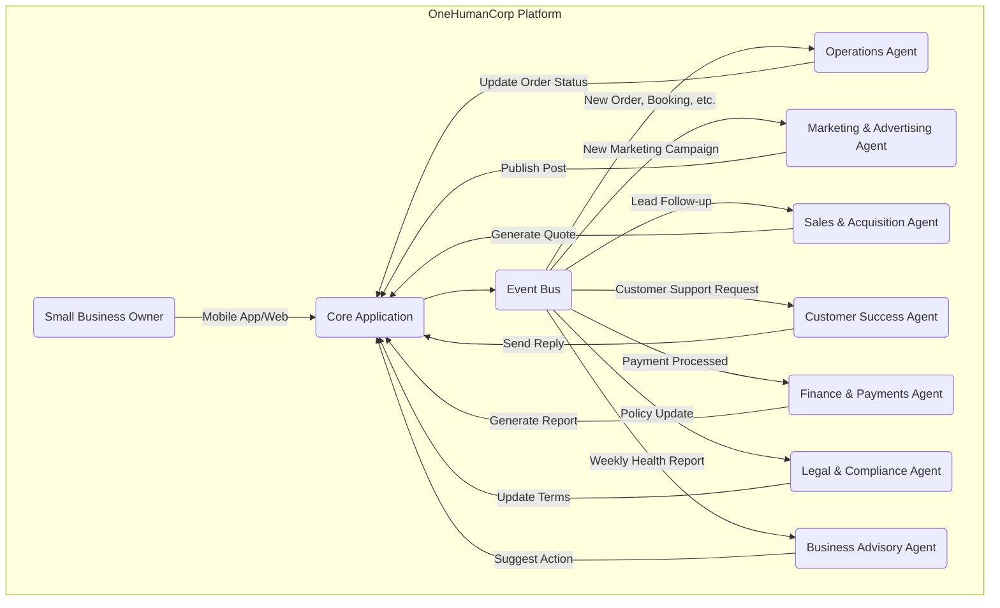

# AI Agent Department Architecture

## Problem Statement

Small business owners—whether they are a baker taking custom orders via Instagram, a handyman relying on word-of-mouth, or a food cart operator pre-ordering supplies—are overwhelmed by the complexity of managing their digital presence and day-to-day operations. They don't have the time or technical expertise to wire up CRMs, manage automated workflows, build multi-page marketing websites, or parse complex financial reports. They need simple, reliable "departments" that run invisibly in the background, akin to hiring a dedicated manager, promoter, salesperson, or accountant. The system must feel like magic, requiring no manual configuration or specialized knowledge.

## Research Report

**Context & Persona Needs:**
- **Maya (Baker):** Needs custom quote generation, automated Instagram DM replies, and calendar syncing for custom orders.
- **Carlos (Handyman):** Needs service pricing, a booking calendar with deposit capabilities, and an AI quote generator.
- **Priya (Boutique Owner):** Needs inventory sync across physical and online stores, newsletter automation, and daily analytics.
- **Fatima (Food Cart):** Needs pre-order notifications, a printable order list, and multi-language support (Arabic + English).
- **Leo (Music Tutor):** Needs a scheduling calendar, automatic meeting link generation, subscription billing, and automated follow-ups for inactive students.

**Competitive Analysis:**
- **Shopify / Wix / Squarespace:** Offer extensive third-party app ecosystems, but require technical knowledge to set up, configure, and connect integrations. The barrier to entry is high, and the tools often feel disconnected from the core workflow.
- **GoDaddy:** Provides simplified website building and marketing tools, but lacks deep integrations for service-based businesses or complex inventory scenarios.
- **OneHumanCorp (OHC):** Must abstract away all technical configuration. The user should define their business and let the AI agents handle the rest. The platform must be mobile-first, ensuring all features are accessible and functional on a 375px wide screen.

**Proposed Solution:**
Introduce a suite of "AI Departments"—specialized agents that handle specific business functions automatically. These departments include Operations, Marketing & Advertising, Sales & Acquisition, Customer Success, Finance & Payments, Legal & Compliance, and Business Advisory.

## Design Doc

### Architecture Diagram

### Key Design Decisions

1. **Event-Driven Architecture:** AI agents will operate on an event-driven basis (e.g., triggering the Operations agent when a new order is received). This ensures real-time responsiveness without manual intervention.
2. **Invisible Integration:** Agents must not require manual configuration. They will derive context from the user's initial business setup and ongoing interactions.
3. **Mobile-First UX:** The AI department interactions must be simple, actionable notifications and summaries delivered via the mobile app, optimized for a 375px display.
4. **Agent Coordination:** Agents must communicate via the Event Bus. For example, when Operations completes an order fulfillment, Customer Success is notified to send a confirmation message.
5. **Approval Workflows:** High-risk actions (e.g., publishing a marketing campaign or updating terms) will require user approval (Draft-for-Review), while routine tasks (e.g., sending a confirmation email) will execute automatically.
6. **Usage Throttling & Budgeting:** AI execution will be tracked and throttled based on the tenant's subscription tier, ensuring cost control while maintaining a smooth user experience.

### Mobile UX Flow (375px)

- **Dashboard:** A clear, at-a-glance view of daily metrics (e.g., new orders, revenue, tasks pending approval).
- **AI Departments Tab:** A simplified view showing the status of each department (e.g., "Operations: 3 orders processing", "Marketing: 1 post drafted for review").
- **Notification Center:** Actionable alerts (e.g., "Approve new Instagram post", "Review draft quote for Carlos").
- **Agent Detail View:** A deeper dive into a specific department's activity log and settings (e.g., adjusting the tone of voice for Customer Success).

## Implementation Prompt

**Task for Implementer:**
Design and implement the core infrastructure and initial set of AI Departments for the OneHumanCorp platform. The system should support event-driven triggers for specialized agents (Operations, Marketing, Sales, Customer Success, Finance, Legal, Advisory). Ensure the agents can coordinate seamlessly via an Event Bus and that high-risk actions are queued for user approval. The user interface must be mobile-first (375px target), presenting agent activities as simple, actionable notifications and summaries without requiring complex setup.

**Acceptance Criteria:**
- The Event Bus is operational and can route events to the correct AI Agent.
- At least two basic agents (e.g., Operations and Customer Success) are implemented and can communicate.
- A "Draft-for-Review" approval workflow is implemented for high-risk actions, visible in the mobile UI.
- The UI properly displays agent activity and requires zero technical configuration from the user.
- All functionality is verified via Playwright E2E and Slint UI tests.

## Priority
P0 (Critical)

## Estimated Scope
Large
