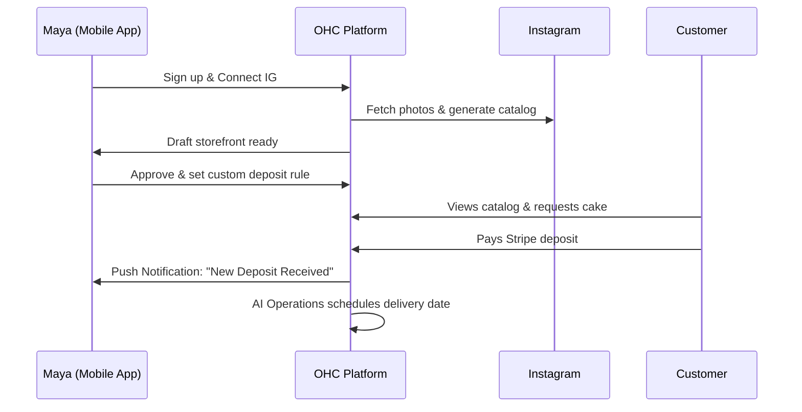
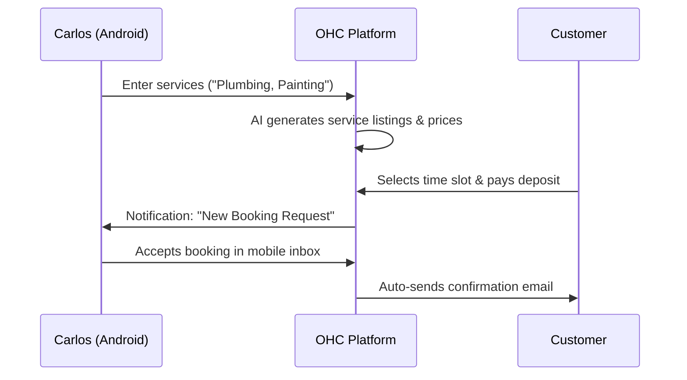
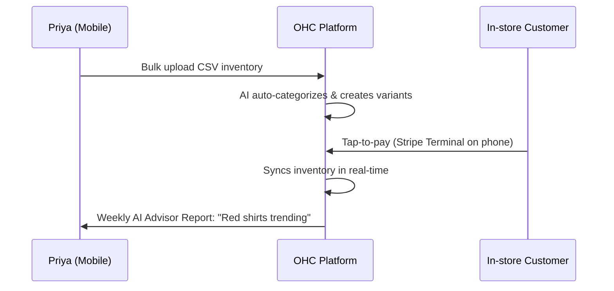
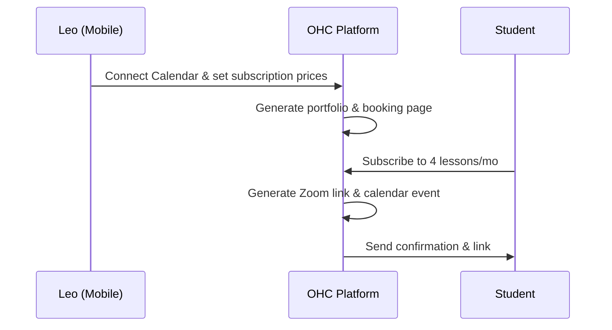
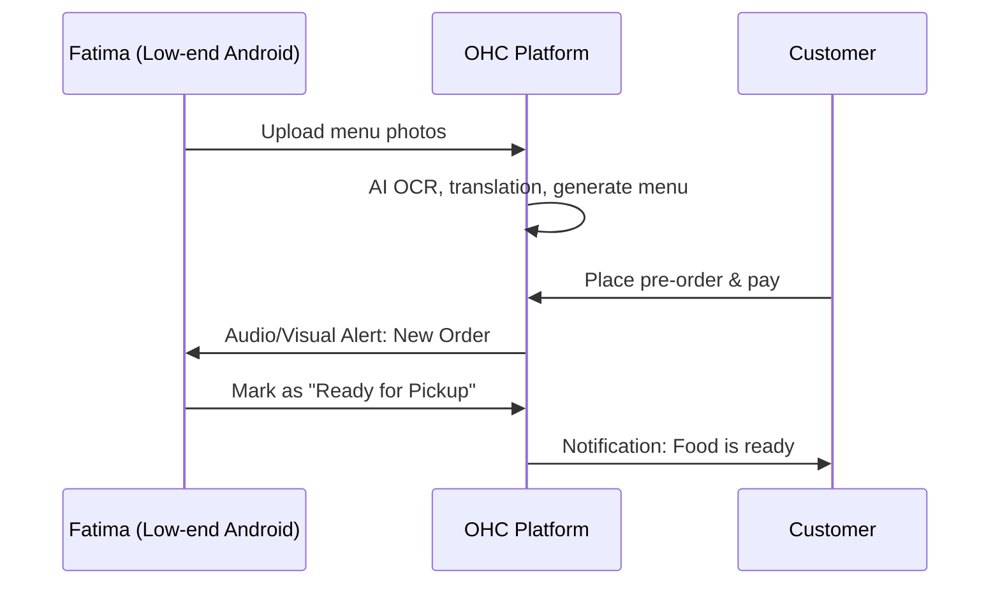

# [Business Journey] OHC End-to-End Persona Architecture

## Problem Statement
Small business owners (bakers, handymen, boutique owners) struggle with the technical complexity, time investment, and disjointed tools required to launch and manage an online presence. Existing platforms (Shopify, Wix, Squarespace) cater primarily to semi-technical users or require significant desktop-based setup, alienating non-technical, mobile-only users who need an integrated, zero-jargon solution.

## Research Report
### Competitive Analysis
- **Shopify**: Powerful but complex. Requires 30-60 minutes for setup and often demands third-party apps for basic features like custom deposit forms or service bookings. Heavily desktop-oriented for management.
- **Wix**: Flexible but overwhelming. The blank-canvas approach paralyzes non-technical users. Mobile management is clunky.
- **Squarespace**: Design-focused but rigid. Lacks deep integration for specialized workflows like food pre-orders or integrated POS tap-to-pay without complex workarounds.
- **OHC Advantage**: Zero setup time (AI generation from raw inputs), true mobile-first management (375px native), and built-in AI agents that actively manage operations (inbox replies, order tracking) rather than just assisting with setup.

### Key Friction Points Identified
1. **The "Blank Canvas" Problem**: Users drop off when faced with empty templates.
2. **Fragmented Inboxes**: Managing Instagram DMs, emails, and web chats separately leads to missed sales.
3. **Complex Payment Logic**: Setting up deposits, recurring subscriptions, or in-person POS usually requires bridging multiple platforms (e.g., Stripe + Calendly + Squarespace).

## Design Doc

### High-Level Architecture
The Business Journey relies on an "AI-Driven Onboarding" paradigm and a "Unified Mobile Dashboard."

**Key Decisions & Invariants:**
1. **Input-to-Draft Paradigm**: Users never start from scratch. They provide an Instagram handle, a CSV, or a plain-text description, and the AI Marketing Agent generates a complete, reviewable draft.
2. **Mobile Parity**: Every action (from setting deposit rules to approving AI draft emails) must be performable on a 375px screen natively.
3. **Unified Context**: All customer interactions and transactions are unified under the `tenant_id` and accessible by all AI Departments to provide holistic insights.

### UX Wireframes / Screen Flow (375px Mobile First)
1. **Welcome Screen**: "How do you run your business?" -> [Connect Instagram] / [Upload Photos] / [Describe in Text].
2. **Processing Screen**: Optimistic UI with glassmorphism spinner. "The Promoter is building your storefront..."
3. **Review Draft Screen**: Full-screen preview of the generated site. Floating Action Button (FAB): [Publish] or [Edit].
4. **Dashboard (Post-Activation)**: Unified inbox up top, daily sales chart below, AI Advisor suggestions ("You have 3 unanswered DMs") prominently displayed.

### Persona Journeys (Sequence Diagrams)

#### 1. Maya — The Home Baker (Instagram to Deposit Flow)
- **Acquisition**: Discovers OHC via an Instagram ad showing a "Link in Bio to Storefront in 5 mins" feature.
- **Onboarding**: Connects her Instagram account. The AI Marketing Agent pulls her photos and generates a catalog. She sets up Stripe with a single tap for deposits.
- **Activation**: First custom cake deposit received within 2 hours.
- **Retention**: Daily push notifications of orders. The AI Customer Success Agent drafts replies to her DMs.
- **Revenue**: Upgrades from Free to Starter tier when she reaches 100 orders to get a custom domain.
- **Referral**: Mentions OHC to another baker friend directly via DM.

#### 2. Carlos — The Freelance Handyman (Booking Flow)
- **Acquisition**: Referred by another contractor. Landing page CTA: "Get Booked Today."
- **Onboarding**: Types "I fix plumbing and paint." AI generates service listings and prices.
- **Activation**: First booking received via Google Search integration.
- **Retention**: Uses the mobile inbox daily to manage quotes and accept bookings.
- **Revenue**: Subscribes to Pro tier for unlimited quotes.
- **Referral**: Showcases his professional booking page to clients directly.

#### 3. Priya — The Boutique Owner (Omnichannel Flow)
- **Acquisition**: Searching for "POS that syncs with online store."
- **Onboarding**: Uploads a CSV of her inventory. AI categorizes products and creates variants.
- **Activation**: First in-store tap-to-pay transaction using Stripe Terminal.
- **Retention**: Reviews daily mobile analytics. AI Advisor suggests reordering trending items.
- **Revenue**: Purchases Business tier for robust analytics and unlimited products.
- **Referral**: Mentions OHC platform at trade shows.

#### 4. Leo — The Music Tutor (Subscription Flow)
- **Acquisition**: Sees a TikTok video about "The ultimate link-in-bio for creators."
- **Onboarding**: Connects Google Calendar. AI generates subscription packages (e.g., 4 lessons/mo).
- **Activation**: First student signs up for a recurring subscription.
- **Retention**: AI Agent auto-follows up with inactive students.
- **Revenue**: Promotes from free tier to start charging standard fee after achieving a reliable monthly recurring base.
- **Referral**: Places the custom domain link prominently in TikTok bio.

#### 5. Fatima — The Food Cart Operator (Pre-Order Flow)
- **Acquisition**: Community outreach flyer.
- **Onboarding**: Takes photos of her menu. AI extracts text, prices, and translates to English/Arabic.
- **Activation**: First pre-order received via customer's phone.
- **Retention**: Uses the printable daily order list. App functions smoothly on slow data.
- **Revenue**: Uses the free tier effectively with transaction-based fees.
- **Referral**: Other food carts notice her streamlined pickup system.

## Implementation Prompt
**Role**: Implementer Agent
**Task**: Build the Mobile-First AI Onboarding Wizard (Frontend & API integration).
**User Journey / CUJ**: A non-technical user opens the app, selects "Connect Instagram," and waits while the system pulls their recent posts. The app displays an optimistic loading screen. Once the backend (AI Marketing Agent) returns the generated draft catalog and theme, the UI presents it for a 1-tap "Publish" approval.
**Acceptance Criteria**:
1. Implement the UI flow starting at 375px width (strict adherence to OHC Premium Token glassmorphism).
2. Connect to the existing `/api/v1/onboarding/generate` backend endpoint.
3. Ensure native mobile keyboards are utilized where text input is required.
4. Provide a full E2E Playwright test (using `loginAsAdmin`) that mocks the AI response and verifies the user reaches the "Draft Review" state.

## Priority
P1

## Estimated Scope
Medium
