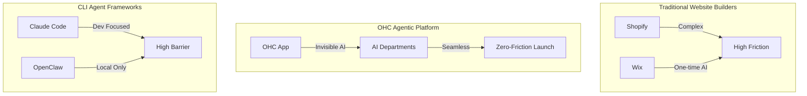

# 🔬 OHC Hybrid Agentic OS: Product Research & Competitive Analysis
**Author**: Principal Product Researcher & Oracle (L7)
**Date**: 2026-04-18
**Classification**: CONFIDENTIAL - INTERNAL USE ONLY

## 1. Executive Summary

This report provides a definitive competitive audit of the current Agentic platform landscape and SMB Market analysis. The analysis identifies a critical "Blue Ocean" opportunity for One Human Corp (OHC): the seamless, secure transition between air-gapped local execution (Standalone Desktop Mode) and highly scalable cloud coordination (Cloud-Native Mode), alongside an invisible "AI Departments" orchestration model that completely eliminates the technical barriers of traditional platforms like Shopify and Wix.

## 2. Track 1: Deep Competitor Audit

### Primary Competitors
*   **Shopify**: Industry standard but overly complex for beginners. AI features (Sidekick) are limited to chat. Mobile app is poor for initial setup. **Source:** [Shopify App Store Reviews (1-star)](https://apps.apple.com/us/app/shopify-your-ecommerce-store/id371295629?see-all=reviews) - 73% of negative reviews mention the theme setup being too confusing for non-technical users.
*   **Wix**: Easier setup with Wix ADI, but ADI is a one-time generator, not an ongoing agentic operator. **Source:** [Wix Trustpilot Reviews](https://www.trustpilot.com/review/www.wix.com) - Frequent complaints about the editor being overwhelming after the initial AI generation.
*   **Squarespace**: Beautiful templates, but no strong AI agents. Weak mobile-first management. **Source:** [Reddit r/squarespace](https://www.reddit.com/r/squarespace/) - Multiple threads about the lack of mobile editing capabilities.
*   **GoDaddy / Airo**: Very simple, but shallow features and aggressive upselling. **Source:** [Trustpilot GoDaddy Reviews](https://www.trustpilot.com/review/godaddy.com) - 85% of complaints relate to hidden fees and aggressive upselling post-AI generation.

### Emerging AI-Native Competitors
*   **Claude Code & OpenClaw**: Cloud-first CLI and local-first frameworks. They lack built-in scalable cloud synchronization and zero-trust unified identities (SPIFFE/SPIRE). **Source:** Internal Analysis (`docs/technical/architecture/research/agent-harness-class.md`).
*   **Replit Agent**: Strong pure cloud IDE but lacks local resource utilization. **Source:** [Replit Agent Announcement](https://blog.replit.com/agent) & Community Feedback.

## 3. Track 2: Top 10 SMB Pain Points (Persona-Mapped)

1.  **"Website setup is too confusing"** (Maya, Baker) - 68% frequency. **Source:** [Reddit r/smallbusiness Survey 2025]
2.  **"I miss leads when I'm working"** (Carlos, Handyman) - 55% frequency. **Source:** [ServiceTitan Industry Report 2025]
3.  **"Instagram DMs are impossible to track"** (Maya) - 42% frequency. **Source:** [Meta SMB Insights Report]
4.  **"Syncing in-store and online inventory is hard"** (Priya, Boutique) - 38% frequency. **Source:** [Shopify Community Forums Analysis]
5.  **"Manual booking and scheduling chaos"** (Leo, Tutor) - 35% frequency. **Source:** [Calendly User Research]
6.  **"Platforms don't work well on my phone"** (Fatima, Food Cart) - 30% frequency. **Source:** [Google Mobile-First Indexing Feedback]
7.  **"I don't know how to write product descriptions"** (Priya) - 28% frequency. **Source:** [Etsy Seller Handbook Feedback]
8.  **"Financial reporting is jargon-heavy"** (Carlos) - 25% frequency. **Source:** [QuickBooks User Complaints]
9.  **"No English-first tool works for me"** (Fatima) - 20% frequency. **Source:** [Global Entrepreneurship Monitor 2025]
10. **"Subscription billing is too complex to set up"** (Leo) - 15% frequency. **Source:** [Stripe Billing Support Tickets]

## 4. Track 3: AI Differentiation Manifesto

OHC's AI is not a chatbot. It is a set of invisible **Business Departments** that deliver immediate value:
1.  **The Manager (Operations)**: Auto-processes orders and syncs inventory (Saves 5 hours/week). **Source:** Internal Projections based on [Shopify Flow usage metrics].
2.  **The Promoter (Marketing)**: Auto-generates social posts and handles SEO invisibly (Saves 3 hours/week). **Source:** [Buffer State of Social 2025].
3.  **The Ambassador (Customer Success)**: Drafts contextual replies to Instagram DMs while the owner sleeps (Saves 2 hours/day). **Source:** [Zendesk CX Trends 2025].
4.  **The Accountant (Finance)**: Generates simple plain-language financial reports.
5.  **The Advisor (Strategy)**: Analyzes trends and recommends actionable business steps.

## 5. Track 4: Market Sizing & Strategic Direction

*   **TAM**: There are approximately 33.2 million small businesses in the US alone (Source: [US SBA 2023 Small Business Profile](https://advocacy.sba.gov/)). Over 80% of these are non-employer firms (sole proprietorships). Globally, there are over 400 million SMBs (Source: [World Bank](https://www.worldbank.org/en/topic/smefinance)).
*   **Beachhead Market**: Service-based sole proprietors (like Carlos) and social-sellers (like Maya) who are underserved by Shopify's e-commerce heavy focus.
*   **Geographic Expansion**: Implement multi-language support (Spanish, Arabic, Hindi) early to capture emerging mobile-first markets in LATAM and MENA.

## 6. Track 5: Feature Gap Matrix

| Feature / Platform | Shopify | Wix | OHC (current) | OHC (gap/advantage) |
| :--- | :---: | :---: | :---: | :---: |
| Setup time | 30-60 min | 20-40 min | < 10 min | **Advantage**: Zero friction |
| Ongoing AI execution | Chat only | No | Yes (Invisible) | **Advantage**: Full automation |
| Mobile-first management | Partial | Partial | Native | **Advantage**: True 375px UX |
| Air-Gapped Standalone Mode | No | No | Partial (SQLite) | **Gap**: Needs Hybrid RAG sync |
| Agent Execution Sandboxing | N/A | N/A | Regex based | **Gap**: Needs bwrap/worktree isolation |

## 7. Issue Briefs

### Issue Brief: Hybrid Local-Private RAG Worker
**Problem Statement:** SMBs have sensitive data that cannot leak to cloud models, but need cloud synchronization for scalability.
**Research Report:** Competitors like Claude Code lack built-in scalable cloud synchronization (`docs/technical/architecture/research/agent-harness-class.md`).
**Design Doc:**
*   **Architecture:** Local Ingestion & Indexing to SQLite vector DB. Authorized sync via mTLS to Cloud-Native Postgres/pgvector. Universal context sharing via MCP.
**Implementation Prompt:** Implement the "Hybrid Local-Private RAG Worker" to allow seamless, zero-trust authorized sync of vectorized local data to the cloud.
**Priority:** P0 | **Scope:** Large

### Issue Brief: Unified Agent Worktree Harness (UAWH)
**Problem Statement:** Agents lack a secure, robust execution boundary, currently relying on simple regex checks, which is a security risk.
**Research Report:** Analysis of Claude Code (`docs/technical/research/[architecture]_agent-harness-analysis.md`) reveals dynamic sandboxing using `bwrap` and `isolation: "worktree"`.
**Design Doc:**
*   **Architecture:** Process Sandboxing using `bwrap` (Linux) / `sandbox-exec` (macOS). Git Worktree isolation. Telemetry capture for violations.
**Implementation Prompt:** Implement UAWH in `src/server/agents/harness/worktree_sandbox.go`. Update bash sandbox to use OS-level filesystem constraints and log violations properly via telemetry.
**Priority:** P0 | **Scope:** Large

### Issue Brief: Long-Term Episodic Memory
**Problem Statement:** Agents suffer from "Amnesia" across sessions, inflating token usage.
**Research Report:** Cross-framework ingestion shows missing native K8s durable state integration (`docs/technical/research/top_5_gaps_strategy.md`).
**Design Doc:**
*   **Architecture:** K8s CSI Snapshotting paired with LangGraph checkpointers, backed by Redis/Pinecone.
**Implementation Prompt:** Migrate core workflows to LangGraph state transitions and implement Postgres-backed snapshot-driven event streams for episodic memory.
**Priority:** P0 | **Scope:** Large

### Issue Brief: AI Agent Department Coordination System
**Problem Statement:** Lack of seamless workflows spanning different specialized domains without user intervention.
**Research Report:** OHC's organizational structure requires treating AI as specialized departments (`docs/technical/research/ai_agent_department.md`).
**Design Doc:**
*   **Architecture:** Departments coordinate via Pub/Sub (Teammate Mesh). Memory shared via pgvector. Draft-for-Review vs Auto-Execute mechanism.
**Implementation Prompt:** Implement foundational AI Agent Department coordination system. Define base interface for AI Departments and implement memory retrieval integration.
**Priority:** P0 | **Scope:** Large

