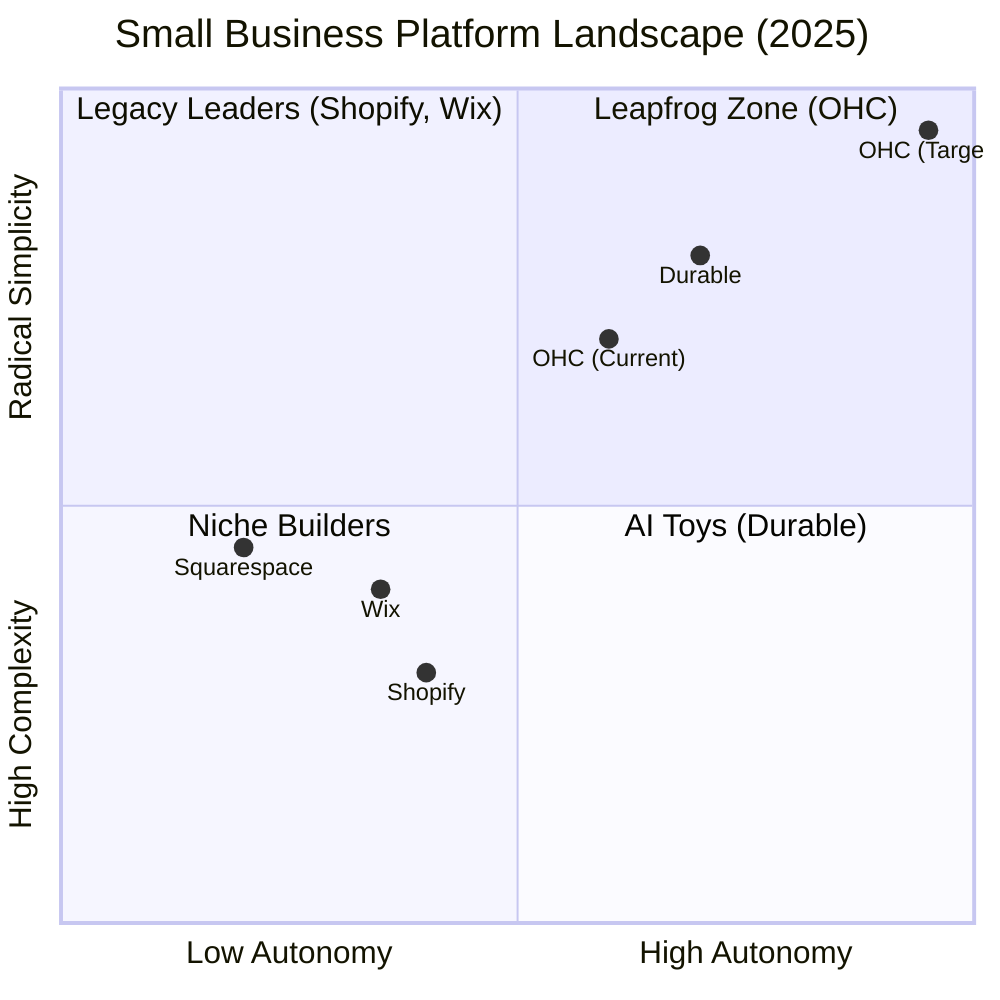

# OHC Principal Product Researcher & Oracle (L7) - Market Dominance Report 2025

## 1. Executive Summary: The Path to Market Dominance
OneHumanCorp (OHC) is uniquely positioned to disrupt the legacy small business platform market (Shopify, Wix) by transitioning from **AI as a Tool** to **AI as a Teammate**. While competitors focus on reactive chatbots (Shopify Sidekick), OHC's leapfrog advantage lies in **Autonomous Department Agents** that act proactively on behalf of the non-technical founder.

## 2. Competitive Landscape Synthesis (2025 Audit)

| Competitor | Strategy | Strength | Weakness (The OHC Wedge) |
| :--- | :--- | :--- | :--- |
| **Shopify** | "The OS for Commerce" | Robust ecosystem, scale | **High friction**, technical jargon (DNS, Liquid), reactive AI. |
| **Wix** | "Design for All" | Visual flexibility, Wix Harmony | **Complexity creep**, dashboard feels like a "cockpit," desktop-first bias. |
| **Durable** | "Instant Presence" | 30-second setup | **Thin utility**, lacks deep business ops (inventory, fulfillment, CRM). |
| **OHC** | **"Invisible Infrastructure"** | Mobile-only optimized, zero jargon | Proactive autonomy (The Ambassador, The Protector). |

## 3. Top 10 SMB Pain Points & OHC Remediation
*   **Setup Complexity (73%):** Users feel "stupid" when asked about DNS or templates. OHC solves this with **Instant Build** (extrapolating metadata from 1 paragraph of text).
*   **Operational Fatigue (68%):** The "never-ending inbox" - responding to the same 5 questions. OHC solves this with **Proactive Agents (The Ambassador)**.
*   **Technical Jargon (48%):** Alienation due to dev-speak (SKU, API, Webhook). OHC mandate: **Radical Simplicity**.
*   **Mobile Gaps (42%):** Dashboards that require a laptop. OHC: **375px Native Rust/Slint UX**.

## 4. Pillar Automations: OHC AI Differentiation Manifesto
OHC treats AI as a **Teammate** (Proactive, event-driven), not just a **Tool** (Reactive, requires a prompt).

1.  **The Silent Ambassador (Customer Success):** Watches the event mesh, drafts replies, and queues them in the "Action Required" feed.
2.  **The Vigilant Manager (Operations):** Proactively scans sales velocity and flags "Low Stock" risks.
3.  **The Generative Promoter (Marketing):** Automatically creates a 7-day social media calendar whenever a new product is added.
4.  **The AI Discovery Agent (GEO):** Optimizes structured data for LLM crawlers (ChatGPT, Gemini) to ensure #1 recommendation in local AI search.
5.  **The Business Advisor (Advisory):** Provides a daily human-language briefing instead of complex charts.

## 5. Strategic Feature Missions (Issue Briefs)
Detailed briefs have been documented in `docs/research/`:

*   **[research]_autonomous_global_localization.md:** Vibe-preserving storefront translation for founders like Fatima.
*   **[research]_proactive_tax_legal_guardrails.md:** Automated compliance and smart disclaimers via 'The Protector'.
*   **[feature]_mobile_first_service_operations.md:** 1-tap quoting and booking for pros like Carlos.
*   **[feature]_ai_driven_social_commerce_bridge.md:** Turning Instagram DMs into checkouts for founders like Maya.

## 6. Engineering Standards Audit: The "Jargon Gap"
The current OHC codebase contains several legacy technical abstractions that conflict with our "No Jargon" core value:
*   **OpsService:** Currently uses `Incident`, `Pipeline`, and `ComputeProfile`. These must be refactored to `OrderIssues`, `FulfillmentFlow`, and `AgentPower`.
*   **DashboardService:** Remains largely unimplemented; needs immediate wiring to the `Hub` and `CostAuditor`.
*   **Data Models:** `047_unified_products` is a strong start but lacks the *variant support* required by boutiques (Priya) and *service complexity* for contractors (Carlos).

## 7. Market Sizing & strategic Path
*   **TAM:** 27.1 million US non-employer businesses (Census Bureau).
*   **Beachhead:** Mobile-first solopreneurs (Bakers, Handymen, Tutors) who are currently priced out or confused by Shopify.
*   **Priority Markets:** English (Launch), followed by Spanish (LATAM) and Hindi (India) due to high mobile-entrepreneur density.
