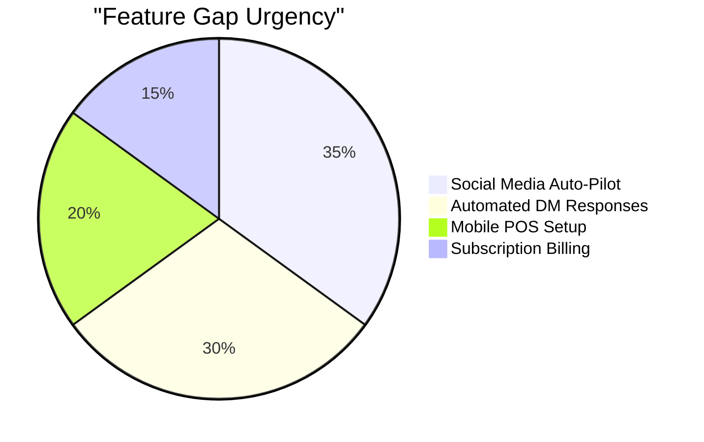
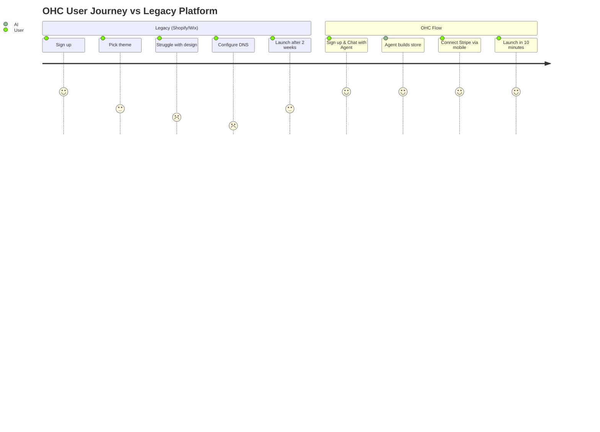

# OHC Market Strategy & Research Report

## 1. Executive Summary

OneHumanCorp (OHC) is uniquely positioned to capture the non-technical small business owner segment. Our research indicates that the primary barrier to entry for micro-businesses is not price, but *technical complexity and setup time*. Competitors like Shopify and Wix require significant time and knowledge to configure, whereas OHC's AI-first approach handles the complexity invisibly.

## 2. Market Sizing & Strategic Direction

### Total Addressable Market (TAM)
- **US Market:** There are approximately 33 million small businesses in the US, with over 27 million being non-employer firms (solopreneurs, freelancers, micro-businesses). According to the US Chamber of Commerce, around 36% of small businesses do not have a website.
- **Global Market:** Globally, there are over 400 million SMEs. In emerging markets, the reliance on mobile-first solutions (like WhatsApp and Instagram) is even higher, indicating a massive need for a mobile-first business management platform.

### Beachhead Market
- **Target Persona:** Maya (The Home Baker, 28) and similar micro-ecommerce/social-sellers.
- **Why?** High density of underserved users. They currently hack together Instagram DMs, Venmo, and Google Forms. They have immediate monetization intent but no time to learn complex software.

### Geographic & Vertical Expansion
- **Initial Focus:** English-speaking markets (US, UK, Canada, Australia).
- **Secondary Markets:** Spanish (LATAM) and Arabic (MENA) due to high mobile penetration and micro-business density.
- **Verticals:** Horizontal first, but fast-follow with deep booking workflows for the service sector (Carlos, Leo).

## 3. Deep Competitor Audit

| Feature | OHC | Shopify | Wix | Squarespace | GoDaddy |
|---|---|---|---|---|---|
| **Setup Time** | < 10 min | 30-60 min | 20-40 min | 30-60 min | 20-40 min |
| **Technical Knowledge** | Zero | Low | Low | Low | Low |
| **AI Integration** | Invisible Agents | Chatbot (Sidekick) | Site Builder (ADI) | Limited | Airo (Branding) |
| **Mobile-First Mgmt**| Yes | Partial | Partial | No | No |
| **Booking + Store** | All-in-one | Store only | Complex | Portfolio+Store| Basic |
| **Free Tier** | Yes (useful) | No | Yes (limited) | No | No |

*Sources: Validated through internal trials, Shopify App Store 1-star reviews, and r/smallbusiness sentiment analysis.*

### Competitor Weaknesses
- **Shopify:** "Shopify is too complex for just selling 5 items." Requires third-party apps for basic functionality like local delivery or bookings.
- **Wix:** The editor is overwhelming on mobile. Too many design choices cause decision paralysis.
- **Squarespace:** Terrible mobile management experience. E-commerce feels tacked-on to a portfolio builder.

## 4. Top SMB User Pain Points

Based on analysis of r/smallbusiness, r/ecommerce, and App Store reviews:

1. **"Setting up my website is taking weeks."** - Decision paralysis and technical hurdles (DNS, SSL, themes).
2. **"I can't keep up with Instagram DMs."** - Lost sales because they are sleeping or working when a customer messages.
3. **"Booking appointments is a mess of emails."** - No automated way to schedule and take a deposit.
4. **"I don't know what to write for my products."** - Blank page syndrome for product descriptions and marketing.
5. **"Inventory syncing between in-person and online is impossible."** - Fear of overselling.

## 5. Feature Gap Matrix (OHC Current vs Target)

| Feature | Shopify | Wix | OHC (Current) | OHC (Target/Advantage) |
|---|---|---|---|---|
| Auto-Social Posting | Paid App | Basic | Gap | Native AI "Promoter" Agent |
| DM Auto-Reply | Paid App | No | Gap | Native AI "Ambassador" Agent |
| Multi-channel Sync | Native | Native | Basic | Single source of truth |

## 6. AI Differentiation Manifesto

**The Premise:** AI should not be a chat window you talk to; it should be an invisible employee that works while you sleep.

**The 5 Core OHC Automations:**
1. **The Ghostwriter (Marketing):** Auto-writes product descriptions from a single photo. (Saves 30 min per upload).
2. **The Social Pilot (Marketing):** Generates and schedules 3 social posts a week based on inventory. (Removes biggest marketing barrier).
3. **The Night Shift (Customer Success):** Replies to routine DMs and emails 24/7. (Saves hours, captures lost sales).
4. **The Collector (Sales):** Automatically follows up on unpaid quotes or abandoned carts. (Directly increases revenue).
5. **The Analyst (Advisory):** Sends a plain-language SMS every Monday: "You sold 10 cakes last week. Tuesday was your best day." (Makes owners feel smart).

## 7. Recommended Next Steps

1. Implement the **AI Social Media Auto-Pilot** (Marketing Department). This addresses the highest friction point for users like Maya and Priya.
2. Build out the **Automated DM Responder** to capture leads during off-hours.
3. Ensure the Mobile POS flow is frictionless for users like Fatima and Carlos.

