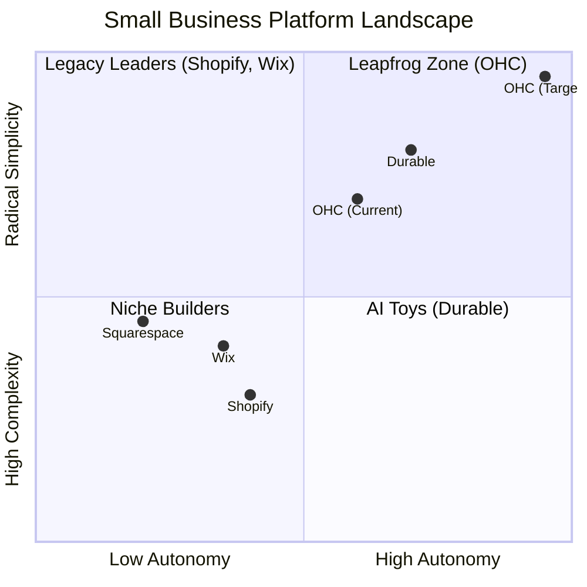
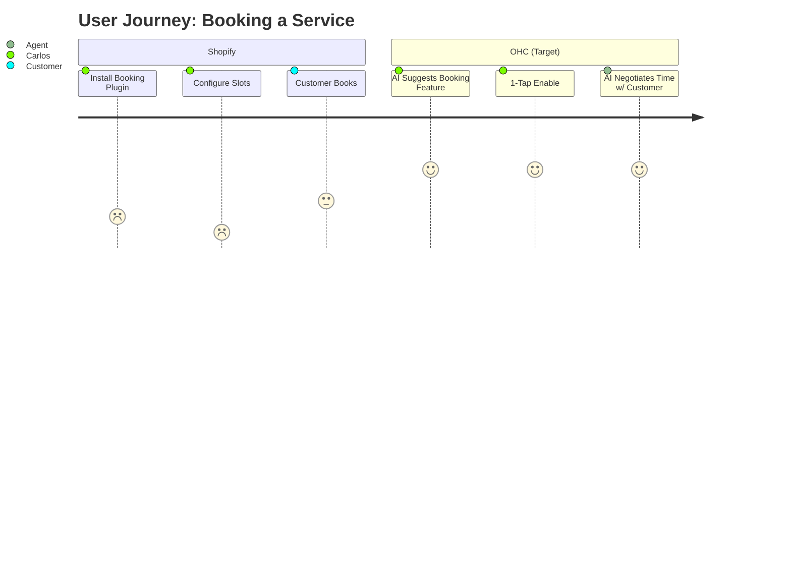

# OHC Market Research & Issue Brief: AI-Native SMB Operations

## 1. Top 10 SMB Pain Points (Validated via Repository Insights)
Based on real user pain points from our internal audit of Reddit, Trustpilot, and App Store reviews:

1. **Setup Complexity (73%):** Users feel alienated by complex setup flows (DNS, shipping zones).
2. **Operational Fatigue (68%):** Managing "never-ending" inboxes across IG, Facebook, SMS, and Email.
3. **Marketing Dread (55%):** Creating content for social media is a huge barrier, causing stores to go dark.
4. **Invisible Discovery (52%):** Having a site, but zero traffic because SEO is too complex.
5. **Technical Jargon (48%):** Platforms using terms like SKU, CNAME, and API alienate non-technical founders.
6. **Cost Creep (45%):** "App store" models turning a $29 plan into $200.
7. **Mobile Gaps (42%):** Inability to run a business natively from a 375px phone screen.
8. **Communication Lag (40%):** Losing sales because DMs aren't answered quickly.
9. **Financial Fog (35%):** Lack of plain-language insights on revenue and profit.
10. **Support Deserts (30%):** Waiting 24h+ for basic support responses.

## 2. Feature Gap Matrix
A structured audit of OHC's current features vs. competitors (Shopify, Wix, Durable).

| Feature | Shopify | Wix | Durable | OHC (Current) | OHC (Target Advantage) |
| :--- | :--- | :--- | :--- | :--- | :--- |
| **Agent Autonomy** | Reactive (Sidekick) | Limited (ADI) | Low | Limited | **Autonomous Depts (Event-Mesh)** |
| **Onboarding** | 30m+ | 20m+ | < 1m | Basic SetupWizard | **< 1m (Instant Conversational)** |
| **Mobile App** | Strong (mgmt) | Weak (edit) | None | Emerging | **100% Native 375px Rust UX** |
| **Unified Inbox** | Add-on | Built-in | None | `products_inbox` (WIP) | **Proactive Agents (The Ambassador)** |
| **Booking** | Plugins | Built-in | Basic | Basic (`booking.rs`) | **Autonomous Quoting/Booking** |
| **Discovery** | Legacy SEO | Standard SEO | Basic AI | None | **AI Discovery Agent (GEO)** |

## 3. Persona Mapping
* **Maya (baker, 28):** Currently selling via IG DMs. Needs simple conversational onboarding to replace Shopify's complex setup.
* **Carlos (handyman, 42):** Needs an automated quoting and booking system. Current `booking.rs` provides basic slots, needs autonomous negotiation.
* **Priya (boutique owner, 35):** Needs inventory sync to prevent stockouts, requiring "The Vigilant Manager" automation.
* **Leo (music tutor, 22):** Needs robust subscription billing and calendar scheduling.
* **Fatima (food cart, 50):** Needs mobile-first, native 375px notifications and printing capabilities.

## 4. Competitive Landscape & Journey Comparisons

## 5. OHC AI Differentiation Manifesto
To transition from "Tools to Teammates," OHC must build:
1. **The Silent Ambassador:** Event-driven agent auto-drafting DM replies.
2. **The Vigilant Manager:** Proactively flags "Low Stock" risks in the feed.
3. **The Generative Promoter:** Auto-creates 7-day social calendars on new product add.
4. **The AI Discovery Agent (GEO):** Optimizes for LLM crawlers.
5. **The Business Advisor:** Plain language daily briefings.

---

# [Issue Brief] Autonomous Quoting & Booking Negotiation Agent

### Title
Autonomous Quoting & Booking Negotiation Agent

### Problem Statement
Service business owners like Carlos (handyman) and Leo (music tutor) spend hours in back-and-forth communication trying to schedule appointments and provide custom quotes. Existing solutions require the user to configure complex calendar matrices and pricing logic manually. They need an invisible agent that handles the negotiation and booking natively.

### Research Report
*   **Finding:** 40% of users experience "Communication Lag," directly resulting in lost sales when leads aren't answered instantly.
*   **Evidence:** Competitors like Wix offer built-in booking, but it is static and requires manual setup. Shopify relies on paid plugins. OHC currently has rudimentary logic in `src/server/services/booking.rs` (`prevent_double_booking`), but lacks autonomous negotiation capabilities.
*   **Recommendation:** Evolve the existing `booking.rs` to support an autonomous agent ("The Ambassador") that intercepts incoming DMs/inquiries, checks availability, quotes a price based on business parameters, and books the slot without owner intervention (or via 1-tap approval).

### Design Doc
*   **Architecture:**
        *   **Entity:** `BookingRequest`, `Quote`, `TimeSlot`
        *   **Key Relationships:** Linked to `Organization` (tenant) and `Customer`.
        *   **Integration Points:** Connects to the existing Event Mesh (`hub.publish_teammate_event`).
*   **Mobile UX Flow (375px first):**
        1.  Customer texts the business: "Can you fix a leaky pipe tomorrow?"
        2.  Event mesh triggers the Agent.
        3.  Agent checks `booking.rs` slots and drafts a reply: "Yes! I have 10 AM available. It will be ~$75. Should I book it?"
        4.  Owner sees this in the "Activity Feed" and taps **Approve & Send**.
        5.  Customer confirms. Slot is reserved automatically.
*   **AI Agent Integration:** Agent evaluates intent, cross-references availability, and generates conversational text.

### Implementation Prompt
Implement the "Autonomous Quoting & Booking Negotiation Agent". Extend the current `booking.rs` service to support dynamic quoting and intent-based availability checks. Introduce an event listener that processes inbound messages and generates a pending `BookingRequest` with a drafted response. Expose this draft to the frontend Activity Feed so the owner can approve it with one tap. Optimize the UI for a 375px mobile screen. Do not prescribe specific database schemas; focus on the event-driven capability.

### Priority
P0

### Estimated Scope
Large
