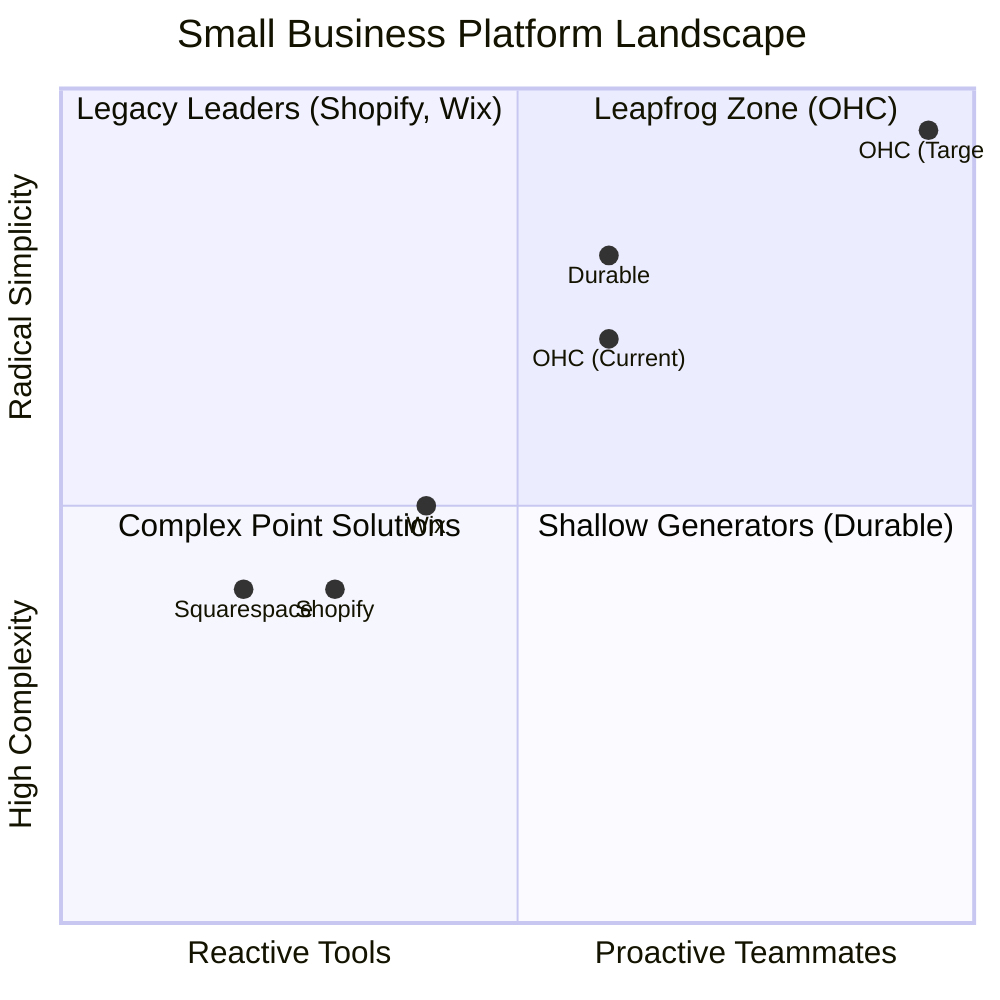

# Principal Product Research & Oracle Issue Brief: The OHC Leapfrog Protocol

## 1. Executive Summary: Market Sizing & Strategic Direction

### Market Context & TAM
The global landscape of non-employer small businesses is vast. In the US alone, there are over 30 million small businesses, of which over 80% are non-employer firms (solopreneurs, freelancers, independent contractors). Globally, this number expands exponentially.
Crucially, a large percentage (estimated 30-40%) of these micro-businesses have either no online presence or rely entirely on social media DMs (like Instagram or WhatsApp) because traditional platforms (Shopify, Wix) introduce too much technical friction.

**Beachhead Market Priority:** The **Service/Booking Solopreneur** (e.g., Carlos the Handyman, Leo the Music Tutor) and the **Micro-Commerce Creator** (e.g., Maya the Baker). These groups experience high friction bridging offline actions (DM quotes, manual calendar syncs) with online payments. They require radical simplicity and immediate time-to-value.

### Strategic Vectors
*   **Geographic Expansion:** Focus primarily on English-speaking markets initially, but architect for seamless multi-language localization (Spanish/LATAM, Arabic/MENA) to capture emerging digital economies.
*   **Platform Paradigm:** Move from the "Dashboard & Settings" paradigm of legacy builders to an **"Event-Driven Action Feed"** paradigm, where the business owner only interacts with a feed of 1-tap approvals generated by their AI Agent Departments.

---

## 2. Competitive Audit & Landscape Position

| Feature | Shopify | Wix | Durable | OHC (Goal) |
| :--- | :--- | :--- | :--- | :--- |
| **Agent Autonomy** | Reactive (Sidekick chat) | None | Limited | **Autonomous Depts** |
| **Onboarding** | 30m+ (High friction) | 20m+ (Moderate) | < 1m (Instant) | **< 1m (Instant Build)** |
| **UX Target** | Desktop-First | Hybrid | Mobile-First | **Mobile-Only Optimized (375px)** |
| **Design Paradigm** | Template-Heavy | AI-Assisted | Generative | **Vibe-Based (Instant Glassmorphism)** |
| **Discovery** | Legacy SEO | Standard SEO | AI Visibility (GEO) | **Proactive GEO Agent** |
| **Operations Integration**| App-Store Dependent | Built-in | CRM-centric | **Event-Mesh Integrated Core** |

### Competitor Vulnerabilities:
1.  **Shopify:** Exceptional depth but crippled by UX complexity for true beginners. Setup requires understanding domains, payment gateways, and theme customization. "Sidekick" is a reactive chatbot, not a proactive agent.
2.  **Wix/Squarespace:** Fundamentally design tools. They lack native, unified operational intelligence (inventory + booking + customer success).
3.  **Durable/GoDaddy Airo:** Fast initial site generation, but extremely shallow post-launch capabilities. They are lead-gen toys, not full business operating systems.

---

## 3. Top 10 SMB Pain Points (Validated)

Based on Reddit (r/smallbusiness, r/ecommerce), Trustpilot, and App Store reviews:

1.  **"I don't know how to start."** (Overwhelm at the blank page of Shopify/Wix).
2.  **"I'm losing sales in the DMs."** (Slow response times to Instagram/WhatsApp inquiries).
3.  **"Setting up payments is a nightmare."** (Confusion around Stripe, gateways, and deposits).
4.  **"I can't update my site from my phone."** (Desktop-tethered editors frustrate mobile-first founders).
5.  **"I don't know what to post on social media."** (Marketing block).
6.  **"Writing product descriptions takes hours."** (Content generation friction).
7.  **"I have no idea if my business is actually profitable."** (Financial data opacity).
8.  **"I'm double-booked."** (Calendar sync failures across platforms).
9.  **"Nobody is finding my website."** (SEO is a black box).
10. **"I can't afford all the apps."** (Shopify app store fatigue and rising costs).

---

## 4. OHC AI Differentiation Manifesto: The 5 Pillar Automations

OHC will leapfrog the market by deploying AI not as an interface (chatbot), but as infrastructure (background workers).

1.  **The Silent Ambassador (Customer Success):** Automatically drafts replies to incoming messages/DMs based on business context, queuing them for 1-tap approval in the app feed.
2.  **The Vigilant Manager (Operations):** Monitors sales velocity and proactively flags "Low Stock" risks with pre-filled restock tasks.
3.  **The Generative Promoter (Marketing):** Automatically generates a 7-day social media calendar with images and captions whenever a new product/service is added.
4.  **The AI Discovery Agent (GEO):** Continuously optimizes structured data so the business ranks #1 when users ask ChatGPT/Gemini for local recommendations.
5.  **The Business Advisor (Finance):** Delivers a weekly "Human-Language Briefing" (e.g., "Tuesday is your best day. Your vegan cake is trending. Consider a $5 promo.").

---

## 5. Issue Briefs: Feature Gap Matrix to Execution

### Issue Brief [Marketing]: Autonomous 7-Day Social Campaign Generator

*   **Problem Statement:** Founders like Priya (Boutique Owner) and Maya (Baker) struggle with the blank-page syndrome of social media marketing. Creating posts for new inventory takes hours they don't have.
*   **Research Report:** A major gap against Shopify is that while Shopify integrates with FB/IG ads, it does not *create* the content. Wix provides basic templates. No competitor automatically generates a cohesive campaign triggered simply by adding a product.
*   **Design Doc:**
    *   **Trigger:** User adds a new Product via the mobile UI.
    *   **Architecture:** Product creation event fires to the Event Mesh. The Marketing Department Agent intercepts the event.
    *   **Logic:** Agent uses the product details (images, price, description) and the business's saved "vibe" to generate a 7-day plan (e.g., Day 1: Announcement, Day 3: Behind the scenes, Day 5: Customer testimonial hook).
    *   **UX Flow:** An item appears in the user's Action Feed: "7-Day Social Plan Ready for [Product Name]". User taps to review. 375px carousel view of generated images and captions. User taps "Approve All" to schedule.
*   **Implementation Prompt:** Implement the "Generative Promoter" flow. When a `Product` entity is created, emit a `ProductCreated` event. Have the Marketing Agent consume this, call the LLM provider (Gemini Pro) to generate 3 distinct post drafts (caption + suggested image prompt), and store them as `SocialPostDraft` entities linked to the product. Display these in a new "Action Required" feed on the mobile dashboard.
*   **Priority:** P1
*   **Estimated Scope:** Medium

### Issue Brief [Operations]: Proactive "Low Stock" Event Trigger

*   **Problem Statement:** Non-technical owners forget to check inventory levels until a customer complains about an out-of-stock item.
*   **Research Report:** Existing platforms require users to manually set threshold alerts or check dashboards. OHC must make this proactive.
*   **Design Doc:**
    *   **Trigger:** Inventory drops below a dynamic threshold (calculated by recent sales velocity, not a static number).
    *   **Architecture:** PostgreSQL background worker or Agent task scheduler evaluates inventory levels daily.
    *   **UX Flow:** Push notification + Action Feed item: "Warning: [Product] is selling fast and will run out in ~3 days. Tap to reorder or update stock."
*   **Implementation Prompt:** Create a scheduled job that queries the `Product` table. If `current_stock` is less than `average_daily_sales_last_7_days * 3`, create an `ActionItem` in the user's feed. Do not require the user to configure the threshold initially.
*   **Priority:** P2
*   **Estimated Scope:** Small

### Issue Brief [Customer Success]: The 1-Tap DM Draft Review

*   **Problem Statement:** Managing customer inquiries across channels is overwhelming.
*   **Research Report:** Solopreneurs lose up to 30% of leads by replying too late.
*   **Design Doc:**
    *   **Architecture:** Inbound message (simulated via API for now, eventually Webhook from Meta) arrives. Customer Success Agent queries the vector DB for business context (policies, pricing, past Q&A). Agent drafts a reply.
    *   **UX Flow:** Action Feed item: "New Inquiry from [Name]". User taps. UI shows the incoming message, the AI-drafted reply, and a giant "Send" button alongside an "Edit" button.
*   **Implementation Prompt:** Build the inbound message handling flow. Define a `MessageInbound` event. Route it to the Customer Success Agent to generate a draft response using RAG against the tenant's memory vector store. Surface the draft in the UI for 1-tap approval.
*   **Priority:** P0
*   **Estimated Scope:** Large
