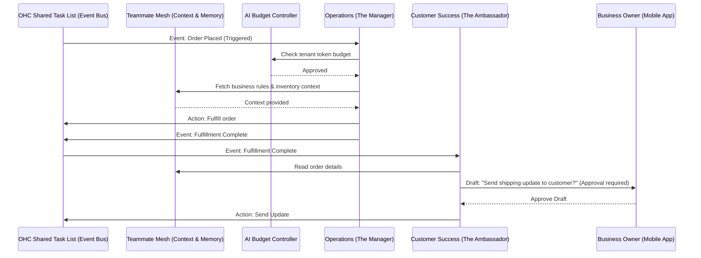

# AI Agent Department Architecture

## Title
AI Agent Department Coordination & Workflow Architecture

## Problem Statement
OneHumanCorp (OHC) enables non-technical small business owners to run operations invisibly through AI Agent Departments. Currently, there is a lack of a formalized architecture defining how these autonomous departments (Operations, Marketing, Sales, Customer Success, Finance, Legal, Advisory) are triggered, how they share context, how they coordinate handoffs without blocking, and how to safely manage automated actions versus human-in-the-loop approvals, all while enforcing tenant-level AI usage budgets.

## Research Report
**Market & Competitive Analysis:**
* **Shopify / Wix / Squarespace:** Traditional platforms rely on deterministic automations (e.g., Shopify Flow) or passive AI (e.g., generating product descriptions). They do not offer autonomous, inter-departmental agent swarms acting on behalf of the user.
* **Key Findings:**
  * **Triggering:** Polling external events is expensive. A unified event bus is necessary to trigger departments based on state changes (e.g., "Order Placed" triggers Operations).
  * **Memory:** Agents need a shared memory ledger to avoid asking the user duplicate questions.
  * **Approvals:** Small business owners are highly sensitive to brand reputation and financial risk. High-stakes actions (e.g., issuing refunds, sending legal contracts) require a "draft-for-review" mechanism.

## Design Doc
### Architecture Diagram

### Key Design Decisions
- **Triggering:** Departments are strictly event-driven. They listen to the OHC Shared Task List (which acts as a unified queue) for relevant domain events (scheduled, webhook-driven, or user-initiated).
- **Coordination:** Handoffs occur asynchronously via the Shared Task List. When Operations finishes, it emits a new event, which wakes up Customer Success.
- **Memory/Context:** All departments read from and write to the "Teammate Mesh," a centralized context repository (leveraging pgvector/SQLite fallback) so an agent knows what another agent did yesterday.
- **Approvals (Draft-for-Review):** Destructive or high-risk actions (spending money, sending broad communications) are flagged by the agent as "Drafts." The mobile UI surfaces these as actionable push notifications for the user to one-tap approve or edit.
- **Budgeting:** The AI Budget Controller intercepts all agent requests, enforcing the tenant's monthly action limits. If a limit is hit, non-critical agents are paused, and the user receives an upgrade prompt.

### Mobile UX & UI Flow (375px first)
**Screen Flow Description:**
1. **Home/Inbox (375px):** A clean glassmorphism feed showing "Pending AI Actions".
2. **Draft Review Card:** A summary card titled "The Ambassador drafted an email." It shows the recipient, the generated message, and a large primary "Approve" button, alongside a secondary "Edit" button.
3. **Budget Alert Overlay:** A subtle, non-blocking toast (using Outfit typography) that appears when nearing the monthly AI limit: "Your agents have been busy! You are at 90% of your AI budget." with a seamless upgrade CTA.

## Implementation Prompt
**Objective:** Implement the core event-driven coordination loop for the AI Agent Departments, specifically focusing on the handoff between Operations and Customer Success, and the mobile Draft-for-Review UI.
**Outcome:** When a simulated "Order Placed" event is injected, the Operations agent must process it and trigger Customer Success to generate a draft email. The draft must appear in the system awaiting manual user approval.
**Acceptance Criteria:**
- The Shared Task List successfully routes events between at least two distinct AI departments.
- The Teammate Mesh successfully stores and retrieves context between the two agents.
- The UI properly displays the pending draft action in a mobile-responsive (375px) card, allowing the user to approve or reject the action.
- Ensure the AI Budget Controller correctly deducts usage points for each agent invocation.

## Priority
P0

## Estimated Scope
Large
