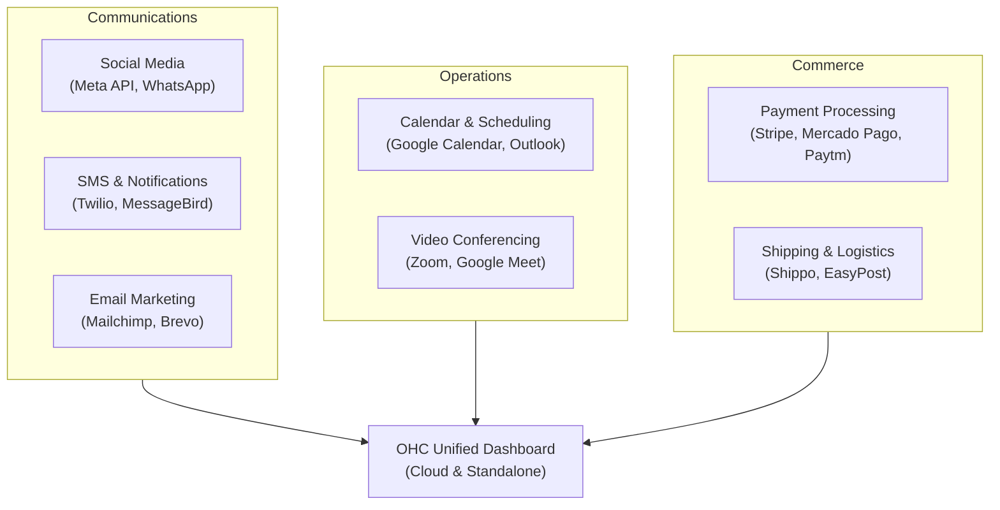

# Tool Integration Research Report

## Executive Summary
This report evaluates third-party tool integrations to expand OHC's capabilities for small business owners in both Cloud (multi-tenant) and Standalone (local, private) environments. We focus on seven key categories: Social Media Integration, Calendar & Scheduling, Email Marketing, Payment Processing, Shipping & Logistics, SMS & Notifications, and Video Conferencing.

## Persona-Specific Pain Point Summaries
- **Maya (The Multi-tasking Boutique Owner):** Struggles with managing customer inquiries across Instagram, Facebook, and WhatsApp. Wants a unified inbox to avoid missing sales. Needs easy shipping label generation.
- **Carlos (The Mobile Service Provider - Plumber):** Needs reliable mobile-first scheduling and on-the-go payment processing (including alternative methods like Mercado Pago for his LATAM clients). SMS notifications are critical to reduce no-shows.
- **Priya (The Freelance Consultant/Tutor):** Requires seamless Google Calendar syncing and automatic generation of Zoom/Meet links for her online sessions. Needs automated email marketing to retain clients.
- **Leo (The Local Bakery Owner):** Overwhelmed by local delivery logistics and managing pre-orders. Needs a simple way to process payments and alert customers when orders are ready via SMS.
- **Fatima (The Non-Technical Artisan/Crafter):** Low-English proficiency. Needs tools with minimal setup, visual interfaces, and robust SMS capabilities (as email is rarely checked by her local customer base).

## Competitive Landscape & Ecosystem Map

## Comparative Tables: Key Categories Evaluated

| Category | Top Tool Evaluated | Alternative Evaluated | Cloud Mode | Standalone Mode | Key Persona |
|----------|--------------------|-----------------------|------------|-----------------|-------------|
| Social Media | Meta Business Suite | Chatwoot (Self-hosted) | Yes | Yes (Chatwoot) | Maya |
| Calendar | Google Calendar API | Cal.com | Yes | Yes | Priya |
| Email Marketing | Mailchimp | Brevo (Sendinblue) | Yes | Yes | Priya, Leo |
| Payment Processing| Stripe | Mercado Pago / Paytm | Yes | Yes | Carlos |
| Shipping & Logistics| Shippo | EasyPost | Yes | Yes | Maya, Leo |
| SMS & Notifications | Twilio | MessageBird | Yes | Yes | Fatima |
| Video Conferencing | Zoom API | Google Meet | Yes | Yes | Priya |

## Issue Briefs

### [Social Media] Unify Customer Messages from Instagram and WhatsApp
**Title:** Implement Unified Social Media Inbox for Meta (Instagram/WhatsApp/FB)
**Problem Statement:** Business owners like Maya currently juggle multiple apps on their phones to answer customer questions. They miss sales because a DM gets buried. They need all customer messages to show up in one simple screen inside OHC.
**Research Report:** We evaluated the Meta Graph API and self-hosted tools like Chatwoot. The Meta API provides direct access to Instagram DMs, Facebook Messenger, and WhatsApp Business. For standalone users, an embedded lightweight Chatwoot instance can aggregate these webhooks securely. It is highly reliable but requires business verification on Meta's end, which can be a friction point for non-technical users. Pricing is generally free for incoming messages, making it highly attractive.
**Design Doc:** The integration will connect via OAuth. OHC will listen for incoming message webhooks and display them in the existing OHC unified dashboard. A user can reply directly from OHC, and the response is routed back to the correct platform. In standalone mode, local polling or tunneled webhooks will be required.
**Implementation Prompt:** Provide a "Connect Social Accounts" button in the settings. Walk the user through a simple Meta login flow. Once connected, incoming DMs and WhatsApp messages should appear in the OHC messaging tab. Replies sent from OHC must successfully reach the customer's social app. Handle webhook events seamlessly.
**Priority:** P0
**Estimated Scope:** Large

### [Calendar] Sync Google Calendar for Seamless Scheduling
**Title:** Implement Two-Way Google Calendar Sync for Client Bookings
**Problem Statement:** Priya double-books herself because her OHC bookings don't talk to her personal Google Calendar. She needs OHC to know when she's busy and automatically add new appointments to her phone's calendar.
**Research Report:** The Google Calendar API is the industry standard. It's free, robust, and handles complex timezone math flawlessly. The main friction point for non-technical users is understanding OAuth scopes. Cal.com offers a robust open-source alternative for self-hosting but is overkill for basic sync. OHC should do Google Calendar API directly because it requires fewer intermediate services for the user to manage.
**Design Doc:** A "Sign in with Google" button connects the account. OHC will perform a two-way sync: reading free/busy times to block OHC booking slots, and writing new OHC bookings into the Google Calendar. Standalone mode will store the OAuth tokens locally.
**Implementation Prompt:** Create a calendar settings page where users can authorize Google Calendar. Once authorized, any new booking created in OHC must appear on the user's Google Calendar. Likewise, any events created directly in Google Calendar must mark that time slot as "busy" in OHC's booking widget.
**Priority:** P1
**Estimated Scope:** Medium

### [Email Marketing] Automated Customer Follow-ups
**Title:** Integrate Simple Email Marketing for Customer Retention
**Problem Statement:** Leo wants to send a weekly special offer to all customers who bought bread this month, but he doesn't know how to export lists. He needs a one-click way to send a nice-looking email to his customer list directly from OHC.
**Research Report:** Mailchimp and Brevo were evaluated. Mailchimp is famous but its free tier has become restrictive. Brevo offers generous free tiers for small businesses (300 emails/day) and an easier API. For non-technical users, Brevo is less intimidating regarding list management.
**Design Doc:** OHC will sync its customer contact list to a Brevo audience list automatically. The user will be able to select a simple pre-built template in OHC, type their message, and click "Send to all customers". OHC triggers the Brevo transactional/campaign API.
**Implementation Prompt:** Build an integration with Brevo. Create a UI where the user can draft a simple text/image email. When they click send, use the API to dispatch the email to all contacts currently stored in the OHC customer database. Show basic success/failure states.
**Priority:** P2
**Estimated Scope:** Medium

### [Payments] Support Local Payment Gateways (Mercado Pago / Paytm)
**Title:** Integrate Alternative Payment Processors for Global Markets
**Problem Statement:** Carlos works in LATAM where Stripe is not the dominant player. His clients want to pay with Mercado Pago or Pix. Without this, he has to ask for cash or manual bank transfers, which is unprofessional and slow.
**Research Report:** Mercado Pago (LATAM) and Paytm (India) dominate their regions. Mercado Pago's API is robust and supports mobile-first checkout flows like QR code generation (Pix). The settlement speed is very fast. Stripe is excellent for US/EU, but these alternatives are mandatory for global parity.
**Design Doc:** OHC's billing/invoicing module will support "Payment Providers" as a pluggable interface. When Carlos generates an invoice, he can select "Mercado Pago". The system will generate a localized payment link or QR code to display on the invoice. Webhooks will confirm payment.
**Implementation Prompt:** Add Mercado Pago as a payment provider option alongside the existing payment structures. When generating an invoice, allow the user to create a Mercado Pago payment link. When the customer pays, process the incoming webhook to mark the OHC invoice as "Paid".
**Priority:** P1
**Estimated Scope:** Large

### [Shipping] One-Click Shipping Label Generation
**Title:** Integrate Automated Shipping Rate Calculation and Label Generation
**Problem Statement:** Maya spends hours typing customer addresses into different carrier websites to find the cheapest shipping rate for her boutique items. She needs OHC to automatically calculate the rate and print the label when an order is placed.
**Research Report:** Shippo and EasyPost are the top contenders. Shippo has a slightly more user-friendly interface for small businesses and deep USPS discounts out of the box without negotiating carrier rates. It handles international customs forms seamlessly.
**Design Doc:** When an order is marked "Ready to Ship", OHC will send the package weight and destination to the Shippo API. Shippo returns the available rates. The user clicks a rate, and OHC downloads the PDF label for printing. Tracking numbers are automatically attached to the order.
**Implementation Prompt:** Integrate the Shippo API. On the order details page, add a "Buy Shipping Label" button. Prompt the user for package weight. Display the top 3 cheapest shipping options. Upon selection, generate the label PDF and display a "Print Label" button.
**Priority:** P2
**Estimated Scope:** Medium

### [SMS] Reliable Customer Notifications via SMS
**Title:** Implement Automated SMS Notifications for Appointments and Orders
**Problem Statement:** Fatima's clients rarely check their email. When she finishes crafting an item, she needs to text them. Manually texting from her personal phone mixes business with personal life. She needs OHC to send automatic text alerts.
**Research Report:** Twilio and MessageBird are the leaders. Twilio has the best global coverage and reliability, though A2P 10DLC compliance in the US is a massive hurdle for small businesses. MessageBird offers a slightly easier onboarding flow for international SMS. Twilio's API is better documented.
**Design Doc:** OHC will provide a notification engine where users can toggle "Send SMS on order completion". We will use Twilio's API. OHC must handle phone number validation and formatting (E.164) automatically to prevent failures.
**Implementation Prompt:** Integrate Twilio API for outbound SMS. Add a toggle in the settings for "Enable SMS Notifications". When an appointment is booked or an order is completed, automatically send a brief, customizable text message to the customer's phone number on file.
**Priority:** P0
**Estimated Scope:** Medium

### [Video Conferencing] Auto-Generate Meeting Links
**Title:** Automate Video Conference Link Generation for Services
**Problem Statement:** Priya offers virtual tutoring. Every time a client books a slot, she manually creates a Zoom meeting and emails them the link. She needs OHC to automatically generate the link and attach it to the calendar invite.
**Research Report:** Zoom API and Google Meet (via Google Calendar integration) are the primary targets. Zoom is ubiquitous but requires OAuth. If Google Calendar sync is already implemented, Google Meet links can be generated automatically for free without a separate API integration.
**Design Doc:** For simplicity, tie this to the Google Calendar sync feature. When OHC creates a calendar event on Google Calendar, it will request the addition of a Google Meet conference link. This link will be extracted and displayed in the OHC UI and sent to the client.
**Implementation Prompt:** Extend the Calendar integration to automatically attach a Google Meet link when creating an event. Display this "Join Meeting" link prominently on the appointment details page for both the business owner and the customer.
**Priority:** P1
**Estimated Scope:** Small

## Recommendations

- OHC should do Google Calendar API for scheduling and video links because the Google Meet generation is free and requires no additional OAuth flows, saving Priya time and frustration.
- OHC should do Mercado Pago integration for the LATAM market because Stripe's regional coverage leaves users like Carlos without viable local options like Pix or cash-based vouchers.
- OHC should do Shippo for shipping logistics because it provides immediate carrier discounts without requiring the user to have pre-negotiated accounts, directly saving Maya money on day one.
- OHC should do Twilio for SMS because despite the compliance hurdles, it offers the most reliable delivery rates, which is critical for Fatima's non-English speaking, mobile-first customer base.
- OHC should do Brevo for email marketing because their free tier allows 300 emails per day, which perfectly fits the scale of small business owners like Leo without adding overhead costs.
