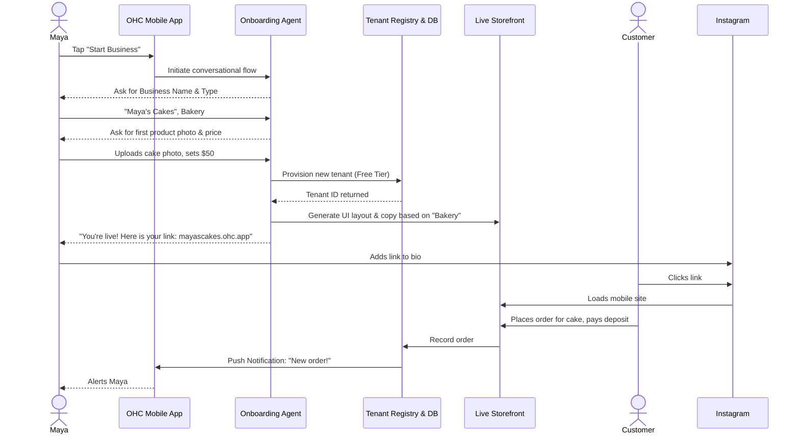
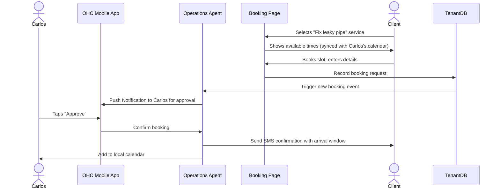

# OHC Business Journey Architecture Research

## Problem Statement

Small business owners—from bakers selling via Instagram DMs to handymen relying on word of mouth—struggle to digitize their operations without confronting steep learning curves. Existing platforms (Shopify, Wix, Squarespace) require them to think like web developers or e-commerce managers. They need a system that brings them from "zero" to a "live business" in under 10 minutes, intuitively guiding them through acquisition, onboarding, activation, retention, revenue, and referral stages without them ever needing to touch a manual or a line of code. Friction at any step (especially on mobile devices, which are their primary tool) leads to abandonment.

## Research Report

### Competitive Landscape

-   **Shopify:** Excellent for established e-commerce but overwhelming for service providers or highly mobile-dependent, low-tech users. It requires significant desktop time to configure themes and complex settings.
-   **Wix/Squarespace:** Powerful visual builders but not truly "mobile-first." Editing a site on a smartphone is clunky. They lack integrated, invisible AI agents out-of-the-box to handle operations like DM replies or quote generation.
-   **GoDaddy:** Simple onboarding but often results in rigid, generic sites. The post-launch operational tools (inbox, calendar) feel bolted on rather than cohesive.
-   **Link-in-bio tools (Linktree, Stan Store):** Very mobile-friendly but too limited for full business operations (like a handyman's booking calendar or a baker's complex custom order deposits).

### Findings & Core Requirements

1.  **Mobile Primacy is Non-Negotiable:** Our personas (Maya, Carlos, Priya, Leo, Fatima) primarily or exclusively use their smartphones to run their businesses. The entire platform must be 100% functional and performant on mobile (375px minimum width). Desktop is an additive experience.
2.  **Conversational vs. Form-Based Onboarding:** Traditional multi-page forms cause high drop-off. We must use an AI-guided conversational onboarding flow. The user answers simple questions (e.g., "What do you sell?", "How much do you charge?") and the AI builds the foundation.
3.  **Invisible AI Operations:** The user shouldn't need to configure "The Manager" or "The Promoter" agents. They should activate them with natural language (e.g., "Start replying to my Instagram DMs about vegan cakes").
4.  **Immediate Value (Activation):** Success by Day 1 means having a live link to share. The wizard must defer non-critical steps (like complex tax settings or advanced styling) until *after* the core storefront or booking page is published.

## Design Doc: Business Journey Architecture

### 1. Acquisition & Entry

**How do they find us?**
-   Organic search ("how to sell cakes online")
-   Social ads showcasing 10-minute setup
-   Viral loops: Customers of OHC merchants see a "Powered by OneHumanCorp" badge and realize they can build one too.

**The Entry Point (Mobile First):**
A frictionless landing page with a single prominent CTA: "Start your business in 3 minutes." No credit card required upfront.

### 2. Onboarding (The Wizard Flow)

The onboarding flow is a conversation, not a configuration dashboard.

**Minimum Inputs for Go-Live:**
1.  **Business Name/Category:** (e.g., "Maya's Cakes", Bakery)
2.  **Primary Goal:** (e.g., "Sell custom cakes", "Book handyman appointments")
3.  **First Item/Service:** (e.g., Name: "Custom Birthday Cake", Starting Price: $50, Photo: Upload from phone gallery)
4.  **Contact/Payment basics:** (How do you want to get paid? Cash/Venmo for now, or connect Stripe later)

**Deferred Steps (Post-Launch):**
-   Custom domain setup (Start with `mayascakes.ohc.app`)
-   Complex inventory management
-   Detailed branding (fonts, colors beyond basic themes)

**UX Flow (375px):**
1.  **Screen 1:** Welcome prompt (Glassmorphic input field: "What's your business called?")
2.  **Screen 2:** Goal selection (Large, touch-friendly tap targets: "Sell products", "Take bookings", "Show portfolio")
3.  **Screen 3:** First item creation (Camera integration: "Snap a photo of what you do")
4.  **Screen 4:** "Building your business..." (Subtle motion, progress indicator as AI generates the layout, initial copy, and provisions the database tenant)
5.  **Screen 5:** Success! "You are live. Here is your link."

### 3. Activation & Retention

**Activation (Day 1):** The user shares their link on their Instagram bio or via text.
**Activation (Week 1):** They receive their first order or booking.

**Retention Engine:**
-   **Push Notifications:** "New order from Sarah!" (Drives immediate dopamine and return to the app).
-   **AI 'Advisor' Summaries:** "Good morning Maya. You have 3 cake orders to fulfill today. Would you like me to send reminder texts to them?"
-   **Frictionless Operations:** Managing orders must feel like replying to a text message, not managing a spreadsheet.

### 4. Revenue & Upgrades

The platform must clearly demonstrate value before asking for money.

**Upgrade Triggers:**
-   **Custom Domain:** User wants to drop `.ohc.app`. Prompt: "Upgrade to Starter ($9/mo) to connect your own domain."
-   **Volume:** User hits the 10-product limit or 100 AI actions limit.
-   **Advanced AI Needs:** User wants "The Promoter" to start auto-posting to social media. Prompt: "Unlock advanced AI departments with the Pro tier."

**Upgrade Presentation:** Contextual, within the flow of their work, not hidden in a settings menu.

### 5. Architectural Sequence Diagrams (Mermaid)

#### Maya (Baker) - Onboarding & First Sale

#### Carlos (Handyman) - Booking Flow with AI Manager

### Key Architectural Invariants

-   **Mobile-First Rendering:** The UI must prioritize small viewports. Build components for 375px width first, then scale up.
-   **Tenant Isolation:** Data for Maya's bakery must never bleed into Carlos's handyman business. All queries must automatically scope to the authenticated `organization_id`.
-   **Offline Tolerance:** Mobile apps must handle spotty connections gracefully. Core operations (like viewing the day's orders) should be cached locally and sync when online.

---

**Priority**: P0
**Estimated Scope**: Large

## Proposed Next Steps (Implementation Prompts)

### Implementation Prompt: Mobile Onboarding Wizard UI Component

**User-Facing Outcome:**
A new user must be able to complete a 4-step conversational onboarding flow on their mobile device to generate their initial storefront. The flow must look premium (Glassmorphism, Outfit/Inter typography) and require zero technical configuration.

**CUJ (Critical User Journey):**
1.  User opens the app (or mobile web view).
2.  User sees a welcoming screen with a single input field.
3.  User enters business name and selects a category from visual, touch-friendly cards.
4.  User uploads one photo and sets one price.
5.  User sees a "building" animation and is then presented with their live `*.ohc.app` link.

**Acceptance Criteria:**
-   Implement the UI flow in Next.js/React (for web) or Tauri/Rust (for desktop/mobile wrapper).
-   Must be 100% usable and visually perfect at 375px width.
-   Adhere to OHC Design Standards: Easing `cubic-bezier(0.4, 0, 0.2, 1)`, entrance animations <= 300ms, touch targets >= 44x44px.
-   Include at least 5 user journey verification steps (e.g., Playwright tests simulating the flow).
-   *Do not* implement the backend tenant provisioning API in this PR; mock the final "building" step and link generation for now.
