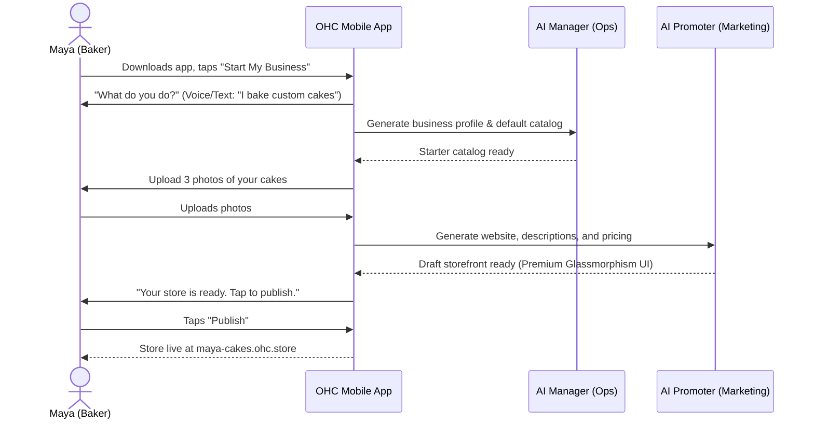
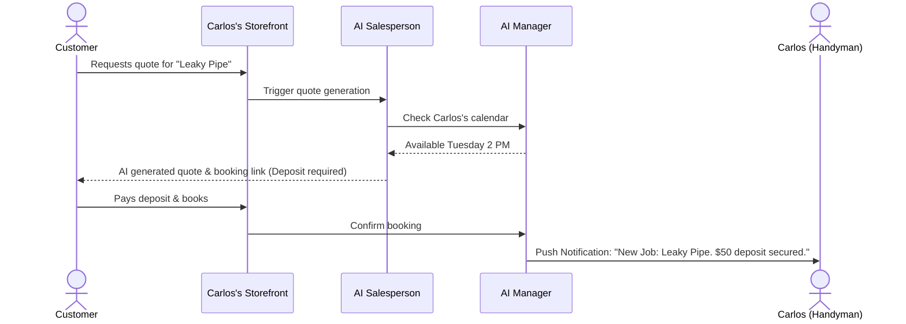
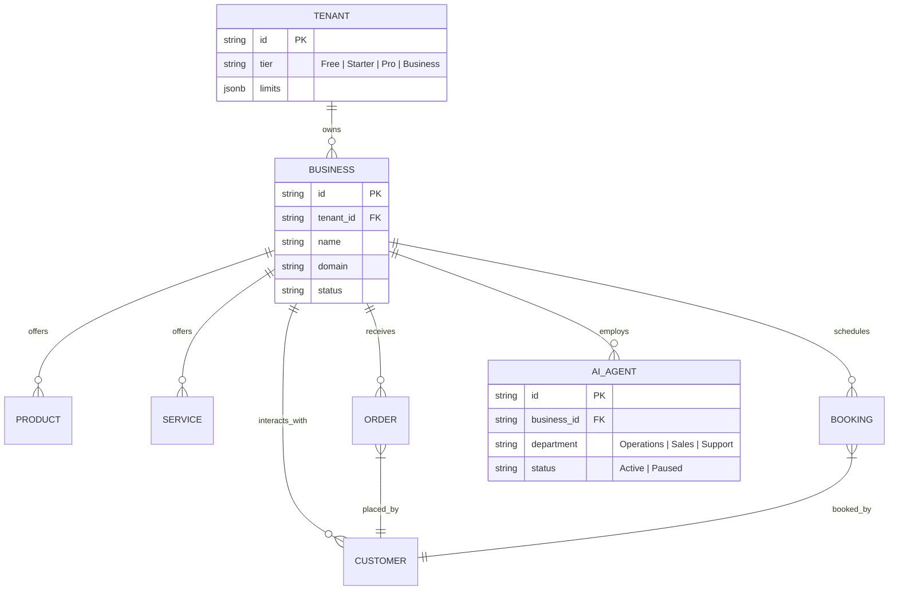

# 🚀 KAIROS Report: Next-Gen OHC Platform Architecture

## Title
End-to-End Business Journey & Unified Agentic Architecture for OneHumanCorp

## Problem Statement
Small business owners (like Maya the baker, Carlos the handyman, and Fatima the food cart operator) are overwhelmed by technical complexity when trying to launch or scale. They need an invisible, zero-config platform that gets them from zero to a live business in under 10 minutes on their phone. Current flows often introduce friction through technical jargon, disconnected tools, and manual configurations that require a desktop. We need a unified architecture where AI agents seamlessly handle operations, marketing, sales, customer success, finance, and compliance—acting as an invisible team for the business owner.

## Research Report
**Market Gap**: Competitors (Shopify, Wix, Squarespace) offer powerful tools but expose the underlying complexity. Users must understand concepts like "DNS," "Payment Gateways," "SEO meta tags," and "Inventory synchronization."
**Persona Analysis**:
- **Maya (Baker, 28)**: Needs beautiful mobile-first storefronts, custom order deposits, and an AI agent that handles Instagram DM inquiries ("do you do vegan cakes?") while she sleeps.
- **Carlos (Handyman, 42)**: Needs service listings, booking calendars, automated quotes, and an interface that works flawlessly on his Android phone.
- **Priya (Boutique Owner, 35)**: Needs storefront + inventory sync, product variants (size/color), in-person tap-to-pay, and daily mobile analytics.
- **Fatima (Food Cart, 50)**: Needs a multi-lingual, high-contrast, pre-order system with printable daily lists and SMS notifications, functioning on a low-end device.
**Conclusion**: The architecture must prioritize mobile parity (everything works optimally on a 375px screen), zero technical configuration, and an event-driven AI agent mesh that proactively manages the business invisibly.

## Design Doc

### 1. Business Journey Architecture

#### Acquisition & Onboarding (Maya's Journey)


#### Retention & Revenue (Carlos's Journey)


### 2. Data Model Architecture

The data model ensures strict multi-tenancy and high performance for mobile access without prescribing specific database implementations.


**Key Invariants**:
- **Multi-Tenancy Guarantees**: Every request and data access must be scoped to `tenant_id`. Cross-tenant data leakage is structurally impossible.
- **Offline-First & Mobile Responsiveness**: Mobile clients cache `BUSINESS`, `PRODUCT`, and `ORDER` entities locally. Mutations are queued and synced via optimistic UI updates, ensuring a fluid experience even on spotty connections.
- **Extensibility**: Custom attributes (e.g., cake flavors, service durations) are stored in schema-less document structures to prevent endless rigid schema migrations, adapting to any business type.

### 3. AI Agent Department Architecture

OHC agents act as an invisible enterprise team for a team of one.

```mermaid
flowchart TD
    subgraph OHC Agentic Mesh
        Ops[The Manager\nOperations & Fulfillment]
        Mktg[The Promoter\nMarketing & SEO]
        Sales[The Salesperson\nQuotes & Lead Gen]
        CS[The Ambassador\nCustomer Success]
        Fin[The Accountant\nPayments & Reports]
        Leg[The Protector\nCompliance & Legal]
        Adv[The Advisor\nHealth & Strategy]
    end

    EventBus((Event Bus))

    OrderCreated[Event: Order Placed] --> EventBus
    EventBus --> Ops
    Ops --> |Update Inventory| DB[(Database)]
    Ops --> |Notify Customer| CS
    CS --> |Send "Thank You"| Email/SMS
    EventBus --> Fin
    Fin --> |Record Payment| DB

    WeeklyTick[Event: Weekly Health Check] --> EventBus
    EventBus --> Adv
    Adv --> |Analyze Metrics| DB
    Adv --> |Send Push Notification| App[Mobile App]
```

**Department Triggers & Coordination**:
- **Event-Driven Execution**: Agents subscribe to domain events (e.g., `order.created`, `customer.message_received`) and act autonomously.
- **Idempotency & Resilience**: All agent actions must be idempotent to handle retries gracefully. They must fail-safe and enter a "paused" state if external systems (like LLMs) go down, without cascading failures.
- **Budgeting & Tiering**: AI usage is tied to SaaS tiers (Free, Starter, Pro, Business). Usage is strictly enforced server-side. When limits are approached, users receive a friendly prompt to upgrade, adhering to "User-First Pricing." Soft limits avoid abruptly breaking the business flow.

### 4. Visual Excellence & Mobile-First UX

- **Premium Design Tokens**: All UI components strictly adhere to Glassmorphism (`backdrop-filter: blur(20px) saturate(200%)`).
- **Typography**: Outfit for headings, Inter for body text.
- **Motion**: Fluid entrance (<= 300ms) and exit (<= 200ms) transitions with `cubic-bezier(0.4, 0, 0.2, 1)` easing.
- **Accessibility & Simplicity**: Touch targets must be >= 44x44px. Interfaces must pass the "Grandmother Test," relying entirely on plain-language labels and zero technical jargon. Everything must be executable on a 375px mobile screen.

## Implementation Prompt
**For Implementer Agents:**
1. Implement the core onboarding wizard UI components reflecting the OHC Premium Design Standards (Glassmorphism, Outfit/Inter typography, >44px touch targets).
2. Construct the underlying event-driven orchestration layer for the "Operations" and "Customer Success" AI departments to enable background processing without blocking the UI.
3. Ensure the onboarding flow strictly follows the "Maya's Journey" sequence, capturing intent via conversational input and transitioning the user from zero to a published draft storefront in under 10 minutes.
4. Verify complete mobile parity (375px viewport tests) and implement 100% unit and E2E test coverage for the new flows.
**Acceptance Criteria**: A non-technical user can successfully generate a business profile, upload products, and publish a premium storefront via a mobile device interface without encountering terms like "API," "DNS," or "Schema."

## Priority
P0 (Critical)

## Estimated Scope
Large
