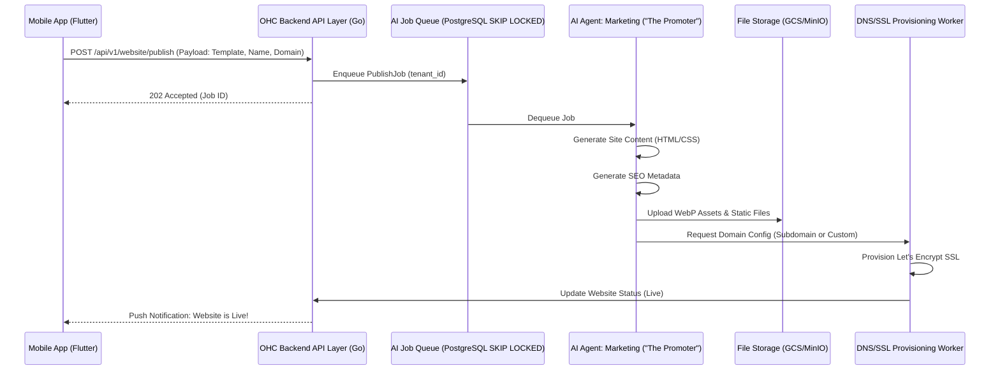

# Website Builder Wizard Screen - Technical Limitations Analysis

## Problem Statement
The current `WebsiteBuilderWizardScreen` in the Flutter mobile application does not fulfill the OHC Mobile-First Non-Negotiables contract. Specifically, the "Publish" action simply copies a fake domain to the user's clipboard and displays a mock snackbar. Furthermore, it operates purely on local, transient state without integrating with our distributed Teammate Mesh, AI Promoters, or the multi-tenant SaaS domains layer. This leaves Maya the Baker unable to legitimately publish her custom cake catalog domain, breaking the core "Zero to Live Business in 10 minutes" promise.

## Research Report
The existing implementation of the Website Builder (`src/app_old/lib/screens/website_builder_wizard_screen.dart`) reveals significant architectural gaps:

1.  **State Volatility:** State is managed entirely locally via `WebsiteBuilderNotifier` (Riverpod). The `domainChoice` and `customDomain` variables exist in memory and are discarded. There is no sync mechanism to the PostgreSQL multi-tenant data layer.
2.  **Missing AI Department Integration:** The website builder does not currently trigger the Marketing & Advertising ("The Promoter") AI agent department to generate the content, SEO metadata, or final static site artifacts.
3.  **Missing Domain/SSL Architecture:** The "custom domain" flow merely sets a string state. It lacks any integration with our infrastructure layer for provisioning custom domains, validating CNAME/A records, or generating SSL certificates automatically.
4.  **No Persistence Endpoint:** The frontend code explicitly notes: `// Note: there is no formal wizard save endpoint for website building yet`.
5.  **Competitive Disadvantage:** Competitors like Wix and Squarespace provide instant, real domain publishing within their onboarding flow. Our current mock implementation damages trust.

## Design Doc

### Architecture Diagram

### Mobile UX Flow
1. **Step 1-4:** User completes design choices (Template, Colors, Products) as per current wizard.
2. **Step 5 (Domain Selection):** User chooses "OHC Subdomain" (e.g., `maya-cakes.ohc.com`) or enters a "Custom Domain".
3. **Step 6 (Publishing State):** User taps "Publish". UI transitions to an animated loading screen: "The Promoter is building your website...".
4. **Completion:** Push notification arrives. UI updates to show the live URL with a shareable QR code component and a "View Live Site" button.

### Key Design Decisions
-   **Async Publishing:** Website generation and DNS propagation can take time. We will use an asynchronous job queue (PostgreSQL SKIP LOCKED) to handle the work, allowing the user to continue using the app while the AI agent works in the background.
-   **AI Delegation:** The mobile app will not generate HTML. It will only send the configuration state to the backend, delegating the actual asset creation to the Promoter agent.
-   **SSL by Default:** All domains (subdomains and custom) must automatically receive Let's Encrypt SSL certificates managed by the infrastructure layer to meet security standards.

## Implementation Prompt

**Role:** Feature Implementer

**Task:** Connect the `WebsiteBuilderWizardScreen` to a real backend publishing flow, replacing the current mock snackbar.

**User Journey (CUJ):**
As Maya the Baker, I complete the website builder wizard in the mobile app. When I tap "Publish", I see an animated loading state indicating that my AI Promoter is building the site. Once complete, I receive a notification and can immediately visit my live, secured (SSL) website.

**Acceptance Criteria:**
1.  **Backend Integration:** Create a new REST API endpoint to receive the `WebsiteBuilderState` payload.
2.  **Job Queuing:** The API must enqueue an asynchronous job for the Marketing ("The Promoter") AI agent department.
3.  **UI Feedback:** The mobile app must display a loading state while the job processes and gracefully handle success or error responses from the backend.
4.  **E2E Testing:** Add a full-loop E2E test covering the frontend wizard flow through to the backend job queuing (mocking the actual AI generation step). Ensure the test starts from the home page login.
5.  **Mobile Constraints:** The new loading UI and success screen must fit within the 375px mobile-first constraint and use native mobile interactions. Do not block the main thread.

## Priority
P0

## Estimated Scope
Medium
