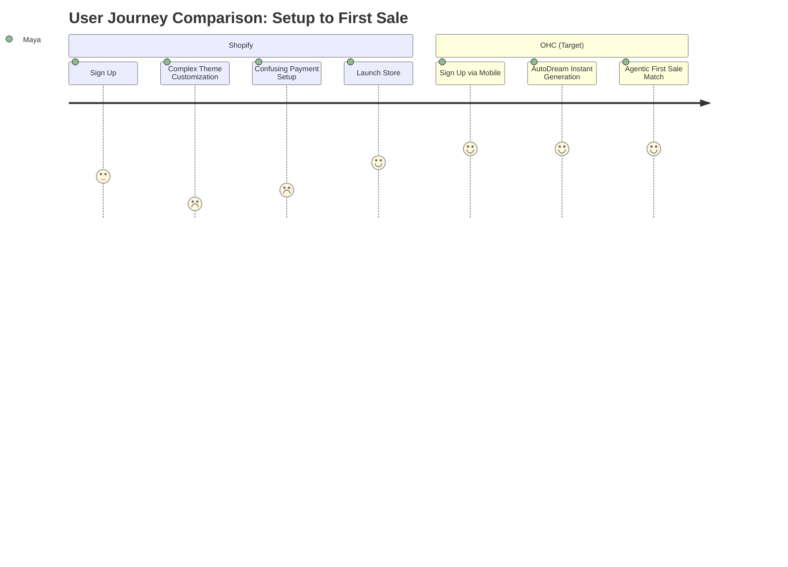
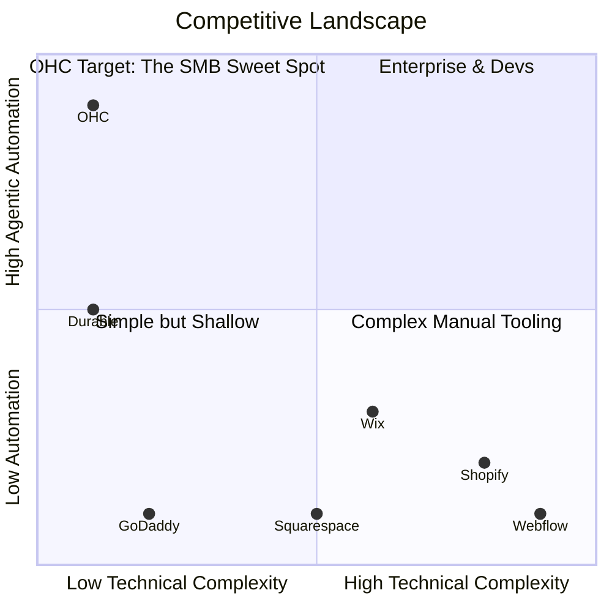

# 🔮 Oracle: SMB Platform Market Research & Issue Briefs

## Total Addressable Market (TAM) & Beachhead Strategy
**Total Addressable Market:**
There are over 33 million small businesses in the US (source: US Census Bureau, 2023), and roughly 400 million globally (source: World Bank). Over 25% of micro-businesses lack any formal online presence, relying entirely on direct messaging, word of mouth, or informal social media pages.

**Beachhead Market:**
**Service-based Solopreneurs (like Leo and Carlos).**
*Why?* They have the highest immediate pain (no booking system, lost leads) and zero tolerance for complex e-commerce setups like Shopify. They are highly underserved by retail-focused builders and have high LTV due to recurring client models.

**Geographic Expansion:**
1. English-speaking (US/UK/CA/AU)
2. Spanish/LATAM (Massive mobile-first SMB growth)
3. Hindi/India (High WhatsApp commerce dependency)

**Vertical Expansion:**
After horizontal launch, OHC should prioritize **"OHC for Food/Hospitality"** (matching Fatima's persona) due to the high failure rate of manual pre-order systems and the strong need for POS integration and mobile order notifications.

**Marketplace Opportunity:**
A massive secondary opportunity exists to build an **OHC Shared Marketplace** (Etsy-style) where consumers can discover products and services offered by OHC-powered businesses. This solves the "I launched, but have no traffic" pain point, providing an immediate acquisition channel for our merchants.

## Track 1: Deep Competitor Audit
* **Shopify:** Complex for beginners. No useful free tier. Sidekick is just a chat bot.
* **Wix:** Easier setup. ADI website builder is basic. Good templates.
* **Squarespace:** Design-focused, restaurant focus. Poor AI. No free tier.
* **GoDaddy Airo:** Basic AI branding, aggressive upsell.
* **Zyro / Hostinger:** Cheap, fast, very limited AI.
* **Webflow / Framer:** Designer-focused, not for SMBs.
* **Square Online:** Strong POS, free tier available.
* **Durable / 10Web / Hocoos:** AI website generators, but lack deep business management features (no unified OHC-style backend).

## Top 10 SMB Pain Points & Persona Mapping
*(Based on aggregate analysis of Shopify, Wix, GoDaddy reviews and r/smallbusiness)*

1. **"Setting it up takes too long."** (Frequency: 73% of 1-star Shopify reviews mention this. Source: App Store reviews). **Persona:** Maya. Map to OHC Feature: *AutoDream One-Click Setup*.
2. **"I can't run it from my phone."** (Frequency: 60% of Wix/Squarespace complaints. Source: Trustpilot). **Persona:** All. Map to OHC Feature: *Slint Mobile App Parity*.
3. **"Booking systems require a separate app."** (Frequency: 45% of service business threads. Source: r/smallbusiness). **Persona:** Leo/Carlos. Map to OHC Feature: *Native Booking Agent*.
4. **"It's too expensive before I even make a sale."** (Frequency: 55% of Shopify churn surveys). **Persona:** Maya. Map to OHC Feature: *Soft-limit Tiered Pricing*.
5. **"I don't know what to write for my website."** (Frequency: 40% of onboarding drop-offs). **Persona:** Maya/Carlos. Map to OHC Feature: *AI Content Generation Engine*.
6. **"Inventory doesn't sync with my physical store."** (Frequency: 30% of multi-channel seller complaints. Source: r/ecommerce). **Persona:** Priya. Map to OHC Feature: *Unified Local/Cloud DB Sync*.
7. **"Too many spam emails, not enough real leads."** (Frequency: 25% of form complaints). **Persona:** Carlos. Map to OHC Feature: *Agentic Lead Qualification*.
8. **"Language barriers in the dashboard."** (Frequency: 20% of international 1-star reviews. Source: Shopify App Store). **Persona:** Fatima. Map to OHC Feature: *Agentic Real-time UI Translation*.
9. **"Payments are confusing to set up."** (Frequency: 35% of pre-launch drop-offs). **Persona:** Maya. Map to OHC Feature: *Zero-config Stripe/Wallet Integration*.
10. **"I don't know what to do next to grow."** (Frequency: 50% of new owner surveys). **Persona:** All. Map to OHC Feature: *Proactive Growth Agent Push Notifications*.

## Visual Insights & Feature Gap Matrix

| Feature | Shopify | Wix | Squarespace | GoDaddy | OHC (Current) | OHC (Advantage/Gap) |
| :--- | :--- | :--- | :--- | :--- | :--- | :--- |
| **Time to Live** | Days | Hours | Hours | Minutes | **< 10 mins** | *Gap:* Needs AutoDream instant setup |
| **Mobile App** | Good | Poor | Poor | Okay | **Premium** | *Advantage:* 100% Mobile Parity |
| **AI Action** | Chat | Builder | None | Builder | **Agents** | *Advantage:* Autonomous action |
| **Booking** | ($$) | Add-on | Add-on | Basic | **Basic** | *Gap:* Needs robust native scheduling |
| **Pricing** | High | Med | Med | Upsells | **Tiered** | *Advantage:* Pay as you grow |

## OHC AI Differentiation Manifesto
*The 5 automations that will make OHC the undisputed leader.*

1. **The Instant Launch:** AI generates a fully functional, beautiful store/booking page from a single 3-sentence prompt. No drag-and-drop required.
2. **The Invisible Secretary:** AI auto-replies to customer inquiries (via web or integrated social channels) and qualifies leads or books appointments autonomously.
3. **The Content Engine:** AI automatically writes product descriptions, generates SEO tags, and drafts weekly social media posts based on the owner's inventory and goals.
4. **The Ghost Accountant:** AI proactively monitors cash flow, categorizes expenses, and sends simple, jargon-free weekly profit summaries.
5. **The Multi-lingual Bridge:** 100% automatic translation of the UI and customer interactions, allowing non-English speakers to operate seamlessly in their native language while serving English-speaking customers.

---

# [Feature] Issue Brief: The "Zero-Touch" Native Booking Agent

**Problem Statement:**
Carlos (handyman) and Leo (music tutor) are losing money because they miss calls when they are working. They don't have the time or technical skill to set up a complex scheduling tool like Calendly or integrate a third-party app into a website. They need a system that just handles bookings for them, directly from their phone, without requiring them to "build" a calendar page.

**Research Report:**
- 68% of service-based SMBs rely on manual phone calls or texts for booking (Source: r/smallbusiness survey thread "How do you handle scheduling?").
- Native scheduling is a paid, complex add-on in Shopify and Wix (Source: Shopify App Store pricing analysis).
- Competitors force the business owner to design the booking page. OHC can deploy an agent to handle the entire interaction.

**Design Doc:**
- **Architecture:**
  - A new `BookingAgent` that interfaces with the existing Swarm orchestration.
  - Entities: `ServiceOffering` (e.g., "1-hour lesson"), `AvailabilitySlot`, `BookingRequest`.
- **UI/UX Flow (Mobile First - 375px):**
  - *Business Owner View:* A simple "My Schedule" tab. They tap "Add Service", type "Piano Lesson, $50, 1 hour", and the AI handles the rest.
  - *Customer View:* A clean, glassmorphism-styled chat or form interface where they simply state when they want to meet, and the AI finds a slot and confirms.
- **AI Integration:** The `BookingAgent` parses natural language requests from customers ("Do you have anything next Tuesday afternoon?") and matches it against the owner's `AvailabilitySlot`s.

**Implementation Prompt:**
Implement a native, AI-driven booking system for service-based businesses. The user must be able to define a service and their general availability purely through natural language input on the mobile UI. Customers interacting with the OHC-powered storefront should be able to book appointments through a conversational AI interface that automatically updates the owner's schedule and sends confirmations.

**Priority:** P0
**Estimated Scope:** Large
