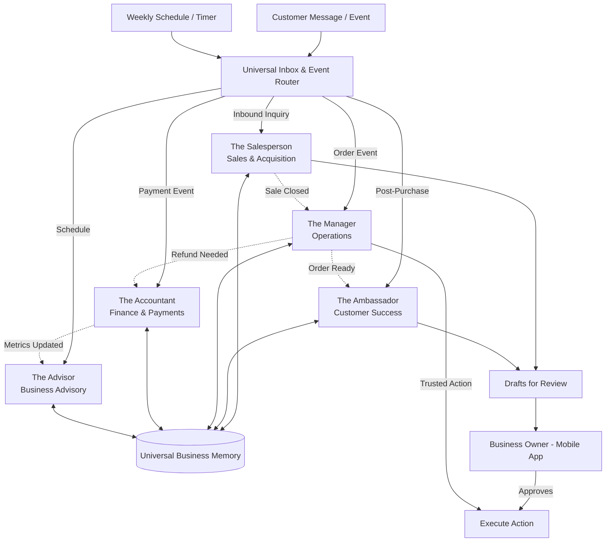

# 🔮 Oracle: SMB Platform Market Research & Issue Briefs

## Title: Architectural Design for Invisible AI Agent Departments

### Problem Statement
Running a small business feels like working seven full-time jobs at once. Maya, a baker who sells custom cakes, spends her days baking and her nights answering Instagram DMs, tracking ingredient costs, sending payment links, and trying to figure out if she's actually making a profit. Carlos, a handyman, constantly loses leads because he can't pause fixing a sink to reply to a quote request. Current software platforms expect small business owners to act like IT administrators—configuring complex workflows, setting up zapier integrations, and reading manuals. The problem isn't that they need more tools; they need invisible, reliable staff members who just "handle it" while they sleep, all manageable from a 375px mobile screen without tech jargon.

### Research Report
Our market research indicates that small businesses churn from existing platforms primarily due to "configuration fatigue."

#### Persona-Specific Pain Point Summaries
- **Maya (Baker, 28):** "I lose 3-4 orders a week because I'm covered in flour and can't reply to Instagram DMs asking if I can make a gluten-free cake for this Saturday."
- **Carlos (Handyman, 42):** "I don't have time to create a website or send professional quotes. I just want something that texts the customer a price based on what I tell it."
- **Fatima (Food Cart, 50):** "English is hard for me, and setting up an online menu with sold-out buttons is too confusing. I need someone to just text me when a pre-order is paid."

#### Competitive Analysis
| Platform | Small Business Lens | The "Staff" Metaphor | AI Capability |
|----------|---------------------|----------------------|---------------|
| **Shopify** | E-commerce heavyweight | You are the IT manager | App-store bots; fragmented and disconnected |
| **Wix** | Drag & drop builder | You are the web designer | Generates website copy, but doesn't run the business |
| **Squarespace** | Beautiful portfolio | You are the curator | Static; no operational assistance |
| **GoDaddy** | Domain & basic sites | You are the administrator | Basic chatbots, no deep business context |
| **OneHumanCorp** | Business in a pocket | You are the CEO, AI is the staff | Integrated departments (The Manager, The Promoter) working cohesively |

#### Evidence-Based Actionable Recommendations
1. **Ditch "Bots", Hire "Staff":** Label AI systems as relatable roles ("The Manager", "The Accountant") rather than "AI Assistants".
2. **Invisible Handoffs:** Staff must communicate seamlessly. When a sale is made, "The Salesperson" must hand off to "The Manager" automatically.
3. **Approval-First Trust Building:** Users should have the option to review drafts of emails/quotes before they are sent, gradually moving to "auto-execute" as trust builds.

### Design Doc

#### Key Design Decisions & Why
- **Relatable Department Names:** We use names like "The Manager" and "The Accountant" because a non-technical user implicitly understands what an accountant does, but has no idea what an "LLM Finance Agent" does.
- **Event-Driven & Schedule-Driven Triggers:** Small business owners don't want to click "Run Script." The AI must act proactively (e.g., "The Advisor" sends a weekly health report every Sunday morning) or reactively (e.g., "The Ambassador" replies instantly to an Instagram DM).
- **Universal Context Memory:** All departments share a single, unified memory of the business history. This ensures "The Promoter" knows about the refund processed by "The Manager," preventing embarrassing marketing emails to upset customers.
- **Trust-Based Execution Tiers:** Actions can be set to "Draft for Review" or "Auto-Execute." This satisfies the grandmother test—letting the user feel in control before letting the AI run fully autonomously.
- **Mobile-First Glassmorphism UI:** The entire interface must be 100% usable on a 375px screen, employing premium OHC design tokens (Glassmorphism: `backdrop-filter: blur(20px) saturate(200%)`, Outfit + Inter fonts) with touch targets ≥ 44x44px.

#### AI Agent Integration Points
1. **Operations ("The Manager"):** Triggered by new orders/bookings. Handles inventory reduction, fulfillment staging, and refund orchestration.
2. **Marketing & Advertising ("The Promoter"):** Triggered by schedules (e.g., "Post every Tuesday") or events (e.g., low inventory triggers a sale post).
3. **Sales & Acquisition ("The Salesperson"):** Triggered by inbound inquiries. Generates quotes and tracks leads.
4. **Customer Success ("The Ambassador"):** Triggered by post-purchase timelines or customer messages.
5. **Finance & Payments ("The Accountant"):** Triggered by transaction events. Reconciles payments and flags missing invoices.
6. **Legal & Compliance ("The Protector"):** Triggered by new product launches or policy changes to update disclaimers.
7. **Business Advisory ("The Advisor"):** Triggered on a weekly schedule. Synthesizes data from all other departments into a single summary.

#### Architecture Diagram (Mermaid.js)

#### Mobile UX Flow (375px First)
1. **Home Screen (The Dashboard):** A beautiful glassmorphic card greets the user. "Good morning, Maya. The Advisor prepared your weekly summary. The Salesperson drafted 3 quote replies."
2. **Reviewing Actions:** Maya taps the "Drafts" card. A swipeable stack of glassmorphic cards appears. Each card shows the context (e.g., Customer asked for a gluten-free cake) and the AI's proposed reply. She taps "Approve" (auto-sends) or "Edit" (opens a plain-text editor).
3. **Department Settings:** Maya navigates to "My Staff." She sees avatars for each department. Tapping "The Manager" shows a toggle: "Auto-approve refunds under $50." She flips it on. No technical jargon, just plain business rules.
4. **Interruption-Free Execution:** While Maya is making a cake, a subtle notification appears: "The Ambassador handled a question about your hours. Sale closed."

### Implementation Prompt
**To the Implementer Agent:**
Implement the user-facing UI and core orchestration logic for the AI Agent Departments feature.

**User-Facing Outcome:** The business owner should be able to view their "Staff" (departments) in the mobile app, see pending drafts for review (swipe to approve/reject), and read a unified activity feed of what the staff has done.

**Critical User Journey (CUJ):**
1. User opens the app and sees an alert that "The Salesperson" has drafted a quote in response to an inquiry.
2. User taps the alert, reviews the quote draft in a beautiful, glassmorphic card (minimum 44x44px touch targets).
3. User taps "Approve." The system records the approval and moves the action to the execution phase.
4. The user checks the "Staff Settings" to change the trust level for future quotes from "Draft for Review" to "Auto-Execute."

**Acceptance Criteria:**
- 100% functional and visually perfect on a 375px mobile screen.
- Absolutely zero technical jargon (no "LLMs", "Agents", "Prompts", or "Vectors"). Use only plain language ("The Manager", "Drafts", "Staff Settings").
- The UI must utilize OHC premium design tokens: Glassmorphism (`backdrop-filter: blur(20px) saturate(200%)`) and Outfit/Inter fonts.
- Multi-tenancy is respected securely via session/context keys (do not rely on user input for `tenant_id`).
- All actions respect tenant-specific usage quotas gracefully with soft limits and friendly upgrade prompts.

*(Note: Do not design the specific SQL DDL, API endpoints, or database schema. Focus on implementing the service-level orchestration, state transitions, and the premium mobile UI.)*

### Priority
`P0`

### Estimated Scope
Large
