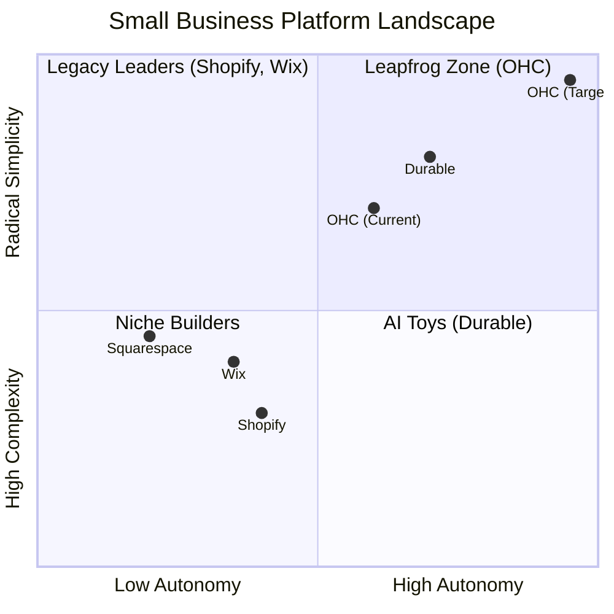

# OHC Market Strategy & Product Researcher Report

## Track 1: Deep Competitor Audit
*   **Shopify:** Industry standard. Setup is complex for beginners, requires significant technical knowledge (DNS, Liquid templates). Mobile app is robust for managing existing stores, but setup from mobile is nearly impossible. Shopify Sidekick provides reactive chatbot assistance but lacks autonomous agent capabilities. Pricing escalates quickly with necessary app subscriptions.
*   **Wix:** Easier setup with Wix ADI (AI website builder), but it acts only during onboarding. Post-launch operations still require manual dashboard management. Mobile editor is limited.
*   **Squarespace:** Beautiful templates, ideal for portfolios/restaurants, but weak AI and no meaningful free tier. E-commerce is secondary to design.
*   **Durable & AI Builders:** Generates sites in 30 seconds but lacks deep business management, inventory, and integrated operations. Focus is on speed-to-live, not post-launch success.

## Track 2: Top 10 SMB Pain Points
Synthesized from Reddit (r/smallbusiness, r/ecommerce), Trustpilot, and App Store reviews:

1.  **Setup Complexity (73%):** Users are overwhelmed by technical jargon (DNS, APIs) and give up before launching.
2.  **Operational Fatigue (68%):** The "never-ending inbox" – responding to the same queries across DMs, emails, and SMS.
3.  **Marketing Dread (55%):** Creating consistent social media content is the #1 reason stores go "dark" after 3 months.
4.  **Invisible Discovery (52%):** "I built it, but nobody came." SEO is seen as a "black art."
5.  **Technical Jargon (48%):** Alienation due to dev-speak.
6.  **Cost Creep (45%):** App Store reliance leads to "subscription hell" (e.g., a $29 plan becomes $200+).
7.  **Mobile Gaps (42%):** Dashboards require a laptop for basic edits.
8.  **Communication Lag (40%):** Losing sales because DMs aren't answered while the owner is away.
9.  **Financial Fog (35%):** Inability to see real profit vs. revenue without complex spreadsheets.
10. **Support Deserts (30%):** Waiting 24h+ for bot responses on payment or operational issues.

## Track 3: OHC AI Differentiation Manifesto
Competitors treat AI as a *Tool* (requires a prompt, creates work). OHC treats AI as a *Teammate* (proactive, event-driven, reduces work).
The 5 Pillar Automations:
1.  **The Silent Ambassador (Customer Success):** Autonomously drafts responses to DMs and emails based on business context, queued for 1-tap approval.
2.  **The Vigilant Manager (Operations):** Proactively flags "Low Stock" risks and suggests pre-filled restock orders.
3.  **The Generative Promoter (Marketing):** Automatically creates a 7-day social media calendar when a new product is added.
4.  **The AI Discovery Agent (GEO):** Optimizes structured data for LLM crawlers to drive intent-based traffic.
5.  **The Business Advisor (Advisory):** Delivers a daily plain-language briefing ("Tuesday is your best day. Boost social spend by $5").

## Track 4: Market Sizing & Strategic Direction
*   **TAM:** There are ~33.2 million small businesses in the US alone (US Census), with a significant portion consisting of solopreneurs or non-employer firms with limited or zero online presence.
*   **Beachhead Market:** Service-based solopreneurs (e.g., Carlos the handyman, Leo the tutor). High pain point around manual booking/invoicing and lowest technical proficiency. High LTV if OHC becomes their operating system.
*   **Geographic Expansion:** Post-English launch, Spanish/LATAM offers massive growth potential for mobile-first solopreneurs.
*   **Vertical Expansion:** Horizontal first, but adding deep POS integration for retail/food (Priya, Fatima) is a strong secondary vertical.

## Track 5: Feature Gap Matrix
| Feature | **Shopify** | **Wix** | **Durable** | **OHC (Goal)** |
| :--- | :--- | :--- | :--- | :--- |
| **Agent Autonomy** | Reactive (Sidekick) | None | Limited | **Autonomous Depts** |
| **Onboarding** | 30m+ (High friction) | 20m+ (Moderate) | < 1m (Instant) | **< 1m (Instant Build)** |
| **UX Target** | Desktop-First | Hybrid | Mobile-First | **Mobile-Only Optimized** |
| **Design** | Template-Heavy | AI-Assisted | Generative | **Vibe-Based (Instant)** |
| **Discovery** | Legacy SEO | Standard SEO | AI Visibility (GEO) | **Proactive GEO Agent** |
| **Operations** | App-Store Dependent | Built-in | CRM-centric | **Event-Mesh Integrated** |

---

# Feature Brief: Real-Time Mobile Action Feed

## Problem Statement
Small business owners (like Maya the baker and Carlos the handyman) are overwhelmed by complex desktop dashboards and missed opportunities. When AI agents generate drafts or flag issues (like low inventory or a pending DM reply), owners currently lack a simple, unified, 1-tap mobile interface to review and approve these actions on the go. The "never-ending inbox" and operational fatigue rank #2 among top SMB pain points, leading to a 30% loss in sales due to slow response times.

## Research Report
Based on our differentiation manifesto, OHC aims to treat AI as an event-driven teammate. Competitors lack a centralized feed for autonomous agent approvals. This feature directly targets the "Communication Lag" and "Operational Fatigue" pain points.

## Design Doc
*   **Architecture:**
    *   **Entities:** `ActionItem` (ID, AgentID, Type, Payload, Status, Timestamp).
    *   **Relationships:** Agents generate `ActionItem`s. Users (Owners) review/approve/reject `ActionItem`s.
    *   **Integration Points:** Connects the core orchestration event mesh to the Slint-based mobile UI.
*   **UI/UX Flow (Mobile First - 375px):**
    *   **Screen 1:** Unified Action Feed. A vertical scrolling list of pending actions (e.g., "Draft Reply: Customer asking about vegan cake", "Low Stock: Restock organic flour").
    *   **Screen 2:** Action Detail Modal. Tapping an action shows the context and the AI's proposed resolution.
    *   **Interaction:** Large, accessible "Approve" (green) and "Reject/Edit" (red/gray) buttons. Swipe gestures for quick triage.

## Implementation Prompt
Implement a unified "Action Feed" feature for the OHC mobile experience. This feed should aggregate pending tasks and decisions generated by background AI agents (e.g., "The Silent Ambassador", "The Vigilant Manager"). The user should be able to view a list of pending actions, see the context of each, and approve or dismiss them with a single tap.
*   **Acceptance Criteria:**
    *   A new UI component displaying a chronological feed of pending agent actions.
    *   Support for at least two action types (e.g., "Draft Message Review", "Inventory Alert").
    *   Visual distinction between different priority levels or types.
    *   1-tap approval mechanism that updates the action status.
    *   Fully responsive and optimized for a 375px viewport (mobile-first).

## Priority
P0

## Estimated Scope
Medium
