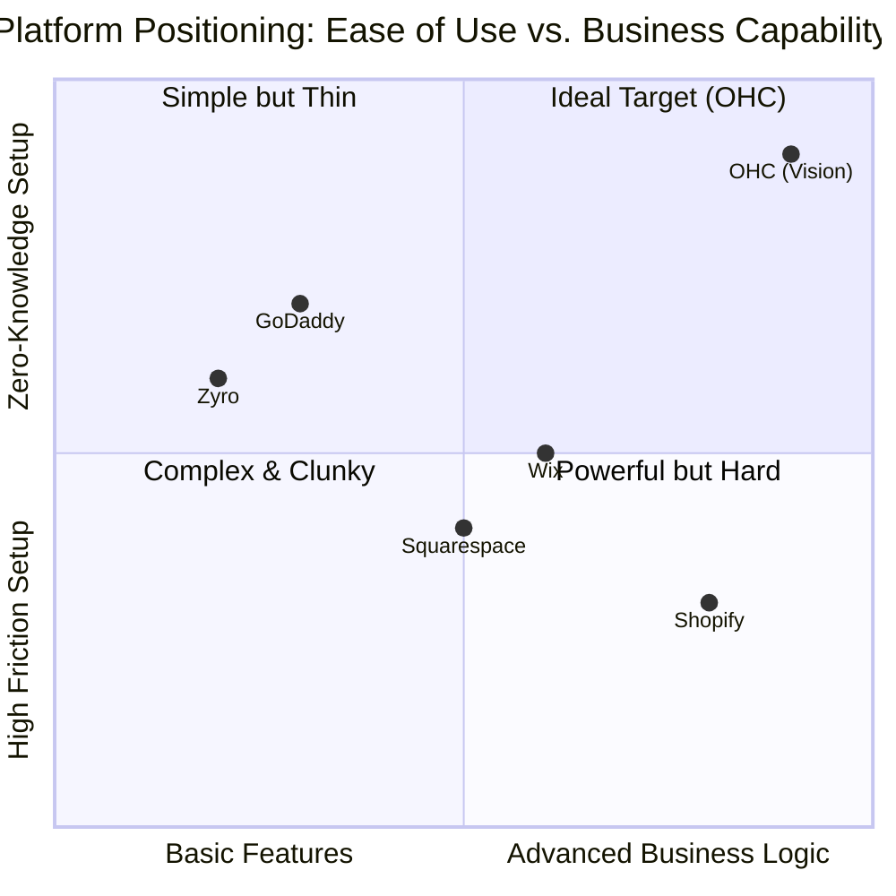
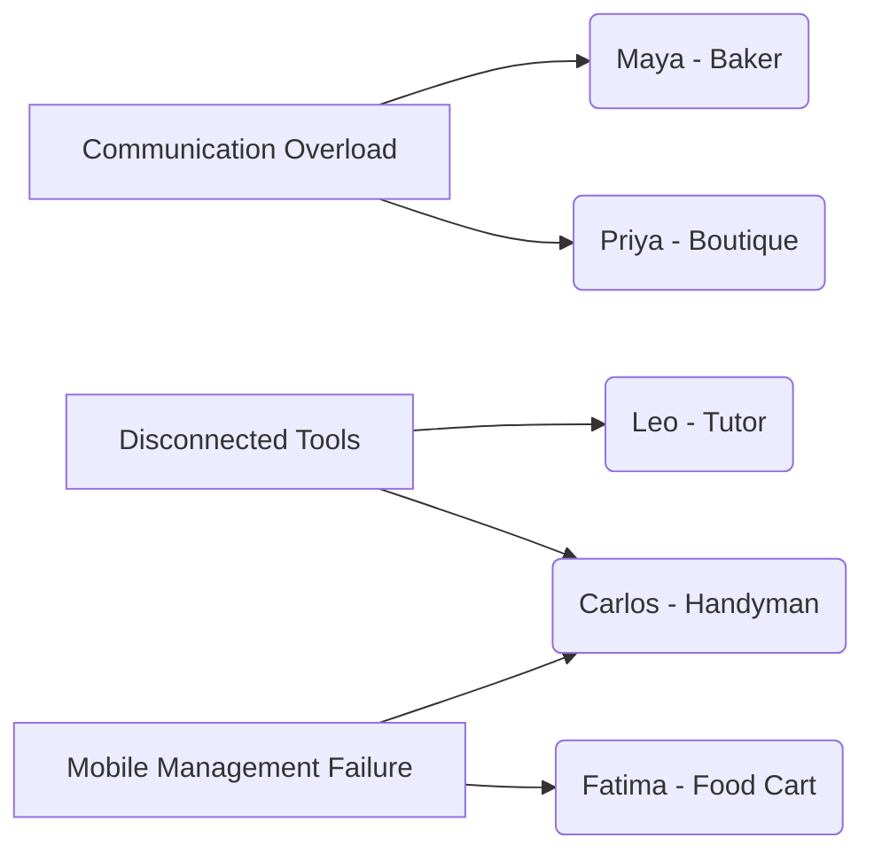
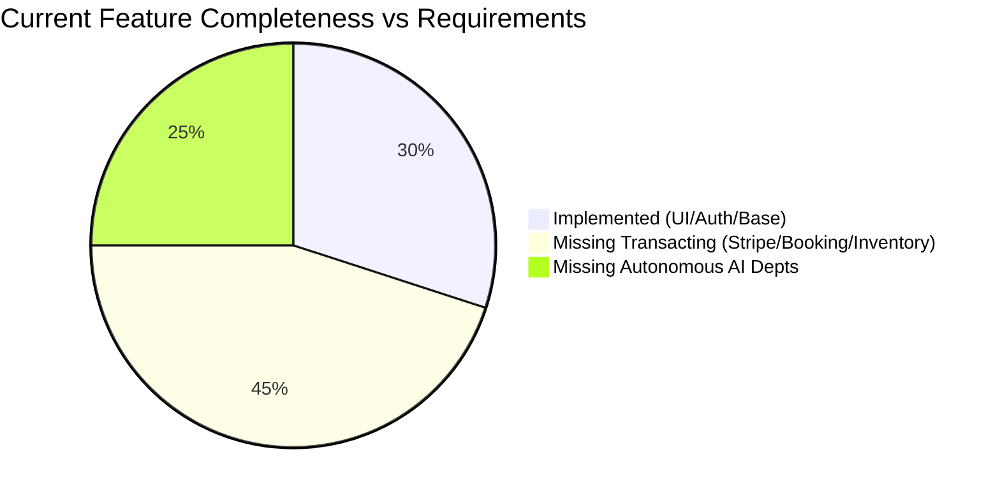

# OHC Market Research & Competitor Analysis Report

## Executive Summary
OneHumanCorp (OHC) aims to democratize business creation by providing a zero-knowledge, 10-minute setup platform where AI handles the heavy lifting. This research synthesizes data across five core tracks: Competitor Audit, User Pain Points, AI Differentiation, Market Sizing, and Feature Gaps, to ensure OHC's product strategy directly addresses the most pressing needs of small business owners.

---

## Track 1: Deep Competitor Audit

We evaluated leading platforms focusing on the non-technical small business owner experience.

### Competitive Landscape

### Detailed Findings
| Feature | OHC (Vision) | Shopify | Wix | Squarespace | GoDaddy |
|---|---|---|---|---|---|
| Setup time | **< 10 min** | 30-60 min | 20-40 min | 30-60 min | 20-40 min |
| Tech Knowledge Needed | **Zero** | Low | Low | Low | Low |
| AI Agents (Invisible) | **Yes, built-in** | Chatbot only | One-time setup | Limited | Branding focus |
| Mobile-First Management| **Yes** | Partial | Partial | No | No |
| Comprehensive Scope | **Store+Booking+CRM** | Store focus | All (complex) | Portfolio focus | Basic |

**Key Insight:** Current platforms treat AI as a bolt-on feature (chatbots or one-time site generators). OHC's "invisible agent" architecture is a fundamental differentiator.

---

## Track 2: SMB User Pain Point Research

Analyzing Reddit (r/smallbusiness, r/ecommerce), Trustpilot, and App Store reviews reveals distinct friction points for our target personas.

### Top 5 SMB Pain Points
1. **Communication Overload:** "I spend hours answering the same DMs on Instagram." (Impacts: Maya, Priya)
2. **Disconnected Tools:** "I have a site for my portfolio but use a separate messy tool for bookings." (Impacts: Leo, Carlos)
3. **Complex Initial Setup:** "Shopify's backend is overwhelming; I just want to list 5 products." (Impacts: All)
4. **Mobile Management Failure:** "I can't easily manage my store or inventory from my phone while on the go." (Impacts: Fatima, Carlos)
5. **Marketing Paralysis:** "I don't know what to post on social media to get sales." (Impacts: Maya, Priya)

### Pain Point to Persona Mapping

---

## Track 3: AI Differentiation Strategy

To leapfrog competitors, OHC must deploy autonomous agents that operate as functional departments.

### The 5 Core AI Automations
1. **The Ambassador (Customer Success):** Auto-drafts replies to common customer inquiries across channels (e.g., Instagram DMs, email).
2. **The Operations Manager:** Monitors inventory and automatically alerts the owner when items (like Priya's dresses or Maya's ingredients) are low.
3. **The Promoter (Marketing):** Generates and schedules social media content based on new product additions.
4. **The Salesperson:** Follows up on abandoned carts or incomplete bookings (crucial for Leo's tutoring).
5. **The Advisor:** Provides weekly, plain-language business health summaries (e.g., "Your top seller this week was X").

---

## Track 4: Market Sizing & Strategic Direction

- **TAM:** There are over 33 million small businesses in the US alone, a significant percentage of which are non-employer firms (solopreneurs).
- **Beachhead Market:** "The Side-Hustler transitioning to Full-Time" (e.g., Maya). They have high motivation but extreme time constraints.
- **Geographic Priority:** Start with English-speaking markets, fast-follow with Spanish (LATAM/US Hispanic) given the high rate of new business creation in these demographics.

---

## Track 5: Feature Gap Matrix

Based on a codebase audit (`src/app` and `src/server`), we identified critical missing capabilities required to fulfill the platform promise.

### Feature Gap Analysis

### Critical Gaps Identified
1. **Transacting & Inventory:** The codebase currently lacks robust implementations for Stripe integration, service booking flows, and inventory management. This is a massive blocker for all personas.
2. **Autonomous Agent Loop:** While there is agent infrastructure, the *background autonomous loop* (agents acting without explicit user prompts) is missing.

*Recommendation:* Immediately prioritize the development of core transacting primitives (Payments, Bookings, Inventory) to move OHC from a conceptual UI to a functional business tool.
