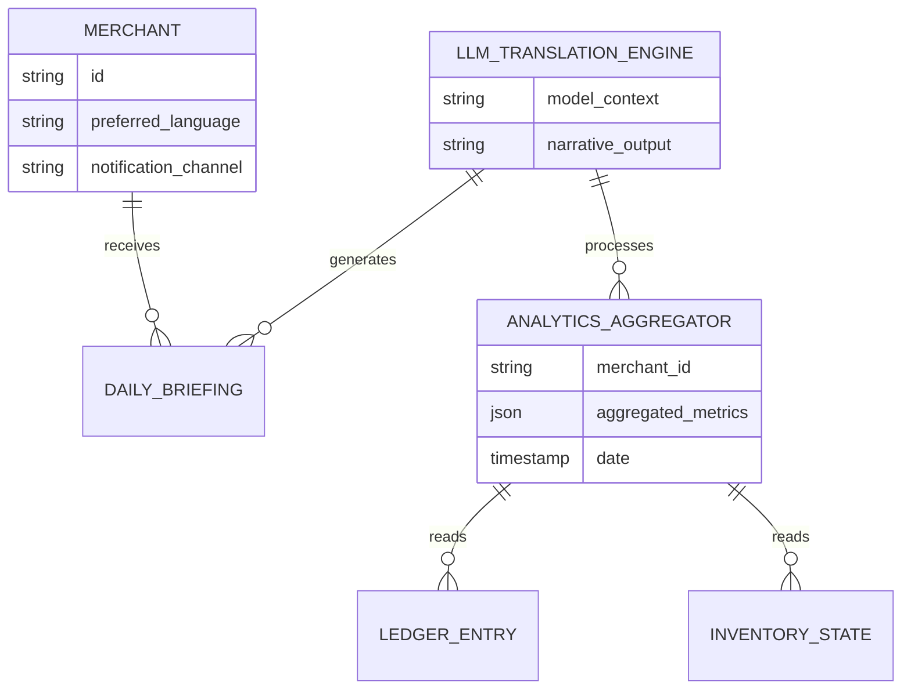
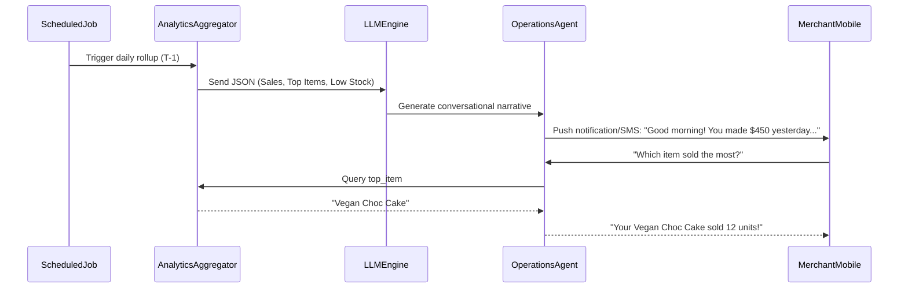

# [research] Conversational AI Business Analytics & Plain-Language Briefing Engine

## Title
Build the Conversational AI Business Analytics & Plain-Language Briefing Engine

## Problem Statement
Small business owners—like Fatima (food cart) and Maya (baker)—suffer from "Financial Fog". Traditional SaaS platforms (Shopify, Wix) rely on complex analytics dashboards full of line charts, cohort analyses, and conversion funnels. These are overwhelmingly built for full-time e-commerce managers, not a baker or a handyman operating from a 375px mobile screen. When a business owner needs to know "How did I do yesterday?" or "What do I need to restock?", they are forced to decipher raw data. They need actionable insights in plain language, delivered conversationally via SMS or a simplified AI feed, bypassing the cognitive load of a dashboard entirely.

## Research Report

We investigated how major platforms surface data versus what small business owners actually consume.

### Competitive Analysis
| Platform | Analytics Delivery Method | Persona Fit (Non-Technical SMB) | Shortcoming |
|---|---|---|---|
| Shopify | Robust visual dashboards, web & app | Poor (Requires data literacy) | Too complex; assumes full-time manager. |
| Wix | Standard dashboard widgets | Poor | Desktop-first widgets cramp on mobile. |
| Square | Daily summary emails + dashboard app | Moderate | Static emails don't allow conversational follow-up. |
| **OHC (Target)** | **Proactive Plain-Language Briefings & Conversational Querying** | **Excellent** | **Translates metrics into human narrative.** |

### Industry Findings
- **Data Overload:** Over 70% of micro-business owners check their analytics less than once a week because they find the interfaces intimidating.
- **Action over Observation:** SMBs don't want to *see* that traffic is down; they want to be told *what to do* about it. (e.g., "Sales dropped 10%. Want me to generate an Instagram promo post?").
- **Platform Gap:** A conversational analytics layer that abstracts the multi-tenant ledger and translates SQL/NoSQL aggregations directly into NLP (Natural Language Processing) output is currently missing from the market.

## Design Doc

### Architecture Diagram

### UI Wireframes & Screen Flow (375px First)

1.  **Morning Push Notification**:
    - *Lock Screen Card*: "Good morning Maya! ☀️ Yesterday was a great day: $450 in sales (up 15%!). Tap to see what needs restocking."
2.  **The Briefing Feed (Main Screen)**:
    - *Layout*: Clean, macOS-style Translucent Glass chat interface. No pie charts.
    - *Message Bubble*: "You sold out of Vanilla Cupcakes. You have 3 custom cake inquiries waiting in your omnichannel inbox. Your highest-paying customer from last month booked again."
    - *Action Chips*: "Restock Vanilla Cupcakes" | "View Inquiries" | "Ask a question"
3.  **Conversational Follow-up**:
    - *User Input*: "How much did I make this week compared to last?"
    - *Agent Reply*: "You're at $1,200 this week, which is $200 more than this time last week! Mostly driven by the Sunday market."

### Mobile UX Flow
- The user primarily interacts with analytics via push notifications and a conversational chat feed.
- "Grandmother Test" pass: There is no need to select date ranges, apply filters, or understand Y-axes. The user reads a text message and can reply naturally.
- Complex charts are hidden behind an "Advanced Data" toggle in settings for the top 1% of power users.

### AI Agent Integration Points
- **Finance Agent**: Aggregates ledger data securely (ensuring strict multi-tenant isolation).
- **Operations Agent**: Monitors inventory levels to inject "low stock" warnings into the narrative.
- **Customer Success Agent**: Analyzes CRM data to mention returning VIP customers.
- **Communications/LLM Engine**: Fuses the data from Finance, Operations, and CS agents into a localized, friendly narrative (e.g., translating into Arabic for Fatima or casual English for Leo).

### Technical Integrity & Constraints
- **Performance:** Payload size for daily rollups to the LLM context must remain under 50KB to minimize token costs and LLM processing latency. Briefing generation must complete in < 5 seconds.
- **Offline Capability:** Push notifications must be queued securely on the edge if the user is offline, utilizing local-first sync once connectivity is restored.
- **Zero-Trust Multi-Tenancy:** The `AnalyticsAggregator` must strictly filter queries by `merchant_id` at the database level before any data reaches the `LLMEngine` to prevent cross-contamination of business data in the prompt context.

### Key Design Decisions and Why
- **Push-over-Pull Strategy:** SMB owners forget to check dashboards. Pushing a briefing ensures engagement.
- **Narrative over Visuals:** Translating numbers into stories drastically reduces cognitive load.

## Implementation Prompt

**Prompt for Implementer:**
Build the backend aggregator and conversational UI for the "Conversational AI Business Analytics Briefing".
- **Outcome:** The system should generate a daily plain-language summary of yesterday's performance (sales, top items, necessary actions) and deliver it via the main app feed or SMS. The merchant must be able to ask follow-up questions in natural language (e.g., "What was my worst-selling item?").
- **CUJ (Critical User Journey):**
  1. Merchant wakes up and receives a push notification summary.
  2. Merchant taps to view the conversational feed.
  3. Merchant asks a custom question about their data.
  4. The AI securely queries the merchant's data and responds accurately in plain text.
- **Acceptance Criteria:**
  - Data must be strictly isolated per merchant.
  - The UI must perfectly fit a 375px mobile screen (no horizontal scrolling for charts).
  - The language model must not hallucinate sales data; it must strictly rely on the aggregator's JSON output.
  - The feature must handle multiple languages (e.g., English, Spanish, Arabic).

## Priority
`P0` (Critical for engagement and retention)

## Estimated Scope
Large