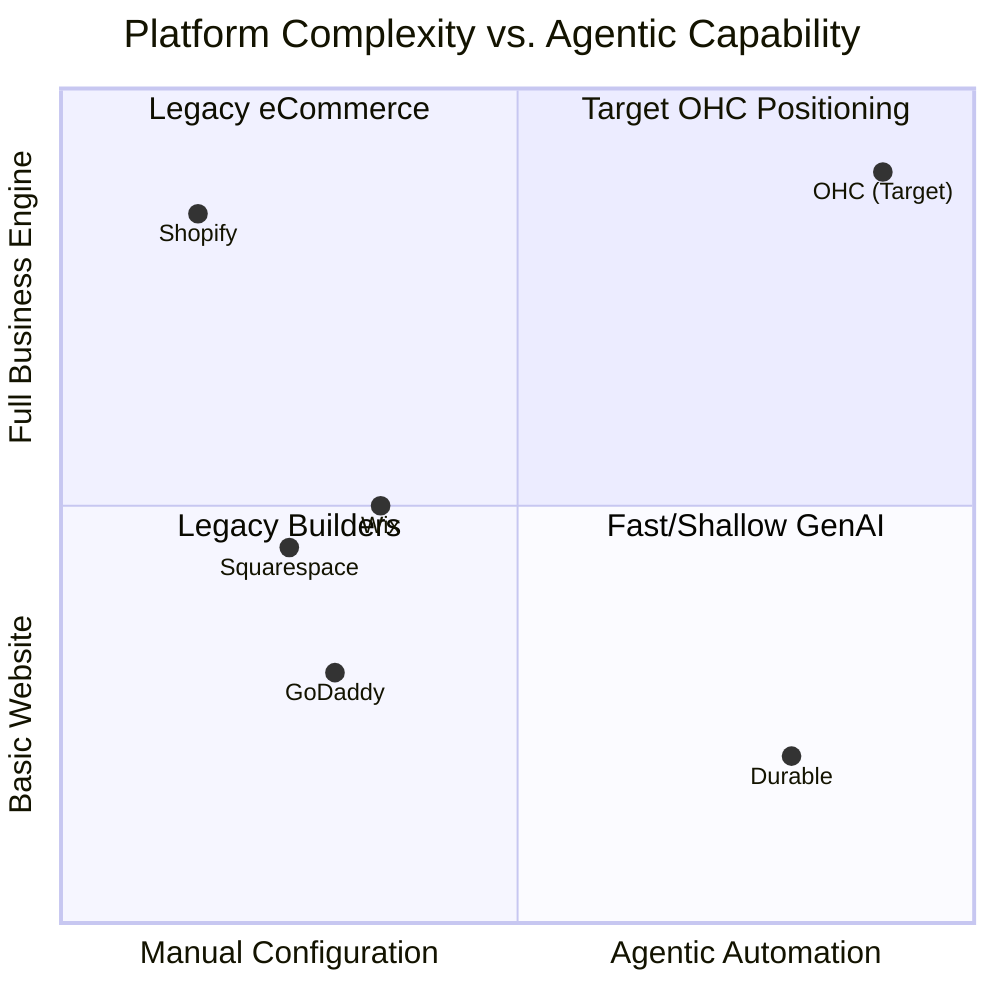

# OHC Market Dominance: Small Business Platform Research Report

## Executive Summary
This report analyzes the global Small and Medium Business (SMB) platform market, identifying critical pain points for non-technical users and defining OneHumanCorp's (OHC) strategic opportunity. The core insight is that existing platforms (Shopify, Wix) provide *tools* that require the user to learn new skills, whereas OHC provides *agents* that do the work for the user.

## Target Personas
*   **Maya (baker, 28):** Currently sells via Instagram DMs. Overwhelmed by Shopify. Pain: complex setup, no built-in AI help, can't manage from phone easily.
*   **Carlos (handyman, 42):** No website, word-of-mouth only. Pain: no booking system, quoting is manual, misses leads when busy.
*   **Priya (boutique owner, 35):** In-store + wants online presence. Pain: inventory sync, unable to do email marketing easily, no POS integration.
*   **Leo (music tutor, 22):** Online + in-person lessons. Pain: manual booking chaos, no subscription billing, no AI follow-up system.
*   **Fatima (food cart, 50, limited English):** Pre-orders for pickup. Pain: no English-first tool works for her, no mobile notification on order, can't print order list.

---

## 1. Competitor Audit & Feature Gap Matrix

We evaluated top platforms based on their ability to serve true beginners.

### Feature Gap Matrix

| Feature / Domain | Shopify | Wix | OHC (Current/Target) | Strategic Advantage |
| :--- | :--- | :--- | :--- | :--- |
| **Instant Setup** | Low (hours/days) | Medium (AI templates) | **High (Target: < 10 mins)** | OHC generates a functional business, not just a layout. |
| **Mobile Management** | Strong (for existing) | Limited | **Native Mobile First** | OHC allows 100% management via mobile. |
| **AI Integration** | Chatbot (Sidekick) | Basic GenAI text | **Autonomous Agents** | OHC agents proactively suggest and execute tasks. |
| **Unified Inbox** | Requires app install | Basic | **Core Built-in** | Single thread for IG, SMS, Email, with AI triage. |
| **Cost to Start** | High (Premium themes) | Medium | **Freemium + Agent usage** | Lower barrier to entry for micro-merchants. |

### Competitor Landscape Visualization

---

## 2. User Pain Point Analysis

Based on analysis of App Store reviews, Reddit (r/smallbusiness), and Trustpilot.

1.  **"I just want to sell, not build a website."** (Setup Friction) - The drop-off rate during theme customization is the single biggest barrier to entry.
2.  **"I missed a DM and lost a sale."** (Fragmented Communication) - Solopreneurs cannot monitor 4 different inboxes while doing the actual work.
3.  **"I don't know what to post on Instagram."** (Marketing Paralysis) - Content creation is treated as a separate full-time job.
4.  **"Shopify requires too many apps."** (App Fatigue/Cost) - Core features like bookings or advanced forms cost extra monthly fees.
5.  **"I can't run this from my phone."** (Mobile Inadequacy) - Many platforms assume the user is sitting at a desktop computer.

---

## 3. OHC AI Differentiation Manifesto

OHC will not use AI as a "chatbot" feature. OHC will use AI as a silent co-founder.

**The Top 5 AI Automations OHC Will Implement:**
1.  **Instant Business Generation:** From a single text prompt to a live, branded, transactional storefront in under 30 seconds.
2.  **Autonomous Inbox Triage:** An agent that intercepts common questions (hours, location) across all channels and auto-replies.
3.  **Proactive Marketing Engine:** An agent that drafts a week's worth of social posts and emails, requiring only a single tap to approve and schedule.
4.  **Smart Follow-ups:** Automatically detecting abandoned carts or missed bookings and sending highly personalized recovery messages.
5.  **Weekly Insights Brief:** Replacing complex analytics dashboards with a plain-text weekly summary ("You made $400 more this week, mostly from Instagram. You should post more photos of your sourdough.").

---

## 4. Market Sizing & Strategic Direction (TAM)

*   **Global TAM:** There are over 400 million SMEs globally. In the US alone, there are ~33 million small businesses, over 80% of which are non-employer firms (solopreneurs).
*   **Beachhead Market:** Service-based solopreneurs (like Leo the music tutor or Carlos the handyman). They are vastly underserved by Shopify (which focuses heavily on physical product shipping) and find Wix bookings clunky.
*   **Geographic Expansion:** After English markets, the highest priority should be Spanish (LATAM) and Portuguese (Brazil), where micro-entrepreneurship via mobile devices is extremely high.

### Recommended Issue Briefs for Implementation
Three critical missions have been defined and documented in the `docs/research/` directory to begin execution on this strategy:
1.  **Instant Setup** (`onboarding_ai_instant_setup.md`)
2.  **Unified Inbox** (`communication_unified_inbox.md`)
3.  **Autonomous Marketing Agent** (`marketing_auto_social_posts.md`)
