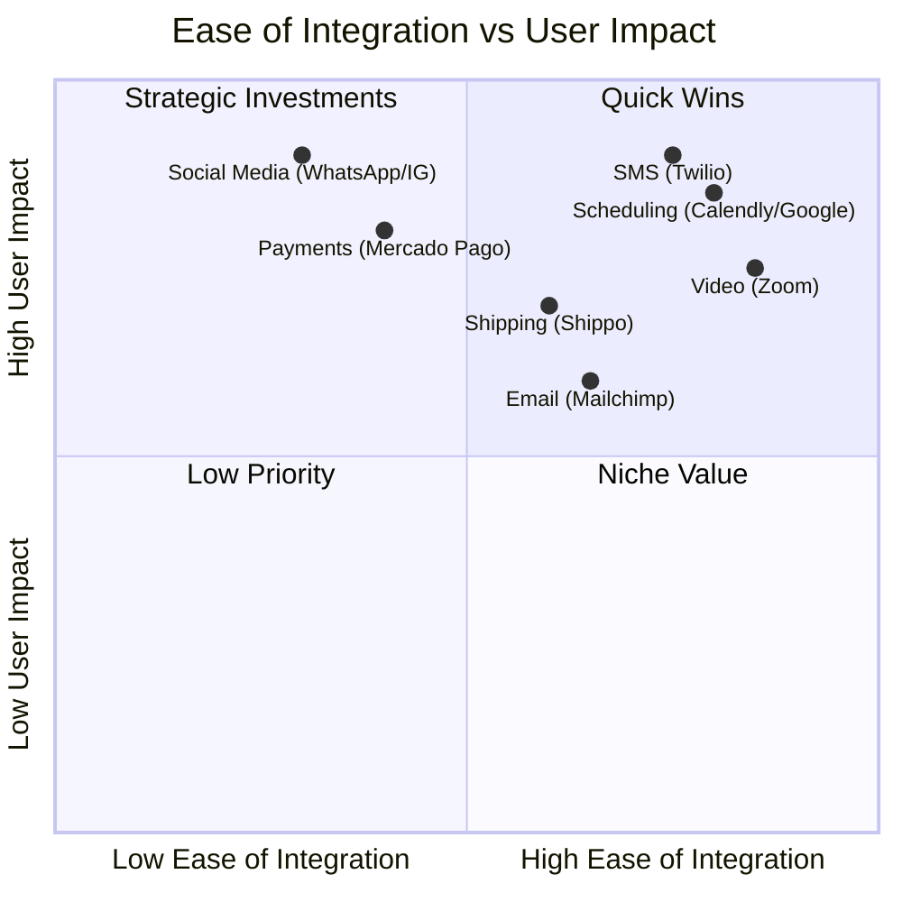

# 🔍 Tool Integration Research Q3

## Executive Summary
This report evaluates critical third-party integrations for One Human Corp (OHC) that directly solve pain points for small business owners. The research covers seven core domains: Social Media, Calendar & Scheduling, Email Marketing, Payment Processing, Shipping & Logistics, SMS Notifications, and Video Conferencing.

### Persona Pain Points
- **Fatima (Local Bakery Owner)**: Struggles with missed customer messages on Instagram and WhatsApp. Needs reliable SMS alerts as her English proficiency is low and SMS is universally understood.
- **Marcus (Consultant)**: Spends hours generating Zoom links and dealing with timezone conflicts. Needs automated booking integrated with his Outlook.
- **Elena (Boutique E-commerce)**: Needs localized payment processing (Mercado Pago) and easy shipping label generation to scale her LATAM operations.

### Competitive Landscape

### Integration Category Overview
| Category | Evaluated Tools | Cloud Mode | Standalone Mode | Pricing Estimate | Priority |
|---|---|---|---|---|---|
| Social Media | WhatsApp Business, IG Graph | ✅ | ✅ | $0.015/msg | P0 |
| Scheduling | Google Calendar, Outlook | ✅ | ✅ | Free API | P1 |
| Email Marketing | Mailchimp, Resend | ✅ | ✅ | $15-20/mo | P2 |
| Payments | Mercado Pago, Alipay | ✅ | ✅ | 2.9% + 30c | P1 |
| Shipping | Shippo, EasyPost | ✅ | ✅ | $0.05/label | P2 |
| SMS & Notifications | Twilio, MessageBird | ✅ | ✅ | $0.007/msg | P0 |
| Video Conferencing | Zoom, Google Meet | ✅ | ✅ | Free API | P1 |

---

## Issue Briefs

### [Social Media Integration] Unified Inbox for WhatsApp and Instagram
**Problem Statement**:
Small business owners like Fatima struggle to keep up with customer messages scattered across WhatsApp, Instagram DMs, and Facebook. Missed messages mean lost sales. They need a single, unified inbox that brings all these conversations into one easy-to-manage view without needing to switch apps.

**Research Report**:
- **Evaluated Tools**: WhatsApp Business Cloud API, Instagram Graph API.
- **Ease of Use**: High for end users once connected. The setup requires OAuth flows which can be streamlined via OHC's dashboard.
- **Pricing**: WhatsApp charges per conversation (approx. $0.015 - $0.08 depending on region). IG is free but rate-limited.
- **Reputation**: Industry standards. High reliability.
- **Environment**: Works in Cloud (webhooks via shared gateway) and Standalone (polling or local tunneling for webhooks).

**Design Doc**:
- **Trigger**: Customer sends a message on WhatsApp or IG.
- **Action**: Message is fetched and routed into the OHC Unified Inbox.
- **User Sees**: A new chat thread appears in their OHC dashboard labeled with the source platform. The user can type a reply directly in OHC, which is sent back to the customer on their native app.

**Implementation Prompt**:
Create a unified inbox view that supports connecting WhatsApp and Instagram accounts via a simple "Connect" button. Messages should arrive in real-time, and the business owner must be able to reply directly from the OHC interface. Ensure the setup flow clearly explains what permissions are being granted in plain language.
**Acceptance Criteria**:
- User can authorize WhatsApp and Instagram.
- Incoming messages show up in a unified OHC feed.
- Replies sent from OHC successfully deliver to the customer's native app.

**Priority**: P0
**Estimated Scope**: Large

---

### [Calendar & Scheduling] Automated Calendar Sync & Booking
**Problem Statement**:
Consultants like Marcus spend too much time emailing back and forth to find meeting times. Timezone math often leads to missed appointments. They need a way to share a booking link that only shows their true availability and automatically adds appointments to their calendar.

**Research Report**:
- **Evaluated Tools**: Google Calendar API, Microsoft Graph API (Outlook).
- **Ease of Use**: Extremely high for both the business owner and the client.
- **Pricing**: Free for the API usage.
- **Reputation**: Gold standards for scheduling.
- **Environment**: Works seamlessly in both Cloud and Standalone modes via standard OAuth 2.0.

**Design Doc**:
- **Trigger**: Business owner shares their OHC booking link with a client; client selects a time.
- **Action**: System checks real-time availability, reserves the slot, and pushes an event to the owner's Google/Outlook calendar.
- **User Sees**: A personalized booking page. The owner sees new appointments magically appear on their native calendar with no manual entry required.

**Implementation Prompt**:
Implement a calendar integration allowing users to connect Google Workspace or Outlook. Generate a public "booking page" for the user. When a client books a slot, the system must automatically sync the event to the connected calendar, handling all timezone conversions invisibly.
**Acceptance Criteria**:
- User can connect Google/Outlook calendars.
- Public booking page accurately reflects free/busy status.
- New bookings are automatically synced to the external calendar with correct timezones.

**Priority**: P1
**Estimated Scope**: Medium

---

### [Email Marketing] Integrated Customer Campaign Manager
**Problem Statement**:
Business owners want to announce sales or new products to their existing customers, but exporting lists to complex tools like Mailchimp is overwhelming. They need a simple way to email their customer base directly from their management dashboard.

**Research Report**:
- **Evaluated Tools**: Resend, Mailchimp API.
- **Ease of Use**: Resend is developer-friendly but can be abstracted into a super simple UI for our users. Mailchimp has a steeper learning curve but recognizable brand.
- **Pricing**: Resend ($20/mo for 50k emails), Mailchimp (starts free, scales quickly).
- **Reputation**: Resend is highly regarded for deliverability; Mailchimp is an industry veteran.
- **Environment**: Both Cloud and Standalone supported.

**Design Doc**:
- **Trigger**: User creates an announcement draft and hits "Send to All Customers".
- **Action**: System compiles the customer email list and dispatches the campaign via the integrated email provider.
- **User Sees**: A simple text editor to write the email, a preview button, and basic stats (how many were delivered/opened) without leaving OHC.

**Implementation Prompt**:
Build a simple email campaign feature that connects to an external provider (like Resend). Provide the business owner with a distraction-free writing interface and a one-click button to send to all contacts. Include a basic dashboard showing open rates.
**Acceptance Criteria**:
- User can draft an email and preview it.
- System can send emails to the entire contact list using an external provider.
- User can view basic delivery and open statistics.

**Priority**: P2
**Estimated Scope**: Medium

---

### [Payment Processing] Localized Payment Gateways
**Problem Statement**:
E-commerce owners in specific regions (like Elena in LATAM) cannot rely solely on Stripe. They need integrations with local payment providers like Mercado Pago or Alipay to accept payments in ways their customers actually want to pay.

**Research Report**:
- **Evaluated Tools**: Mercado Pago API, Alipay Global.
- **Ease of Use**: Frictionless for the end-customer. Moderate setup for the business owner.
- **Pricing**: Standard localized processing fees (approx 2.9% + fixed fee).
- **Reputation**: Mercado Pago dominates LATAM; Alipay is essential for the Chinese market.
- **Environment**: Cloud and Standalone supported via webhooks and API polling.

**Design Doc**:
- **Trigger**: Customer proceeds to checkout on an invoice or storefront.
- **Action**: System generates a payment intent with the selected regional provider.
- **User Sees**: The business owner sees a simple toggle in their settings to "Enable Mercado Pago". The customer sees their preferred local payment method at checkout.

**Implementation Prompt**:
Add support for connecting alternative payment providers such as Mercado Pago. Provide a settings screen where the business owner can input their API keys or authenticate via OAuth. Ensure the checkout experience automatically displays the enabled payment methods.
**Acceptance Criteria**:
- User can toggle and configure Mercado Pago.
- Checkout flow securely redirects to or embeds the payment gateway.
- Successful payments automatically mark corresponding OHC invoices as "Paid".

**Priority**: P1
**Estimated Scope**: Medium

---

### [Shipping & Logistics] Automated Label Generation
**Problem Statement**:
Manually copying customer addresses into a courier's website to buy shipping labels is error-prone and time-consuming. Business owners need to generate tracking numbers and print labels with one click from their order list.

**Research Report**:
- **Evaluated Tools**: Shippo API, EasyPost.
- **Ease of Use**: High. Both abstract hundreds of carriers into a single API.
- **Pricing**: ~$0.05 per label + postage costs.
- **Reputation**: Both are industry leaders in logistics API.
- **Environment**: Supported across Cloud and Standalone deployments.

**Design Doc**:
- **Trigger**: Owner clicks "Create Shipping Label" on an order.
- **Action**: System sends package dimensions and address to Shippo/EasyPost to purchase postage and retrieve a PDF label.
- **User Sees**: A printable PDF label opens immediately. The system automatically emails the tracking number to the customer.

**Implementation Prompt**:
Integrate a shipping API (e.g., Shippo) to allow users to generate shipping labels directly from order records. The feature should allow the user to input box dimensions, view rates, purchase the label, and download it as a PDF, all seamlessly.
**Acceptance Criteria**:
- User can connect a shipping provider account.
- User can compare shipping rates for an order.
- User can purchase and download a shipping label PDF.
- Tracking numbers are auto-saved to the order.

**Priority**: P2
**Estimated Scope**: Large

---

### [SMS & Notifications] Global SMS Alerts
**Problem Statement**:
Many customers ignore emails, and some business owners (like Fatima) prefer SMS because it requires lower technical proficiency. They need reliable, automated SMS notifications for order updates and appointment reminders.

**Research Report**:
- **Evaluated Tools**: Twilio, MessageBird.
- **Ease of Use**: API is complex, but for the business owner, it's just flipping a switch "Send SMS reminders".
- **Pricing**: ~$0.007 per message in the US, varies globally.
- **Reputation**: Twilio is the global leader; MessageBird is strong in Europe/Asia.
- **Environment**: Fully supported in Cloud and Standalone.

**Design Doc**:
- **Trigger**: An appointment is upcoming, or an order ships.
- **Action**: System formats a brief text message and dispatches it via Twilio.
- **User Sees**: A toggle in settings: "Send SMS updates to customers". They can also see a log of sent SMS messages on the customer's profile.

**Implementation Prompt**:
Implement SMS notification capabilities using a provider like Twilio. Provide a zero-configuration experience for the business owner where turning on "SMS Alerts" automatically sends standard templates for order confirmations and appointment reminders. Ensure opt-out (STOP) compliance is handled automatically.
**Acceptance Criteria**:
- User can enable SMS notifications.
- System automatically sends SMS for key events (orders, appointments).
- System processes "STOP" replies to comply with opt-out regulations.

**Priority**: P0
**Estimated Scope**: Medium

---

### [Video Conferencing] Auto-Generated Meeting Links
**Problem Statement**:
When a client books a remote consultation, the business owner often has to manually create a Zoom link and email it separately. This leads to confusion and lost links. They need the video link generated and attached automatically at the moment of booking.

**Research Report**:
- **Evaluated Tools**: Zoom API, Google Meet API.
- **Ease of Use**: Very easy once Oauth is set up.
- **Pricing**: API is included with standard paid accounts.
- **Reputation**: Zoom and Meet are ubiquitous.
- **Environment**: Cloud and Standalone modes supported.

**Design Doc**:
- **Trigger**: A new virtual appointment is booked via OHC.
- **Action**: System calls Zoom/Meet to create a meeting and appends the join URL to the calendar event.
- **User Sees**: The business owner connects their Zoom account once. Thereafter, all virtual bookings automatically include a "Join Video" button for both the owner and the client.

**Implementation Prompt**:
Add a video conferencing integration that allows users to connect their Zoom or Google Meet accounts. When a virtual meeting is scheduled, the system must automatically generate a meeting link and embed it into the calendar invite and the OHC dashboard's meeting view.
**Acceptance Criteria**:
- User can authenticate with Zoom or Google Meet.
- Booking a virtual meeting automatically creates a video link.
- The video link is accessible to both the business owner and the client via their respective interfaces.

**Priority**: P1
**Estimated Scope**: Small
