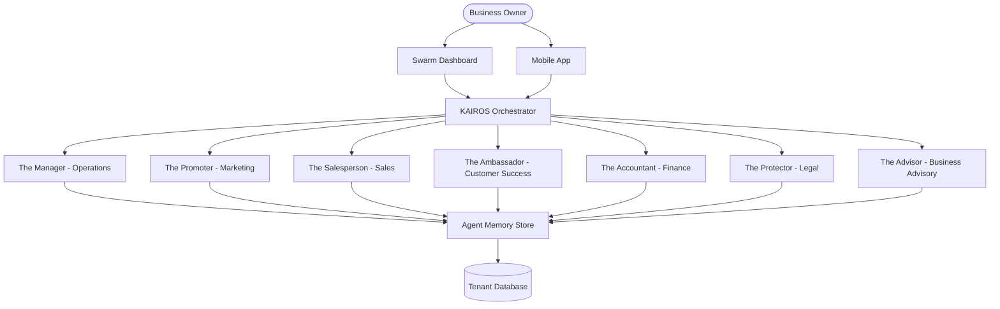

# 🔬 RESEARCHER: AI Agent Department Architecture

## Problem Statement
Small business owners lack the technical expertise to manage complex software ecosystems. Maya, a baker, needs her Instagram DMs answered while she sleeps, but configuring webhooks, LLMs, and memory stores is impossible for her. The gap is a transparent, non-technical interface to powerful AI that acts as a true employee, rather than a chat bot.

## Research Report
Current solutions (e.g., Shopify Inbox, Wix Answers) rely heavily on rule-based bots or require significant manual configuration. OHC's goal is an invisible, fully autonomous AI that handles operations, marketing, sales, customer success, finance, legal, and advisory out of the box.

## Design Doc

### Architecture Diagram

### UI Wireframes & Mobile UX Flow
**Mobile Dashboard (375px):**
- **Header:** Glassmorphism top bar containing tenant name and current tier status (e.g., "Maya's Bakery - Pro Tier").
- **Body:**
  - A summary card showing the status of each department (e.g., "The Manager: 12 orders fulfilled today").
  - An interactive feed of recent actions taken by agents across departments.
  - A prominent "Approve Actions" button for tasks awaiting user consent.

**User Journey for Agent Configuration:**
1. User taps "Manage Staff" on the main menu.
2. User is presented with the 7 departments, each with a toggle switch.
3. User taps "The Ambassador" to configure customer success.
4. User selects "Auto-reply to Instagram DMs" and grants the required permissions.
5. The Ambassador agent is now active and monitoring the Instagram channel.

### AI Agent Integration Points
1. **Trigger Mechanisms:**
   - **On Schedule:** Weekly health reports (Advisor).
   - **On Event:** New Instagram DM (Ambassador), Order placed (Manager).
   - **On Demand:** "Generate a quote for Carlos" (Salesperson).
2. **Coordination:** KAIROS orchestrates handoffs. E.g., The Manager fulfills an order and signals the Ambassador to send a confirmation.
3. **Memory:** Agents share a contextual memory store partitioned by tenant, ensuring Maya's DM history informs future interactions.
4. **Approval Flow:** High-risk actions (e.g., issuing refunds) default to draft-for-review until the owner explicitly grants auto-execute permissions.
5. **Throttling:** Actions are tracked against tier limits (e.g., 100/mo for Free, Unlimited for Pro).

### Key Design Decisions
- **Department Personification:** Using terms like "The Manager" bridges the technical gap for non-technical users.
- **Shared Memory Architecture:** Prevents disjointed customer experiences by ensuring all departments have the same context.
- **Draft-for-Review Default:** Builds trust. Users must explicitly opt-in to full autonomy for high-risk actions.

## Implementation Prompt
**Outcome:** Implement the "Manager" (Operations) department.
**CUJ:** A customer places a pre-order for Fatima's food cart. The Manager agent receives the event, verifies inventory, updates the daily printable order list, and triggers a push notification to Fatima's phone.
**Acceptance Criteria:**
1. Event listener for "order.created" triggers the Manager.
2. Manager queries inventory and updates the daily list.
3. Push notification is sent to the registered mobile device.
4. The action is logged in the agent memory store.
5. 100% unit and E2E test coverage for the flow.

## Priority
P0

## Estimated Scope
Large
