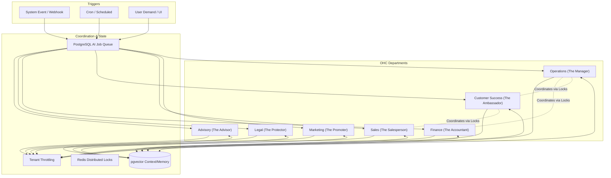

# AI Agent Department Architecture

## Title
AI Agent Department Coordination & Autonomy System

## Problem Statement
Small business owners—whether they are a baker like Maya or a handyman like Carlos—are often overwhelmed by the technical and operational overhead of running their business. They must manage inventory, create websites, handle customer support, track finances, and ensure compliance without a dedicated staff. Existing tools either offer isolated chatbots or force owners to learn complex systems. There is a critical need for an invisible, continuous, and integrated "digital staff" that operates like functional business departments, proactively handling complexity and communicating in plain language, empowering non-technical owners to focus entirely on their craft.

## Research Report
Our competitive analysis shows a significant gap in the market for AI integration:
- **Shopify & Wix:** Introduce AI as bolt-on features like Sidekick or simple text/image generators. These remain isolated tools rather than integrated autonomous systems.
- **Squarespace & GoDaddy:** Offer basic AI website building and promotional generation but lack deep workflow automation (e.g., finance and operations).
- **OHC Opportunity:** By treating AI as the core infrastructure and organizing it into "Departments" that mirror real-world business roles (Operations, Marketing, Sales, Customer Success, Finance, Legal, Advisory), we provide a full, invisible staff. This ensures the "zero technical knowledge required" mandate is met while providing robust, interconnected automation.

## Design Doc

### Architecture Diagram

### Key Design Decisions
1. **Department Triggers:**
   - **On Schedule:** Tasks like weekly health reports (Advisor) or seasonal marketing campaigns (Promoter).
   - **On Event:** Reactive tasks such as an order completion triggering operations or an incoming Instagram DM triggering Customer Success.
   - **On Demand:** Directly invoked by the user from the mobile app (e.g., "Draft a new refund policy").
2. **Coordination & Communication:**
   - Departments coordinate via a Pub/Sub backplane (Teammate Mesh) and Redis distributed locks. For instance, when Operations processes a custom order, it signals Finance to manage the deposit and Customer Success to send a confirmation.
3. **Memory & Context:**
   - All past actions, customer profiles, and business rules are stored as embeddings in `pgvector`. This shared memory ensures continuity (e.g., Sales knows a customer’s previous issues resolved by Customer Success).
4. **Approval Mechanisms:**
   - **Auto-Execute:** Routine tasks (like order confirmation emails) run without user intervention.
   - **Draft-for-Review:** High-stakes tasks (like generating legal contracts, issuing refunds, or sending quotes) create drafts requiring a simple "Approve" tap from the user.
5. **Usage Budgeting:**
   - AI actions are tracked against tenant tier limits using Redis/PostgreSQL counters. When limits are approached, the Advisor suggests upgrading.

### UI Wireframes Description
- **Home Dashboard (375px):** A feed of clean, glassmorphic cards summarizing department activities. e.g., "The Manager processed 5 orders" or "The Advisor has a new weekly report."
- **Action Required Flow:** A prominent floating notification showing drafts pending review (e.g., a quote for Carlos' plumbing job). The user sees a simple "Approve" or "Edit" button.

### Mobile UX Flow
1. **Trigger:** User receives a push notification: "The Ambassador drafted a reply to a new DM."
2. **Review:** User taps the notification to open a 375px-optimized card displaying the drafted reply.
3. **Action:** User taps "Send" (Approve) or "Rewrite" (Demand trigger).
4. **Conclusion:** State updates smoothly with a micro-animation, returning the user to the Home Dashboard.

## Implementation Prompt
**Task:** Implement the foundational AI Agent Department coordination system.
**CUJ:** A user (e.g., Maya the baker) receives a custom order request. The system must autonomously route the event to the Customer Success department to draft a confirmation, and to the Operations department to schedule the request. The user should be able to view these pending actions in their mobile dashboard and approve them with a single tap.
**Acceptance Criteria:**
- Define the base interface for AI Departments (Triggers, Execution, Memory access).
- Implement the pgvector memory retrieval integration for context sharing between departments.
- Implement the "Draft-for-Review" vs "Auto-Execute" approval system with appropriate state tracking in the database.
- E2E tests must verify that an incoming event successfully invokes multiple departments and respects tenant throttling limits. All E2E tests must traverse from the UI to the backend without mocking network requests (AI models may be mocked).

## Priority
P0

## Estimated Scope
Large
