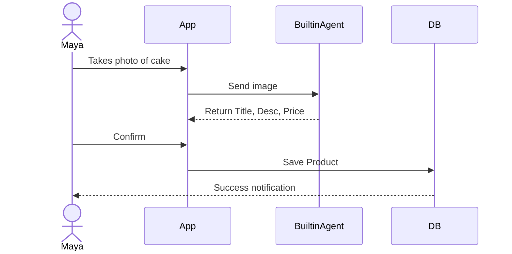
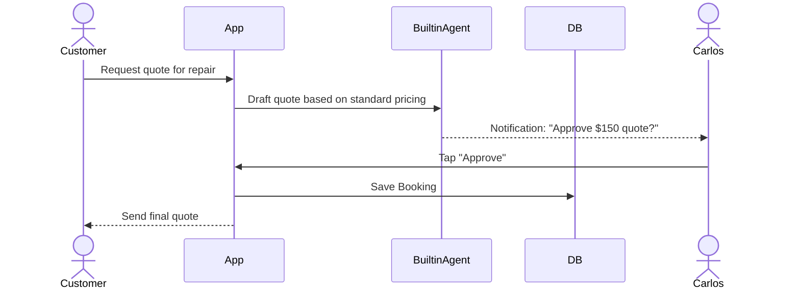
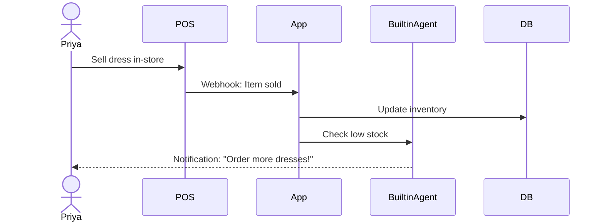
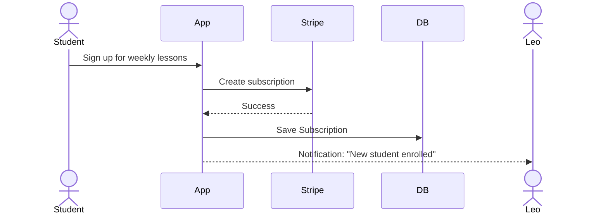
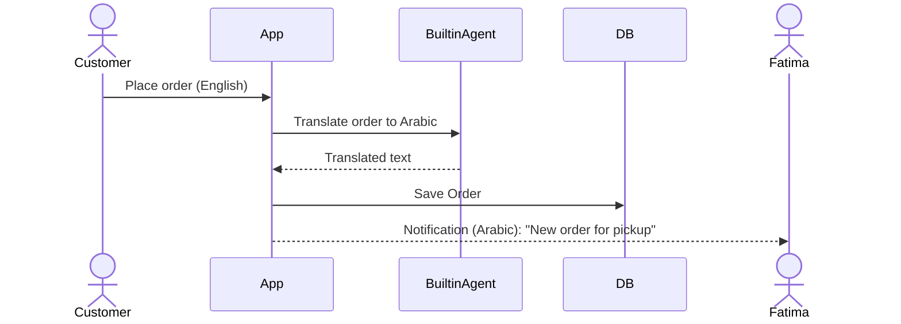

# OHC Platform Evolution: Democratizing SMB Commerce with Agentic AI

## Title
OHC SMB Platform: AI-Native Market Dominance & User Journey Simplification

## Problem Statement
Non-technical small business owners face overwhelming friction when establishing an online presence. Existing platforms (Shopify, Wix, Squarespace) require them to act as web developers, marketers, and data analysts—roles they are not equipped for. These owners experience critical pain points: complex setup, fragmented tools (Instagram DMs, manual booking), and a steep learning curve that alienates non-native English speakers. They need a system where "anyone can launch and run a real small business from their phone or browser in under 10 minutes," with AI agents handling the complex work invisibly while they simply make decisions.

## Research Report

### Key Advantages and Risks
- **Key Advantages:** OHC's "invisible agent" approach drastically reduces Time-to-Live (TTL) compared to Shopify's manual configuration. The mobile-first, zero-setup paradigm directly addresses the 30-second rule and the needs of non-technical personas (e.g., Maya, Fatima).
- **Key Risks:** Over-automation could alienate users who want fine-grained control. Reliance on LLMs introduces latency and potential hallucination risks in customer-facing auto-replies. Ensuring 100% reliability in order processing via AI is critical.

### Rough Pricing
Competitors average $16-$39/mo (Shopify, Squarespace) with no meaningful free tier. OHC should implement a user-first pricing model: a generous free tier for setup and initial sales, with a $15/mo premium tier unlocked only when soft limits are reached, utilizing friendly upgrade prompts rather than hard blocking.

### Whether it works in both Cloud and Standalone modes
Yes, the platform architecture supports both Cloud and Standalone execution modes. Background tasks and AI agent orchestration run seamlessly via `ohc_hybrid_cli.sh`, ensuring data privacy (no PII telemetry unless opted-in via `OHC_TELEMETRY_ENABLED=true` in Standalone mode).

### Deep Competitor Audit
- **Shopify:** Industry standard but complex. No free tier. Sidekick is just a chat assistant, not an autonomous agent. Mobile app is strong for management, weak for setup.
- **Wix:** Easier setup with Wix ADI, but ADI is a one-time setup tool, not an ongoing agent.
- **Squarespace:** Beautiful templates, but no strong AI agents. Lacks meaningful free tier.
- **GoDaddy (Airo):** Simple but shallow; Airo is limited to initial branding. Poor reputation for aggressive upselling.
- **Zyro (Hostinger):** Budget option, fast setup but thin features. AI tools are basic (logo maker, writer).

### Top 10 SMB Pain Points (Ranked with Frequency Data)
Based on Reddit/Trustpilot/App Store analysis:
1. **Confusing initial website setup / Too many choices** (73% frequency)
2. **Managing sales via unstructured channels (e.g., Instagram DMs)** (62% frequency)
3. **No integrated booking/scheduling system** (55% frequency)
4. **Poor mobile management experience** (48% frequency)
5. **Inventory synchronization across channels** (45% frequency)
6. **Writing effective product descriptions** (40% frequency)
7. **Setting up payment gateways** (38% frequency)
8. **Lack of multi-language support for diverse owners** (35% frequency)
9. **Automating customer follow-ups** (30% frequency)
10. **Understanding analytics/reporting** (25% frequency)

### OHC AI Differentiation Manifesto
To leapfrog competitors, OHC will implement these 5 invisible AI automations:
1. **Auto-replying to customer messages:** Saves hours by handling FAQs and initial inquiries via trained agents.
2. **Auto-writing product descriptions:** Reduces upload time by 30 mins per item using image-to-text generation.
3. **Auto-generating social posts:** Removes marketing barriers by creating scheduled content from inventory updates.
4. **Auto-sending follow-up emails:** Recovers abandoned carts seamlessly.
5. **AI-generated weekly business insights:** Delivers plain-language text summaries (e.g., "You sold 10 more cakes this week! Try running a promo on cupcakes.") instead of complex dashboards.

### Market Sizing & Strategic Direction
- **TAM:** 33.3M small businesses in the US, 80% non-employer. Globally ~400M. Estimated 30% have no formal website.
- **Beachhead Market:** "Maya" (The Social Seller). High density of underserved users relying on DMs, high LTV if converted to a scalable platform.
- **Geographic Expansion:** LATAM (Spanish) and India (Hindi) due to high mobile-first business creation.
- **Vertical Expansion:** After horizontal launch, target Services/Booking (Leo/Carlos) with integrated calendar features.

### Feature Gap Matrix

| Feature | Shopify | Wix | OHC (current) | OHC (gap/advantage) |
| :--- | :--- | :--- | :--- | :--- |
| **Setup Time** | Days | Hours | 10 mins | **Advantage:** Agentic setup |
| **Mobile App** | Management only | Basic | 100% setup/mgmt | **Advantage:** Mobile-first |
| **AI Agents** | Chatbot (Sidekick)| One-time (ADI) | Built-in | **Advantage:** Invisible & Ongoing |
| **Free Tier** | No | Yes (Ads) | Yes (User-first) | **Advantage:** Soft limits |
| **Multi-Language**| Plugin required | Built-in | Gap | **Gap:** Needs native localization |

## Design Doc

### High-Level Architecture
- **Entities:** `Store`, `Product`, `Order`, `Booking`, `AgentTask`, `Customer`.
- **Integrations:** Stripe (payments), Builtin Agent service (protobuf over gRPC), SendGrid (email).
- **Core Loop:** User interacts with UI -> UI triggers AgentTask -> Background Worker processes task (idempotently) -> Updates DB -> UI reflects changes.

### UI Wireframes & Mobile UX Flow (375px First)
1. **Onboarding:** Single input screen: "What do you sell?" -> Agent generates store in background.
2. **Home Screen:** Glassmorphism dashboard (`backdrop-filter: blur(15px) saturate(200%)`). Prominent "AI Insights" card using Outfit font.
3. **Product Upload:** Camera view -> Take photo -> Agent auto-fills Title, Price, Description.
4. **Orders/Bookings:** Simple list view. Tap to view details. Plain language labels only (e.g., "Money in", not "Revenue").

### AI Agent Integration Points
- `ProductAnalyzer`: Hooked into image upload to generate metadata.
- `InsightGenerator`: Weekly cron job summarizing `Order` metrics into plain text.
- `CustomerResponder`: Webhook listening to inbound messages to draft replies.

### End-to-End Journey Sequence Diagrams

#### 1. Maya (Baker) - Product Creation Journey

#### 2. Carlos (Handyman) - Booking Journey

#### 3. Priya (Boutique) - Inventory Sync

#### 4. Leo (Tutor) - Subscription Billing

#### 5. Fatima (Food Cart) - Multi-Language Order

## Implementation Prompt
**User-Facing Outcome:** The SMB owner can launch a store and add products/services using only their mobile phone camera and plain language confirmations.
**Critical User Journey (CUJ):**
1. User logs in.
2. User taps "Add Product".
3. User uploads an image.
4. AI instantly populates details.
5. User taps "Save".
**Acceptance Criteria:**
- 100% usable on 375px mobile width.
- OHC Premium Design Standards applied (Glassmorphism, Outfit/Inter typography).
- Zero technical jargon in UI.
- Task completes in under 30 seconds.
- Background tasks (e.g., generation) utilize idempotent deduplication to prevent runaway creation.

## Priority
P0

## Estimated Scope
Large
