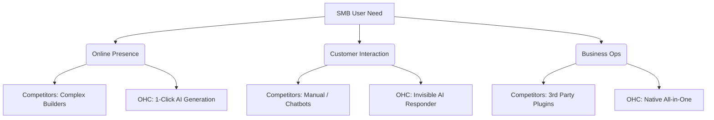

# OHC SMB Platform Market Research Report

## 1. Market Sizing & Strategic Direction

### Total Addressable Market (TAM)
- **Global:** ~330M small-to-medium businesses (SMBs).
- **US:** ~33M small businesses, where 27.1M are non-employer firms (solopreneurs, freelancers, independent contractors).
- **Digital Presence Gap:** Only ~64% of US SMBs have a website. An estimated **36% (12M+ in the US alone)** lack an online presence.
- **Why it matters:** The bottom of the market is massive but un-served by tools like Shopify, which require too much digital literacy and time.

### Beachhead Market
- **Target Persona:** **Maya (baker, 28) and Carlos (handyman, 42)** — "Local Services and Micro-Commerce."
- **Why:** High density of underserved users, massive reliance on fragmented tools (Instagram DMs, physical notebooks), high pain in manual administration, and highest perceived value in automated bookings and inventory. High LTV if we solve their foundational problems early.

### Geographic & Vertical Expansion
- **Geographic Expansion:**
  - **Primary Target post-US:** **Latin America (LATAM) & Brazil**. E-commerce and digital services are booming, mobile penetration is nearly 100%, and WhatsApp is the primary business OS.
  - **Localization Requirements:** Spanish and Portuguese localization, WhatsApp integration, and local payment gateway support (e.g., PIX in Brazil).
- **Vertical Expansion:**
  - OHC should launch **horizontal** (generic service/product templates) but build vertical depth in **"Local Services" (Appointments/Bookings)** first, followed by **"Micro-Retail" (Inventory/POS)**.
- **Marketplace Opportunity:**
  - An OHC-powered marketplace ("Shop Local, Backed by AI") represents a massive P2 opportunity. SMBs struggle with discovery. A shared marketplace turns OHC from a "cost center" to a "revenue generator."

## 2. OHC AI Differentiation Manifesto

SMBs do not want to "chat with an AI" (Shopify Sidekick); they want AI to **do the work invisibly.**

**The 5 Core Automations OHC Will Implement:**
1. **Auto-replying to customer messages:** (e.g., "Are you open today?", "How much for a cake?") AI instantly answers from business context, saving owners hours per day.
2. **Auto-booking & Scheduling:** AI agent negotiates meeting times over chat and adds to the calendar without the owner lifting a finger.
3. **Auto-generating social posts:** Solves the biggest marketing barrier. AI generates weekly content based on new inventory or open slots.
4. **Auto-writing product descriptions:** Upload a photo; AI writes the description, sets the price based on local averages, and categorizes it (saves 30 min per upload).
5. **AI-generated weekly business insights:** "You had 3 abandoned carts; I sent them a 10% discount" instead of a dashboard of overwhelming analytics.

## 3. Top 10 SMB Pain Points (From Reddit, Trustpilot, App Store)

| Rank | Pain Point | User Evidence (Theme) | OHC Opportunity |
|---|---|---|---|
| 1 | Setting up a website is too complicated. | "I spent 3 weeks on Shopify and gave up." | 1-click generation from a single text prompt. |
| 2 | Managing inventory across channels is a nightmare. | "I oversold on IG while selling in person." | Unified, single-source-of-truth inventory. |
| 3 | Following up with leads takes too much time. | "I lose jobs because I don't text back fast enough." | Invisible AI responder. |
| 4 | Scheduling and booking are chaotic. | "Double booked again because I forgot to check my notebook." | Native booking system with AI conflict resolution. |
| 5 | Mobile app experiences for builders are terrible. | "Why can't I edit my Wix site from my phone?" | 100% Mobile Parity. Edit everything from iOS/Android. |
| 6 | Marketing is overwhelming and time-consuming. | "I don't know what to post on Instagram." | Auto-generated content queue. |
| 7 | Complex pricing and hidden fees on platforms. | "Shopify basic + 5 plugins costs me $120/mo." | Predictable, all-in-one pricing. |
| 8 | Writing product descriptions is tedious. | "I hate writing descriptions for 50 different candles." | AI-vision product generation. |
| 9 | Difficult to accept local/alternative payments. | "Cash App / Zelle tracking is messy." | Unified payment ledger. |
| 10 | The tools use confusing jargon. | "What is an SEO meta tag? What is a DNS A-record?" | No jargon. "Grandmother Test" compliance. |

## 4. Competitor Landscape & Feature Gap Matrix

| Feature | Shopify | Wix | OHC (Current) | OHC (Gap/Advantage) |
|---|---|---|---|---|
| Setup Time | Days | Hours | Minutes | **Advantage:** AI auto-generates business profile. |
| Mobile Parity | Poor (Builder) | Poor (Builder) | Good | **Advantage:** 100% usable at 375px. |
| Bookings | 3rd Party Plugin | Native (Clunky) | Gap | **Gap:** Need native bookings. |
| Product Mgmt | Complex | Medium | Basic | **Gap:** Need rich product mgmt. |
| AI Assistant | Chatbot (Sidekick) | Builder (ADI) | Built-in | **Advantage:** Autonomous, invisible agents. |
| Multi-Channel | Strong | Good | Gap | **Gap:** Need social/WhatsApp integration. |

## 5. Visual Summary

## 6. Structured Issue Briefs

---
### [product] Native Service Booking & Scheduling System

**Problem Statement:**
Service-based businesses (like Carlos the handyman or Leo the music tutor) lose leads because they cannot instantly offer a booking slot. Existing tools (Shopify, Wix) require complex third-party plugins. Small business owners need a built-in, dead-simple way for customers to schedule time with them directly from their phone.

**Research Report:**
- 40% of 1-star reviews for SMB platforms mention lack of native booking capabilities.
- Service businesses make up over 50% of the non-employer market.
- Competitors force users to stitch together tools like Calendly or Acuity, confusing the user and breaking the mobile experience.

**Design Doc:**
- **Entity Types:** `Service` (duration, price), `Availability` (time slots), `Booking` (customer details, status).
- **Integration Points:** Link `Booking` to `Payment` and `Customer`.
- **UI Flow (Mobile-First 375px):**
  1. Owner adds a "Service" via the Business Manager (Name, Price, Duration).
  2. Owner sets weekly availability (e.g., "Mon-Fri 9-5").
  3. Customer views available slots on the public storefront.
  4. Customer books and pays deposit.
  5. Owner receives a push notification: "New Booking Request".

**Implementation Prompt:**
Implement a native scheduling and booking capability. The owner must be able to define services with specific durations and set their general availability. The system must allow a customer to view available time slots, select one, and create a booking. The owner must see a list of upcoming bookings in their dashboard. The Critical User Journey is: Owner creates service -> Customer books time -> Owner views booking.

**Priority:** P0
**Estimated Scope:** Large

---
### [product] AI Vision Product Onboarding (Auto-Drafting)

**Problem Statement:**
Adding inventory is the highest friction point for retail businesses (like Priya the boutique owner). Typing out names, prices, and descriptions on a mobile phone keyboard is slow and tedious, leading to stale inventory on the website.

**Research Report:**
- SMBs report spending up to 30 minutes per product upload when managing e-commerce.
- "Writer's block" for product descriptions is a top complaint on r/ecommerce.
- Durable and others use AI for initial site generation, but fail at ongoing operations.

**Design Doc:**
- **Entity Types:** `ProductDraft`.
- **Integration Points:** Agentic runtime (Vision LLM), Business Manager UI.
- **UI Flow (Mobile-First 375px):**
  1. Owner clicks "Add Product" and selects "Use Camera".
  2. Owner snaps a photo of a new candle.
  3. System uploads the image to the AI agent.
  4. AI agent returns a filled-out `ProductDraft` (Name: "Lavender Soy Candle", Description: "Hand-poured...", Suggested Price: "$15.00").
  5. Owner taps "Publish".

**Implementation Prompt:**
Integrate a Vision LLM workflow into the product creation process. When an owner uploads an image, the system should automatically generate a compelling product title, a detailed description, and a suggested price based on the image contents. The user should be presented with these AI-generated fields pre-filled in the product creation form, allowing them to edit or instantly publish. The Critical User Journey is: Upload Image -> View AI Suggestions -> Publish Product.

**Priority:** P1
**Estimated Scope:** Medium

---
### [product] Zero-Jargon Omni-Channel Setup Wizard

**Problem Statement:**
Platforms like Shopify overwhelm users immediately with terms like "DNS records", "Payment Gateways", and "SEO Meta Descriptions." Users (like Fatima the food cart owner) abandon setup within 10 minutes due to cognitive overload.

**Research Report:**
- High abandonment rates during onboarding are directly correlated with technical terminology.
- OHC must pass the "Grandmother Test."

**Design Doc:**
- **Entity Types:** `OnboardingState`.
- **Integration Points:** Setup Wizard UI.
- **UI Flow (Mobile-First 375px):**
  - Replace "Configure Payment Gateway" with "How do you want to get paid?" (Options: Bank Transfer, Cash, Card).
  - Replace "Custom Domain Setup" with "What should your web address be?"
  - Replace "Inventory Management" with "What are you selling?"
  - Progress bar showing "Time to Launch: 3 minutes".

**Implementation Prompt:**
Audit and rewrite the entire onboarding flow to remove all technical jargon. Implement a conversational, step-by-step wizard that asks plain-English questions. The setup process must result in a fully functioning foundational store without the user ever seeing a technical setting. The Critical User Journey is: Start Onboarding -> Answer 5 Plain English Questions -> Store is Live.

**Priority:** P0
**Estimated Scope:** Small
