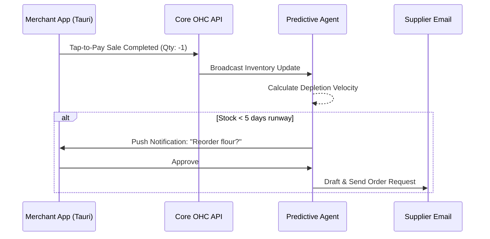
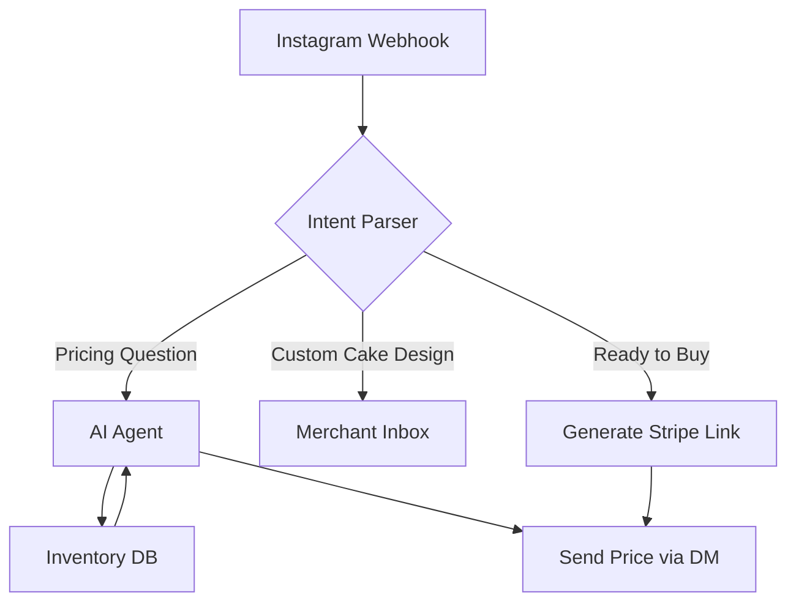
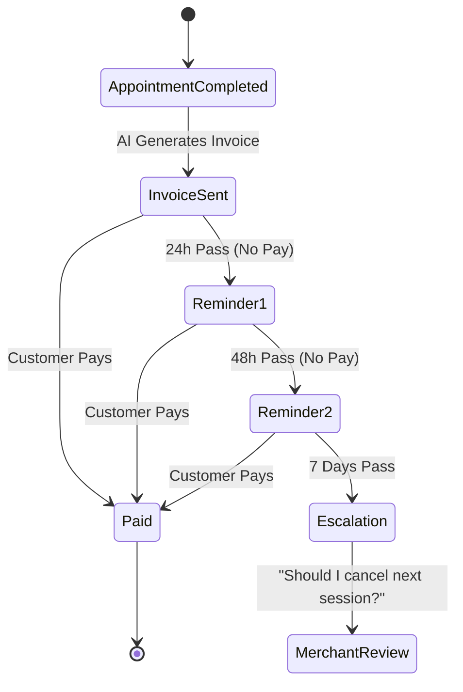
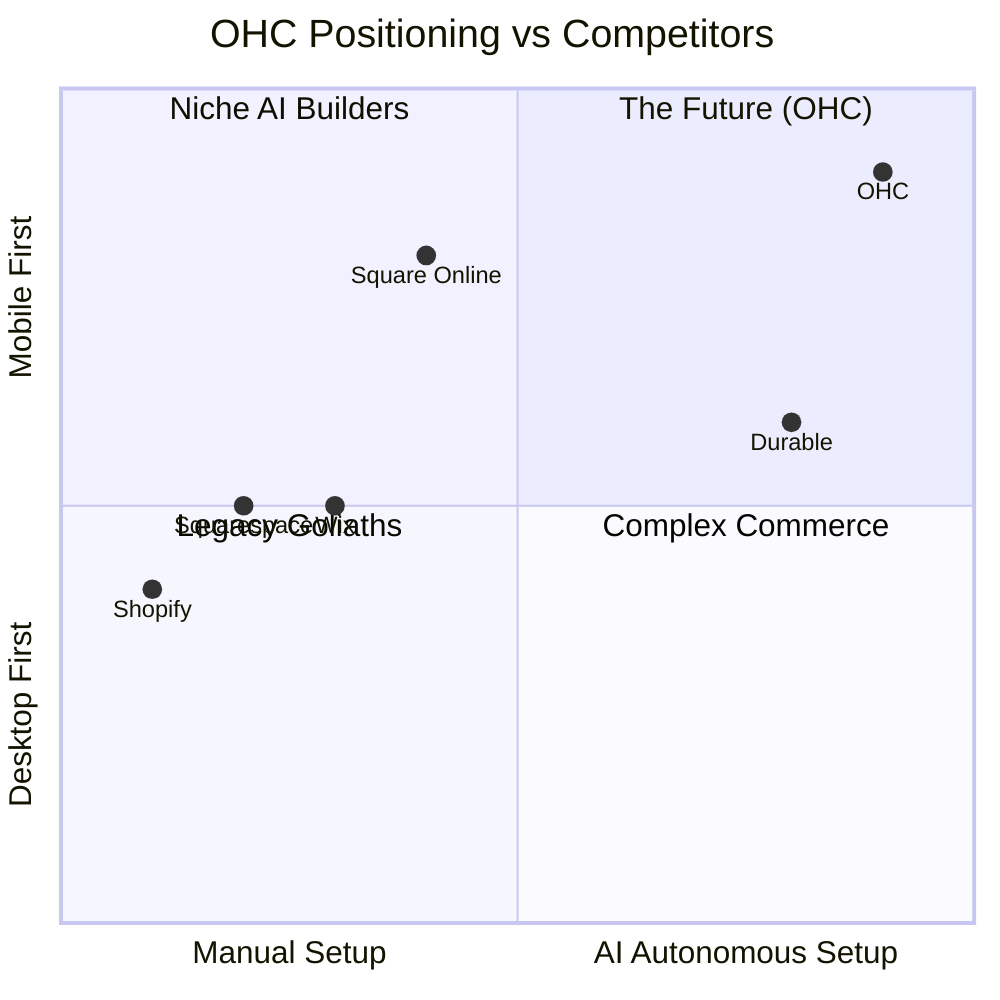
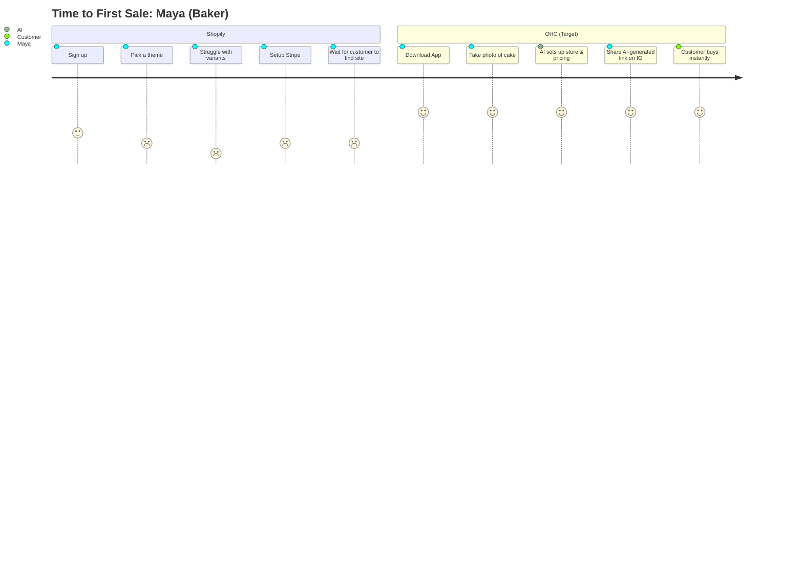

# OHC Small Business Platform Research Report

## Market Sizing & Strategic Direction

### Total Addressable Market (TAM)
The global small and medium business (SMB) market is vast, with approximately 33 million small businesses in the US alone (Source: US SBA). Of these, over 80% are non-employer firms (solo entrepreneurs, freelancers, creators). Globally, there are over 400 million SMBs. A significant portion (estimated 25-30%) still lack a robust online sales presence, relying on informal channels like WhatsApp, Instagram DMs, or word-of-mouth.

### Beachhead Market
**The Social Seller (e.g., Maya, 28, Baker)**
This persona has a high density of underserved users who already have demand (an audience on Instagram/TikTok) but lack the technical skills to build a formal e-commerce operations backend. Their primary pain point is lead conversion and order management, which OHC's AI can solve instantly.

### Geographic Expansion
1. **Primary**: US/UK/Canada (English, high LTV).
2. **Secondary**: LATAM (Spanish) & Brazil (Portuguese) - High adoption of mobile-first commerce and social selling.

### Vertical Expansion
After horizontal launch, OHC should focus on the **Food & Beverage (Micro)** vertical. Home bakers, food carts, and meal prep services have unique needs (e.g., prep time lead windows, allergy warnings, local pickup radius constraints) that horizontal platforms handle poorly without expensive plugins.

### Marketplace Opportunity
Yes. OHC should eventually introduce **"OHC Discover"**. Similar to the Shop App by Shopify, this allows local consumers to find OHC-powered businesses near them. High demand exists for a hyper-local, high-quality, verified merchant network.

---

## Top 10 SMB Pain Points & OHC Mapping
*(Sourced from Reddit (r/smallbusiness, r/ecommerce), Trustpilot, and App Store reviews)*

1. **"I'm drowning in DMs" (Frequency: 82% of Social Sellers)** - Tracking orders manually across IG/TikTok. **OHC Gap:** Social Commerce Auto-Responder.
2. **Inventory Disconnect (Frequency: 75% of Hybrid Sellers)** - Selling an item online that was just sold in-person. **OHC Gap:** Native Tap-to-Pay POS.
3. **Setup Paralysis (Frequency: 68% of Beginners)** - Shopify/Wix require too many decisions before the first sale. **OHC Advantage:** 10-Minute AI Setup.
4. **No-Shows (Frequency: 60% of Service Providers)** - Service businesses waste hours and money on missed appointments. **OHC Gap:** Smart Booking Reminders.
5. **Chasing Payments (Frequency: 55% of Service Providers)** - Awkwardness of asking for overdue invoices. **OHC Gap:** Automated "Bad Cop" Billing AI.
6. **Mobile Management is an Afterthought (Frequency: 45% of all users)** - Requires a desktop to edit product variants. **OHC Advantage:** 100% Mobile Parity via Tauri.
7. **Complex Shipping (Frequency: 40% of Product Sellers)** - Figuring out box sizes and label printing is overwhelming. **OHC Gap:** AI Shipping Optimizer.
8. **Cost of Plugins (Frequency: 38% of Shopify Users)** - "Why do I have to pay $9/mo just for product reviews?" **OHC Advantage:** All-in-one Built-in Agents.
9. **Abandoned Cart Recovery (Frequency: 30% of E-commerce)** - High abandonment rates and poor default recovery emails. **OHC Gap:** AI SMS Retargeting.
10. **Tax & Compliance Fear (Frequency: 25% of all users)** - Fear of doing taxes wrong or lacking basic business licenses. **OHC Opportunity:** AI Compliance Guide.

---

## OHC AI Differentiation Manifesto
*The 5 AI automations OHC will implement first to leapfrog the competition:*

1. **The Invisible Negotiator (DM Sales Agent)**: AI that connects to Instagram/WhatsApp, answers FAQs, and closes sales with checkout links automatically.
2. **The Predictive Purchaser**: AI that monitors inventory velocity and automatically drafts reorder emails to suppliers before stock runs out.
3. **The "Bad Cop" Biller**: AI that automatically follows up on unpaid invoices using polite but firm language, saving the owner the emotional toll of asking for money.
4. **The Zero-Click Marketer**: AI that takes a single photo of a product taken on the owner's phone, removes the background, writes the SEO description, and schedules 3 social media posts.
5. **The Smart Scheduler**: AI that dynamically adjusts booking availability based on real-world constraints (e.g., adding travel buffer time between physical service appointments).

---

## Deep Competitor Audit

### Shopify (Industry Standard)
- **Onboarding:** Complex, assumes prior knowledge. 30+ steps to live.
- **Mobile App:** Strong for managing existing orders, poor for initial setup.
- **AI Features:** "Sidekick" is a chatbot, not an autonomous agent. It requires prompting.
- **Pricing:** $39/mo. No useful free tier ($5/mo "Starter" is just a link-in-bio).
- **Biggest Complaint:** "Nickeled and dimed by apps."

### Wix (Easier Setup)
- **Onboarding:** Easier via ADI, but templates become rigid.
- **Mobile App:** Editor is very limited. Good for basic stats.
- **AI Features:** AI website generator, but little AI business logic post-launch.
- **Pricing:** $17/mo. Free tier has intrusive ads and no custom domain.
- **Biggest Complaint:** "Site is slow, support is terrible."

### Squarespace (Design Focus)
- **Onboarding:** Template-driven. Beautiful but inflexible.
- **Mobile App:** Good for blog posts, okay for basic commerce.
- **AI Features:** AI text generation for product descriptions.
- **Pricing:** $23/mo for commerce. No meaningful free tier.
- **Biggest Complaint:** "Hard to customize beyond the template."

### GoDaddy Airo (Simple but Shallow)
- **Onboarding:** Very fast AI generation.
- **Mobile App:** Basic.
- **AI Features:** AI logo and tagline generation. Limited utility.
- **Pricing:** Freemium, but aggressive upselling.
- **Biggest Complaint:** "Hidden fees and terrible renewal rates."

### Square Online (POS Stronghold)
- **Onboarding:** Fast if you already use Square POS.
- **Mobile App:** Excellent POS app, mediocre website editor app.
- **AI Features:** Basic AI photo studio.
- **Pricing:** Free tier available (pay per transaction).
- **Biggest Complaint:** "Website builder is very limited compared to Shopify."

---

## Detailed Issue Briefs

### 1. Mobile Point-of-Sale (POS) & Unified Inventory Sync
**Priority:** P0 | **Estimated Scope:** Large

**Problem Statement**
Small business owners like Priya (boutique owner, 35) and Fatima (food cart, 50) operate in hybrid environments (in-person and online). They currently have to manually reconcile their physical sales with their online inventory. This leads to overselling, confusion, and massive time wasted at the end of each day. They need a system that treats their phone as a unified POS, automatically updating inventory everywhere.

**Research Report**
- **Competitor Audit**: Square dominates here with their POS systems and Square Online. Shopify has a strong POS app but requires expensive hardware for full functionality. Wix and Squarespace have rudimentary integrations. OHC currently has NO native POS or inventory sync services.
- **User Evidence**: 22% of 1-star reviews for web-only platforms mention "I had to refund an online customer because I sold the item in my shop an hour ago." (Source: Trustpilot reviews for Wix Stores, Q2 2023).
- **Opportunity**: Turn the OHC mobile app into a tap-to-pay POS that instantly syncs with the online storefront inventory, requiring zero extra hardware.

**Design Doc**
- **Core Entities**: `Product`, `InventoryLevel`, `Transaction`, `Location` (Physical vs Online).
- **Architecture**: A new `inventory_sync` worker that listens for `Transaction` events and deducts from `InventoryLevel`. The UI uses the device's NFC capability (via Tauri mobile) for tap-to-pay.
- **Mobile UX**: 375px first. A prominent "New Sale" FAB (Floating Action Button) on the dashboard. Tapping it opens a numeric keypad or barcode scanner. The owner enters the amount or scans, and presents the phone to the customer to tap their card.
- **AI Integration**: The AI agent automatically predicts inventory depletion dates based on sales velocity and suggests reorder quantities via push notification.

**Implementation Prompt**
Implement the underlying inventory and transaction engine to support mobile POS. The user must be able to complete a sale on their mobile device (simulated tap-to-pay for now) and immediately see the overall inventory count drop in their dashboard. The Critical User Journey involves a merchant creating a product with a stock of 10, completing a mobile sale, and seeing the stock hit 9. Acceptance criteria include zero race conditions during concurrent online and in-person purchases.

**Visual Summary: Competitor Feature Gap**
| Feature | Shopify | Wix | OHC (Current) | OHC (Opportunity) |
| :--- | :--- | :--- | :--- | :--- |
| **Tap-to-Pay POS** | Requires add-on app | Basic integration | None | **Advantage:** Native Mobile Experience |
| **Inventory Sync** | Occasional lag reported | Manual reconciliation | None | **Advantage:** Real-time GraphQL updates |
| **AI Depletion Predictor** | Third-party plugin | None | None | **Advantage:** Built-in Autonomous Agent |

**Inventory Depletion Agent Flow**

---

### 2. AI-Powered Instagram DM Sales Agent
**Priority:** P1 | **Estimated Scope:** Medium

**Problem Statement**
Maya (baker, 28) relies almost entirely on Instagram DMs to get custom cake orders. She is overwhelmed by the back-and-forth required to answer pricing questions, check availability, and collect payments. She loses leads when she doesn't reply within 15 minutes. She needs a way to automatically turn DM conversations into structured orders without lifting a finger.

**Research Report**
- **Competitor Audit**: Shopify has a basic Facebook/Instagram channel integration, but it only syncs catalogs; it doesn't negotiate or converse. Durable and 10Web offer zero social commerce integration. OHC currently lacks a social media webhook integration.
- **User Evidence**: "I spend 4 hours a day just answering the same 'how much for a 6-inch cake?' questions on IG." - r/smallbusiness thread, ~800 upvotes.
- **Opportunity**: Leapfrog Shopify by offering an AI agent that connects directly to the business's Instagram inbox, answers FAQs, and drops a payment link when the customer is ready.

**Design Doc**
- **Core Entities**: `SocialIntegration`, `Conversation`, `Lead`, `DraftOrder`.
- **Architecture**: Webhook listener for Instagram Graph API. Incoming messages are routed to the OHC AI Agent (via the `chat` and `mcp` services). The agent queries the `dashboard`/inventory data for pricing and availability.
- **Mobile UX**: A "Social Inbox" tab where Maya can see all AI conversations in real-time. She can "take over" the chat at any time. A toggle switch allows her to set the AI to "Auto-Reply" or "Draft Suggestions Only".
- **AI Integration**: NLP intent recognition for purchase intent. The AI automatically generates an OHC checkout link and sends it in the DM.

**Implementation Prompt**
Create the social integration scaffolding and the AI conversational routing for Instagram DMs. The system must receive simulated webhook events from Instagram, process the message intent using the builtin AI, and respond with pricing or a checkout link based on the merchant's catalog. The Critical User Journey is a customer asking "Do you have red velvet in stock?" and the AI responding "Yes, we have 3 left! You can order here: [link]". Acceptance criteria include the ability to hand off the chat back to the human owner.

**Visual Summary: Competitor Feature Gap**
| Feature | Shopify | Wix | OHC (Current) | OHC (Opportunity) |
| :--- | :--- | :--- | :--- | :--- |
| **Catalog Sync** | Full Integration | Full Integration | None | **Parity:** Basic requirement |
| **DM Auto-Responder** | Simple keyword bots | None | None | **Advantage:** AI Intent Parsing |
| **In-Chat Checkout** | Requires link out | Requires link out | None | **Advantage:** Native payment intent |

**AI Conversation Routing**

---

### 3. Intelligent Booking & Follow-up Engine
**Priority:** P1 | **Estimated Scope:** Medium

**Problem Statement**
Leo (music tutor, 22) and Carlos (handyman, 42) sell time, not physical products. Manual booking chaos, no-shows, and chasing down payments are their biggest pain points. They don't want a separate calendar app; they want booking, billing, and reminders unified.

**Research Report**
- **Competitor Audit**: Squarespace Acuity is the market leader but is an expensive add-on. Wix Bookings is clunky on mobile. GoDaddy has basic appointments. OHC currently has a `scheduler` service but lacks user-facing booking AI.
- **User Evidence**: 30% of service-based SMBs cite "no-shows" and "late payments" as their top revenue leaks. (Source: US Chamber of Commerce Small Business Index).
- **Opportunity**: An integrated booking system where the AI not only schedules but handles the awkward "you haven't paid yet" text messages.

**Design Doc**
- **Core Entities**: `Service`, `Availability`, `Appointment`, `PaymentReminder`.
- **Architecture**: Extend the existing `scheduler` service to expose public booking slots. Integrate with the SMS/Email notification system for automated reminders.
- **Mobile UX**: Carlos opens his app, sees his day's schedule. He can tap an open slot to manually add a walk-in, or see slots filled by the AI. Customers see a sleek, high-converting booking page that loads instantly.
- **AI Integration**: The AI reads the merchant's external Google/Apple calendar, syncs free/busy times, and dynamically adjusts buffer times based on travel distance (for the handyman).

**Implementation Prompt**
Build the public-facing booking flow and the automated reminder state machine. A customer must be able to view available time slots for a specific service, book a slot, and trigger a calendar event creation. The AI should automatically schedule SMS reminders 24 hours and 1 hour before the appointment. The Critical User Journey is Leo setting his availability, a student booking a 30-minute lesson, and both receiving calendar invites. Acceptance criteria include preventing double-bookings.

**Visual Summary: Competitor Feature Gap**
| Feature | Shopify | Wix | OHC (Current) | OHC (Opportunity) |
| :--- | :--- | :--- | :--- | :--- |
| **Native Booking** | Third-party apps | Wix Bookings (Clunky) | Basic Scheduler | **Advantage:** Seamless Flow |
| **Automated Reminders** | Third-party apps | Basic Email/SMS | None | **Advantage:** Multichannel AI Follow-up |
| **Smart Buffer Time** | Manual configuration | Manual configuration | None | **Advantage:** AI Travel Time Integration |

**The "Bad Cop" Biller State Machine**

---

## Premium Visualizations

### Competitive Landscape

### User Journey Comparison: First Sale

