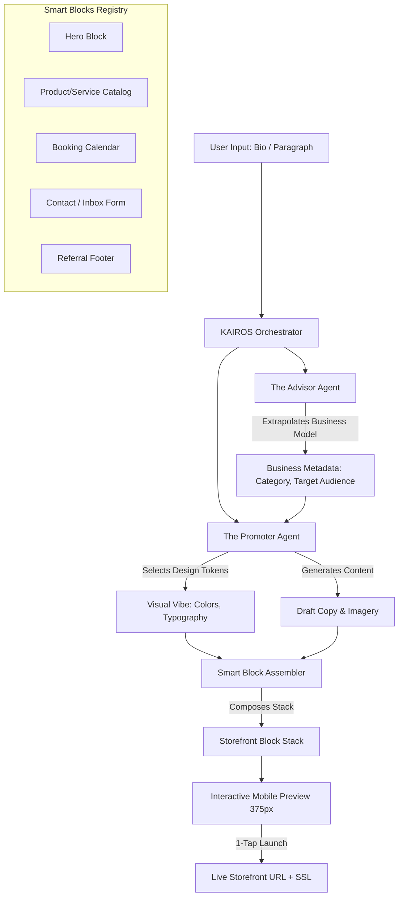

# Architecture Brief: AI-Driven Instant Storefront Builder (The "Smart Builder")

## Title
OHC "Smart Builder": Generative AI-Driven Storefront Generation

## Problem Statement
Small business owners (Maya, Carlos, Fatima) are often overwhelmed by traditional website builders (like Shopify, Wix, Squarespace) which require making dozens of granular decisions about templates, colors, CNAME records, and SSL certificates before even seeing a draft of their site. These existing platforms often fail the "Grandmother Test" for mobile-only users. OHC needs a storefront generation flow that goes from zero to a live, payment-ready site in under 10 minutes, with the first draft generated in under 30 seconds using only a brief natural language description or bio.

## Research Report
- **Competitive Landscape**:
  - **Shopify**: Comprehensive but has a steep learning curve. The theme editor is complex, especially on mobile devices.
  - **Wix/Squarespace**: Template-heavy approach. Users often spend hours tweaking layouts and color schemes.
  - **Durable.co / Wix ADI**: These platforms have pioneered the "AI-generated website in 30 seconds" concept, setting a new baseline expectation for speed of onboarding.
- **Vibe Coding & Generative Layouts**: The trend is shifting from "selecting templates" to "describing a vibe." AI can extrapolate a business description (e.g., "A cozy, local bakery selling vegan cakes") into a complete set of design tokens (colors, typography), layout structures, and sample content.
- **Mobile-First Urgency**: For OHC personas, the entire generation and editing process must be flawless on a 375px mobile screen. Complex drag-and-drop mechanics fail on touchscreens; therefore, a "Smart Block" (section-based) approach is necessary.

## Design Doc

### High-Level Architecture Diagram

### Mobile UX Flow (375px First)
1. **Onboarding Prompt**: A single text area or microphone input: "Describe your business in a sentence."
2. **Generative Shimmer**: While "The Promoter" agent works, the screen shows a skeleton layout with a glassmorphism shimmer effect.
3. **Instant Preview**: The fully assembled draft appears. Users can scroll through the vertically stacked "Smart Blocks."
4. **1-Tap Customization**: Instead of granular editing, users can tap a "Remix Vibe" button to swap the entire color/font palette instantly.
5. **Publishing**: Tapping "Launch Shop" transitions the state from `DRAFT` to `LIVE`, automatically provisioning an OHC subdomain (e.g., `maya.ohc.app`) in the background.

### Architectural Decisions
1. **The "Smart Block" Ecosystem**: The builder UI is constrained to a vertical stack of pre-designed, self-contained, mobile-optimized blocks. Users cannot arbitrarily drag elements, preventing them from breaking the responsive design.
2. **Agent-Driven Assembly**: "The Promoter" agent returns a structured JSON payload defining the sequence of blocks and their content, which the frontend renders.
3. **Optimistic Publishing**: The "Launch" action returns immediately in the UI, while background workers handle the DNS and SSL provisioning.

## Implementation Prompt
**To Implementer Agent:**
Implement the Generative AI Storefront Builder backend flow and frontend UI components.
1. Create a registry of `SmartBlock` components (Hero, Catalog, Contact) in the UI framework that are strictly responsive to a 375px viewport.
2. Build the orchestration flow where "The Promoter" agent receives a raw text bio, extrapolates the business type, and outputs a structured JSON layout definition conforming to the `SmartBlock` schemas.
3. Implement the "Remix" feature to allow instant swapping of global design tokens (colors, fonts).
4. Build the 1-Tap Publishing endpoint that transitions the draft to a live state and queues the background provisioning of a subdomain.
5. Ensure the entire generation UI handles loading states with a premium skeleton shimmer effect.
Do not write SQL DDL; utilize the existing multi-tenant ORM layers. Include E2E test coverage verifying the flow from bio input to a rendered live preview.

## Priority
P0

## Estimated Scope
Large
