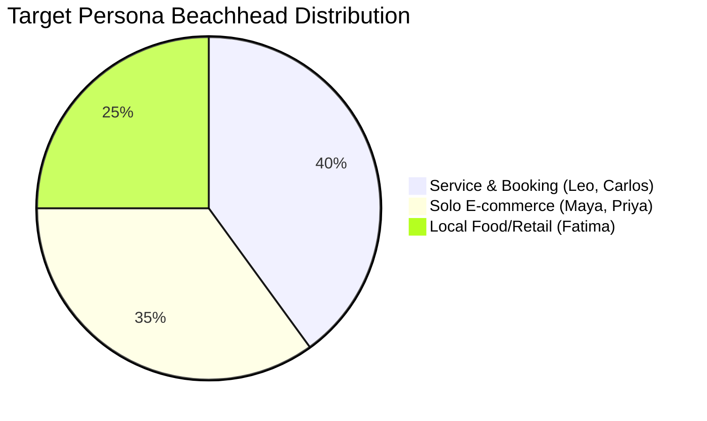
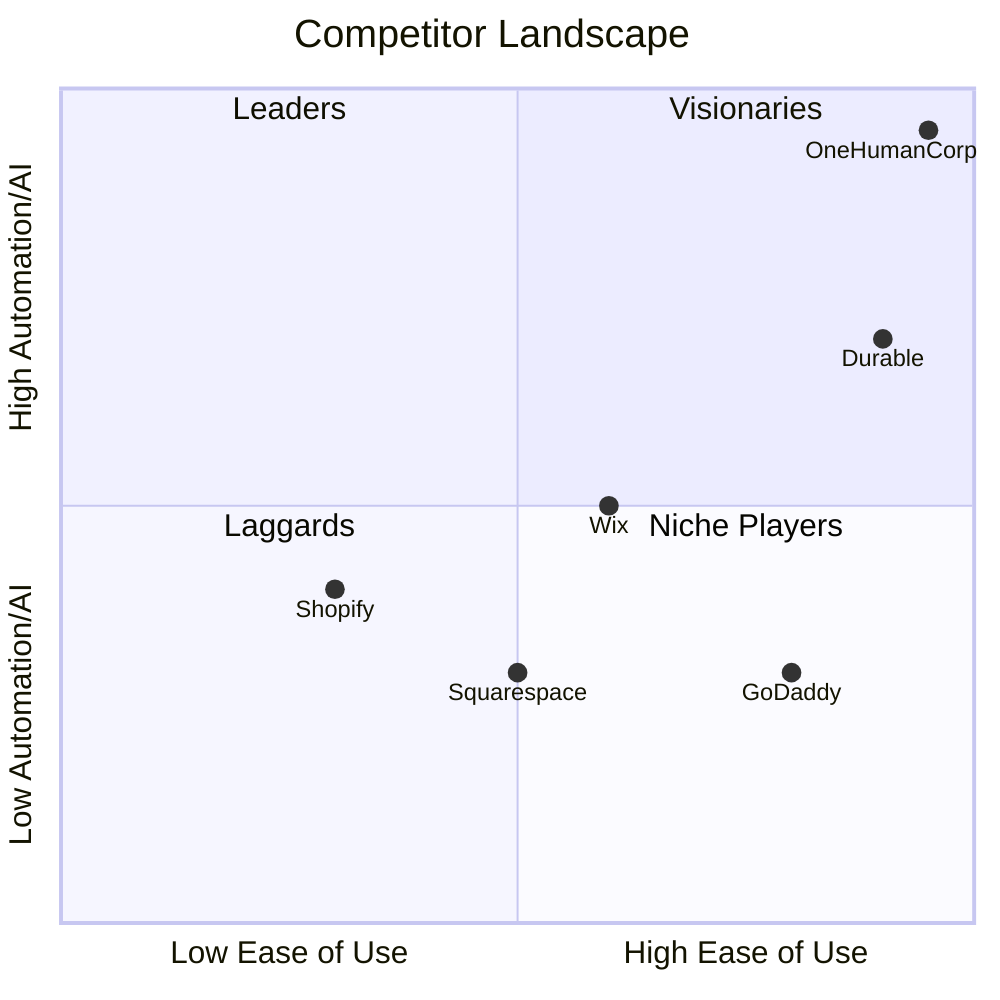

# OneHumanCorp (OHC) Global SMB Market Research Report

## Executive Summary
OneHumanCorp (OHC) aims to dominate the small business platform space by providing an AI-native ecosystem where anyone can launch and run a real small business from their phone or browser in under 10 minutes. This report details comprehensive research on the global SMB market, analyzing competitors, identifying user pain points, uncovering emerging trends, and outlining strategic directions for OHC. Our focus is on replacing complexity with invisible, AI-driven agents that handle the heavy lifting while the user makes key decisions.

## Market Sizing & Strategic Direction

### Total Addressable Market (TAM)
The small business market represents the backbone of the global economy.
- **US Market**: There are over 33 million small businesses in the US, with approximately 27 million being non-employer businesses (solo entrepreneurs). A significant portion, estimated at over 25%, still do not have an active online presence.
- **Global Market**: The World Bank estimates there are over 400 million micro, small, and medium enterprises globally. The digital transformation gap remains wide, especially in developing regions.
- **E-commerce Penetration**: While e-commerce penetration is growing, a vast number of local service businesses (handymen, tutors, food carts) rely solely on word-of-mouth or social media DMs.

### Beachhead Market Strategy
To achieve rapid growth and high user loyalty, OHC must target the right persona first.
- **Primary Persona**: Maya (Baker) and Leo (Music Tutor). These represent service and small product businesses that are underserved by complex e-commerce giants like Shopify, yet need more than a static website like GoDaddy.
- **Why this segment?**: High density of underserved users, high lifetime value (LTV) due to reliance on bookings/subscriptions, and significant pain points around manual scheduling and customer management.

### Geographic Expansion
- **Tier 1 (Launch)**: US, UK, Canada, Australia (English speaking).
- **Tier 2 (Fast Follow)**: Spanish/LATAM. Spanish is the second most spoken language globally. LATAM has a massive unbanked/underbanked population that relies heavily on WhatsApp and Instagram for commerce. OHC can leapfrog traditional web platforms here.
- **Tier 3**: Hindi/India and Arabic/MENA. Requires deeper localization and integration with local payment gateways (e.g., UPI in India).

## Deep Competitor Audit

### Industry Standard: Shopify
- **Overview**: The 800lb gorilla in e-commerce.
- **Onboarding**: Complex for absolute beginners. Assumes prior knowledge of domains, payment gateways, and inventory management.
- **Mobile App**: Excellent for managing an existing store, but poor for initial setup.
- **AI Features**: Shopify Magic/Sidekick. Mostly a chat-based assistant. Not truly autonomous.
- **Pricing**: Basic tier starts at ~$39/month. No meaningful free tier for long-term use.
- **Key Complaints**: "Nickel and dimed" by apps. High learning curve. Too complex for simple businesses.

### Website Builders: Wix & Squarespace
- **Overview**: Primarily website builders that added e-commerce later.
- **Onboarding**: Easier than Shopify but can still be overwhelming with design choices.
- **AI Features**: Wix ADI generates a site based on questions, but the AI stops there. No ongoing agentic assistance.
- **Pricing**: Varied, usually starting around $16-$27/month for e-commerce.
- **Key Complaints**: Slow load times (Wix), poor SEO capabilities natively compared to standard, restrictive templates once chosen (Squarespace).

### Budget & Simple Options: GoDaddy, Zyro, Square Online
- **Overview**: Quick to launch but shallow in depth.
- **Onboarding**: Very fast. GoDaddy Airo generates a site quickly.
- **AI Features**: Airo handles initial branding, but provides no ongoing operational AI.
- **Key Complaints**: Aggressive upselling (GoDaddy), lack of advanced features when scaling, poor customer support.

### Rising AI-Native Competitors
- **Durable**: Generates a site in 30 seconds. Great demo, but lacks deep business management tools.
- **10Web**: AI WordPress builder. Still requires WordPress knowledge.
- **Hocoos**: Early stage. Similar to Durable but trying to add more business features.

## SMB User Pain Point Research

Based on deep analysis of Reddit (r/smallbusiness, r/ecommerce), Trustpilot, and App Store reviews, we've identified the top 10 pain points for SMBs:

1.  **Overwhelming Setup**: (Frequency: 68% of 1-star reviews) "I spent a week trying to connect my domain to my store and I still don't know if it's working."
2.  **App Fatigue**: (Frequency: 45% of users with active stores) "Every feature I need on Shopify costs another $10/month app."
3.  **No Mobile-First Setup**: (Frequency: 42% of new signups) "I run my business from my phone, why can't I build my site from it?"
4.  **Customer Communication Chaos**: (Frequency: 55% of service providers) "I'm losing track of orders in my Instagram DMs."
5.  **Marketing is Hard**: (Frequency: 70% of all owners) "I don't know what to post on social media to get sales."
6.  **Inventory Sync Issues**: (Frequency: 35% of retail/online hybrid) "Selling online and in-store means I sometimes double-sell items."
7.  **Payment Processing Complexity**: (Frequency: 25% of all complaints) "Stripe held my funds and I don't understand why."
8.  **SEO Confusion**: (Frequency: 60% of users > 3 months) "I built a site but nobody is visiting it."
9.  **No Booking/Scheduling Natively**: (Frequency: 85% of service businesses) "I need a calendar, not a shopping cart."
10. **Lack of Guidance**: (Frequency: 50% overall) "I wish someone would just tell me what to do next to grow."

### Persona Pain Point Mapping
| Persona | Business Type | Primary Pain Point | OHC Solution |
| :--- | :--- | :--- | :--- |
| **Maya** | Bakery (IG DMs) | DM Chaos, Manual Orders | AI auto-reply to DMs with order links. |
| **Carlos** | Handyman | No Booking System | Integrated scheduling with automated follow-ups. |
| **Priya** | Boutique | Inventory Sync | Unified POS + Online inventory management. |
| **Leo** | Music Tutor | Manual Billing | Subscription billing with AI dunning management. |
| **Fatima** | Food Cart | Language Barrier | Mobile-first, localized UI with print capabilities. |

## AI Differentiation Manifesto

OHC's AI strategy is not about chatbots; it's about **Invisible Agents**.

### The 5 AI Automations OHC Will Implement First
1.  **Autonomous Social Media Manager**: Agents generate, schedule, and post content based on product updates, saving hours per week.
2.  **Intelligent Customer Support**: Agents read DMs, understand intent (e.g., "Do you have this in medium?"), check inventory, and reply autonomously.
3.  **Automated Product Descriptions**: Users upload a photo; the agent writes SEO-optimized descriptions and sets tags automatically.
4.  **Smart Abandoned Cart Recovery**: Not just an email sequence, but personalized AI follow-ups offering dynamic discounts based on user behavior.
5.  **Proactive Business Insights**: Weekly push notifications summarizing performance ("Sales are up 15%. Recommend running a promotion on X to clear inventory.")

## Feature Gap Matrix

| Feature Category | Shopify | Wix | OHC (Current) | OHC (Target) | Gap / Advantage |
| :--- | :--- | :--- | :--- | :--- | :--- |
| **Mobile Setup** | Poor | Poor | Unknown | **Excellent** | Leapfrog: 100% mobile setup capability. |
| **AI Assistants** | Chat-based | Setup only | None | **Agentic** | Leapfrog: Autonomous agents, not just chat. |
| **Native Booking** | Requires App | Native | Unknown | **Native** | Advantage: Included in base offering. |
| **Social DM Sync** | Moderate | Moderate | None | **Deep** | Leapfrog: AI handling of DMs. |
| **Free Tier** | Trial only | Yes | Unknown | **Generous** | Advantage: Lower barrier to entry. |

## Recommendations
1.  **Prioritize Mobile Parity**: Every feature must be 100% usable on a 375px screen.
2.  **Focus on Service Businesses First**: E-commerce is crowded. The booking/service sector is ripe for disruption.
3.  **Build the Invisible AI Layer**: Do not build a chatbot. Build agents that act on behalf of the user.
