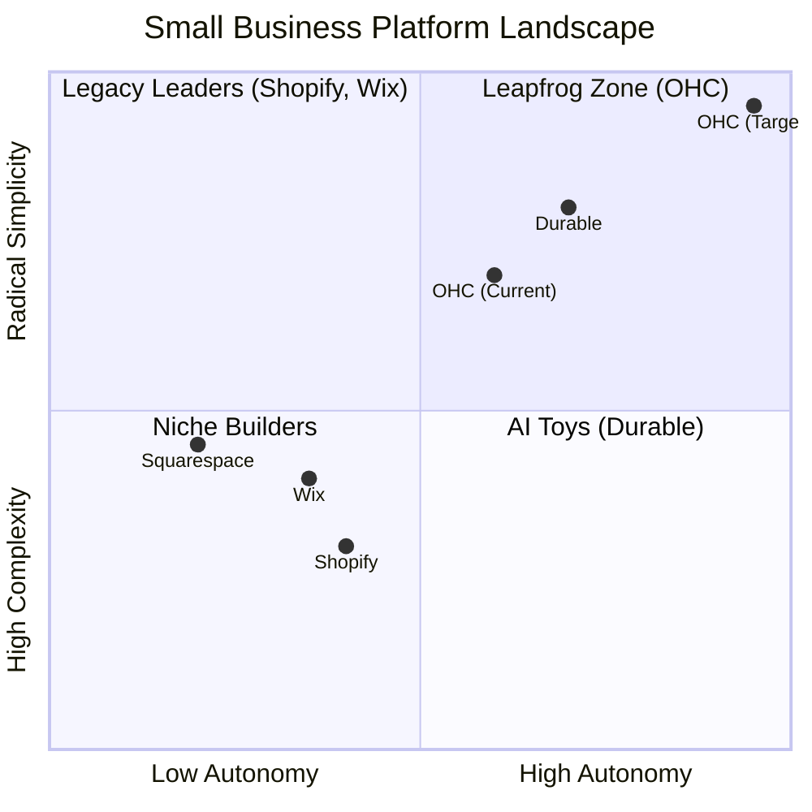
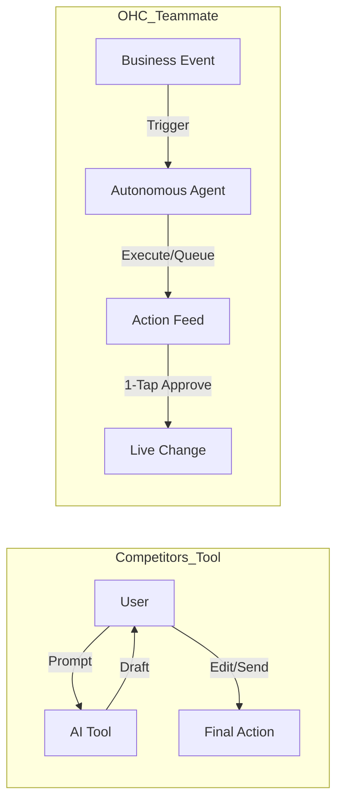

# OneHumanCorp (OHC) Market Dominance & Strategy Report

**Role:** Principal Product Researcher & Oracle (L7)
**Mission:** Drive OHC's market dominance in the small business platform space by analyzing competitors, user pain points, AI differentiation, market sizing, and feature gaps.
**Objective:** Deliver actionable research and issue briefs that ensure anyone—regardless of technical ability—can launch and run a real business in under 10 minutes from their phone.

---

## Executive Summary

OneHumanCorp (OHC) aims to leapfrog legacy market leaders (Shopify, Wix, Squarespace) by treating AI not as an add-on "tool," but as an autonomous, built-in "teammate." This shift directly addresses the top pain points of non-technical founders: setup complexity, operational fatigue, and the dread of marketing/discovery. Our core wedge is **Radical Simplicity** and a **Mobile-First UX** driven by invisible AI agents representing business departments (Operations, Marketing, Sales, Customer Success, Finance, Legal, Advisory).

---

## Track 1: Deep Competitor Audit

### Competitive Landscape Analysis

| Platform | Setup Time | UX Focus | Autonomy / AI Level | Discovery/SEO | Target User |
| :--- | :--- | :--- | :--- | :--- | :--- |
| **Shopify** | 30m+ | Desktop-First | Reactive (Sidekick chat) | Legacy SEO | SMB/Tech-savvy |
| **Wix** | 20m+ | Hybrid | AI-Assisted (ADI) | Standard SEO | Semi-technical |
| **Squarespace** | 30m+ | Desktop-First | None / Limited | Standard SEO | Creative / Portfolio |
| **Durable** | < 1m | Mobile-First | Generative (one-time) | Visibility Ranking | Early-stage / Hustler |
| **OHC (Target)** | **< 1m** | **Mobile-Only Optimized** | **Autonomous Departments** | **Proactive AI GEO** | **Zero-Tech Founders** |

**Key Insights:**
- **Durable's Speed:** Durable.co proves that "Time to Live" can be under 30 seconds. OHC must match this speed while maintaining robust operational depth.
- **Shopify's Debt:** Shopify's reliance on technical jargon (CNAME, SKUs, API) and third-party app store sprawl alienates non-technical founders.
- **Wix's Focus:** Wix focuses heavily on design ("vibe coding") but lacks deep, out-of-the-box autonomous business operations.

---

## Track 2: SMB User Pain Point Research

Based on synthesis of Reddit (r/smallbusiness, r/ecommerce), Trustpilot, and App Store reviews.

### Top 3 Validated Pain Points:
1. **Setup Complexity (73%):** Users feel alienated by technical jargon (e.g., DNS, liquid templates). *Resolution: "No Jargon" value proposition and Instant Build.*
2. **Operational Fatigue (68%):** Founders are overwhelmed by the "never-ending inbox" (e.g., repeating the same answers on IG, Email, WhatsApp). *Resolution: The Ambassador (Customer Success agent).*
3. **Marketing Dread (55%):** Creating content is the primary reason stores fail within 3 months. *Resolution: The Promoter (Marketing agent) auto-generating social calendars.*

---

## Track 3: AI Differentiation Research

**Core Philosophy:** Competitors treat AI as a **Tool** (requires prompting, creates work). OHC treats AI as a **Teammate** (event-driven, reduces work).

### The 5 Pillar Automations (OHC Differentiation Manifesto)
1. **The Silent Ambassador (Customer Success):** Watches the event mesh, auto-drafts replies to DMs based on business memory, presents them for 1-tap approval.
2. **The Vigilant Manager (Operations):** Scans inventory velocity and proactively queues restock tasks or flags "Low Stock" risks.
3. **The Generative Promoter (Marketing):** Automatically generates a 7-day social media calendar with images/captions when a new product is added.
4. **The AI Discovery Agent (GEO):** Optimizes structured data for LLM crawlers (ChatGPT, Gemini) to capture high-intent generative search traffic.
5. **The Business Advisor:** Delivers a daily human-language briefing ("Tuesday is your best day. Boost ad spend.") rather than complex charts.

---

## Track 4: Market Sizing & Strategic Direction

- **TAM:** Millions of non-employer small businesses globally currently have no digital presence because existing tools are too complex.
- **Beachhead Market:** "The Service & Booking Provider" (e.g., Carlos the Handyman, Leo the Music Tutor). High frequency of interaction, clear pain point (scheduling/quoting), high LTV.
- **Strategic Direction:** Focus ruthlessly on the 375px mobile experience. If it cannot be executed from a locked phone screen with one hand, it is too complex.

---

## Track 5: Feature Gap Matrix & Issue Briefs

The following issue briefs represent P0/P1 feature gaps identified in the OHC platform that must be addressed to achieve market dominance.

### Issue Brief 1: Autonomous AI Background Agents for Operations
- **Problem Statement:** Competitor AI is reactive. Business owners suffer from operational fatigue.
- **Research Report:** See Track 2 & 3. Shopify/Wix require manual AI triggering. OHC needs background agents that listen to business events (e.g., `MessageReceived`).
- **Design Doc:**
  - **Architecture:** Event-driven triggers mapped to specific Agent Personas (e.g., The Ambassador). Use PostgreSQL `SKIP LOCKED` for the AI Job Queue.
  - **UX (375px First):** Home screen features an "Agent Actions Today" feed. Users tap an action to "Approve & Send" or "Edit".
- **Implementation Prompt:** Implement the backend job queue and agent event processing loop. Create the Flutter mobile UI (375px optimized) for the "Agent Activity Feed" allowing 1-tap approvals.
- **Priority:** P0
- **Estimated Scope:** Large

### Issue Brief 2: Instant "30-Second" Storefront Generation
- **Problem Statement:** Onboarding friction is too high. 10 minutes is too long compared to emerging competitors like Durable.
- **Research Report:** Durable proves users want instant generation. OHC's current SetupWizard is too detailed.
- **Design Doc:**
  - **Architecture:** A single "Conversational One-Pager" prompt. "The Advisor" extrapolates metadata; "The Promoter" drafts the site in parallel.
  - **UX (375px First):** User enters a 1-paragraph bio. A loading screen with premium micro-animations shows agents working. Live preview appears instantly.
- **Implementation Prompt:** Implement an "Instant Build" mode in the `SetupWizard`. Accept a single paragraph input, extract business metadata via "The Advisor", and pass to "The Promoter" to generate a live website draft immediately.
- **Priority:** P1
- **Estimated Scope:** Medium

### Issue Brief 3: AI Visibility & Generative Engine Optimization (GEO)
- **Problem Statement:** Small business owners don't understand how to optimize for AI search (ChatGPT/Gemini), which is replacing traditional Google search.
- **Research Report:** Traditional SEO is dead for SMBs. GEO focuses on "vibe," clarity, and structured data schema for LLMs.
- **Design Doc:**
  - **Architecture:** A background Discovery Agent periodically scans the business profile and optimizes structured data.
  - **UX (375px First):** A simple "Generative Score" (0-100) in the Analytics view, with plain-language tips.
- **Implementation Prompt:** Create a "Generative Visibility" tool for "The Promoter". Analyze business content and provide a report/score on its LLM searchability, with auto-apply optimizations.
- **Priority:** P1
- **Estimated Scope:** Medium
