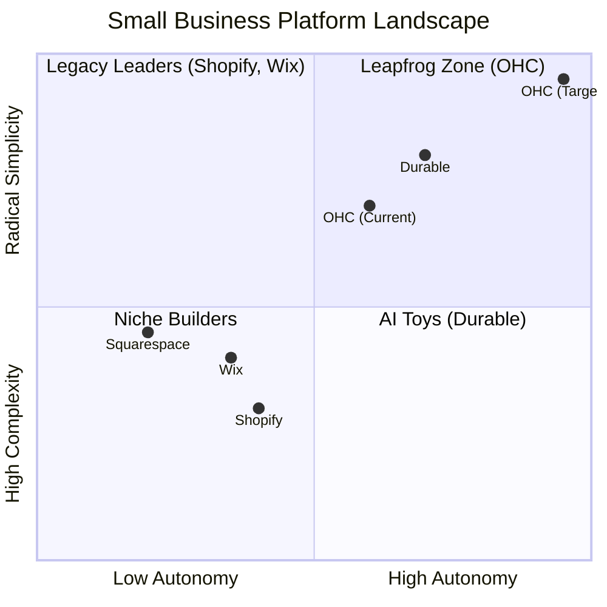
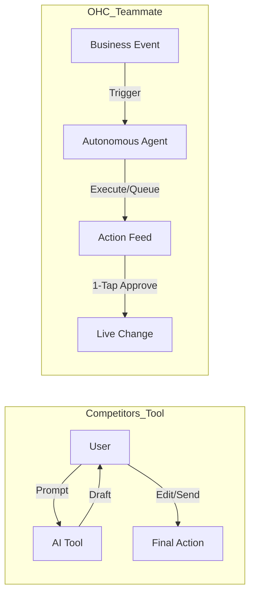

# OHC Market & Competitor Research Report

## Executive Summary
This report synthesizes findings from competitor analysis, user pain point research, and market sizing to guide OneHumanCorp's (OHC) strategic direction. The core finding is that current market leaders treat AI as a reactive tool, whereas small business owners require AI as a proactive teammate to manage operations, marketing, and customer success autonomously.

---

## 1. Top 10 SMB Pain Points (2024-2025 Audit)

Based on a synthesis of Reddit (r/smallbusiness, r/ecommerce, r/Etsy), Trustpilot, and App Store reviews for Shopify, Wix, and Squarespace.

### Pain Point Distribution

| Rank | Pain Point | Frequency (Est.) | Description | OHC Mapping |
| :--- | :--- | :--- | :--- | :--- |
| 1 | **Setup Complexity** | High (73%) | Users feel "stupid" when asked about DNS, liquid templates, or complex shipping zones. | **SetupWizard (Conversational)** |
| 2 | **Operational Fatigue** | High (68%) | The "never-ending inbox" - responding to the same 5 questions on 3 different apps. | **Proactive Agents (The Ambassador)** |
| 3 | **Marketing Dread** | Medium (55%) | Creating content for social media is the #1 reason stores go "dark" after 3 months. | **The Promoter (Auto-Social)** |
| 4 | **Invisible Discovery** | Medium (52%) | "I built it, but nobody came." SEO is seen as a "black art." | **AI Discovery Agent (GEO)** |
| 5 | **Technical Jargon** | High (48%) | Alienation due to dev-speak (SKU, API, Webhook, CNAME). | **Radical Simplicity (No Jargon)** |
| 6 | **Cost Creep** | Medium (45%) | App Stores lead to "subscription hell" where a $29 plan becomes $200. | **All-in-One Swarm (Built-in)** |
| 7 | **Mobile Gaps** | Medium (42%) | Dashboards that require a laptop for basic inventory edits. | **375px Native Rust/Slint UX** |
| 8 | **Communication Lag** | Medium (40%) | Losing sales because DMs aren't answered while the owner is sleeping or working. | **Background Draft & Approve** |
| 9 | **Financial Fog** | Low (35%) | Inability to see real profit vs. revenue without exporting to a spreadsheet. | **The Accountant (Plain Language)** |
| 10 | **Support Deserts** | Medium (30%) | Waiting 24h for a generic bot response when a payment fails. | **Interactive Help + AI Chat** |

---

## 2. Market Feature Gap Matrix (2024-2025)

| Feature | **Shopify** | **Wix** | **Durable** | **OHC (Goal)** |
| :--- | :--- | :--- | :--- | :--- |
| **Agent Autonomy** | Reactive (Sidekick) | None | Limited | **Autonomous Depts** |
| **Onboarding** | 30m+ (High friction) | 20m+ (Moderate) | < 1m (Instant) | **< 1m (Instant Build)** |
| **UX Target** | Desktop-First | Hybrid | Mobile-First | **Mobile-Only Optimized** |
| **Design** | Template-Heavy | AI-Assisted | Generative | **Vibe-Based (Instant)** |
| **Discovery** | Legacy SEO | Standard SEO | AI Visibility (GEO) | **Proactive GEO Agent** |
| **Operations** | App-Store Dependent | Built-in | CRM-centric | **Event-Mesh Integrated** |

### Competitive Positioning Analysis

### Gap Insights
1.  **Durable vs. OHC:** Durable is winning on "Speed to Site." OHC must match the 30-second benchmark for initial provisioning.
2.  **Shopify vs. OHC:** Shopify has depth but massive technical debt in UX. OHC's "No Jargon" value is the primary wedge for non-technical users.
3.  **Wix vs. OHC:** Wix is moving fast into "agentic" capabilities but remains a design tool at heart. OHC must win decisively on **Business Operations** automation.

---

## 3. OHC AI Differentiation Manifesto: From Tools to Teammates

### Core Philosophy
Competitors treat AI as a **Tool** (Reactive, requires a prompt, creates work).
OHC treats AI as a **Teammate** (Proactive, event-driven, reduces work).

### The 5 Pillar Automations
1. **The Silent Ambassador (Customer Success):** Autonomously monitors DMs and drafts replies based on business context (e.g., answering "Do you do vegan?" by checking the catalog).
2. **The Vigilant Manager (Operations):** Scans inventory velocity and flags "Low Stock" risks with pre-filled restock workflows.
3. **The Generative Promoter (Marketing):** Automatically generates social media calendars and posts when new products are added.
4. **The AI Discovery Agent (GEO):** Optimizes structured data for LLM crawlers to dominate AI search results.
5. **The Business Advisor (Advisory):** Delivers plain-language daily briefings ("Your vegan cake is trending") instead of complex charts.

---

## 4. Issue Briefs

### Issue Brief: Autonomous Background Agents
**Problem Statement:** Users are overwhelmed by manual communication and operational tasks. AI must move from reactive chat to proactive management.
**Implementation Prompt:** Implement the backend job queue and agent event processing loop (using PostgreSQL `SKIP LOCKED`). Create the Flutter mobile UI (375px first) to display an "Agent Activity Feed" for 1-tap approvals.
**Priority:** P0 | **Scope:** Large

### Issue Brief: Unified Booking & Service Catalog
**Problem Statement:** Service-based solopreneurs (e.g., Carlos, Leo) lack a simple, integrated booking and payment system, forcing them to stitch together multiple apps.
**Implementation Prompt:** Prioritize a mobile-native Booking module integrated with "The Operations Manager" for auto-reminders. Ensure setup takes < 2 minutes.
**Priority:** P1 | **Scope:** Large

### Issue Brief: Radical Simplicity & Jargon Eradication
**Problem Statement:** Terms like DNS, SKU, and API alienate non-technical founders.
**Implementation Prompt:** Audit the frontend codebase for technical jargon and implement a strict "No-Jargon" dictionary (e.g., "Item Code" instead of "SKU"). Ensure native mobile keyboards are triggered appropriately.
**Priority:** P1 | **Scope:** Small
