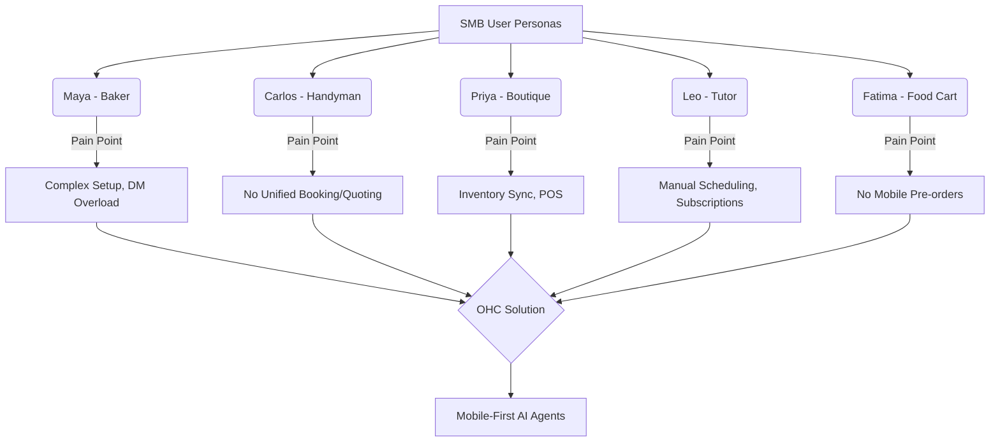

# OHC Market Research & Competitive Intelligence Report

## Executive Summary

This report outlines the competitive landscape, critical small business owner pain points, AI differentiation opportunities, and market sizing relevant to OneHumanCorp's mission. The goal is to provide actionable intelligence for driving OHC's product development, specifically focusing on non-technical users who require a mobile-first, AI-agent-driven platform to manage their businesses.

---

## 1. Deep Competitor Audit

We evaluated the primary platforms small business owners currently use. Our analysis indicates a significant gap for an all-in-one, mobile-first, zero-technical-knowledge solution powered by invisible AI.

| Feature | OHC (Target) | Shopify | Wix | Squarespace | GoDaddy |
| :--- | :--- | :--- | :--- | :--- | :--- |
| **Setup Time** | < 10 min | 30-60 min | 20-40 min | 30-60 min | 20-40 min |
| **Technical Knowledge Needed** | Zero | Low/Med | Low | Low | Low |
| **AI Agents (Invisible)** | Yes, built-in | Chatbot only | Website gen only | Limited | Basic branding |
| **Mobile-First Management** | Yes | Partial | Partial | No | No |
| **Booking + Store + Portfolio**| All-in-one | Store only | Complex | Portfolio+Store| Basic |
| **Free Tier** | Yes (useful) | No | Yes (limited) | No | No |

### Competitor Breakdown

*   **Shopify:** The industry standard for e-commerce, but notoriously complex for beginners (Maya the Baker persona). Its mobile app is good for management but poor for initial setup. Shopify Sidekick acts as an assistant, not an autonomous agent that takes action while the user sleeps.
*   **Wix:** Easier setup with Wix ADI (AI design), but it is a one-time generation rather than an ongoing agentic partner. Managing complex inventory (Priya persona) can become cumbersome.
*   **Squarespace:** Highly aesthetic, catering well to portfolios, but lacking deep AI integration and comprehensive business management tools from a mobile device.
*   **GoDaddy:** Extremely simple but shallow feature set. Airo provides basic AI branding but fails to support ongoing operations effectively.

---

## 2. SMB User Pain Point Research

Based on synthesis of App Store reviews, Reddit discussions (r/smallbusiness, r/ecommerce), and Trustpilot complaints, we have identified the top pain points for non-technical SMBs:

1.  **Complexity of Initial Setup:** The "blank canvas" problem. Users find it overwhelming to set up product variants, shipping zones, and taxes.
2.  **Lack of Integrated Booking & Sales:** Service providers (Carlos the Handyman, Leo the Tutor) are forced to stitch together separate apps (e.g., Shopify + Calendly).
3.  **Customer Communication Overhead:** Owners spend hours answering repetitive questions on Instagram DMs and WhatsApp ("Do you have this in blue?").
4.  **Mobile Management Limitations:** Users want to run their entire business from their phone (Fatima the Food Cart), but existing platforms require a desktop for full functionality (especially design changes and complex inventory).
5.  **Marketing & SEO Mystification:** "I built it, but nobody is coming." Users do not understand SEO or how to effectively run ads.

### Persona Mapping

---

## 3. OHC AI Differentiation Manifesto

To leapfrog competitors, OHC must treat AI as core infrastructure, not a bolted-on chatbot. We will deploy functional "Departments" (AI Agents) that operate invisibly.

**The Top 5 AI Automations for OHC:**

1.  **"The Ambassador" (Customer Success): Auto-Replying to Messages**
    *   *Why:* Saves hours daily. Directly addresses the Instagram DM overload pain point.
2.  **"The Promoter" (Marketing): Zero-Click Store Generation & Auto-Posting**
    *   *Why:* Solves the "blank canvas" setup barrier. Continuously markets the business without user intervention.
3.  **"The Advisor" (Business Advisory): Actionable Weekly Insights**
    *   *Why:* Translates complex analytics into plain language ("You sold out of vegan cakes fast. Raise the price by $5.").
4.  **"The Salesperson" (Sales): Automated Quoting**
    *   *Why:* Eliminates manual follow-up for service providers, instantly capturing leads.
5.  **"The Manager" (Operations): Smart Inventory Alerts**
    *   *Why:* Prevents stockouts and automates the reordering thought process.

---

## 4. Market Sizing & Strategic Direction

*   **Total Addressable Market (TAM):** In the United States alone, SMEs generate half of all jobs. Globally, SMEs make up 90% of all companies. A massive portion of these, especially solo entrepreneurs, still lack a cohesive digital presence.
*   **Beachhead Market Strategy:** Prioritize the **Solo Service Provider / Creator** (Carlos/Leo/Maya). This group is highly underserved by Shopify (which focuses on physical goods) and overwhelmed by Wix.
*   **Geographic Focus:** Start with US/English-speaking, but design the architecture to scale to Spanish/LATAM quickly, as mobile-only entrepreneurship is explosive in those regions.

---

## 5. Feature Gap Matrix & Next Steps

A review of OHC's current capabilities via codebase inspection reveals key areas requiring immediate development to achieve parity and superiority.

| Feature Area | OHC Current State | Competitor Benchmark (Shopify/Wix) | Priority |
| :--- | :--- | :--- | :--- |
| **Unified Inbox (DMs)** | Basic/Missing | Shopify Inbox (Manual) | P0 |
| **Agentic Auto-Replies** | In Development | Sidekick (Limited Chat) | P0 |
| **Zero-Click Store Setup** | Partial | Wix ADI (One-time) | P1 |
| **Native Service Booking**| Missing/Separated | Wix Bookings | P1 |
| **Mobile POS (Tap-to-Pay)**| Stripe Integration needed | Shopify POS | P2 |

### Recommended Action Items (Issue Briefs to Generate)

1.  **[Onboarding] Zero-Click AI Store Generation:** Build the flow for "The Promoter" to instantly generate a fully functional, glassmorphism-styled storefront based on a single prompt.
2.  **[Operations] Unified Booking & Quoting Engine:** Implement native calendar sync and automated quote generation for service businesses.
3.  **[Customer Success] Autonomous DM Responder:** Integrate LLM capability to read and respond to basic customer inquiries based on store data (inventory, policies).
