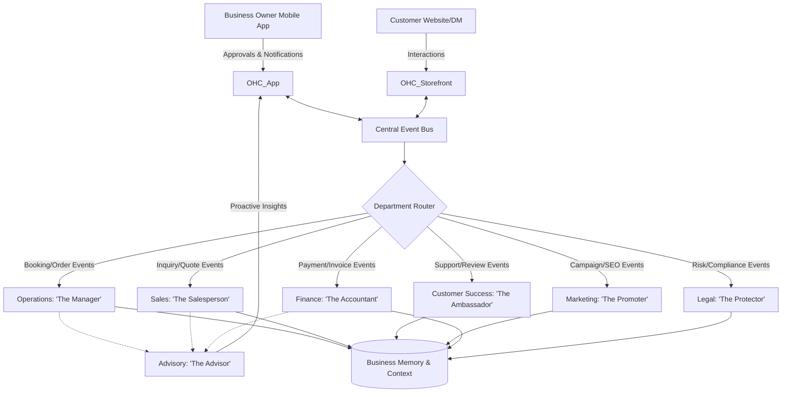

# AI Agent Department Architecture

## Title
AI Agent Department Architecture: Invisible Orchestration for Small Business Owners

## Problem Statement
Small business owners like Maya (baker), Carlos (handyman), and Fatima (food cart operator) are overwhelmed by the administrative burden of running a business. They want to focus on their craft, not on managing customer emails, updating websites, chasing invoices, or calculating taxes. Existing software solutions require them to act as their own IT department, marketer, and accountant, which is confusing and time-consuming. There is a critical need for an invisible, autonomous workforce that handles this complexity in the background, operating exactly like the specialized departments of a large enterprise, but accessible from a smartphone and understandable to a non-technical user.

## Research Report
Current market solutions (Shopify, Wix, Squarespace) offer isolated automation features (e.g., "send abandoned cart email"), but require the user to configure complex triggers and templates. These platforms force users to think in technical concepts ("webhooks", "campaigns", "workflows").

In contrast, our research indicates that small business owners think in terms of roles and responsibilities. When asked how they would scale, they say, "I need an accountant" or "I need someone to manage my social media."

The OneHumanCorp (OHC) approach introduces "AI Departments" — a friendly, role-based conceptual model.
- **Operations ("The Manager")**: Handles fulfillment, inventory, and bookings.
- **Marketing & Advertising ("The Promoter")**: Drives traffic, SEO, and social.
- **Sales & Acquisition ("The Salesperson")**: Generates quotes, follows up on leads.
- **Customer Success ("The Ambassador")**: Manages support, reviews, and re-engagement.
- **Finance & Payments ("The Accountant")**: Reconciles payments, prepares tax summaries.
- **Legal & Compliance ("The Protector")**: Handles policies, GDPR, and contracts.
- **Business Advisory ("The Advisor")**: Provides proactive health reports and insights.

By framing AI agents as "Departments", users immediately understand what the AI does without needing a manual.

## Design Doc

### Architecture Diagram

### UI Wireframes & Screen Flow (375px Mobile-First)
**Screen 1: Department Dashboard (Home)**
- **Header**: "Your Team is Working" with a subtle pulsing green indicator.
- **Body**: A list of cards representing active departments.
  - *Card 1*: 🧑‍💼 **Manager**: "Processed 3 cake orders overnight."
  - *Card 2*: 💬 **Ambassador**: "Drafted 2 replies to Instagram DMs." (Requires Approval - Action Button)
  - *Card 3*: 📈 **Advisor**: "You're low on flour based on upcoming orders. Order more?"

**Screen 2: Department Detail (The Ambassador)**
- **Header**: Back Button | Customer Success
- **Content**:
  - **Activity Log**: "Sent review request to Carlos." "Replied to delivery time inquiry."
  - **Pending Actions**: "Maya, I drafted a reply to @foodie. Approve?" [Review Draft] button.
  - **Settings**: "Auto-reply to sizing questions" (Toggle switch).

### Mobile UX Flow
1. **Event Occurs**: Customer asks a question via Instagram DM.
2. **Notification**: User receives a silent, grouped push notification: "Ambassador drafted a reply to a new DM."
3. **Review**: User taps notification, opening the app directly to the draft.
4. **Action**: User reviews the friendly, brand-aligned response. They can tap "Approve & Send", "Edit", or "Reject".
5. **Learning**: If approved, the agent notes the approval in Business Memory to increase confidence for future auto-execution.

### AI Agent Integration Points
- **Trigger Mechanisms**:
  - *Event-Driven*: Webhooks from payments, social media DMs, or form submissions.
  - *Schedule-Driven*: Weekly tax summary generation, daily social media post drafts.
  - *On-Demand*: User explicitly asks the Advisor for a revenue forecast.
- **Context & Memory**: All agents share a unified vector-based Business Memory. The Salesperson knows a customer's past orders (from Operations) and previous complaints (from Customer Success).
- **Approval Gates**: Agents operate in either "Draft & Propose" mode (requires explicit user tap to execute) or "Auto-Execute" mode (based on user trust settings).

### Key Design Decisions
- **Role-Based Framing**: We chose to name agents as human-like departments (e.g., "The Accountant") rather than technical workflows ("Invoice Automation Pipeline") to pass the grandmother test.
- **Unified Memory Over Silos**: Departments must not give conflicting information. A shared memory context ensures the Salesperson doesn't offer a discount to a customer the Ambassador is currently managing a refund for.
- **Approval-First Execution**: To build trust, new AI departments default to "Draft & Propose". Only as the user gains confidence do they toggle features to "Auto-Execute".
- **Graceful Throttling**: Usage limits are tied to subscription tiers (e.g., Free tier gets 100 actions/mo). When nearing the limit, the Advisor agent gently suggests an upgrade ("Your team is busy! Upgrade to Starter to let us handle more inquiries.").

## Implementation Prompt
**Task for Implementer Swarm**:
Implement the 'Department Router' and the 'Customer Success (Ambassador)' department core logic.
- **Outcome**: When a simulated customer inquiry is received on the unified event bus, the Router must correctly identify it as a Customer Success task and route it to the Ambassador. The Ambassador must generate a drafted response based on the shared Business Memory and flag it as `pending_approval`.
- **CUJ**: A customer asks "Do you do vegan options?" via the storefront. The system generates a draft response "Yes, we offer vegan cakes!" and surfaces it to the business owner's mobile dashboard for a 1-tap approval.
- **Acceptance Criteria**:
  - The event bus correctly routes inquiry events to the Ambassador logic.
  - The generated draft utilizes business context (e.g., knowing the business sells vegan cakes).
  - The draft state is persisted and accessible via a mobile-friendly view.
  - Strict mobile parity: the approval state must be cleanly exposed for a 375px UI.

## Priority
P0 (Critical to the core value proposition of invisible complexity)

## Estimated Scope
Large
