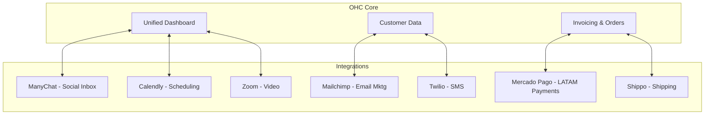

# 🔍 Tool Integration Research Report

## Executive Summary
This report evaluates seven tool integrations across critical categories to enhance the OHC platform for small business owners. The focus is on solving real-world pain points—such as missed messages, tedious scheduling, and manual shipping—with tools that offer accessible pricing, ease of use, and compatibility with both Cloud and Standalone environments.

## Visual Excellence Mandate: Ecosystem Architecture

## Tool Evaluations

### 1. Social Media Inbox: ManyChat
*   **Persona Pain Point:** Fatima runs a bakery and gets orders via Instagram DMs, WhatsApp, and Facebook. She misses messages because she has to check 3 different apps constantly.
*   **Solution:** A unified inbox within OHC aggregating all messages.
*   **Pricing:** Free tier up to 1,000 contacts; Pro starts at $15/mo.
*   **Compatibility:** Cloud (OAuth), Standalone (Requires webhook proxying).

### 2. Calendar & Scheduling: Calendly
*   **Persona Pain Point:** Marcus, a consultant, wastes hours emailing clients to find a time to meet.
*   **Solution:** Direct booking links displayed in OHC; upcoming events synced to the dashboard.
*   **Pricing:** Free basic tier; Standard $10/mo; Teams $16/mo.
*   **Compatibility:** Excellent for both Cloud and Standalone (Personal Access Tokens/OAuth).

### 3. Email Marketing: Mailchimp
*   **Persona Pain Point:** Sarah has a list of 400 customers in OHC but struggles to manually export them to send her monthly newsletter.
*   **Solution:** Automatic background syncing of OHC contacts to Mailchimp audiences.
*   **Pricing:** Free up to 500 contacts; Starts at $13-$20/mo for paid features.
*   **Compatibility:** Cloud (OAuth) and Standalone (API keys).

### 4. LATAM Payments: Mercado Pago
*   **Persona Pain Point:** Carlos in Mexico loses sales because his customers prefer paying with OXXO cash vouchers or local cards that Stripe doesn't support well.
*   **Solution:** Alternative payment gateway for OHC invoices tailored to LATAM.
*   **Pricing:** Variable by country, typically 3-5% + fixed fee.
*   **Compatibility:** Cloud and Standalone (API keys).

### 5. Shipping & Logistics: Shippo
*   **Persona Pain Point:** Jenny runs an e-commerce store and spends hours typing addresses into USPS.com to print labels one by one.
*   **Solution:** Fetch live rates and buy labels directly from OHC order pages.
*   **Pricing:** Free API Starter (first 30 labels free, then $0.05/label); discounted postage.
*   **Compatibility:** Excellent for Cloud and Standalone (API keys).

### 6. SMS Notifications: Twilio
*   **Persona Pain Point:** Fatima's customers don't read emails. She needs to text them when their cake is ready for pickup.
*   **Solution:** Automated and broadcast SMS capabilities directly from OHC.
*   **Pricing:** Pay-as-you-go, ~$0.0083/msg (US).
*   **Compatibility:** Excellent for Cloud and Standalone (API credentials).

### 7. Video Conferencing: Zoom
*   **Persona Pain Point:** Marcus forgets to generate a Zoom link for his consulting calls and scrambles right before the meeting starts.
*   **Solution:** Auto-generate Zoom links when appointments are booked.
*   **Pricing:** Basic is Free; Pro is $14.99/mo.
*   **Compatibility:** Cloud (Server-to-Server OAuth); Standalone might require specific app configuration.

## Proposed Implementation Priority

| Priority | Category | Tool | Scope | Justification |
| :--- | :--- | :--- | :--- | :--- |
| **P1** | Social Inbox | ManyChat | Medium | Solves critical lead-drop issue for omnichannel sellers. |
| **P1** | SMS | Twilio | Medium | High ROI for customer communication reliability. |
| **P1** | Shipping | Shippo | Large | Massive time-saver for e-commerce personas. |
| **P1** | Scheduling | Calendly | Small | Quick win, highly requested feature. |
| **P2** | Payments | Mercado Pago | Medium | Essential for global expansion, but Stripe covers baseline. |
| **P2** | Email Mktg | Mailchimp | Medium | Good for retention, less critical than direct sales/ops. |
| **P2** | Video | Zoom | Medium | Niche for service businesses, but high convenience. |

## Issue Briefs

### **Title**: Integrate ManyChat for Unified Social Media Inbox
**Problem Statement**: Small business owners often miss inquiries and sales because they receive messages across multiple platforms (Instagram, Facebook, WhatsApp, TikTok). Managing these separately is time-consuming and leads to dropped leads.
**Research Report**: ManyChat is a leading platform for chat automation and inbox management across Facebook Messenger, Instagram DMs, and WhatsApp. It offers a free tier for up to 1,000 contacts and Pro plans starting at $15/month. It's known for ease of use with a visual drag-and-drop builder, making it highly accessible for non-technical users. The API allows for robust webhook integration. It can be integrated via Cloud mode (OAuth) but Standalone mode might require custom webhook proxying.
**Design Doc**: When a user connects their ManyChat account, OHC will listen to ManyChat webhooks for incoming messages. These messages will be aggregated into a single 'Unified Inbox' view within OHC. When the business owner replies in OHC, an API call is sent back to ManyChat to deliver the message to the respective platform.
**Implementation Prompt**: Create a 'Connect ManyChat' button in the settings. Upon successful connection, display incoming messages from Instagram, FB, and WhatsApp in a centralized inbox view. Allow the user to reply directly from this inbox, ensuring the message reaches the customer on their original platform. Ensure the UI clearly indicates the source platform of each message.
**Priority**: P1
**Estimated Scope**: Medium

### **Title**: Integrate Calendly for Automated Scheduling
**Problem Statement**: Coordinating meeting times with clients involves endless back-and-forth emails, leading to frustration and lost bookings. Small business owners need a simple way to let clients book available times directly.
**Research Report**: Calendly is a highly popular scheduling tool that syncs with Google Calendar, Outlook, and others. It offers a free basic tier and paid plans (Standard $10/mo, Teams $16/mo). It handles timezone conversions automatically and generates Zoom/Meet links. The API is robust and well-documented. It is highly suitable for both Cloud and Standalone environments using Personal Access Tokens or OAuth.
**Design Doc**: A 'Scheduling' tab in OHC will display the user's Calendly booking links. Users can share these links directly or embed them in OHC-generated communications. OHC will listen to Calendly webhooks to display upcoming appointments in an OHC dashboard widget.
**Implementation Prompt**: Add an integration page for Calendly. Once connected, fetch and display the user's active event types so they can easily copy the booking links. Create a dashboard widget that displays a list of upcoming appointments fetched from Calendly, showing the client name, time, and event type.
**Priority**: P1
**Estimated Scope**: Small

### **Title**: Integrate Mailchimp for Customer Email Campaigns
**Problem Statement**: Business owners want to send newsletters and promotional offers to their customer list but find it difficult to keep their customer database in sync with their email marketing tool.
**Research Report**: Mailchimp is an industry standard for email marketing. It offers a Free plan for up to 500 contacts and 1,000 sends/month. Paid plans start around $13-$20/month. The platform is very user-friendly with drag-and-drop templates. The Marketing API allows for seamless audience syncing. It supports both Cloud (OAuth) and Standalone (API keys) deployments.
**Design Doc**: OHC will act as the source of truth for customer contacts. When a new customer is added or updated in OHC, it will automatically sync to a designated Mailchimp audience list. OHC will display basic campaign stats (open rates) fetched from Mailchimp.
**Implementation Prompt**: Provide a one-click connection to Mailchimp. Allow the user to select which OHC customer segment to sync to a specific Mailchimp list. Implement a background sync that keeps the Mailchimp list updated when OHC contacts change. Display a summary of the latest email campaign performance on the OHC dashboard.
**Priority**: P2
**Estimated Scope**: Medium

### **Title**: Integrate Mercado Pago for LATAM Payments
**Problem Statement**: Stripe is not universally optimal for all markets, particularly in Latin America where local payment methods (like Pix in Brazil or OXXO in Mexico) are crucial for conversion. Business owners in these regions lose sales without localized payment options.
**Research Report**: Mercado Pago is the leading payment processor in Latin America, supporting local credit cards, bank transfers, and cash payments. Pricing varies by country but typically ranges from 3-5% per transaction plus a fixed fee. The API is extensive and supports marketplace routing. It is essential for Cloud deployments targeting LATAM and can be configured via API keys for Standalone mode.
**Design Doc**: During invoice creation or checkout generation in OHC, users in supported regions can select Mercado Pago as the payment gateway. OHC will generate a Mercado Pago checkout preference and display the payment link or embedded checkout. Webhooks will update the invoice status in OHC upon successful payment.
**Implementation Prompt**: Add Mercado Pago as an alternative payment provider in the billing settings. When generating an invoice, allow the user to create a Mercado Pago payment link. Listen for Mercado Pago IPN (Instant Payment Notifications) webhooks to automatically mark invoices as 'Paid' in the OHC system.
**Priority**: P2
**Estimated Scope**: Medium

### **Title**: Integrate Shippo for Automated Shipping Labels
**Problem Statement**: E-commerce business owners waste hours manually calculating shipping rates, buying postage, and typing out tracking numbers for customers.
**Research Report**: Shippo offers a multi-carrier shipping API (USPS, UPS, FedEx, DHL). It provides a Free API Starter tier (first 30 labels free, then $0.05/label) and discounted carrier rates. It is very developer-friendly and easy for end-users to understand. It supports Cloud and Standalone modes via API keys.
**Design Doc**: When an order is marked as 'Ready to Ship' in OHC, the system will fetch live rates from Shippo. The user selects a rate, and OHC purchases the label via Shippo API. The tracking number is saved in OHC and automatically emailed to the customer.
**Implementation Prompt**: Create a 'Fulfillment' module for orders. Integrate Shippo to display available shipping rates based on order weight and destination. Add a button to 'Purchase Label' which generates a PDF shipping label for the user to print and saves the tracking number to the order record.
**Priority**: P1
**Estimated Scope**: Large

### **Title**: Integrate Twilio for Critical SMS Notifications
**Problem Statement**: Email notifications often go unread or end up in spam. For critical updates (appointment changes, urgent alerts), business owners need a reliable way to reach customers instantly, especially for demographics that prefer text over email.
**Research Report**: Twilio is the industry leader for programmable SMS. It offers global reach and high deliverability. Pricing is pay-as-you-go, starting at $0.0079 per message in the US. While highly developer-focused, OHC can abstract the complexity so the business owner simply types a message. It works perfectly in both Cloud and Standalone modes via API credentials.
**Design Doc**: Users can configure 'Notification Rules' in OHC to send SMS via Twilio for specific events (e.g., 'Appointment Tomorrow'). OHC will use the Twilio API to dispatch the messages.
**Implementation Prompt**: Add Twilio API credential fields in the settings. Create an 'SMS Broadcast' feature where users can type a short message and send it to a selected customer segment. Also, add automated SMS toggles for key events like appointment reminders or order shipped notifications.
**Priority**: P1
**Estimated Scope**: Medium

### **Title**: Integrate Zoom for Auto-Generated Meeting Links
**Problem Statement**: Consultants and tutors manually create Zoom meetings and copy-paste links into emails for every booking, which is tedious and prone to errors.
**Research Report**: Zoom is the ubiquitous video conferencing tool. It offers a robust API for meeting creation. The basic plan is free (with a 40-min limit), and Pro is $14.99/mo. It requires Server-to-Server OAuth for automated creation, which is suitable for Cloud mode but may require specific configuration for Standalone users.
**Design Doc**: When a new appointment is created in OHC (either manually or via a tool like Calendly), OHC will automatically call the Zoom API to create a meeting. The resulting Join URL will be saved to the appointment record and included in the confirmation email sent to the client.
**Implementation Prompt**: Add a Zoom integration via OAuth. When scheduling a new event within OHC, provide a checkbox 'Make this a Zoom meeting'. If checked, automatically generate the Zoom link and embed it in the calendar invite and customer confirmation email.
**Priority**: P2
**Estimated Scope**: Medium
