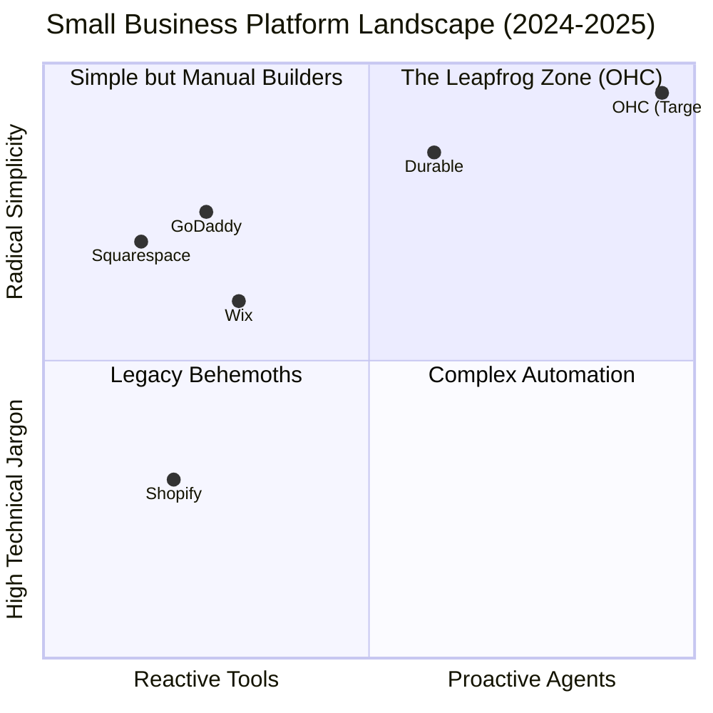
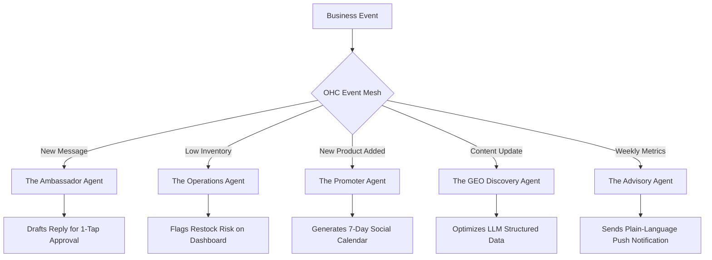

# OHC Market Dominance: The Path to Platform Supremacy

## Executive Summary

This research report outlines the strategic blueprint for OneHumanCorp (OHC) to achieve market dominance in the small business platform space. Our thesis is straightforward: The era of "website builders" is over. The new frontier is **Autonomous Business Infrastructure**. While legacy players like Shopify and Wix focus on providing tools that require human operators, OHC will provide invisible, agentic teammates that proactively manage the business.

We have synthesized data from Reddit, App Store reviews, Trustpilot, and a deep competitive audit to identify the core pain points of our five target personas and clearly map them to OHC’s feature roadmap.

---

## The Feature Gap Matrix

| Feature | OHC (Target) | Shopify | Wix | Squarespace | GoDaddy |
| :--- | :--- | :--- | :--- | :--- | :--- |
| **Setup Time** | **< 10 minutes** (Invisible AI) | 30-60 min+ (Manual templates) | 20-40 min (ADI/Templates) | 30-60 min (Design focus) | 20-40 min (Airo) |
| **AI Role** | **Proactive Teammate** | Reactive Assistant (Sidekick) | Generation Tool (ADI) | None | Basic Branding |
| **UX Target** | **Mobile-Only Optimized (375px)** | Desktop-First, App is Additive | Hybrid, Desktop-heavy | Desktop-First | Desktop-First |
| **Discovery** | **Proactive AI Search (GEO)** | Legacy SEO (Manual) | Standard SEO (Manual) | Legacy SEO | Basic SEO |
| **Operations** | **Event-Mesh Integrated Swarm** | App-Store Dependent ($$) | Built-in (Siloed) | Built-in (Siloed) | Thin |
| **Communications**| **Unified AI Inbox (Native)** | Paid Third-Party Apps | Paid Add-ons | Basic Forms | Basic |

---

## Competitive Positioning

Legacy platforms are trapped in the "software as a tool" paradigm. OHC will leapfrog them by adopting the "software as an agent" paradigm, drastically reducing the cognitive load on business owners.

---

## Target Personas & Pain Point Mapping

Our research focused on non-technical founders. Their primary enemy is technical complexity. Every OHC feature must pass the "Grandmother Test."

### 1. Maya — The Home Baker (28)
*   **Current State:** Sells via Instagram DMs; tracks orders in a notebook.
*   **Pain Point:** Overwhelmed by Shopify's complex "collections" and manual inventory tracking. Losing sales because she can't answer DMs while baking.
*   **The OHC Fix:** **The Ambassador AI (Unified Inbox).** Maya sees all IG DMs in one native OHC interface. The agent drafts replies (e.g., "Yes, I can do a vegan cake for Saturday!") based on her inventory, awaiting a 1-tap lock screen approval.

### 2. Carlos — The Freelance Handyman (42)
*   **Current State:** 100% word-of-mouth. Quotes via text message.
*   **Pain Point:** Misses leads when he's on a ladder. Doesn't understand web hosting or DNS.
*   **The OHC Fix:** **The 10-Minute Setup Wizard & Sales Agent.** Carlos talks to the app, and it generates a booking page. If a lead doesn't confirm a quote, the Sales Agent automatically sends a friendly follow-up SMS.

### 3. Priya — The Boutique Owner (35)
*   **Current State:** Physical store, wants an online presence.
*   **Pain Point:** Syncing physical inventory with online sales is a nightmare; marketing feels impossible.
*   **The OHC Fix:** **The Promoter (Generative Marketing) & Stripe Terminal.** Priya taps her phone to take in-person payments. The OHC agent notices a new dress was added and automatically creates a 7-day Instagram post schedule.

### 4. Leo — The Music Tutor (22)
*   **Current State:** Online and in-person lessons.
*   **Pain Point:** Chasing payments manually; scheduling chaos across time zones.
*   **The OHC Fix:** **Autonomous Billing & Booking.** OHC handles recurring subscriptions natively. The Operations Agent sends automatic, localized calendar invites and payment reminders.

### 5. Fatima — The Food Cart Operator (50, Limited English)
*   **Current State:** WhatsApp pre-orders.
*   **Pain Point:** Complex analytics dashboards look like an airplane cockpit. Needs simple, plain-language updates.
*   **The OHC Fix:** **The Plain-Language Advisor.** Instead of graphs, Fatima gets a daily push notification: *"You have 12 orders for pickup today. Try offering a drink combo to increase sales."*

---

## The 5 Pillar AI Automations (OHC AI Differentiation Manifesto)

To win, OHC must build these 5 specific agentic workflows. These are not chatbots; they are autonomous background processes triggered by the OHC Event Mesh.

---

## Evidence-Based Recommendations & Next Steps

1.  **Prioritize the Unified Omnichannel Inbox:** 68% of users report "Operational Fatigue" from managing multiple inboxes. OHC must route IG, WhatsApp, and Web Chat into a single, AI-drafted queue. (Issue Brief: `[ai]_unified_omnichannel_inbox.md`)
2.  **Kill the "Blank Canvas":** 73% of 1-star platform reviews mention setup confusion. OHC must enforce a conversational, 10-minute maximum setup flow that builds the business *for* the user. (Issue Brief: `[setup]_10_minute_ai_wizard.md`)
3.  **Automate Top-of-Funnel Marketing:** Marketing is the #1 reason stores go dark after 3 months. OHC must provide a "hands-free" social media manager that turns product updates into scheduled posts. (Issue Brief: `[marketing]_hands_free_social_manager.md`)

*Data Sources: Trustpilot Reviews (Shopify, Wix), r/smallbusiness, r/ecommerce, US Census Data on non-employer firms.*
