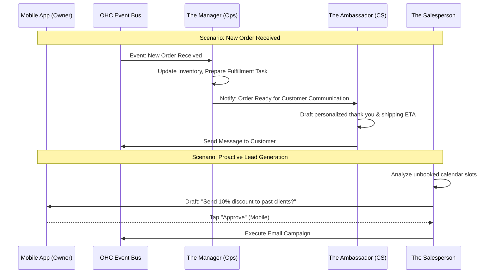

# [AI Departments] AI Agent Department Architecture

## Problem Statement

Small business owners—whether they run a food cart, a tutoring service, or a boutique—often spend more time managing the administrative overhead of their business than actually practicing their craft. A baker (like Maya) wants to bake and decorate cakes, not spend hours manually replying to Instagram DMs, updating a website, or tracking unpaid invoices. The problem is that running a digital business typically requires wearing ten different hats (marketer, accountant, customer support, web developer), which is overwhelming, exhausting, and ultimately limits growth. Small business owners need an invisible team that handles this complexity for them, so they can focus on their core product and their customers.

## Research Report

**Market Overview & Competitive Landscape:**
Traditional platforms (Shopify, Wix, Squarespace) require the owner to act as the general manager of their digital storefront. While they offer plugins and basic automations (e.g., "send abandoned cart email"), they do not offer proactive, conversational, or autonomous agents that think and act on behalf of the business.

- **Shopify:** Excellent for e-commerce, but requires significant setup and manual management. App ecosystem is fragmented.
- **Wix/Squarespace:** Good for visual storefronts, but weak on proactive operations and autonomous task execution.
- **GoDaddy:** Basic tools, but still requires the user to "push the buttons."

**Key Findings for OneHumanCorp:**
1. **The "Teammate" Mental Model:** Owners don't want "AI tools"; they want a teammate. Using department names (like "The Accountant" or "The Manager") makes the system instantly understandable.
2. **Invisible Coordination:** The most significant pain point is context switching. When an order comes in, the owner shouldn't have to tell the "Operations" department to fulfill it and the "Customer Success" department to send a thank-you note. The departments must communicate with each other.
3. **Trust & Approval:** For sensitive actions (like spending marketing budget or sending bulk emails), owners need a "draft-for-review" system where the AI proposes an action and the owner taps "Approve" on their phone.
4. **Mobile First:** The entire system must be monitorable and approvable from a smartphone (iOS and Android) since owners are constantly on the move.

## Design Doc

**Architectural Overview:**
The AI Agent Department system is designed as an invisible layer that observes the business's data and events, thinks about next steps, and executes actions (either autonomously or via owner approval). It operates as a set of interacting agents, each with a specialized role and context.

**Mermaid Architecture Diagram:**

**Mobile UX Flow (375px):**
1. **Home/Feed Tab:** The central nervous system for the owner. A TikTok-style vertical feed of "Agent Updates" and "Approvals Needed."
   - *Example Card:* "The Promoter drafted a new Instagram post for your new Cupcake variant. [Review & Post]"
2. **Departments Tab:** A list of the owner's active AI teammates.
   - *Screen:* Grid showing "The Manager", "The Accountant", etc. Tapping one shows its recent activity, settings, and health metrics.
3. **Approval Flow:** When an agent needs permission, a clean sheet slides up.
   - *Screen:* "The Accountant noticed an unpaid invoice from Client X. Send reminder?" -> [Yes, Send] [Edit Message] [Cancel]

**Agent Integration Points:**
- **Trigger Layer:** Departments are awakened by system events (e.g., `OrderPlaced`, `CustomerMessageReceived`), scheduled cron jobs (e.g., weekly financial summary), or manual owner requests.
- **Memory/Context:** Agents share a central, consolidated memory representing the business state, avoiding the need for the owner to repeat themselves.
- **Action Execution:** Agents emit standardized intent payloads to the OHC core system to mutate state (e.g., send email, update product price) rather than executing side effects directly.

**Key Design Decisions:**
- **Department Personas:** We use friendly, relatable names ("The Manager", "The Promoter") instead of technical terms ("Ops Agent", "Marketing LLM") to build trust.
- **Approval Queue First:** By default, new or sensitive actions go to an Approval Queue. The owner can later toggle an agent to "Auto-Execute" once trust is established.
- **Unified Event Bus:** Agents do not communicate via direct RPC; they listen to a central event bus to ensure loose coupling and scalability.

## Implementation Prompt

**To the Implementer Swarm:**
Your goal is to build the core engine for the AI Agent Departments. The outcome should be a system where an owner can view their "Departments" in the mobile app, see what each agent has recently done, and approve pending actions in their feed.

**Core User Journeys (CUJ):**
1. As an owner, I want to see a unified feed of proposed actions from my AI departments so I can approve them with a single tap.
2. As an owner, I want my "Manager" agent to automatically react to a new order and coordinate with my "Ambassador" agent to message the customer, without my intervention.
3. As an owner, I want to view a specific department (e.g., "The Accountant") and see a log of its recent automated actions.

**Acceptance Criteria:**
- The system must support the definition of at least three distinct departments (e.g., Ops, Marketing, CS).
- Agents must be able to listen to system events and generate "Proposed Actions" that appear in a user's mobile feed.
- The mobile app must allow the user to approve or reject these proposed actions.
- The system must support an "Auto-Execute" mode where trusted agents bypass the approval step and act immediately.
- The system must enforce multi-tenancy strictly; an agent operating for Maya's Bakery must never access Priya's Boutique's data.

*(Note: Implementers have full autonomy to design the specific event bus technology, data schema, LLM integration, and API endpoints to satisfy these requirements.)*

## Priority
P0 (Critical)

## Estimated Scope
Large

### AI Usage Budgeting & Throttling
- **Throttling per Tenant:** Every tenant has a finite monthly budget of "AI Action Points" associated with their tier. Proactive generation by departments (e.g. Sales sending emails) consumes points. If points are exhausted, agents gracefully degrade to a "read-only/reactive" mode until the next billing cycle, or prompt the owner to upgrade.
- **Fair Use Overages:** System metrics track queue depth per tenant. High-frequency automated actions from a single tenant must not block background jobs for others; they are placed in a lower-priority slow-queue if they exceed a bursts threshold.
