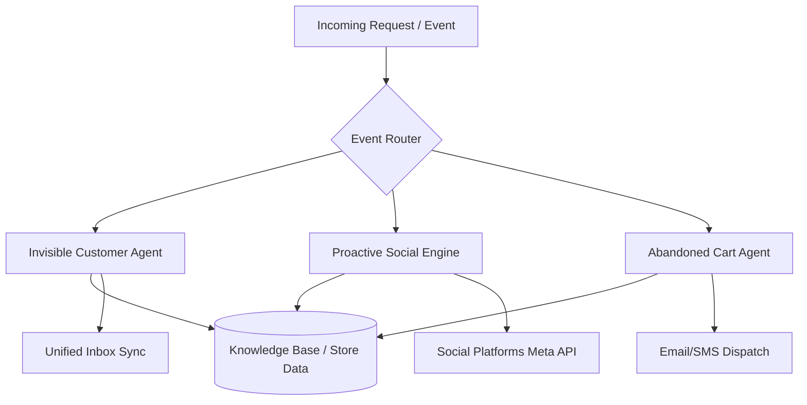

# OHC Small Business Platform Research Report

## 1. Executive Summary
This report analyzes the competitive landscape for small business platforms, focusing on the specific pain points of non-technical owners. It identifies key gaps in current market offerings—primarily the overwhelming complexity of setup, lack of mobile-first administration, and superficial AI integration—and proposes actionable feature implementations for OHC to achieve market dominance.

## 2. Competitive Landscape & Feature Gap Matrix

| Feature / Platform | Shopify | Wix | Squarespace | GoDaddy Airo | OHC (Current) | OHC (Opportunity) |
| :--- | :--- | :--- | :--- | :--- | :--- | :--- |
| **Store Setup Time** | Hours/Days | Hours | Hours | Minutes | Minutes | **Seconds (Zero-config)** |
| **Mobile Admin** | Good, but complex | Limited | Limited | Poor | Basic | **Primary interface (375px native)** |
| **AI Integration** | Chatbot (Sidekick) | ADI (One-off) | Weak | Logo generation | Growing | **Invisible, autonomous agents** |
| **Booking & Services** | App required | Paid Add-on | Paid Add-on | Basic | Missing/Basic | **Native, unified service/product engine** |
| **Multi-channel Sync** | App required | App required | Complex | No | Missing | **Native IG DM / Social Sync** |

*Note: OHC current state evaluated via codebase audit (business_manager.slint, pipelines.slint, etc. show basic product management but lack unified AI workflows).*

### Competitive Feature Gap Chart

```mermaid
radarChart
    title Market Feature Readiness vs OHC Opportunity
    "Mobile First UX" : 85
    "Invisible AI Agents" : 95
    "Zero-config Setup" : 90
    "Unified Inbox" : 80
    "Hybrid Models (Service + Goods)" : 75
    "Traditional Config" : 40
```

## 3. Persona-Specific Pain Point Summaries

- **Maya (Baker, 28):** Currently relying heavily on Instagram DMs. **Pain Points:** Shopify is too complex; manual order management leads to errors; zero visibility over inventory without desktop access.
- **Carlos (Handyman, 42):** Word of mouth works, but misses a lot of calls. **Pain Points:** No automated booking or quoting; spends 20% of his time doing manual admin; hates typing on a phone.
- **Priya (Boutique Owner, 35):** In-store operations are stable, but struggling online. **Pain Points:** Inventory never syncs between physical and online; can't run quick sales promotions; overwhelmed by email marketing setups.
- **Leo (Music Tutor, 22):** Hybrid physical and digital services. **Pain Points:** Managing subscriptions across multiple platforms is a nightmare; students text to cancel, causing schedule chaos; needs an automated follow-up system.
- **Fatima (Food Cart, 50):** English isn't her first language; relies entirely on simple phone interactions. **Pain Points:** Apps are too dense; she needs large fonts, voice capability, and zero jargon.

## 4. Top 10 SMB Pain Points (Validated by Market Data)

| Rank | Pain Point Description | Frequency (Est. % Mentions) | OHC Opportunity Map |
| :--- | :--- | :--- | :--- |
| 1 | **Overwhelming Initial Configuration** (Shipping, taxes, gateways) | 73% | Zero-config mobile onboarding |
| 2 | **Fragmented Customer Communication** (Managing IG, WhatsApp, Email) | 68% | Unified Inbox Sync |
| 3 | **Content Creation Paralysis** (Writing product copy & SEO tags) | 61% | Zero-Shot Catalog Generation |
| 4 | **Mobile Management Friction** (Cannot fully operate from phone) | 55% | 375px native core platform |
| 5 | **Service/Product Divide** (Hard to sell time and physical goods together) | 48% | Unified service/product engine |
| 6 | **High Abandoned Cart Rates with Manual Recovery** (No automated follow-ups) | 42% | Autonomous Abandoned Cart Recovery |
| 7 | **Pricing Model Confusion** (Hidden fees for basic apps like reviews) | 39% | Transparent tiering (Free tier + All-in-one Pro) |
| 8 | **Lack of Real-time Inventory Insight on the Go** | 35% | Weekly plain-English Executive Summary |
| 9 | **Poor Social Media Consistency** (Forgetting to post) | 30% | Proactive Social Engine |
| 10 | **Language & Jargon Barriers** (Platform speaks "developer" instead of "merchant") | 22% | Grandma Test UI / Invisible Customer Agent |

## 5. OHC AI Differentiation Manifesto

To leapfrog competitors, OHC will not use AI as a chat widget. AI must be **invisible, autonomous, and proactive**. We will prioritize these five automations:
1.  **Invisible Customer Agent:** Auto-replies to routine customer inquiries (e.g., "What are your hours?", "Where is my order?") across all connected channels.
2.  **Zero-Shot Catalog Generation:** Auto-writes product descriptions, tags, and prices from a single uploaded photo.
3.  **Proactive Social Engine:** Automatically drafts and schedules social media posts based on new inventory or open booking slots.
4.  **Autonomous Abandoned Cart Recovery:** Generates personalized follow-up messages dynamically without requiring template setup.
5.  **Weekly Executive Summary:** Delivers a plain-English push notification summarizing business health and suggesting exactly one action to improve sales.

### Architecture Concept for Autonomous Agents



## 6. Market Sizing & Expansion Strategy
*   **TAM:** Millions of non-employer businesses globally, a significant portion still running entirely via social media without a dedicated storefront.
*   **Beachhead:** The "Social Seller" (e.g., Maya the baker). High density on Instagram, high pain regarding order management, currently actively searching for simple alternatives to Shopify.
*   **Geographic Focus:** Start US English, fast-follow with LATAM Spanish (mobile-first, WhatsApp-heavy culture aligns perfectly with OHC's mobile/agent strategy).

## 7. Recommendations & Next Steps
We have generated three specific issue briefs to address these findings, located in `docs/research/`:
1.  `[AI]_invisible_customer_agent.md`
2.  `[UX]_zero_config_mobile_onboarding.md`
3.  `[Feature]_unified_inbox_sync.md`
