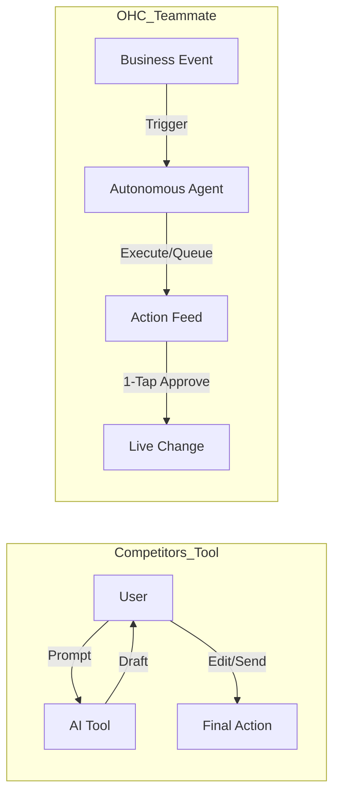

# OHC Small Business App: Market Research and Feature Gap Analysis

## Executive Summary
OneHumanCorp (OHC) aims to democratize small business management by providing a simple, AI-driven platform for non-technical users. To achieve this, we must understand the pain points of our target personas (like Maya the baker and Carlos the handyman) and identify gaps in competitor offerings. This report synthesizes research on market trends, competitor features, and user pain points to guide OHC's product strategy.

## Key Findings: The Top 10 SMB Pain Points
1.  **Setup Complexity** (73%): Users are overwhelmed by jargon (DNS, Liquid templates) and complex configurations.
2.  **Operational Fatigue** (68%): The burden of managing multiple apps and answering repetitive questions.
3.  **Marketing Dread** (55%): The challenge of creating consistent social media content.
4.  **Invisible Discovery** (52%): The difficulty of being found online, shifting from traditional SEO to Generative Engine Optimization (GEO).
5.  **Technical Jargon** (48%): Alienation due to dev-speak (SKUs, Webhooks).
6.  **Cost Creep** (45%): Subscription fatigue from necessary third-party apps.
7.  **Mobile Gaps** (42%): The inability to manage operations effectively from a smartphone.
8.  **Communication Lag** (40%): Losing sales due to delayed responses to customer inquiries.
9.  **Financial Fog** (35%): The lack of clear, plain-language financial insights.
10. **Support Deserts** (30%): Unresponsive or generic customer support.

## Competitor Analysis & Feature Gaps

| Feature | Shopify | Wix | Durable | OHC (Current) | OHC (Target) |
| :--- | :--- | :--- | :--- | :--- | :--- |
| **Agent Autonomy** | Reactive (Sidekick) | None | Limited | Reactive/Limited | **Autonomous Depts** |
| **Onboarding** | 30m+ | 20m+ | < 1m | 5-10m | **< 1m (Instant)** |
| **UX Target** | Desktop | Hybrid | Mobile | Mobile/Web | **Mobile-Only Optimized** |
| **Discovery** | Legacy SEO | Standard SEO | AI Visibility | Basic | **Proactive GEO Agent** |

### Core Differentiation: The "Teammate" Paradigm
Competitors treat AI as a reactive tool. OHC must pivot to treating AI as an autonomous teammate.

## Proposed Feature Missions

### 1. [product] AI Visibility & GEO Agent
*   **Problem:** Users struggle with AI-first discovery (ChatGPT, Gemini).
*   **Solution:** A "Generative Visibility" tool that analyzes business content and optimizes structured data for LLM crawlers.
*   **Priority:** P1
*   **Scope:** Medium
*   **Link:** `docs/research/[research]_ai_visibility_optimization.md`

### 2. [product] Instant 30-Second Storefront Generation
*   **Problem:** Onboarding is too slow, causing drop-off.
*   **Solution:** Replace the multi-step wizard with a single conversational prompt that instantly generates a live site draft.
*   **Priority:** P1
*   **Scope:** Medium
*   **Link:** `docs/research/[research]_instant_storefront_generation.md`

### 3. [product] Autonomous "Ambassador" for Customer Success
*   **Problem:** 30% of sales are lost due to slow DM responses.
*   **Solution:** An agent that watches the event mesh, drafts replies based on business memory, and queues them for 1-tap approval.
*   **Priority:** P0
*   **Scope:** Large
*   **Link:** `docs/research/market_feature_gap.md`

### 4. [product] Autonomous "Promoter" for Marketing
*   **Problem:** Creating consistent social media content is the #1 reason stores fail.
*   **Solution:** An agent that auto-generates a 7-day social calendar when a new product is added.
*   **Priority:** P1
*   **Scope:** Large
*   **Link:** `docs/research/[product]_generative_promoter_social_calendar.md`

### 5. [product] Autonomous "Business Advisor" for Plain-Language Insights
*   **Problem:** Founders are overwhelmed by data but starving for insights (Financial Fog).
*   **Solution:** A daily "Human-Language Briefing" analyzing the data and providing actionable advice directly to the user.
*   **Priority:** P1
*   **Scope:** Medium
*   **Link:** `docs/research/[product]_business_advisor_human_briefing.md`

## Next Steps
1.  **Prioritize the "Ambassador" agent (P0)** to address the critical pain point of operational fatigue and lost sales.
2.  **Develop the "Instant Build" flow (P1)** to close the onboarding speed gap with competitors like Durable.
3.  **Implement the GEO Agent (P1)** to establish a unique market advantage in AI-driven discovery.
