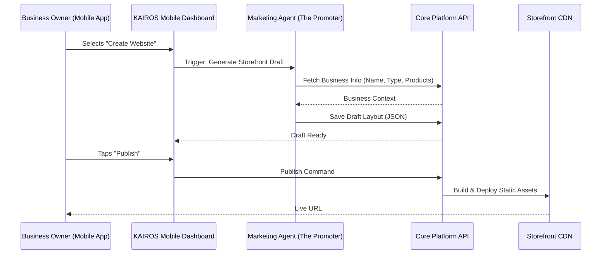

# Website & Storefront Builder Architecture

## Problem Statement
Small business owners like Priya (boutique owner) and Carlos (handyman) want a professional, beautiful online presence to sell products and services. However, they lack the technical skills to build a website, the time to learn a complex drag-and-drop editor, and the budget to hire a designer. They need an instant, professional storefront that configures itself based on their business type and looks perfect on both mobile and desktop, without them writing a single line of code or managing complex layout rules.

## Research Report
The current market offerings present a steep learning curve and feature bloat for simple businesses:

| Platform | Strengths | Weaknesses |
|---|---|---|
| **Shopify** | Powerful e-commerce, large app ecosystem | Complex theme system, requires technical setup, costly addons |
| **Wix / Squarespace** | Flexible drag-and-drop | Overwhelming options, easy to make ugly layouts, poor mobile optimization by default |
| **Linktree / Milkshake** | Simple, mobile-first | Too basic, poor for selling physical products or booking services natively |

**Key advantages and risks for OHC:**
- **Advantages:** Unmatched speed to market (under 10 minutes). True mobile-first approach. AI-generated layouts that prevent users from making "ugly" sites by restricting customization to safe, curated palettes and blocks.
- **Risks:** Power users might feel restricted by the lack of pixel-perfect drag-and-drop freedom. Managing custom domains and SSL securely at scale across hybrid deployments.

**Rough Pricing Estimate:**
- Infrastructure cost per tenant website is near zero for static HTML/CSS generation served via CDN. Custom domain/SSL management via Let's Encrypt or Cloudflare adds minimal operational overhead.

**Whether it works in both Cloud and Standalone modes:**
- **Cloud:** Yes. Websites are hosted centrally, scaled via CDN, and SSL is managed by the cloud load balancer.
- **Standalone:** Yes. The standalone local backend can still generate the website static assets, but publishing them to the public internet requires integration with a cloud CDN or a proxy tunneling service (like ngrok or Cloudflare Tunnels) provided as an optional integration.

## Design Doc

### User Experience (Mobile-First 375px Flow)
1. **Onboarding:** User selects business type (e.g., "Food & Beverage" -> "Food Cart").
2. **Instant Generation:** AI generates a complete storefront template: Hero image (from Unsplash or AI), Menu grid, "Order Now" sticky button.
3. **Block Management:** The user sees a list of "Blocks" on their mobile screen (e.g., Header, Menu, Location Map). They can tap to reorder them or tap "Edit" to change text/images.
4. **Publishing:** A single tap on "Publish" makes the site live on `[username].onehumancorp.com` instantly.

### Architecture Diagram

### Key Design Decisions
- **Block-Based, Not Free-Form:** To ensure websites always look professional and pass the Visual Excellence Mandate (Glassmorphism, clean typography), users cannot drag elements anywhere. They can only reorder pre-designed content blocks.
- **Data-Driven Templates:** The website layout is stored as a structured JSON representation of blocks in the database, making it easy for AI agents to understand, modify, and render across different target platforms.
- **Instant Previews:** The UI must render a live preview of the website instantly as the user modifies block settings, ensuring a tight feedback loop.

## Implementation Prompt
Implement the "Website & Storefront Builder" foundation in the core platform. The user must be able to view their generated website layout as a sequence of configurable "blocks" (e.g., Hero, Product Grid, Testimonials) in the mobile app. They should be able to edit the content of these blocks, reorder them, and toggle a "Publish" state. The backend must represent the website layout as a structured data format (not raw HTML) to allow the "Marketing Agent" to programmatically suggest improvements later. Ensure the user interface for editing blocks follows the Visual Excellence Mandate (Glassmorphism, Outfit/Inter typography) and is flawlessly optimized for a 375px mobile screen. Do not prescribe specific database tables or endpoints; focus on delivering the end-to-end "Edit & Publish" user journey.

## Priority
P0

## Estimated Scope
Large
