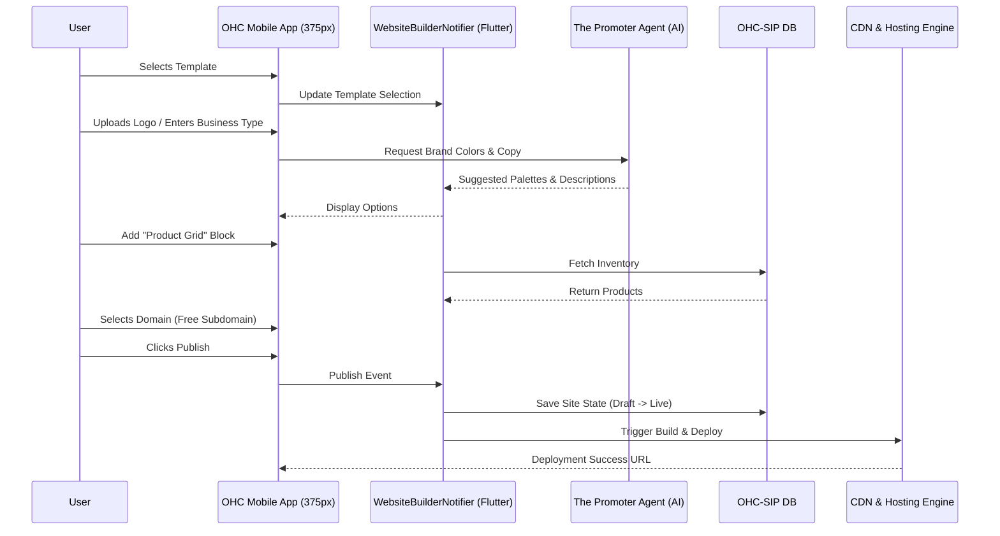

# Issue Brief: Website & Storefront Builder Architecture

## Problem Statement
Small business owners (like Maya the Baker or Carlos the Handyman) are non-technical and do not have the time, skills, or budget to design, build, and deploy a professional online presence. Traditional web builders (e.g., Wix, Squarespace, GoDaddy) are often overwhelming with too many settings and options, requiring users to understand padding, margins, flexbox concepts, SEO metadata, and DNS settings. These platforms are not genuinely mobile-first; building a website from a smartphone is nearly impossible.

OHC needs a builder that abstracts away all technical choices. A user should be able to drag-and-drop functional blocks, and rely entirely on AI to auto-generate copy, suggest color palettes, optimize for SEO, and automatically publish a fast, beautiful mobile-first storefront in under 10 minutes.

## Research Report
Based on an analysis of competitor platform workflows:
- **Shopify:** Complex theme customization requiring HTML/Liquid knowledge for serious modifications. Poor mobile creation experience.
- **Wix & Squarespace:** Extensive template libraries, but customizing layouts on mobile devices is tedious and often breaks desktop designs.
- **GoDaddy (Airo):** Simplified generation but lacks flexibility for multi-functional businesses (e.g., selling physical products AND taking bookings on the same site).
- **Opportunity:** The OHC builder must treat AI as a core participant. It must support high-level functional blocks (e.g., "Booking Calendar", "Product Grid") rather than low-level UI elements (e.g., "Text Box", "Container"). It must offer an experience tailored to 375px screens where building a website feels as easy as customizing an Instagram profile.

## Design Doc

### High-Level Architecture
- **Component Abstraction (Content Blocks):** Instead of raw text/image elements, the builder provides functional widgets: Hero, Product Grid (connected to inventory), Testimonials, Booking Calendar, Contact Form, and Footer.
- **Templates & Theming:** A central theming engine applies the OHC Premium Token library (Glassmorphism, Outfit/Inter typography, consistent spacing). AI suggests cohesive color palettes based on the business type or uploaded logo.
- **AI Integration (The Promoter Agent):**
  - AI auto-generates localized copy for product descriptions based on short inputs (e.g., "Name: Custom Vegan Cake -> Description: Auto-generated appealing description").
  - SEO metadata (Title, Description, Schema.org markup) is automatically generated.
- **Publishing Pipeline:**
  - Sites transition from `Draft` -> `Live`.
  - A staging/live preview is available during editing.
- **Domain Management:**
  - Seamlessly handles custom domains, purchasing new domains, or providing free OHC subdomains (e.g., `mybusiness.ohc.app`). DNS configuration and SSL provisioning are entirely abstracted from the user.

### Mobile UX Flow (375px First)

1. **Template Selection:** User is presented with beautifully crafted, industry-specific templates (e.g., "Modern Bakery", "Freelance Portfolio").
2. **Brand & Identity:**
   - User inputs basic info or uploads a logo.
   - AI generates and presents 3 color palettes. User taps to select.
3. **Adding Content (Blocks):**
   - User taps "+" to add functional blocks.
   - E.g., Tapping "Add Product Grid" automatically pulls products already in the OHC inventory.
   - For missing descriptions, an AI spark icon allows instant generation.
4. **Domain & Go Live:**
   - A clear radio button selection for "Free Subdomain" or "Custom Domain".
   - A final "Live Preview" rendering the 375px mobile site.
   - A prominent "Publish" button.

### Architecture Diagram

## Implementation Prompt
Implement the end-to-end Website & Storefront Builder architecture.
- **Data Model:** Design the database schema (using JSONB where appropriate for flexible layouts) to represent the site structure, content blocks, theme tokens, and metadata.
- **Backend API:** Implement endpoints to save site drafts, manage publishing state, and auto-provision subdomains/SSL.
- **AI Integration:** Wire up "The Promoter" agent to automatically generate SEO metadata and product descriptions during the build flow.
- **Frontend (Flutter):** Build the mobile-first drag-and-drop or block-based builder UI. Ensure the entire flow—from template selection, brand color generation, content block addition, to domain selection and publishing—is fully functional on a 375px screen.
- **Acceptance Criteria:** A non-technical user must be able to publish a functional, styled website with a product grid and contact form in under 5 minutes from their phone without writing any code.

## Priority
P0

## Estimated Scope
Large
