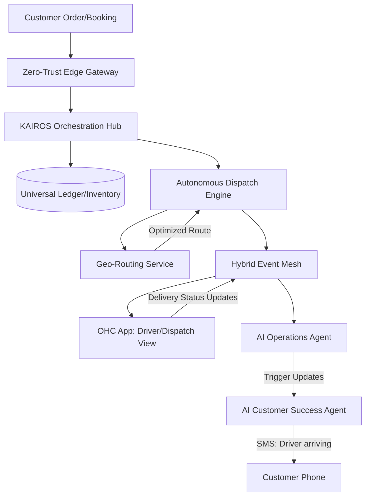

# Title: Universal Autonomous Dispatch & Local Delivery Mesh

## Problem Statement
Small business owners like Maya (who delivers custom cakes locally) and Carlos (a handyman who travels to customer homes) struggle with logistics. Existing delivery and routing apps (like Onfleet or Route4Me) are overly complex, expensive, and require manual data entry or clunky integrations. These tools lack native understanding of the business's inventory, schedule, and customer communications. Maya ends up texting customers manually ("I'm 10 mins away"), while Carlos wastes time optimizing his daily driving route. They need an invisible dispatch system that automatically calculates the most efficient routes based on confirmed orders or appointments, notifies customers proactively, and allows staff to manage deliveries with a simple swipe on a mobile interface.

## Research Report
*   **Competitor Analysis**:
    *   **Shopify Local Delivery**: Basic and requires the "Local Delivery" app. Staff must manually map out routes, and the mobile driver experience is disjointed from the core store admin.
    *   **Onfleet**: Highly capable but requires technical setup, API integrations, and costs hundreds of dollars per month—prohibitive for a single baker or a small handyman team.
    *   **Route4Me**: Focused on enterprise logistics, overwhelming UI for micro-businesses.
*   **The OHC Differentiator**: OHC's Universal Autonomous Dispatch Mesh is built natively into the platform. When an order with local delivery is placed or a service is booked, the AI Operations Agent automatically sequences the daily route. The AI Customer Success Agent handles SMS updates to the customer, and the business owner simply follows a mobile-first, turn-by-turn list that requires zero manual routing.

## Design Doc

### High-Level Architecture

### Mobile UX Flow (375px First)
1. **Daily Overview**: The driver opens the OHC app and taps the "Today's Route" card. The screen displays a clean, unified map with pinned stops, using translucent glass materials over the map view.
2. **Turn-by-Turn Card**: Below the map is a horizontal scrollable list of modular cards for each stop. Each card shows the customer name, address, ETA, and items/services required.
3. **Action Swipe**: To mark a delivery as complete or start navigation, the driver simply swipes right on the card. "Slide to Complete" triggers background sync.
4. **Offline Resilience**: The entire route and customer details are cached locally via the Sync Daemon, so Carlos can complete a job in a dead-zone basement and sync when he returns to the surface.

### AI Agent Integration Points
*   **AI Operations Agent**: Monitors new orders and bookings, dynamically adjusting the day's route for efficiency without human intervention.
*   **AI Customer Success Agent**: Automatically detects when the driver is approaching a stop (via geolocation or task progression) and texts the customer in natural language ("Hi! Maya's Bakery is about 15 minutes away with your vegan cake!").

### Key Design Decisions
*   **Native Geo-Routing**: Integration of a geospatial routing engine directly into the KAIROS backend to avoid third-party logistics SaaS costs.
*   **Offline-First Execution**: The driver mobile UI must function entirely offline using local SQLite caching, syncing status events to the Hybrid Event Mesh once connectivity is restored.
*   **Zero-Config Setup**: Dispatch is automatically enabled when "Local Delivery" or "In-Home Service" is selected as a fulfillment method, requiring no manual geofence drawing or route planning by the user.

## Implementation Prompt
**For the Implementer Agent:**
Build the Autonomous Dispatch Engine and its corresponding mobile UI components.
1.  **Backend**: Create the routing and task sequencing logic within the `DispatchEngine`. It must consume events from new orders/bookings, generate optimized daily routes, and publish task lists to the Hybrid Event Mesh for the driver's device.
2.  **Mobile UI**: Implement the 375px "Driver/Dispatch View". It must feature a map overview and a stack of swipeable task cards. Ensure the view works offline-first, updating the local state and queueing completion events.
3.  **Agent Wiring**: Connect the AI Customer Success Agent to listen for `DispatchTask.Approaching` events and trigger natural language SMS notifications to the customer.
*Acceptance Criteria*: A test driver can view a multi-stop route on a simulated mobile device, go offline, swipe to complete a task, and have the completion event and customer SMS trigger automatically once reconnected.

## Priority
`P1`

## Estimated Scope
Large