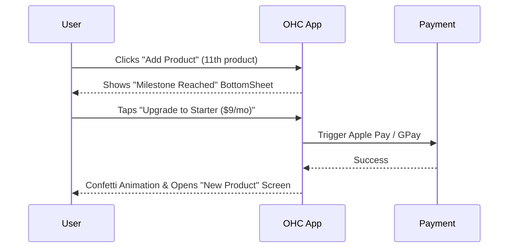

# [Architecture] Multi-Tenant SaaS Tier Architecture

## Problem Statement
Small business owners coming to OneHumanCorp (OHC) need clear, predictable, and fair pricing that grows with their business. A baker just starting out via Instagram DMs shouldn't pay the same as a thriving multi-location boutique. We need a tier system that reduces friction to zero for beginners (Free tier) while clearly surfacing the value of premium features as their needs (products, AI usage, storage) expand. Crucially, hitting a limit shouldn't feel punitive; it should feel like a natural business milestone that triggers an easy upgrade.

## Research Report
**Competitive Analysis:**
- **Shopify:** Starts at $39/mo (Basic). No free tier. Very high barrier to entry for casual sellers or hobbyists.
- **Wix:** Free tier exists but is heavily branded and limits storage. Premium starts around $16/mo. Upgrade paths can be confusing with too many add-ons.
- **Squarespace:** No free tier. Starts at $16/mo (Personal) but eCommerce starts at $23/mo.
- **GoDaddy:** Free basic site, but eCommerce is expensive and AI features are bolted on rather than integrated.

**Opportunity for OHC:**
OHC can dominate by offering a genuinely useful Free tier that lets anyone launch an idea in 10 minutes at no cost. AI features are the core differentiator, so access to AI Departments and Actions scales naturally with revenue-generating activity. Upgrades are presented contextually (e.g., when trying to add an 11th product, or when the AI agent hits its monthly limit).

## Design Doc

### Tier Structure

| Tier | Price | Products | AI Departments | AI Actions/mo | Storage | Custom Domain |
|---|---|---|---|---|---|---|
| Free | $0 | 10 | 1 | 100 | 500MB | No (OHC subdomain) |
| Starter | $9/mo | 100 | 3 | 1,000 | 5GB | Yes |
| Pro | $29/mo | Unlimited | 10 | Unlimited | 50GB | Yes + SSL |
| Business | $79/mo | Unlimited | Unlimited | Unlimited | 500GB | Yes + multi-domain |

### User-Facing Limits Explained

- **Products:** The number of unique items (physical, digital, or service) a user can list. Variants (size, color) do not count toward this limit.
- **AI Departments:** The number of specialized AI personas active simultaneously (e.g., "The Manager" for ops, "The Promoter" for marketing). Free users get 1 (usually Customer Success or Operations).
- **AI Actions/mo:** Any task performed by an AI agent (e.g., drafting a DM reply, generating a weekly report, auto-categorizing an order).
- **Storage:** Space used for product images, digital downloads, and website assets.
- **Custom Domain:** Whether the user can connect their own domain (`mybakery.com`) or must use an OHC subdomain (`mybakery.onehumancorp.com`).

### Upgrades and Hitting Limits

**Philosophy:** Limits are milestones, not paywalls. The system should anticipate limits and notify the user *before* they are blocked.

- **Approaching a Limit (80% / 90% threshold):**
  - "The Advisor" (Business Advisory AI) sends a celebratory notification: *"Great news! You're growing fast. You've used 90 of your 100 AI actions this month answering customer questions. Consider upgrading to the Starter plan for 1,000 actions so I can keep replying while you sleep."*
- **Reaching a Limit:**
  - **Products:** The "Add Product" button gets a small lock icon. Clicking it opens a bottom sheet: *"You've reached your 10-product limit! Upgrade to Starter to add up to 100 products."*
  - **AI Actions:** The AI gracefully degrades. For example, instead of auto-sending replies, it queues them in a "Drafts" folder for manual review, with a banner: *"AI Action limit reached. Upgrade to re-enable auto-replies."*
  - **Storage:** Image uploads fail gracefully with a prompt to upgrade or delete old assets.

### UI Flow & Presentation

**Mobile-First Upgrade Flow (375px):**
1. **Trigger:** User taps a locked feature or a limit notification.
2. **BottomSheet:** A sleek, glassmorphic bottom sheet slides up. No overwhelming comparison tables.
3. **Contextual Pitch:** The copy is specific to the trigger. (e.g., "Need more products?" or "Unlock a Custom Domain").
4. **Action:** One-tap upgrade via Apple Pay / Google Pay.

## Implementation Prompt

Implement the multi-tenant tier limits and upgrade flows in the mobile app and web dashboard.

**Acceptance Criteria:**
1. A new `Pricing & Plans` screen exists in the app settings, clearly showing current usage against tier limits.
2. When a user reaches their product limit, the "Add Product" action must be intercepted with a beautifully designed, contextual upgrade bottom sheet.
3. AI Action limits must be visually communicated in the agent UI (e.g., a progress bar showing `85/100 Actions used`).
4. Hitting the AI action limit must not crash the app or block the user from manually performing the task; the AI simply stops auto-executing and prompts for an upgrade.
5. All upgrade transactions must integrate seamlessly with native mobile payments (Apple/Google Pay) or Stripe Checkout (Web) and immediately unlock the restricted feature upon success.

## Priority
P1

## Estimated Scope
Medium
