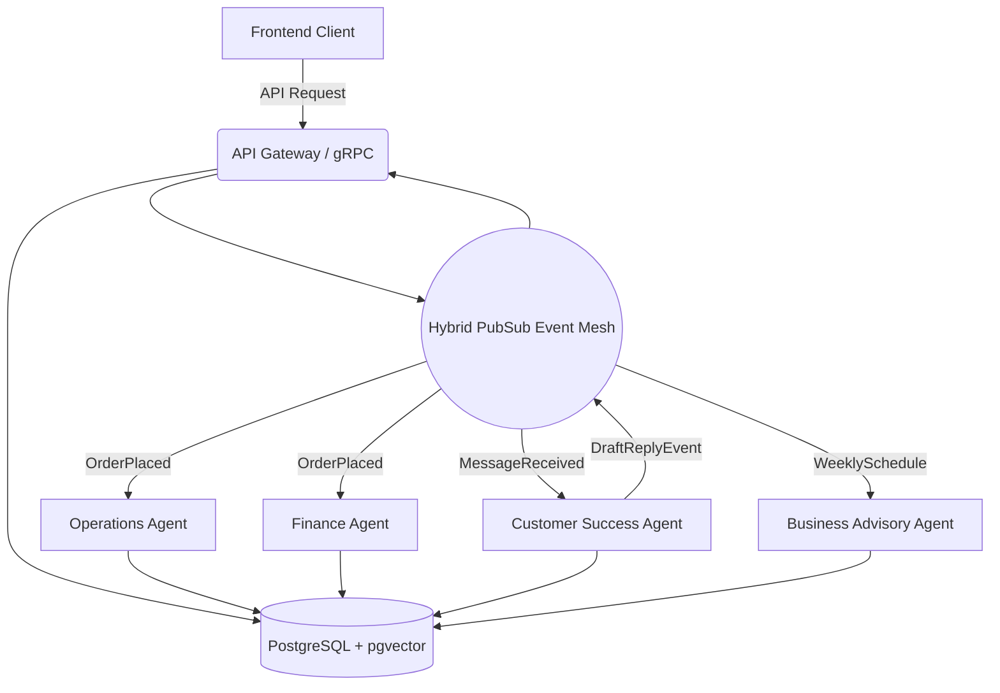

# Architecture Design: AI Agent Departments

**Problem Statement**: OHC business owners lack the technical expertise to manage the diverse operations of a small business efficiently. They need an automated, invisible system that handles marketing, sales, operations, customer success, finance, legal, and business advisory, so they can focus on their core product/service.

## Research Report
The core thesis of OneHumanCorp (OHC) is radical simplicity for non-technical users. Traditional platforms (Shopify, Wix) bolt on AI as chatbots or text generators. OHC treats AI as the fundamental operating system, organized into functional "Departments" that mirror a real business:
- **Operations ("The Manager")**: Order processing, bookings, inventory.
- **Marketing & Advertising ("The Promoter")**: Website design, SEO, social media.
- **Sales & Acquisition ("The Salesperson")**: Quotes, leads, referrals.
- **Customer Success ("The Ambassador")**: Message replies, review requests.
- **Finance & Payments ("The Accountant")**: Payments, reporting, billing.
- **Legal & Compliance ("The Protector")**: Policies, contracts, compliance.
- **Business Advisory ("The Advisor")**: Weekly health reports, insights.

This architecture enables a multi-agent system where specialized AI agents execute tasks autonomously or semi-autonomously based on tenant configuration, communicating asynchronously and utilizing shared state.

## Design Doc

### Architecture Overview

The AI Department architecture utilizes an event-driven, multi-agent mesh pattern.
- **Event Mesh**: All events (e.g., `OrderPlaced`, `MessageReceived`) are published to the Hybrid PubSub MCP (Redis for Cloud, Memory for Standalone).
- **Agent Workers**: Specialized agents subscribe to relevant topics. They operate independently, dequeueing tasks via PostgreSQL `SKIP LOCKED`.
- **Memory & State**: Agents access a shared pgvector database to retrieve historical context (customer interactions, past decisions) and update state.
- **Coordination**: Distributed locks (Redis Redlock) prevent conflicting actions (e.g., two agents trying to reply to the same message simultaneously).

### Mobile UX Flow (375px)

1.  **Dashboard Home**: The business owner sees a unified feed of Agent activity cards (e.g., "The Ambassador drafted 3 replies to Instagram DMs", "The Accountant processed 5 payments today").
2.  **Action Review**: Tapping a draft reply card opens a review screen. The owner can tap "Approve & Send" or edit the text natively.
3.  **Department Settings**: A simple settings menu allows toggling autonomy levels per department (e.g., "Auto-send order confirmations" vs "Review before sending").

## Implementation Prompt

Implement the underlying infrastructure to support the "Operations" and "Customer Success" AI departments as outlined in the design doc. The final deliverable must enable a user to see automated agent actions within their dashboard stream when specific business events occur (e.g., an order is placed, an email is received).
- Create the core event loop mechanism allowing agents to subscribe to these events invisibly in the background.
- Build the system that surfaces AI-generated actions (like draft replies) to the business owner's 375px mobile UI, allowing them to explicitly approve or manually override the action.
- Ensure that actions executed automatically are cleanly logged to the agent's history and visible in the unified feed without spamming the user.
- Acceptance criteria: A mocked "OrderPlaced" event must result in the Operations Agent appearing in the activity stream having logged an action, and a "MessageReceived" event must surface an actionable draft reply on the mobile dashboard.

**Priority**: P0
**Estimated Scope**: Large
