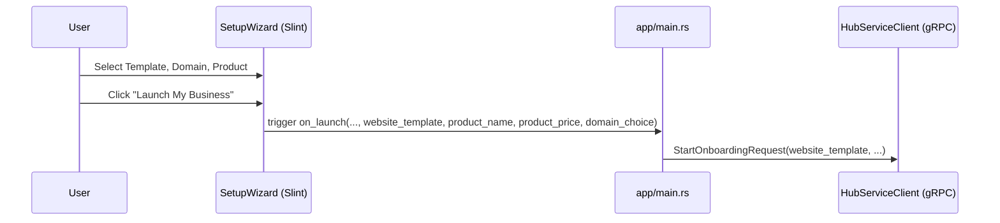

# [architecture] Wizard & Onboarding Form Improvements

## Title
Fix Wizard & Onboarding Form Data Propagation to Backend

## Problem Statement
The wizard & onboarding flow needs to accurately collect essential information during business setup, specifically focusing on template selection, custom domain configuration, and product details. Currently, the UI collects this data appropriately, but it fails to reach the backend correctly, breaking the initial configuration for non-technical small business owners who expect their chosen setup details to reflect immediately upon launch.

## Research Report
The existing codebase has partial implementations for collecting `website_template`, `domain_choice`, `product_name`, and `product_price`. The Slint UI (`src/app/setup_wizard.slint`) successfully captures this data. However, the Rust backend caller in `src/app/main.rs` contains a flaw where it calls `ui.get_website_template()`, `ui.get_product_name()`, `ui.get_product_price()`, and `ui.get_domain_choice()` to populate the request to the `StartOnboarding` gRPC method.

The Slint UI integration passes the correctly updated values as closure arguments to the `on_launch` handler, which should be used instead of calling the UI getters (which may not always reflect the instantaneous state at the time of invocation, or are mocked with empty strings during test contexts). Using the arguments passed to the `move |..., website_template, product_name, product_price, domain_choice|` closure ensures accurate data transmission.

## Design Doc

### Architecture Diagram

### UI Flow & Decisions
- **Mobile First UX:** The setup wizard flows sequentially and requires users to input standard info (business type, product).
- **AI Agent Integration:** The chosen product and domain configs are passed to the `HubServiceClient` to initialize the Operations and Marketing departments correctly.
- **Key Design Decision:** State binding. Relying on explicitly passed closure arguments over late-bound `ui.get_*()` calls ensures data integrity between the asynchronous frontend UI interactions and backend network dispatches.

## Implementation Prompt
Modify the `setup_wizard_ui.on_launch` handler in `src/app/main.rs`. Ensure that when defining the variables `req_website_template`, `req_first_product_name`, `req_first_product_price`, and `req_domain_choice`, they are assigned from the respective closure parameters (`website_template`, `product_name`, `product_price`, and `domain_choice`) instead of calling the `ui.get_*()` methods.

## Priority
P1

## Estimated Scope
Small
