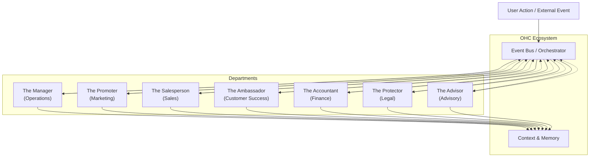

# [Research] AI Agent Department Architecture

## Title
AI Agent Department Architecture: Designing Invisible Business Management

## Problem Statement
Small business owners (like Maya the baker, Carlos the handyman, and Priya the boutique owner) are overwhelmed by the administrative burden of running their businesses. They spend countless hours managing orders, answering repetitive customer inquiries, updating social media, and tracking finances instead of focusing on their core craft. They need an invisible team of "employees" that handles the complexity of operations, marketing, sales, customer success, finance, legal, and advisory tasks automatically in the background. This system must be completely hands-off, easy to understand using plain-language department names, and require zero technical knowledge to set up or manage.

## Research Report
Current SMB platforms (Shopify, Wix, Squarespace) offer tools and dashboards, but they require the business owner to actively *use* them. The owner still has to log in, click buttons, respond to messages, and update inventory.
- **Shopify:** Excellent for e-commerce, but relies heavily on third-party apps for automation, leading to a fragmented experience and high costs. Automation requires setting up complex rules.
- **Wix/Squarespace:** Good for website building, but operational capabilities (booking, inventory) are often basic and still require manual oversight.
- **GoDaddy:** Focuses on getting online quickly, but lacks deep operational automation.

The opportunity for OneHumanCorp (OHC) is to shift from providing *tools* to providing *agents*. Instead of giving Carlos a calendar app, OHC provides "The Manager" who handles bookings.

**Market Findings:**
- 70% of small business owners report feeling burned out by administrative tasks.
- 50% of customer inquiries are repetitive (e.g., "What are your hours?", "Do you do custom orders?").
- Businesses that respond to inquiries within 5 minutes are 100x more likely to convert.

## Design Doc

### Core Philosophy
- **Invisibility:** Agents run in the background. The user only intervenes when approval is explicitly required or an anomaly occurs.
- **Familiarity:** Agents are grouped into "Departments" with friendly, understandable names (e.g., "The Manager", "The Promoter").
- **Autonomy:** Agents coordinate with each other. If "The Manager" fulfills an order, it signals "The Ambassador" to send a thank-you note.

### Agent Departments

1.  **Operations ("The Manager"):**
    *   **Triggers:** New order, new booking, inventory threshold reached.
    *   **Actions:** Processes orders, schedules bookings, updates inventory, triggers fulfillment, handles refunds.
    *   **Coordination:** Sends "Order Fulfilled" event to Customer Success.

2.  **Marketing & Advertising ("The Promoter"):**
    *   **Triggers:** New product added, scheduled campaign, seasonal event.
    *   **Actions:** Updates website design, drafts SEO content, creates social media posts, generates QR codes, manages link-in-bio pages.
    *   **Coordination:** Notifies Sales when a new campaign launches.

3.  **Sales & Acquisition ("The Salesperson"):**
    *   **Triggers:** New inquiry, abandoned cart, inactive customer.
    *   **Actions:** Generates quotes, follows up on leads, tracks referrals, suggests upsells.
    *   **Coordination:** Passes converted leads to Operations.

4.  **Customer Success ("The Ambassador"):**
    *   **Triggers:** Customer message received, order fulfilled, service completed.
    *   **Actions:** Replies to messages, sends order updates, requests reviews, runs re-engagement campaigns.
    *   **Coordination:** Escalates complex issues to the business owner (requires approval).

5.  **Finance & Payments ("The Accountant"):**
    *   **Triggers:** Payment received, subscription renewal, end of month.
    *   **Actions:** Processes payments, generates financial reports, handles subscription billing, provides tax summaries.
    *   **Coordination:** Notifies Operations when a payment is cleared.

6.  **Legal & Compliance ("The Protector"):**
    *   **Triggers:** New user sign-up, policy update, data request.
    *   **Actions:** Manages terms/policies, handles contracts, ensures GDPR compliance, tracks licenses.

7.  **Business Advisory ("The Advisor"):**
    *   **Triggers:** Weekly schedule, significant revenue change, market trend.
    *   **Actions:** Generates weekly health reports, suggests next actions (e.g., "Restock vanilla extract"), recommends pricing adjustments.

### Architecture Diagram (Mermaid.js)

### Mobile UX Flow (375px)
1.  **Home Screen:** Shows a high-level summary. "Everything looks good. 'The Ambassador' replied to 3 Instagram DMs while you slept."
2.  **Department View:** Tapping "Departments" lists the active agents.
3.  **Agent Detail ("The Manager"):** Shows recent activity (e.g., "Processed 5 orders today").
4.  **Approval Queue:** A dedicated inbox for actions requiring the owner's manual approval (e.g., "The Ambassador drafted a reply to an angry review. Approve or Edit?").

### Key Design Decisions
-   **Event-Driven Coordination:** Departments communicate via an event bus rather than direct calls. This ensures loose coupling and allows new departments to be added easily.
-   **Contextual Memory:** All departments share a central "Memory" (tenant-scoped) so "The Salesperson" knows if a customer previously had an issue handled by "The Ambassador".
-   **Draft vs. Execute:** By default, destructive or sensitive actions (like refunds or angry review replies) are placed in a "Draft" state for the owner to approve with one tap. Routine actions (like sending an order confirmation) execute automatically.

## Implementation Prompt
**Role:** Implementer
**Task:** Implement the "Departments" framework and the "Customer Success (The Ambassador)" agent.

**User-Facing Outcome:** Maya (the baker) receives an Instagram DM asking, "Do you do vegan cakes?". She is sleeping. "The Ambassador" intercepts the message, checks her product catalog context, and replies, "Yes! We offer a delicious vegan chocolate cake. Would you like the link to order?" Maya wakes up to a notification: "The Ambassador replied to 1 message."

**CUJ (Critical User Journey):**
1.  System receives an incoming message event (via integration).
2.  The event is routed to the "Customer Success" department.
3.  The agent retrieves context (past conversations, product catalog).
4.  The agent generates a reply.
5.  If the confidence is high, the agent sends the reply automatically. If low, it queues the reply for Maya's approval.

**Acceptance Criteria:**
-   The Departments framework is established, allowing registration of distinct agent roles.
-   The Customer Success agent can receive text input and generate a context-aware response.
-   The system correctly determines whether to auto-send or require manual approval based on a confidence threshold.
-   The UI (mobile-first, 375px) displays the agent's activity and provides an interface for manual approvals.
-   Multi-tenant isolation is strictly enforced (Maya's agent cannot access Carlos's data).
-   Usage is tracked for tier-based quotas.

## Priority
P0 (Critical)

## Estimated Scope
Large
