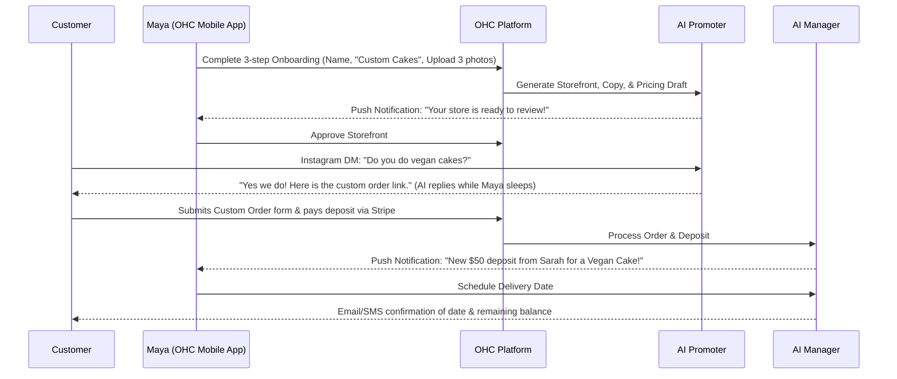
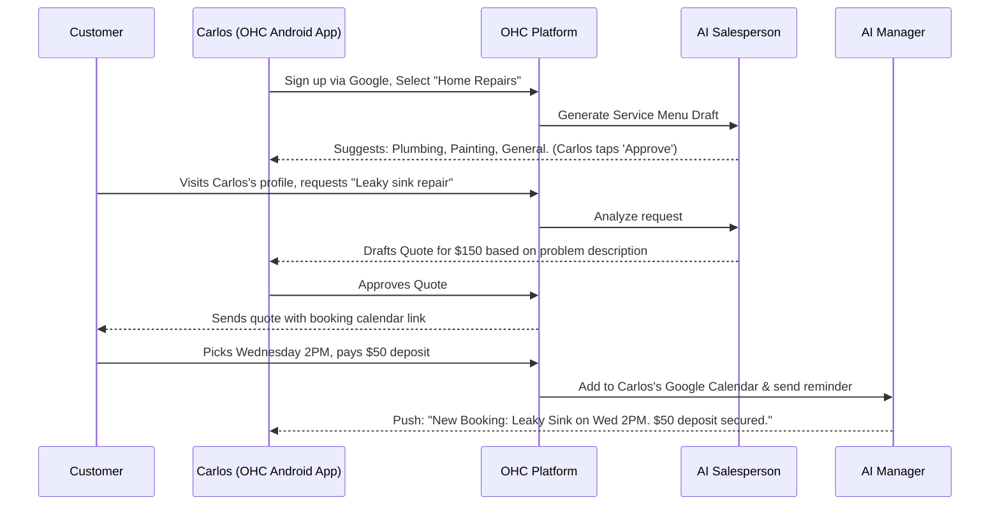
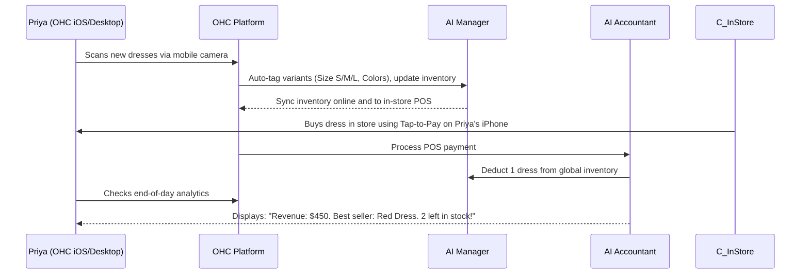

# [architecture] Business Journey Architecture

## Title
Business Journey Architecture: End-to-End Persona Workflows and Growth Loops

## Problem Statement
Small business owners (our core personas like Maya the baker, Carlos the handyman) face immense cognitive load and friction when setting up a digital presence. Existing platforms (Shopify, Wix) are designed for tech-savvy users and require multiple manual steps (domain setup, theme customization, payment gateway configuration). We need to map out the complete, frictionless, zero-code, AI-driven business journey for our core personas—from their first interaction with OneHumanCorp to becoming retained, paying, and referring users. If our onboarding and lifecycle flows contain friction, non-technical users will abandon the platform before reaching activation.

## Research Report
### Competitive Analysis
- **Shopify**: High activation energy. Requires understanding of themes, plugins, and separate payment gateways. Time to first sale is typically days/weeks. Focuses on tech-savvy or established SMBs.
- **Wix/Squarespace**: Template-driven but still requires manual dragging, dropping, and copywriting. Often leads to choice paralysis for non-designers.
- **GoDaddy/Zyro**: Faster setup but limited functionality and poor mobile management experience.
- **OHC's Differentiation**: Absolute zero technical knowledge required. The AI "Promoter" and "Manager" departments build the store, write the copy, and manage the backend. Management is truly mobile-first (100% functionality on a 375px screen).

### Journey Stages Analyzed
1. **Acquisition**: How users find us (TikTok, Instagram, referrals).
2. **Onboarding**: The < 10 minute wizard to get live. Minimal inputs required (Business Name, Type, 1-3 Photos).
3. **Activation**: First product/service added, first deposit/payment received.
4. **Retention**: AI-driven daily/weekly push notifications (e.g., "The Advisor" sending weekly health reports, "The Manager" sending order updates).
5. **Revenue**: Free -> Starter upgrade trigger (e.g., needing custom domain or exceeding 100 products/1,000 AI actions).
6. **Referral**: Viral loop (e.g., "Powered by OHC" link, referral program for other business owners).

## Design Doc

### Architecture Diagrams (Mermaid.js)

#### 1. Maya (Baker) - Custom Orders & Deposit Flow

#### 2. Carlos (Handyman) - Service Booking Flow

#### 3. Priya (Boutique) - In-Store & Online Sync Flow

### UI Wireframes & Mobile UX Flow (375px First)

- **Onboarding Flow (The "10-Minute" Wizard):**
  - **Screen 1**: "What's the name of your business?" (Large text input, native keyboard).
  - **Screen 2**: "What do you do?" (Pill selections: Baking, Handyman, Tutor, Retail, etc.).
  - **Screen 3**: "Upload 1-3 photos of your work." (Native image picker).
  - **Screen 4 (Loading):** "Our AI agents are building your business..." (Glassmorphism progress indicator, smooth animations).
  - **Screen 5**: "You're Live!" (Confetti animation, big "View My Store" button).

- **Daily Dashboard (The Hub):**
  - **Top Card**: "Today's Revenue" with big typography (Outfit font).
  - **Middle Section (The Inbox)**: Unified messages from Instagram, WhatsApp, Email, with "AI Drafts Ready" badges.
  - **Bottom Section**: Agent activity feed ("The Advisor suggests: Add a Mother's Day promo").

### AI Agent Integration Points
- **Onboarding (Promoter & Salesperson)**: Instantly generates website structure, service lists, and copy based on minimal inputs.
- **Daily Operations (Manager & Success)**: Drafts responses to customer inquiries, auto-updates inventory, coordinates bookings.
- **Growth (Advisor)**: Pushes actionable notifications (e.g., "You hit 100 sales! Let's ask them for reviews.").

### Key Design Decisions
1. **Deferred Configuration**: We do not ask for Stripe credentials or custom domain setup during onboarding. The goal is "Store Live" in under 10 minutes. Payments and domains are prompted contextually when they are actually needed (e.g., when the first order is placed or traffic increases).
2. **Unified Inbox**: Non-technical users struggle with managing 5 different apps. The OHC app aggregates Instagram DMs, SMS, and emails into one view where AI drafts responses.
3. **Conversational Interface Alternative**: Instead of standard settings menus, users can chat with "The Manager" to change things (e.g., "Add a 10% discount for next week").
4. **Push Notification Reliance**: Mobile users don't constantly check dashboards. We rely on intelligent, low-frequency, high-value push notifications to bring them back to the app.

## Implementation Prompt
**Objective**: Build the user onboarding flow (Acquisition -> Activation) reflecting the Business Journey Architecture.

**Acceptance Criteria**:
1. Implement the 3-step mobile-first onboarding wizard in Flutter (`//srcs/app/`).
2. Integrate with the backend `Tenant` and `BusinessProfile` creation APIs.
3. Trigger an asynchronous AI Job (via PostgreSQL `SKIP LOCKED` queue) to generate the initial storefront configuration using the "Promoter" agent.
4. Display a loading screen with appropriate micro-animations while the AI job processes, transitioning to the "You're Live!" screen upon completion.
5. Ensure 100% functional layout on a 375px viewport (no horizontal scrolling).
6. Implement full E2E test verifying a user can sign up, complete the wizard, and view the generated storefront.

## Priority
P0 (Critical)

## Estimated Scope
Large
