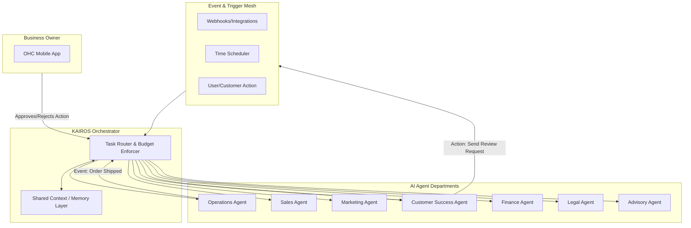
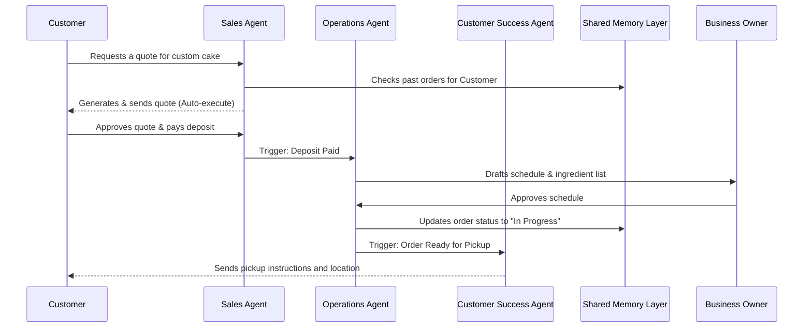

### Title
Architectural Design for OHC AI Agent Departments

### Problem Statement
Running a small business is overwhelmingly complex for a non-technical owner. Maya the Baker, Carlos the Handyman, and Fatima the Food Cart Operator need more than just software—they need an active team running the business in the background while they focus on their craft. Currently, AI capabilities are often disjointed or reactive. The OHC platform must architect a unified system of "AI Agent Departments"—Operation, Marketing, Sales, Customer Success, Finance, Legal, and Business Advisory—that operate invisibly in the background, communicating with each other seamlessly, and presenting a plain-language, friendly "manager" persona to the business owner. We need a clear architectural design detailing how these departments are triggered, how they coordinate, how they manage memory, and how their actions are budgeted and approved.

### Research Report
#### Context and Personas
The business journey and AI operations are evaluated against the following core personas:
1.  **Maya (Home Baker, 28)**: Needs the Operations Agent to handle Instagram DM orders ("do you do vegan cakes?") and the Marketing Agent to post appealing cake photos.
2.  **Carlos (Handyman, 42)**: Relies on the Sales Agent for automated quote generation and the Operations Agent for scheduling and calendar sync.
3.  **Priya (Boutique Owner, 35)**: Benefits from the Customer Success Agent running re-engagement campaigns and the Finance Agent summarizing daily tap-to-pay revenue.
4.  **Leo (Music Tutor, 22)**: Needs the Operations Agent to automate meeting links and follow up with inactive students.
5.  **Fatima (Food Cart Operator, 50)**: Requires extreme simplicity—the Operations Agent handles pre-orders and pickup notifications in multiple languages automatically.

#### Agent Departments Breakdown
- **Operations ("The Manager")**: Order processing, inventory tracking, fulfillment coordination, refund processing.
- **Marketing & Advertising ("The Promoter")**: Content creation, SEO optimization, social media drafting, link-in-bio page updates.
- **Sales & Acquisition ("The Salesperson")**: Lead follow-up, quote generation, up-selling, referral tracking.
- **Customer Success ("The Ambassador")**: Message replies, review requests, order updates, handling customer queries.
- **Finance & Payments ("The Accountant")**: Payment tracking, financial summaries, subscription billing management, tax reports.
- **Legal & Compliance ("The Protector")**: Terms of service generation, contract management, GDPR compliance tracking.
- **Business Advisory ("The Advisor")**: Weekly health reports, pricing recommendations, seasonal trend analysis.

#### Key Architectural Requirements
1.  **Triggers**: Departments must respond to Event-Driven triggers (e.g., "new order placed"), Scheduled triggers (e.g., "weekly summary generation"), and On-Demand triggers (e.g., owner asks "how did we do today?").
2.  **Coordination**: Agents must communicate across departments. For example, Operations finishes fulfilling an order, which triggers Customer Success to send a delivery confirmation and review request.
3.  **Memory and Context**: Agents need a shared memory layer (likely vector-based) to recall past interactions (e.g., "Customer X prefers vegan options").
4.  **Approval Workflows**: High-stakes actions (like spending money or sending marketing blasts) require an "Approve/Reject" flow from the owner, whereas low-stakes actions (like marking an order as 'Preparing') can be auto-executed.
5.  **Throttling and Budgets**: AI usage must be metered per tenant to enforce tier limits (e.g., Free tier: 100 actions/mo) gracefully.

### Design Doc

#### AI Agent Interaction Architecture

#### Department Workflow: The Sales to Ops to CS Flow

#### Mobile UX Flow Notes
- **The "Activity Feed" View**: The primary interface for the business owner is an activity feed, not a complex dashboard. It looks like a friendly chat interface.
- **1-Tap Approvals**: When an agent drafts an action (e.g., a marketing post), the owner sees a card with "Approve", "Edit", or "Reject". Actionable, premium, and simple.
- **Department Personas**: Each agent has a distinct, friendly avatar and name to make them relatable to the non-technical owner.

### Implementation Prompt
**To Implementer Agent:**
Implement the core KAIROS Orchestrator and the foundational structure for the "Operations" and "Customer Success" AI Agent departments. Create the underlying orchestration logic that routes incoming events (e.g., `order.placed`, `message.received`) to the appropriate agent department. Implement a shared memory/context interface that both agents can read from and write to. Build the "Activity Feed" UI for the mobile app (375px first view) that displays agent actions. Ensure that actions requiring approval appear as interactive cards with "Approve" and "Reject" buttons, updating optimistically. The system must enforce tenant-level AI action budgets. Do not prescribe specific database schemas or LLM provider endpoints; focus on the event routing, agent interfaces, and the user-facing approval flow. Include comprehensive unit and E2E tests verifying an event triggering an agent, creating a draft action, and the owner approving it via the UI.

**Priority**: P0
**Estimated Scope**: Large
