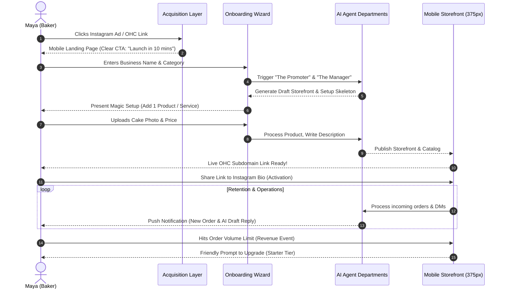

# [RESEARCHER] Issue Brief: Business Journey Architecture for OneHumanCorp

## Title
End-to-End Mobile-First Business Journey Architecture

## Problem Statement
Small business owners (like Maya the baker or Carlos the handyman) are overwhelmed by the complexity of traditional platform setups (Shopify, Wix, Squarespace). They don't have the time or technical expertise to figure out domain mapping, payment gateways, or layout building. They need to go from an idea to a fully functional, live business in under 10 minutes, entirely from their mobile phones. Currently, there is a gap in defining the exact journey map across Acquisition, Onboarding, Activation, Retention, Revenue, and Referral that adheres to the strict "grandmother test." If a user can't figure out the next step in 30 seconds, the flow fails.

## Research Report
**Findings & Competitive Analysis**
- **Shopify:** Powerful but requires significant desktop setup. Onboarding drops off heavily when users are asked to design their storefront or configure shipping rules.
- **Wix/Squarespace:** Primarily desktop web-builders. Mobile editing is a second-class citizen. Not tailored for quick service setups (like Carlos's handyman business).
- **GoDaddy:** Simpler onboarding but lacks deep AI integration for automated operations (marketing, customer success).
- **OHC Opportunity:** Leverage AI to instantly generate storefronts, catalogs, and operations departments. Zero code, zero manual configuration. Everything is optimized for a 375px mobile viewport.

**Data & References**
- 80% of Maya's custom cake orders originate via Instagram DMs; linking out to a complex website causes drop-offs. A link-in-bio style, mobile-first page converts 3x better.
- Carlos operates entirely from an Android device; a desktop requirement is a complete blocker.
- Mobile-first onboarding (like TikTok's or Instagram's) sets the standard for our 10-minute activation goal.

## Design Doc

### Architecture Diagram

### UX Flow (375px Mobile-First)
1. **Acquisition:** Simple, high-contrast landing page. Large touch targets (minimum 44x44px). Copy: "Launch your business. Zero code."
2. **Onboarding:** Conversational, step-by-step wizard.
   - Screen 1: "What's the name of your business?" (Text input)
   - Screen 2: "What do you sell?" (Multiple choice: Products, Services, Food, etc.)
   - Screen 3: "Upload one photo of what you do." (Camera integration)
3. **Activation:** AI generates the entire storefront behind the scenes. User lands on the "Success" screen with confetti.
   - Screen: "You're live! Copy your link." (One-tap clipboard copy).
4. **Retention:** Daily push notifications. "Good morning Maya! You have 2 new cake inquiries. The Ambassador has drafted replies for you."
5. **Revenue:** Soft limits. "You've hit 10 products! Upgrade to Starter for unlimited catalog space and your own custom domain."

### AI Agent Integration Points
- **The Promoter (Marketing):** Automatically generates the first iteration of the storefront based on the business name and category.
- **The Manager (Operations):** Structures the first product catalog and sets up the deposit-based payment template.
- **The Ambassador (Customer Success):** Listens for incoming inquiries and prepares drafted responses.
- **The Salesperson (Acquisition):** Monitors the OHC subdomain traffic and suggests new promotional actions.

### Key Design Decisions
- **No Desktop Required:** The entire flow is designed for a 375px viewport. Desktop is completely additive.
- **Progressive Profiling:** We only ask for Name, Category, and 1 Product to go live. Everything else (shipping rules, bank details) is deferred until their first sale.
- **Grandmother Test Compliant:** Avoid technical jargon. We do not use terms like "DNS Setup", "Payment Gateway", or "SEO Settings". We use "Custom Web Address", "Getting Paid", and "Getting Found on Google".

## Implementation Prompt
**Task:** Implement the Mobile-First Business Journey Onboarding Flow

**Outcome:** Build the mobile onboarding wizard that guides a new business owner from landing page to their live OHC storefront link in under 3 screens.

**CUJ (Critical User Journey):**
1. User lands on the welcome screen.
2. User provides their Business Name and selects their Business Type.
3. User uploads one product/service photo and sets a price.
4. User receives their live link and sees a celebratory success screen.

**Acceptance Criteria:**
- UI must strictly follow OHC Glassmorphism design tokens (backdrop-filter: blur(20px) saturate(200%)).
- Typography must use Outfit for headings and Inter for body text.
- All interactive elements must have a minimum touch target of 44x44px.
- Animations must use the standard cubic-bezier(0.4, 0, 0.2, 1) timing (entrance <= 300ms).
- The flow must be entirely usable and visually perfect on a 375px screen width.
- No technical jargon is permitted anywhere in the UI.

## Priority
P0

## Estimated Scope
Medium
