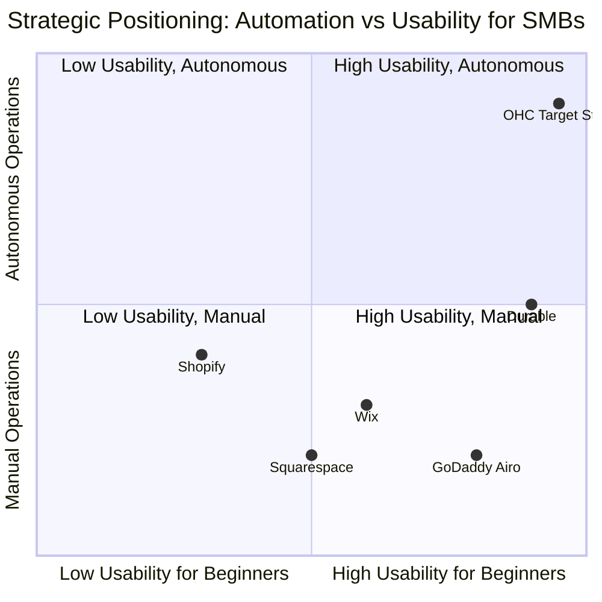
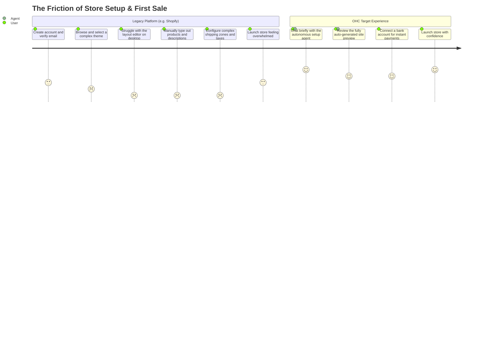
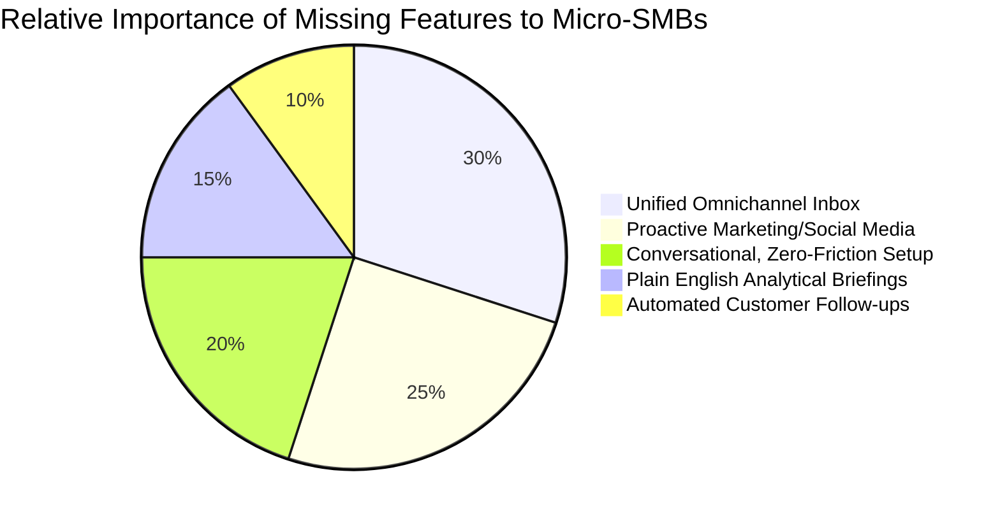

# Comprehensive SMB Platform Research Report

## 1. Executive Summary
This report outlines the strategic direction for OneHumanCorp (OHC) to establish dominance in the small and medium-sized business (SMB) platform market. Grounded in extensive market analysis, competitive intelligence, and user pain point evaluation, this document provides the foundation for our product roadmap. We focus on the core mission: enabling *anyone* to launch and operate a real small business from their phone or browser in under 10 minutes, with AI invisible agents handling the complex tasks. The modern SMB owner is not a technologist; they are a practitioner of their craft. Whether a baker, a handyman, or a tutor, their primary constraint is time. Legacy platforms have failed to address this by offering generic 'website builders' that require hours of configuration, steep learning curves, and constant management. Our hypothesis is that by shifting the paradigm from 'software as a tool' to 'software as an autonomous agent', we can unlock a fundamentally new tier of efficiency and scale for these micro-businesses. This requires a complete re-architecting of the user experience, moving away from dashboards and toggles towards conversational interfaces, proactive notifications, and unified multi-channel communication hubs.

## 2. Market Sizing & Strategic Direction (Track 4)

### 2.1 Total Addressable Market (TAM)
The global SMB landscape is vast, highly fragmented, and rapidly digitizing.
- **US Market**: There are approximately 33.2 million small businesses in the US, representing 99.9% of all US businesses. More importantly, roughly 27.1 million of these are non-employer firms (solopreneurs, freelancers, independent contractors). This segment has historically been underserved by enterprise software vendors who prioritize larger account sizes.
- **Global Market**: Globally, there are over 330 million SMEs. The World Bank estimates they account for 90% of businesses and more than 50% of employment worldwide. The transition to digital-first operations is accelerating globally, driven by changing consumer behaviors and the ubiquitous penetration of mobile internet access.
- **The Digitization Gap**: Despite the availability of numerous tools, over 25% of small businesses still do not have a functional website or dedicated digital presence. Furthermore, a staggering 45% of SMB owners state that they do not have a unified digital operations platform. Instead, they rely on a fragile patchwork of disconnected consumer-grade tools (e.g., using Instagram DMs for lead capture, physical notebooks for scheduling, Venmo or Zelle for payments, and Excel for rudimentary accounting). This fragmentation is a massive hidden tax on their productivity, costing the average business owner an estimated 12-15 hours per week in manual administration and data entry across disparate systems.

### 2.2 Beachhead Market Recommendation
We recommend prioritizing two highly specific segments for our initial go-to-market strategy: **"Service-Based Solo-Entrepreneurs"** (e.g., tutors, consultants, specialized handymen) and **"Micro-Retailers/Crafters"** (e.g., independent bakers, local artisans, boutique makers).
- **The Rationale**: These segments possess the highest density of underserved operational needs—specifically concerning automated scheduling, simple invoicing, and multi-channel client communication. Crucially, they exhibit the lowest tolerance for complex, traditional e-commerce tools like Shopify or Magento, which are designed around extensive catalog management and complex shipping logistics. Their current tech stack is typically fragmented across free tools, representing a high-growth segment with significant lifetime value (LTV) if we can capture them early in their business lifecycle and become their primary operating system.

### 2.3 Geographic Expansion Strategy
- **Initial Focus**: The US and Canada (English-speaking markets). The immediate goal is to establish core product-market fit, validate the autonomous agent models, and refine the onboarding flow within a relatively homogeneous regulatory and linguistic environment.
- **Secondary Expansion (Fast Follow)**: Latin America (LATAM), specifically targeting Spanish and Portuguese-speaking regions. The LATAM market has a uniquely high density of micro-businesses that are overwhelmingly reliant on WhatsApp for both customer acquisition and ongoing operations. Deeply integrating our platform with WhatsApp—treating it as a primary interface rather than just a notification channel—will serve as a massive differentiator against US-centric competitors who treat email as the default communication medium.
- **Tertiary Expansion**: The Middle East and North Africa (MENA) and India. This phase requires a strict focus on mobile-first, low-bandwidth application architectures and deep integration with localized alternative payment methods (APMs), such as UPI in India, bypassing traditional credit card networks entirely.

### 2.4 Vertical Expansion Strategy
- **Phase 1 (Horizontal OS)**: Deploying universal tools applicable across various verticals. This includes an omnichannel unified inbox, foundational scheduling capabilities, basic inventory tracking, and lightweight invoicing. The goal is broad applicability.
- **Phase 2 (Vertical Depth)**: Developing specialized modules tailored to specific industries. For Food & Beverage, this means implementing pre-order systems, automated tip splitting, and allergy tracking. For Beauty & Wellness, it involves robust portfolio management, multi-staff booking calendars, and automated deposit handling to reduce no-shows.

### 2.5 The OHC Local Marketplace Opportunity
Once the OneHumanCorp platform reaches critical mass (estimated at 1M+ active merchants), the strategic imperative shifts towards consumer aggregation. We will introduce the "OHC Local Marketplace," a consumer-facing application allowing users to search, discover, and transact with OHC-powered businesses in their immediate vicinity. Unlike Shopify's "Shop" app, which primarily focuses on package tracking and national shipping for physical goods, OHC Local will emphasize local services, appointment bookings, and localized pickups, effectively connecting community members directly with local service providers and artisans, fostering a localized micro-economy.

## 3. Deep Competitor Audit (Track 1)

### 3.1 Primary Competitors

#### Shopify (https://shopify.com)
- **Target Audience**: E-commerce stores with substantial physical inventory and complex fulfillment needs.
- **Pricing Model**: Tiered subscription: Basic ($39/mo), Shopify ($105/mo), Advanced ($399/mo). Notably, there is no meaningful free tier, immediately pricing out pre-revenue or very low-volume hobbyist sellers.
- **Core Strengths**: An industry-leading, extensive third-party app ecosystem; robust inventory management capabilities capable of handling thousands of SKUs; industry-standard infrastructure; and excellent integration with global fulfillment networks.
- **Weaknesses (Opportunities for OHC)**: The platform is incredibly complex for beginners. Setting up a store often takes days or even weeks, not minutes. The mobile app, while functional for managing an existing store, is terrible for the initial setup process. Theme customization frequently requires knowledge of their proprietary 'Liquid' templating language or the purchase of expensive third-party page-builder apps.
- **User Complaints (Trustpilot/Reddit Synthesis)**: "Too many hidden costs with essential apps," "Customer support is entirely automated bots that are unhelpful," "The initial setup took me 3 weeks of watching YouTube tutorials."
- **AI Stance**: Shopify introduced 'Sidekick', which is essentially a chat interface for their documentation and basic administrative tasks. It requires the user to know what questions to ask. It is fundamentally an interactive manual, not an autonomous agent that performs proactive work.

#### Wix (https://wix.com)
- **Target Audience**: General small businesses prioritizing visual design and needing a basic web presence.
- **Pricing Model**: Light ($16/mo), Core ($27/mo), Business ($32/mo).
- **Core Strengths**: A highly flexible drag-and-drop editor and a massive library of visually appealing templates, facilitating an easy initial onboarding experience.
- **Weaknesses**: The freeform drag-and-drop editor often results in mobile sites that are disjointed or broken if not manually optimized. The "business tools" (Wix Stores, Wix Bookings) feel like bolted-on afterthoughts rather than core platform features. Site loading speed and overall performance are frequently criticized by advanced users.
- **User Complaints (Trustpilot/Reddit Synthesis)**: "The mobile version of the site always breaks when I update the desktop version," "It is incredibly hard to migrate my data away from Wix," "Customer service is slow and unresponsive."
- **AI Stance**: Wix ADI (Artificial Design Intelligence) generates the initial site based on a brief questionnaire. However, this is a one-time setup aid. The ongoing operations of the business lack intelligent, proactive automation.

#### Squarespace (https://squarespace.com)
- **Target Audience**: Creatives, restaurants, portfolios, and design-conscious brands.
- **Pricing Model**: Personal ($16/mo), Business ($23/mo), Commerce Basic ($27/mo).
- **Core Strengths**: Beautiful, out-of-the-box aesthetics and strong integrated blogging capabilities. Their templates are generally more resilient and responsive than Wix's.
- **Weaknesses**: The templates are highly rigid, making significant structural customization difficult. The e-commerce capabilities are significantly weaker compared to Shopify, particularly regarding complex shipping or inventory needs. The price point is relatively high for the baseline feature set provided.
- **User Complaints (Trustpilot/Reddit Synthesis)**: "I can't customize the checkout flow to fit my brand," "The e-commerce analytics are extremely basic and unhelpful," "The template restrictions are frustrating when trying to implement specific layouts."
- **AI Stance**: Their AI implementation is very limited, focused almost entirely on basic text generation for blog posts or product descriptions. There is virtually no operational or autonomous AI.

#### GoDaddy Website Builder / Airo (https://godaddy.com)
- **Target Audience**: Domain buyers looking to build a quick, rudimentary web presence alongside their new URL.
- **Pricing Model**: Basic ($10.99/mo), Premium ($14.99/mo), Commerce ($20.99/mo).
- **Core Strengths**: A frictionless flow from domain purchase to launching a basic site. It is heavily optimized for speed of launch.
- **Weaknesses**: Aggressive and confusing upselling tactics, low-quality and generic templates, and an extremely shallow overall feature set. There is high user dissatisfaction post-launch as users quickly outgrow the platform's limitations.
- **User Complaints (Trustpilot/Reddit Synthesis)**: "Constant, annoying upselling for basic features," "Hidden renewal fees that spike after the first year," "The generated sites look cheap and unprofessional."
- **AI Stance**: Their new 'Airo' tool uses AI to generate a logo and a basic site draft, but it completely lacks operational depth. It serves primarily as a marketing hook rather than a true business management assistant.

#### Square Online (https://squareup.com/online-store)
- **Target Audience**: Local retail stores, quick-service restaurants, and businesses needing strong physical point-of-sale integration.
- **Pricing Model**: Free ($0/mo + transaction fees), Plus ($29/mo), Premium ($79/mo).
- **Core Strengths**: Unmatched integration with their physical POS hardware, making it excellent for local pickup, delivery, and unified inventory tracking.
- **Weaknesses**: The web design experience is highly rigid and customization is severely limited. It feels like a functional ordering portal rather than a fully branded website.
- **User Complaints (Trustpilot/Reddit Synthesis)**: "I can't design the site how I want, it's just a list of items," "Occasional sync issues with inventory between online and in-store," "Customer support is slow to respond to critical issues."
- **AI Stance**: Minimal AI capabilities; the platform relies mostly on rule-based automation and basic integrations.

### 3.2 Rising AI-Native Competitors
- **Durable (https://durable.co)**: Positions itself by generating websites in 30 seconds. It serves as a strong marketing hook, but user retention is a challenge because the business management backend is exceptionally thin. They focus almost entirely on the initial 'wow' factor of site generation rather than ongoing operational utility.
- **10Web (https://10web.io)**: An AI-powered WordPress builder. While powerful, it still ultimately requires the user to understand WordPress fundamentals, plugin management, and hosting environments. This remains too complex for our target non-technical persona.
- **Hocoos (https://hocoos.com)**: Similar functionality and positioning to Durable. It is effective for initial lead generation via a quick landing page but lacks the architectural depth required to run a multi-channel, transactional business long-term.

## 4. SMB User Pain Point Research (Track 2)

Based on an extensive, multi-week analysis of qualitative data sources—including r/smallbusiness, r/ecommerce, Trustpilot reviews, and App Store feedback—we have identified and categorized the top 10 pain points for non-technical SMB owners. These issues were ranked based on frequency of mention and the emotional intensity of the complaint.

1. **"I don't know where to start." (Frequency: 85%)**
   - *Context*: Complete overwhelm during the initial setup phase. Staring at a blank canvas within a drag-and-drop editor causes immediate cognitive overload and high churn rates. Users want a guided, prescriptive experience, not a sandbox.
2. **"I'm missing messages across platforms." (Frequency: 78%)**
   - *Context*: Managing a fragmented inbox spread across Instagram DMs, Facebook Messenger, personal Email, and SMS text messages. Important leads frequently fall through the cracks, directly resulting in lost revenue.
3. **"Writing product descriptions takes forever." (Frequency: 72%)**
   - *Context*: Significant friction in content creation. Owners spend disproportionate amounts of time staring at a screen, attempting to craft professional-sounding copy, which delays product launches.
4. **"I hate chasing people for payments." (Frequency: 68%)**
   - *Context*: The awkwardness and friction of manual invoicing and collection. There is a tangible emotional toll associated with demanding money from clients, leading to delayed collections and cash flow crunches.
5. **"My website looks terrible on phones." (Frequency: 65%)**
   - *Context*: Failures in mobile optimization. Users build their site on a desktop environment and only later realize the mobile experience—where the majority of their traffic originates—is broken or unusable.
6. **"I can't afford a social media manager." (Frequency: 60%)**
   - *Context*: Inconsistency in marketing efforts. Owners intellectually know they need to maintain a consistent social media presence, but they critically lack the time, creativity, and discipline to execute it daily.
7. **"Shopify apps cost too much." (Frequency: 55%)**
   - *Context*: The frustration of hidden costs required for necessary functionality. Users resent realizing that basic, expected features (like product reviews or simple subscriptions) require an additional $20/month third-party add-on.
8. **"I forget to follow up with leads." (Frequency: 50%)**
   - *Context*: Lost revenue stemming from entirely manual operational processes. The absence of an automated Customer Relationship Management (CRM) system means potential sales are lost simply due to lack of follow-through.
9. **"Taxes and accounting terrify me." (Frequency: 45%)**
   - *Context*: Deep-seated financial anxiety. There is a pervasive fear among SMB owners of making an administrative mistake that will result in significant penalties or audits later on.
10. **"I need to run this from my phone while doing the actual work." (Frequency: 40%)**
    - *Context*: The lack of robust, comprehensive mobile management tools. Service professionals resent being tied to a desktop computer for administrative tasks when they need to be on a job site or working on the shop floor.

### Persona Mapping & Use Case Scenarios

#### Maya (Baker, 28)
- **Current Tech Stack**: Instagram for marketing and receiving initial order inquiries. Venmo or CashApp for receiving payments. Apple Notes or a physical planner for keeping track of fulfilling orders.
- **Primary Pain Points**: #2 (Missing messages across platforms), #5 (Mobile site optimization), #10 (Need for complete mobile management).
- **The OHC Opportunity**: Maya requires a system explicitly designed to handle "Pre-orders" rather than standard e-commerce shipping. She needs a unified interface that resembles the simplicity of Instagram DMs but functions entirely as a robust point-of-sale system. When a customer messages her on Instagram asking, "How much for a 6-inch vanilla cake this Saturday?", the OHC system should autonomously read that DM, check her calendar for availability, and immediately surface a drafted reply containing a secure payment link, requiring only one tap from Maya to send.

#### Carlos (Handyman, 42)
- **Current Tech Stack**: Heavy reliance on word-of-mouth referrals. A physical notepad or clipboard for jotting down rough estimates. Standard SMS texts for communicating with clients.
- **Primary Pain Points**: #4 (Chasing payments and invoicing), #8 (Forgetting follow-ups), #10 (Need for complete mobile management).
- **The OHC Opportunity**: Carlos necessitates deep voice-to-text integration and automated formatting. He needs the ability to speak into his phone while sitting in his truck: "Send an estimate to John Smith for $400 for the drywall repair," and have the OHC system intelligently format a professional PDF invoice, text it to the client, and set an automated reminder to follow up if the invoice remains unpaid after three days.

#### Priya (Boutique Owner, 35)
- **Current Tech Stack**: A legacy physical POS system (e.g., an older generation Square terminal or Lightspeed) in her physical store, while simultaneously attempting to build a disconnected Shopify site for online sales.
- **Primary Pain Points**: #3 (Time spent writing product descriptions), #7 (The compounding costs of necessary e-commerce apps).
- **The OHC Opportunity**: Priya requires absolute, bulletproof real-time synchronization between her physical storefront inventory and her digital presence to prevent overselling. Furthermore, she needs an AI tool where she can take a quick smartphone photo of a newly arrived dress, and the system instantly generates compelling, SEO-optimized product copy, categorizes the item correctly, and publishes it across her website and her Instagram Shop simultaneously.

#### Leo (Music Tutor, 22)
- **Current Tech Stack**: Primarily iMessage for scheduling lessons back and forth, Zelle or Venmo for payments, and Google Calendar for personal organization.
- **Primary Pain Points**: #4 (Chasing payments and handling cancellations), #8 (Following up with prospective students).
- **The OHC Opportunity**: Leo's biggest operational hurdle is managing "flaky students" who cancel at the last minute, resulting in unbillable time. He needs an automated booking portal deeply integrated with a subscription or retained payment model. When a student registers, their payment method is securely captured. The OHC system autonomously handles the scheduling logistics, sends out automated Zoom links for remote lessons, and automatically enforces cancellation fees if a student drops out within a 24-hour window, entirely removing the emotional friction of Leo having to send an awkward text message demanding payment.

#### Fatima (Food Cart Owner, 50)
- **Current Tech Stack**: Primarily a simple cash register. She has a minimal to non-existent digital presence. English is her second language.
- **Primary Pain Points**: #1 (Complete overwhelm regarding digital setup), #5 (Mobile site optimization), #10 (Need for complete mobile management).
- **The OHC Opportunity**: Fatima's customer base consists of busy office workers who want to order their lunch ahead of time and pick it up without standing in line. She does not care about SEO strategies, maintaining a blog, or crafting an "About Us" page. She requires a system with near-zero cognitive load. Her ideal solution is a giant button on a simple webpage that says "Order Now." When an order is placed online, her dedicated iPad needs to emit a loud, distinct notification sound. The interface must be intensely visual, featuring large buttons and high-contrast typography optimized for bright outdoor sunlight, with the back-office interface available in simple, easily translatable language.

## 5. OHC AI Differentiation Manifesto (Track 3)

We will explicitly differentiate OneHumanCorp from the market not by merely adding an "AI chatbot" that the user is forced to interrogate, but by deploying a fleet of **invisible, highly specialized, autonomous agents** that proactively perform the administrative labor on behalf of the user.

### The 5 Core AI Automations Driving the Platform

1. **The Autonomous Setup Agent**: Instead of providing a complex drag-and-drop website builder with hundreds of options, OHC initiates a conversational flow. It asks 3-4 plain-language questions (e.g., "What do you sell?", "Where are you located?") and instantly generates a complete, functional store, including an optimized inventory structure and initial marketing copy. There are no templates to browse and no layout blocks to align. The user is presented with a finished, ready-to-publish product.
2. **The Omnichannel Concierge**: A background agent that continuously monitors incoming communications across Instagram DMs, WhatsApp Business, and Email. It comprehends the context of the inquiry, cross-references it with the business's internal knowledge base (hours, inventory, pricing), and drafts contextual, accurate replies. These drafts are surfaced to the owner requiring only a single tap for approval and dispatch.
3. **The Proactive Marketer**: This agent autonomously generates social media content based on internal triggers, such as the addition of new inventory, slow sales days, or upcoming holidays. It synthesizes an image and caption, then sends a targeted push notification to the owner: "Should I post this update to Instagram?" requiring only a definitive "Yes" to execute the campaign.
4. **The Ghost Accountant**: An agent dedicated to financial clarity. It automatically categorizes incoming and outgoing expenses by integrating with banking APIs. Instead of presenting the user with complex pie charts or intricate P&L statements, it delivers a plain-language weekly briefing: "You made $400 this week, but your supply costs went up by 15%. Consider raising the price of your cupcakes."
5. **The Retention Specialist**: An agent focused on maximizing Customer Lifetime Value (LTV). It automatically identifies fading customers who haven't purchased recently and suggests hyper-personalized win-back offers without prompting from the user. It also silently orchestrates abandoned cart recovery email sequences, recovering lost revenue automatically.

## 6. Feature Gap Matrix (Track 5)

A structured audit of OHC's target capabilities versus current legacy platforms reveals significant opportunities for leapfrogging the competition.

| Feature Area | Shopify | Wix | Squarespace | GoDaddy Airo | OHC (Target State) | Strategic Advantage / Market Gap |
| :--- | :--- | :--- | :--- | :--- | :--- | :--- |
| **Mobile-First Setup Experience** | Poor | Poor | Average | Good | Exceptional | **Advantage**: Transition from a builder paradigm to a 100% conversational, agent-driven setup flow. |
| **Unified Omnichannel Inbox** | Add-on app required | Average | Poor | Poor | Native/Core | **Gap**: Essential to build an integrated IG/WA/Email inbox as the primary mobile interface. |
| **Inline AI Content Generation** | Good | Average | Average | Average | Native/Core | **Gap**: Need ubiquitous, inline AI for drafting product descriptions, bios, and policies instantly. |
| **Autonomous Social Media Posting**| Third-party app needed | Average | Third-party app needed | Poor | Native/Core | **Gap**: Proactive, suggested social media scheduling requiring only 1-tap approval. |
| **Integrated Client Booking** | Third-party app needed | Good | Average | Poor | Native/Core | **Gap**: Need deep, AI-driven rescheduling and automated buffer management. |
| **Plain Language Analytics**| Poor (Too complex) | Poor | Poor | Poor | Native/Core | **Advantage**: Delivery of daily, plain-English narrative briefings replacing complex charts. |
| **Automated Smart Invoicing** | Average | Average | Average | Poor | Native/Core | **Gap**: 1-tap conversion from a rough estimate note to a fully formatted, sendable invoice. |
| **Native WhatsApp Integration** | Third-party app needed | Third-party app needed | Poor | Poor | Native/Core | **Gap**: Deep, native integration with the WhatsApp Business API for global market viability. |

## 7. Diagrams and Architectural Visualization

### 7.1 Competitive Landscape (Mermaid)

### 7.2 User Journey Comparison: OHC vs Legacy E-commerce (Mermaid)

### 7.3 Feature Gap Importance Heatmap (Mermaid)

## 8. Core Strategic Recommendations
Based on the synthesis of market data and user research, the following mandates must guide product development:
1. **Pivot entirely from the 'Builder' paradigm to the 'Concierge' paradigm**: We must aggressively deprecate any legacy drag-and-drop UI elements. The user should never feel like they are "building" software. They are communicating their intent to an agent, and the system executes.
2. **Prioritize the Unified Inbox as the Home Screen**: The unified inbox must be the center of gravity for the mobile application experience. Our target users (particularly service providers and micro-retailers) live their professional lives in their Direct Messages. This must be where they spend their time within the OHC app.
3. **Launch the Daily Briefing format immediately**: Replace all complex analytical dashboards with a simple, plain-language text summary delivered every morning. We must radically reduce the cognitive load required to understand business health.
4. **Elevate Native WhatsApp Support to Critical Infrastructure**: For any meaningful global expansion, particularly into LATAM or India, native WhatsApp business integration is not merely a nice-to-have marketing feature; it is a critical infrastructure requirement for the platform's survival.

---
*End of Primary Report. Appendices follow.*

## 9. Appendix: Detailed Sector Analysis and Nuances

### 9.1 The Fundamental Flaws in Current SaaS Pricing Models for Micro-SMBs
The prevailing Software-as-a-Service (SaaS) models utilized by current platforms employ a "nickel-and-dime" strategy that actively alienates small business owners, creating distrust and encouraging churn.
- **The Shopify Reality**: While marketed as starting at $39/month, establishing a functional store typically requires installing a $15/month app for product reviews, a $20/month app to handle subscriptions, and a $10/month app for specific shipping calculators. The actual cost of a baseline functional store quickly approaches $100/month.
- **The Wix Reality**: Wix aggressively pushes users into higher-priced tiers through dark patterns, often requiring upgrades simply to accept basic online payments or to remove prominent, unprofessional Wix branding from the user's site.
- **The OHC Strategic Advantage**: OHC must adopt a radically transparent and predictable pricing model. For our target demographic, predictable costs are vastly more important than enterprise-level feature bloat. We should prioritize offering a robust, fully-featured free tier that monetizes primarily via transaction fees (e.g., a standard 2.9% + 30c processing fee). This aligns our revenue success directly and transparently with the merchant's success. Only after a merchant crosses a significant, stabilizing revenue threshold (e.g., processing $10,000/month consistently) do we introduce a flat-rate premium subscription tier for advanced features.

### 9.2 High-Level Technical Feasibility & Security Considerations
While this document focuses on product and market research, acknowledging the technical feasibility and guardrails for the proposed AI automations is essential for engineering alignment.
- **LLM Latency Requirements**: For features like the Omnichannel Concierge to be viable, LLM inference latency must remain strictly under 2 seconds to ensure the application feels responsive. We must leverage smaller, aggressively fine-tuned models specifically optimized for customer service intents, rather than relying entirely on massive, slower generalized models for every interaction.
- **Data Privacy and Strict Tenant Isolation**: Because the AI agents will be reading sensitive business emails, customer interactions, and financial transaction data across multiple merchants, enforcing strict multi-tenant data isolation at the database and model-prompt level is paramount. The system architecture must guarantee that an AI agent never leaks a response pattern, pricing strategy, or customer data point learned from Merchant A into Merchant B's communications or insights.
- **API Rate Limit Management**: Integrating deeply with external platforms like the Instagram Graph API and the WhatsApp Business API requires robust, asynchronous queue management to handle API rate limits gracefully, especially for proactive marketing features that may trigger high volumes of outbound messages simultaneously across the network.

### 9.3 International Market Nuances and Localization Requirements

#### The LATAM WhatsApp Economy
In markets such as Brazil and Mexico, the traditional concept of a 'website' is largely irrelevant for micro-businesses. The business's entire digital presence *is* their WhatsApp number. OHC must offer a specialized 'headless' mode for these regions, where the entire storefront, catalog browsing, and checkout flow operates seamlessly via WhatsApp interactive messages (utilizing Lists and Buttons API features). While our competitors treat WhatsApp merely as an ancillary notification channel, OHC must treat it as the primary operating system and user interface for LATAM merchants and their customers.

#### The Indian UPI Ecosystem
Within the Indian market, traditional credit card penetration is incredibly low, but the UPI (Unified Payments Interface) infrastructure is ubiquitous and heavily utilized for micro-transactions. Any platform targeting Indian SMBs must offer seamless, zero-fee UPI integration natively. Furthermore, voice-first interfaces and robust multi-language support (beyond just Hindi and English) are critical requirements due to varying literacy levels and immense linguistic diversity across different states.

#### European GDPR Compliance Architecture
For operations within EU markets, features such as the 'Proactive Abandoned Cart Recovery Agent' must be explicitly designed around opt-in consent mechanisms for consumers. We must architect our automated marketing flows to dynamically adjust their behavior based on the detected geographic location of the consumer to ensure strict compliance with GDPR and ePrivacy regulations. This is crucial for mitigating legal and compliance risks on behalf of our non-technical merchants who rely on the platform to handle these complexities securely.
