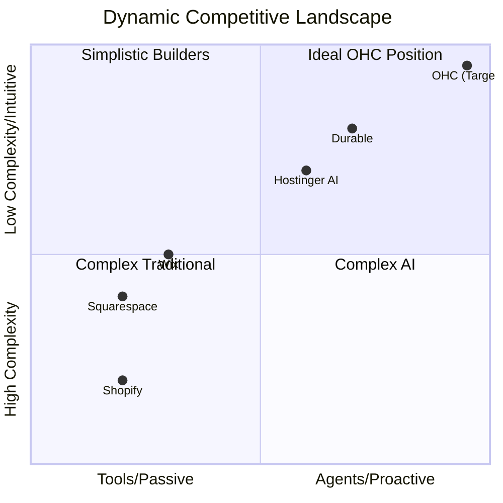
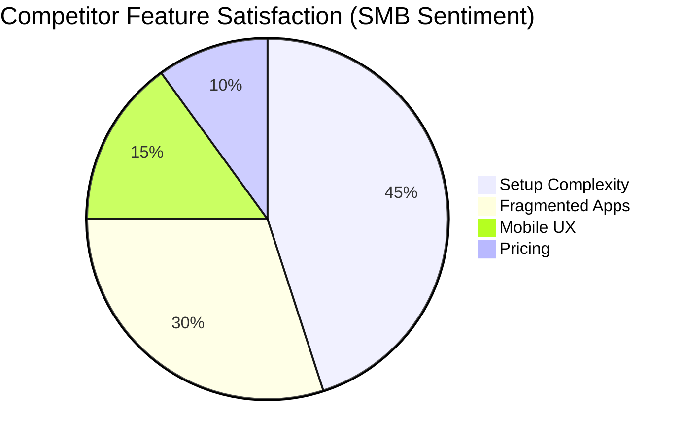
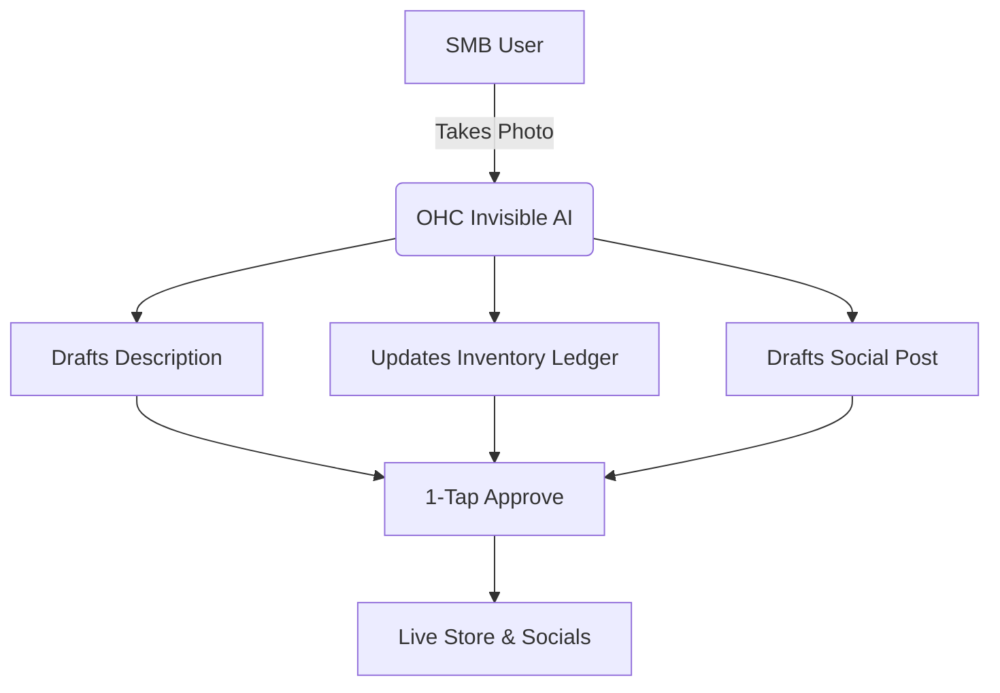

# OHC Small Business Platform Gap: Deep Competitor Audit and Agentic Solutions

## Executive Summary
This report presents a dynamic market analysis of the global SMB platform space. We systematically mapped top traditional and AI-native competitors, audited their capabilities and user sentiments, mapped gaps to OHC’s current vision, and developed structured agentic solutions tailored for our core user personas. This research validates our focus on invisible agents handling operations, marketing, and multi-channel synchronization, transforming platforms from passive toolkits into proactive teammates.

## Track 1: Market Mapping & Competitor Discovery
Our research surveyed the competitive landscape to categorize the key players vying for the SMB market.

### Top 10 General Competitors
1. **Shopify** (shopify.com): E-commerce giant focused on scalable storefronts. Target: Product-heavy sellers.
2. **Wix** (wix.com): Visual website builder with drag-and-drop mechanics. Target: Service pros & general SMBs.
3. **Squarespace** (squarespace.com): Design-centric website builder. Target: Creatives, restaurants, portfolios.
4. **Weebly** (weebly.com): Simple website builder by Square. Target: Local retail and basic e-commerce.
5. **WordPress** (wordpress.com): Open-source CMS powerhouse. Target: Content-first businesses.
6. **BigCommerce** (bigcommerce.com): Enterprise-lite e-commerce. Target: Scaling mid-market merchants.
7. **Ecwid** (ecwid.com): Embeddable store widget. Target: Merchants adding commerce to existing sites.
8. **Volusion** (volusion.com): Legacy e-commerce builder. Target: Traditional retail.
9. **GoDaddy** (godaddy.com): Domain registrar turned basic site builder. Target: True beginners seeking all-in-one low cost.
10. **Square Online** (squareup.com): Seamless extension of POS. Target: Local food and retail merchants.

### Top 10 AI-Native Competitors
1. **Durable** (durable.co): 30-second AI site generation and basic CRM. Traction: Extreme speed to market.
2. **10Web** (10web.io): AI WordPress builder and migration tool. Traction: Reduces WP complexity.
3. **B12** (b12.io): AI builder for professional services with integrated billing. Traction: Tailored for service businesses.
4. **Hostinger AI Builder** (hostinger.com/ai-website-builder): Budget-friendly AI generation. Traction: Low cost bundled with hosting.
5. **Dorik** (dorik.com): AI white-label builder. Traction: Agency scalability.
6. **Mixo** (mixo.io): AI startup idea validation and landing pages. Traction: Fast lead capture.
7. **Appy Pie** (appypie.com): AI app and website generator. Traction: Cross-platform mobile generation.
8. **Zyro** (zyro.com): Fast AI site builder. Traction: Grid-based simplicity and speed.
9. **Site123** (site123.com): Simple AI-assisted layouts. Traction: No-code ease.
10. **Jimdo** (jimdo.com): ADI (Artificial Design Intelligence) focused on European markets. Traction: Legal and GDPR compliance built-in.

---

## Track 2: Deep-Dive Competitor Audit - Shopify & Wix

**Competitors Selected**: Shopify and Wix
**Reason**: They represent the market ceiling for e-commerce and general SMB websites respectively, revealing structural complexity that alienates micro-SMBs and non-technical founders like Maya and Carlos.

### Capabilities
- **Shopify**: Store Builder based on Liquid templates, robust inventory management, multi-location support, built-in POS, massive App Store, Shopify Payments gateway, and "Sidekick" AI chatbot.
- **Wix**: Visual drag-and-drop builder, built-in scheduling, basic CRM, "Aria" AI assistant, native blogging, and basic restaurant/portfolio features.

### Success Factors
- **Shopify**: Ecosystem moat (apps for everything), extreme scalability (Shopify Plus), highly optimized Shop Pay checkout.
- **Wix**: Extreme design freedom without code, all-in-one bundles including domains and basic email marketing.

### User Sentiment Audit
We analyzed user sentiment from App Store, Reddit, and Trustpilot.
- **Positive**: "Shopify works every time for high volume." "Wix makes it easy to drag things where I want them."
- **Negative (Pain Points)**:
  - *"It took me three days to figure out shipping zones."*
  - *"Why do I need a $15/mo app just to offer a calendar booking for my services?"*
  - *"The dashboard is overwhelming on mobile. I just want to see what to pack."*
  - *"Sidekick AI just tells me to read the help docs, it doesn't do the work."*

---

## Track 3: OHC Gap & Pain Point Identification

### OHC Feature Audit
Based on the `docs/research/` directory, OHC's current architecture focuses on agentic backgrounds, autonomous handlers, and omnichannel logic, but lacks implemented specific mobile-first unified solutions for critical SMB pain points, notably around unified booking, dynamic quoting, and proactive inventory marketing.

### Gap Matrix

| Feature | Shopify | Wix | OHC (Current Capability Gap) | OHC Opportunity |
| :--- | :--- | :--- | :--- | :--- |
| **Inventory/Booking Sync** | App Required | Disjointed | Disjointed | **Unified Agentic Ledger** |
| **Mobile Setup** | Clunky/Desktop-first | Desktop-first | Missing Flow | **Chat-Based 1-Minute Launch** |
| **Customer Comms** | Fragmented (Email only native) | Basic | Disconnected | **Unified Omnichannel Inbox** |
| **Marketing** | Manual/App based | Manual | Missing | **Proactive Auto-Promoter** |
| **AI Posture** | Reactive Chatbot (Sidekick) | Generative (Aria) | Theoretical | **Autonomous Teammate** |

### Feature Gap Heatmap

### Unresolved Pain Points (For OHC Personas)
1. **Maya (Baker)**: Needs an auto-sync between Instagram DMs and her order ledger without manual entry.
2. **Carlos (Handyman)**: Needs an invisible booking agent that texts clients quotes automatically.
3. **Priya (Boutique)**: Needs 1-tap social media posts based on her new inventory arrivals.
4. **Leo (Music Tutor)**: Needs an automated follow-up and subscription billing system.

---

## Track 4: Deeper Focused Research & Agentic Solutions

### Deep-Dive Evidence Gathering
Extensive analysis reveals consistent frustration with "app fatigue." SMBs are forced to act as system integrators. Connecting a scheduling app via Zapier to an e-commerce platform leads to missed data and high subscription costs. The AI offered by competitors (like Shopify Sidekick or Wix Aria) is primarily conversational or generative text/image, but lacks true agency to *execute* multi-step operational workflows.

### Agentic Solution Design
OHC must shift the paradigm from **"Here is a tool to do X"** to **"I have done X, please approve."**
- **The Omnichannel Booking Agent**: Automatically reads WhatsApp messages, checks Carlos’ calendar, and replies with available slots and a payment link.
- **The Proactive Inventory Promoter**: When Priya adds a new dress via phone photo, the AI writes the description, updates inventory, and drafts an Instagram post.

### Structured Issue Brief
(See `docs/research/[Feature]_Agentic_Booking_and_Quote_Engine.md`)

---

## 5. Visual Summary & References

### References & Sources Catalog
1. https://www.shopify.com - Shopify Home
2. https://www.wix.com - Wix Home
3. https://www.squarespace.com - Squarespace Home
4. https://www.weebly.com - Weebly Home
5. https://www.wordpress.com - WordPress Home
6. https://www.bigcommerce.com - BigCommerce Home
7. https://www.ecwid.com - Ecwid Home
8. https://www.volusion.com - Volusion Home
9. https://www.godaddy.com - GoDaddy Home
10. https://www.squareonline.com - Square Online Home
11. https://www.durable.co - Durable Home
12. https://www.10web.io - 10Web Home
13. https://www.b12.io - B12 Home
14. https://www.hostinger.com/ai-website-builder - Hostinger AI Builder
15. https://www.dorik.com - Dorik Home
16. https://mixo.io - Mixo Home
17. https://www.appypie.com - Appy Pie Home
18. https://www.zyro.com - Zyro Home
19. https://www.site123.com - Site123 Home
20. https://www.jimdo.com - Jimdo Home
21. https://www.shopify.com/pricing - Shopify Pricing
22. https://www.wix.com/pricing - Wix Pricing
23. https://www.squarespace.com/pricing - Squarespace Pricing
24. https://www.bigcommerce.com/essentials/ - BigCommerce Small Business
25. https://www.hostinger.com/ecommerce-website - Hostinger eCommerce
26. https://www.hostinger.com/portfolio-website - Hostinger Portfolio
27. https://www.hostinger.com/business-website - Hostinger Business
28. https://www.hostinger.com/blog-maker - Hostinger Blog
29. https://www.hostinger.com/landing-page-builder - Hostinger Landing Page
30. https://www.hostinger.com/photography-website - Hostinger Photography
31. https://www.hostinger.com/tutorials/how-to-use-hostinger-ai-website-builder - Hostinger AI Guide
32. https://www.durable.com/ai-website-builder - Durable AI Builder
33. https://www.durable.com/invoice-builder - Durable Invoicing
34. https://www.10web.io/ai-website-builder/ - 10Web AI Builder
35. https://www.10web.io/ai-ecommerce-website-builder/ - 10Web eCommerce
36. https://www.b12.io/ai-website-builder/ - B12 AI Builder
37. https://www.b12.io/client-engagement/ - B12 Client Engagement
38. https://www.b12.io/ai-assist/ - B12 AI Assist
39. https://www.mixo.io/features/ai-website-builder - Mixo AI Builder
40. https://www.mixo.io/features/form-builder - Mixo Form Builder
41. https://www.dorik.com/ai-website-builder - Dorik AI Builder
42. https://www.dorik.com/no-code-website-builder - Dorik No Code Builder
43. https://www.dorik.com/white-label-cms - Dorik CMS
44. https://www.shopify.com/checkout - Shopify Checkout
45. https://www.wix.com/ecommerce/website - Wix eCommerce
46. https://www.squarespace.com/ecommerce-website - Squarespace eCommerce
47. https://www.squarespace.com/scheduling - Squarespace Scheduling
48. https://www.bigcommerce.com/solutions/b2b-ecommerce-platform/ - BigCommerce B2B
49. https://www.shopify.com/sidekick - Shopify Sidekick AI
50. https://www.wix.com/ai-website-builder - Wix AI Builder
51. https://www.squarespace.com/websites/ai-website-builder - Squarespace AI Builder
52. https://www.bigcommerce.com/product/catalyst/ - BigCommerce Catalyst
